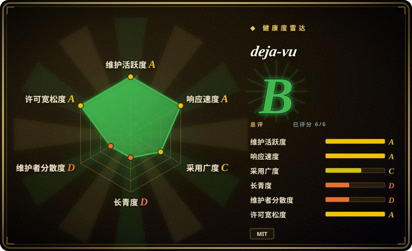
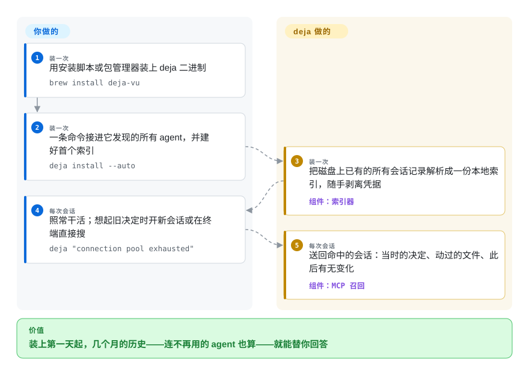

# deja-vu

三月你在 Codex 里修好过一个鉴权 bug；九月 Claude Code 把同一个坑从头再排一遍——它不记得三月，你装过的任何工具也不替你记得。deja-vu 把它点名的 35 个编码 agent 早已写进磁盘的会话记录，解析成本地一份可检索的倒排索引（`~/.cache/deja`），你现在用的是哪家 agent，就把当时的决定送回哪家面前。

## 何时使用

你同时在跑好几个编码 agent——一个仓库用 Claude Code，另一个用 Codex，接手别人的项目时被塞了 Cursor——每个新会话都从零开始。痛感很具体：agent 又提议了你六月就否掉的缓存方案，因为没有任何一家工具记录“否掉过什么”；按这个项目自己测的数字，43 次上下文压缩后，摘要保住了 77% 的决定，却只剩 0.2% 的命令。会话历史其实没丢——它们就躺在磁盘上（`~/.claude/projects`、`~/.codex/sessions`、Cursor 的 SQLite 库）——只是拿 grep 去翻几 GB 的 JSONL 翻不动，而且各家之间互相不可见。

当决定性的取舍是 **“装它之前的历史”优先于“精炼的笔记”** 时，就想到 deja-vu：它不需要任何“保存”环节，你的 agent 本来就在往磁盘写记录，装上第一天连之前几个月的历史都能搜——这一点和 [Engram](engram.zh.md) 相反，后者从零开始、只记得 agent 主动存下的东西；也和 [claude-mem](claude-mem.zh.md) 不同，后者是给单一 harness 挂 hook、向前开始压缩注入。它同样不需要模型：检索是对本地倒排索引做关键词查询，没有 [Mem0](../app-memory/mem0.zh.md)、[Letta](../app-memory/letta.zh.md) 那样每轮都要花 LLM 的账单。一个 Go 单文件程序把 MCP 召回接进它检测到的每家 agent（`deja install --auto`），会话一开场不等你问就把旧决定送到，机器之间用 `deja sync ssh` 直传、中间没有云。

## 怎么用起来

deja-vu 是一个 Go 单文件程序，我们核对时（2026-09-28）它的 `go.mod` 里没有任何第三方 require——只用标准库，不用 CGO；读 SQLite 库的办法是调用系统的 `sqlite3` 命令。它的索引器解析每家 harness 自己的存储——JSONL 文件和 SQLite 数据库——把每条消息拆成有类型的记录（用户发言、工具输出、shell 命令、打开过的文件、编辑时被替换掉的确切片段），写进 `~/.cache/deja` 下的本地倒排索引（就是书末尾那种“词 → 出现在哪”的查找表）：`records.bin`、分词的 posting 桶、外加逐文件的 manifest，所以增量重建只吞变化的文件。API key、JWT、PEM 这类凭据形态在建索引时被剥离，磁盘上的原始记录不动。你不写任何记忆规程——该记的由 deja 读已有记录来记。`deja install --auto` 把这份索引注册成一个只暴露一个工具的 MCP 服务（README 称：一个工具的 schema 每轮花 477 个 token，而它测到的最大的七工具服务要 8283），并在支持的 harness 上打开会话开场自动召回——agent 还没碰文件就先拿到旧决定；改写式查询要命中，可以另跑 `deja embed`，指向本地 Ollama、LM Studio 或你自己配置的向量端点，不加也无碍。

<!-- flow-steps:begin (generated from flows/deja-vu.json by tools/flow_card.py — do not edit) -->

流程文字版

1. **你**（装一次）：用安装脚本或包管理器装上 deja 二进制 — `brew install deja-vu`
2. **你**（装一次）：一条命令接进它发现的所有 agent，并建好首个索引 — `deja install --auto`
3. **deja-vu**（装一次）：把磁盘上已有的所有会话记录解析成一份本地索引，随手剥离凭据 — 组件：`索引器`
4. **你**（每次会话）：照常干活；想起旧决定时开新会话或在终端直接搜 — `deja "connection pool exhausted"`
5. **deja-vu**（每次会话）：送回命中的会话：当时的决定、动过的文件、此后有无变化 — 组件：`MCP 召回`

**价值**：装上第一天起，几个月的历史——连不再用的 agent 也算——就能替你回答

<!-- flow-steps:end -->

## 何时不用

- **你要按“意思”召回，又不肯跑嵌入端点。** 核心检索是词法的——原样贴一个报错串、一个 flag 命中很准，但换了说法的查询（“那个缓存问题”）可能错过用别的词写下的会话。要开箱即用的语义召回，用 [claude-mem](claude-mem.zh.md)（Chroma 向量检索）或 [Mem0](../app-memory/mem0.zh.md)；或者给 deja 配上可选的 `deja embed` 和本地运行时，接受多一个模型依赖。
- **记忆该属于你产品里的用户，而不是你这台开发机。** deja 索引的是编码会话，按本机目录归属；没有给应用代码用的 SDK，也没有按终端用户建模。给要发布的产品做记忆，用 [Mem0](../app-memory/mem0.zh.md) 或 [Letta](../app-memory/letta.zh.md)。
- **你不能接受原始对话被复制第二份。** 索引里存的是脱敏后的会话正文——脱敏靠正则形态匹配，项目自己的 `docs/SECURITY-MODEL.md` 明说“模式匹配不是密钥检测”，它不认识的形态会漏过去。只允许留存精炼笔记，用 [Engram](engram.zh.md)，存什么由 agent 决定；要按用户隔离地共享内容，用 [OpenViking](openviking.zh.md)。
- **你要一份带账号和访问控制的团队共享记忆。** deja-vu 是按机器的；`deja sync ssh` 在你自己控制的机器之间搬，但没有服务端、没有认证模型。团队共享存储用 [OpenViking](openviking.zh.md) 或 [Beacon](agent-beacon.zh.md)。
- **你需要一个变化慢、可以冻住的依赖。** 项目还在 1.0 之前（v0.21.3，2026-09-27），每周发好几个版本，还带 `nightly` 通道；35 家 harness 的存储格式一改，解析器就得跟着追。如果你们的规矩是不允许几乎每周重新验证，就选一个更慢、有依托的项目，否则请锁定版本。
- **Windows 是你的主力机。** `install.sh` 那条一键安装会直接退出并报 `unsupported OS`；Scoop/winget 包存在，但截至 2026-09-28 有一条外部用户提的 open issue（#4116）：`deja install --auto` 在 Windows 写出反斜杠 hook 路径，Claude Code 的 bash 执行不了，所有 hook 静默失败。README 自己也说 macOS 和 Linux 才是久经实战的路径。

## 横向对比

| 替代品 | 是否收录 | 我们的评价 | 取舍 |
|---|---|---|---|
| [Engram](engram.zh.md) | ✅ | 你要的记忆大多早于“装任何记忆工具”、且不想指望 agent 自觉保存时，选 deja-vu；想要一份小、精炼、由 agent 主动写的笔记库、并接受从零开始时，选 Engram。 | deja-vu：零采集纪律，把 35 家的原始记录建进索引，词法检索加可选向量旁挂。Engram：干净的 FTS5 笔记库、不复制原始对话，但只召回 agent 选择记录的内容。 |
| [claude-mem](claude-mem.zh.md) | ✅ | 你同时跑多家 harness、要毫秒级召回且中间不过模型时选 deja-vu；只用 Claude Code、宁愿每会话注入压缩摘要而不是自己翻历史时选 claude-mem。 | deja-vu：没有每会话的模型账单、没有向量库、跨工具；代价是原始记录被复制进索引。claude-mem：hook 自动采集加 LLM 压缩加 Chroma 检索，代价是这套管线和对 Claude Code 的偏重。 |
| [Mem0](../app-memory/mem0.zh.md) | ✅ | 开发者自己的机器历史选 deja-vu；当你要做的产品里，agent 必须按账号记住终端用户时选 Mem0。 | deja-vu：无模型、无服务端、按编码会话归属，答不了应用侧的用户记忆问题。Mem0：换到按用户建模的记忆 API，代价是抽取管线和托管或自托管的平台。 |
| agentmemory（rohitg00/agentmemory） | 未收录 | 当你需要一个用户基数大、但接受 LLM 参与的记忆工具时，它（GitHub API 2026-09-28 约 2.9 万 star）是 deja-vu 最近的同类，值得对比后再定；“装之前的记录”和零依赖单文件若先定胜负，就留本页。 | 两家都拿 benchmark 说话：deja 的 README 在自家对比里引了 agentmemory 的 95.2%。两者没有第三方的互测；本批 tab-intake 未收录它。 |
| MemPalace（MemPalace/mempalace） | 未收录 | 当“平台型记忆系统 + 打榜数字”对你的分量，大过“一个不过模型的单文件编码会话索引”时选它，否则留本页。 | 自称“the best-benchmarked open-source AI memory system”（GitHub API 2026-09-28 约 5.9 万 star）；deja 的 README 在自家对比里引了它的 96.6%。它是平台、deja 是记录索引，形状不同；本批 tab-intake 未收录它。 |

## 技术栈

- **语言：** Go（module `github.com/vshulcz/deja-vu`，`go 1.25`）；截至 2026-09-28 `go.mod` 无第三方 require——纯标准库、不用 CGO。SQLite 存储通过调用外部 `sqlite3` 命令读取。
- **存储：** `~/.cache/deja` 下自建的本地倒排索引——`records.bin`（带长度前缀的类型化记录，正文 ≥8 KiB 的压缩存放）、`buckets/*.bin`（分词 posting）、`manifest.gob`/`sessions.gob`（逐文件状态、脱敏计数、同步水位），因此增量为定序重建。
- **可选向量：** `deja embed` 生成 `.vectors.bin` 旁挂文件（float32，1024 维约每千条消息 4 MB），端点可配置，或自动探测本地 Ollama/LM Studio/OpenAI 兼容接口。
- **接口面：** CLI；单工具 MCP stdio 服务（`deja`，模式 `recall/context/blame/fix/how/orient/remember`）；各 harness 的会话开场 hook 与 skill/指引文件；`.mcpb` 包；8 个 agent 生态的 marketplace 包；多平台 CI 含 CodeQL 与 nightly 发布通道。

## 依赖

- **核心：** 除二进制外无依赖（Homebrew `deja-vu`、Scoop、winget、npm `@vshulcz/deja-vu`、`go install`）。不需要数据库服务、不需要 Node/Python 运行时，默认路径不需要模型 API key。
- **`sqlite3` 命令**：当你要索引的 harness 用 SQLite 存会话时需要在 PATH（opencode、Cursor IDE、Goose、Zed、Crush、Kiro、Grok、OpenClaw、Hermes）；压缩存储还需要 **`zstd`**（DeepSeek Harness、Zed、Reasonix 1.x、OpenClaw 归档）。
- **磁盘：** 索引是会话正文的一份（脱敏后）拷贝——按作者机器约语料的 10%。
- **可选：** 只有 `deja embed` 需要可达的嵌入端点；词法检索没有它也照常工作。

## 运维难度

**macOS/Linux 上低。** 两条命令装好并接进 agent；首次建索引在作者那台 19,195 个会话的机器上是十几秒量级，之后按文件增量更新，`deja doctor --deep` 可以拿索引对照源文件自证。卸载是 `deja uninstall --all` 加删 `~/.cache/deja`。不算免费的部分：1.0 之前一周发数个版本、不承诺稳定，升级要重新验证（请锁版本）；而真正会压到你身上的维护负担是 harness 漂移——35 家存储格式一变，就要等一位维护者把解析器追上来。Windows 和自动召回 hook 是测试最薄的表面。

## 健康度与可持续性

- **维护——强度极高（2026-09-28 核对）。** 2026-09-07 到 09-27 从 v0.19.4 连发到 v0.21.3，`nightly` 通道在本次核对当天还在重发资产，最后提交 2026-09-28。快，但属 1.0 前的高速搅动。
- **治理 / bus factor——一个人。** owner 是个人账号不是组织；贡献者榜首 1,968 次、约占全部的 95%，第二名只有 19 次（contributors API 2026-09-28）。有 `SECURITY.md` 和私下披露通道，但看不到第二维护者。
- **依托与 Lindy——11 周大。** 创建于 2026-07-14；未查到基金会或公司背书，依据是 owner.type=User 且仓库内无资助信息——太年轻，谈不上 Lindy 先验：把它当作接得起也丢得起的活实验，不要当作基础设施。
- **采用——起量快、含金量待证。** 约 11 周攒下 ~1.1k star、104 fork（GitHub API 2026-09-28）；8 个 agent 生态有包；issue 区绝大多数是维护者自开的任务票，外部 bug 票只见一条 open 的 #4116。未检索到独立的生产使用报告。
- **风险信号。** MIT，无改许可史；benchmark 数字均为作者自跑（驱动与带日期的结果 JSON 都在仓库里，如 2026-09-22 的 LongMemEval-S 清洗集 hit@1 88.1%、hit@5 97.4%——可审计，但本文未复现）；脱敏按项目自己的说法是形态匹配；curl 一键装加一个读本机所有 agent 数据的二进制，把信任集中在一位维护者身上。

## 存疑（未验证）

- `[未验证]` 全部性能/benchmark 数字（97.2% R@5、仓库内 2026-09-22 结果 JSON 的 88.1% hit@1 与 97.4% hit@5、19,195 个会话 17.6 秒建完索引、58% 省 token、0.7–0.8 ms 查询）都是作者在作者机器上自报；跑分驱动与结果文件确在仓库（`scripts/longmemeval`、`docs/benchmarks/*.json`），但我们没有复跑。
- `[推断]` README 头条的 97.2% R@5 多半来自比我们核对到的那份 97.4% 结果 JSON 更新的一次运行；没找到头条数字对应的那次运行产物。
- `[未验证]` “支持 35 家 harness”只核到 README 矩阵 35 行与 `docs/ARCHITECTURE.md` 的 35 个解析器条目，没有对各家真实安装逐一运行验证。
- `[未验证]` 压缩统计（43 次压缩后保住 77% 决定、0.2% 命令）与“一台机器 42 个会话里 84 处凭据”均为作者自测，无第三方复现。
- `[未验证]` “Claude Code 默认 30 天删除会话文件（`cleanupPeriodDays`）”出自 README 问答，未对照 Claude Code 自己的文档核实。
- `[未验证]` 社区 issue #4116（Windows 反斜杠 hook 路径静默失败）是单一外部报告，我们没有在 Windows 上复现。
- `[推断]` star 增速（约 11 周从 0 到 ~1.1k）更像推广脉冲而非稳定自然增长；未核查任何流量来源。
- `[推断]` “未见基金会/公司背书”“未检索到独立生产使用报告”两条，依据是 GitHub API 的 owner.type=User、仓库内无资助声明，以及我们跑过的检索——查不到不等于不存在。
- `[未验证]` “索引约语料 10%”“向量每千条消息约 4 MB”是单机作者数字。
