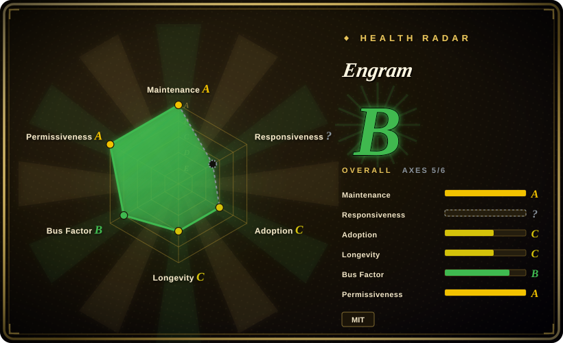
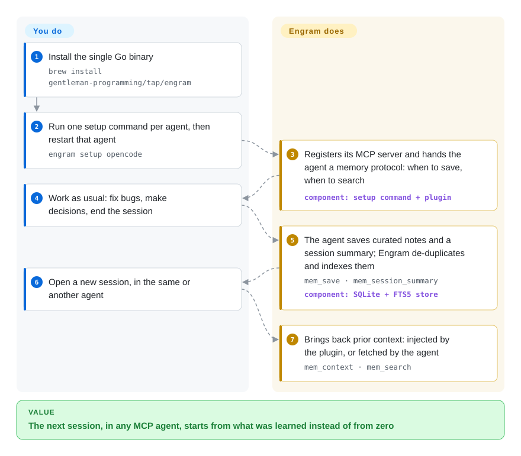

# Engram

Every new coding-agent session starts blank: you re-explain the auth model, the agent re-discovers the same N+1 bug, and switching from Claude Code to OpenCode loses whatever the last tool had learned. Engram is one Go binary that any MCP-speaking agent calls to save short, agent-written notes into a local SQLite file and search them back next session — no Node, Python, vector database or background compression service.

## When to use

You run more than one coding agent — say Claude Code at work, OpenCode with a local Qwen model at home, Codex for a side project — and each session opens with the same ritual: "we use JWT in `internal/auth`, the retry bug was the missing idempotency key, don't touch the legacy importer". The memory tools you looked at either lock you to one harness (Claude Code plugins) or want a Node/Bun worker on a fixed port plus a vector database plus an LLM API key just to compress transcripts. You want one thing on disk that every agent can read and write.

Reach for Engram when the deciding tradeoff is **agent-agnostic and dependency-free over automatic**: `engram setup <agent>` wires the same `~/.engram/engram.db` into 14 named agents over MCP, the agent itself writes curated `What / Why / Where / Learned` notes with `mem_save`, and SQLite full-text search (FTS5 — keyword search built into SQLite, no embeddings) brings them back. You give up automatic capture of everything the agent did — the agent decides what to save — in exchange for a clean, grep-able store with no extra process to babysit and no extra model bill. If you later want the same memory on another machine or shared with a team, it exports compressed chunks into the repo (`engram sync`) or replicates to a Postgres-backed server you host.

## How it works

Engram is a store plus a protocol. The store is a single SQLite database with full-text indexing, reachable four ways from the same binary: an MCP server over stdio (the usual path — the agent launches `engram mcp` itself), a local HTTP API on `127.0.0.1:7437`, a CLI, and a terminal UI. The protocol is a set of instructions — shipped as a Claude Code skill, injected into OpenCode's system prompt by a small plugin — telling the agent *when* to save (after a bug fix, a decision, a discovery), *when* to search (before re-doing work), and to write a session summary before ending. So the division of labour is: you install the binary and run one setup command per agent; the agent does the remembering (it already has the model and the context, so there is no separate compression pass); Engram stores, de-duplicates, and serves it back in three steps — compact search hits, then the surrounding timeline, then the full note. Think of a lab notebook the agent is told to keep, rather than a camera recording the whole session. With the Claude Code or OpenCode plugin, previous-session context is also injected automatically at session start and after compaction; with bare MCP the agent must ask for it (`mem_context`).

<!-- flow-steps:begin (generated from flows/engram.json by tools/flow_card.py — do not edit) -->

Text version of the flow

1. **You**: Install the single Go binary — `brew install gentleman-programming/tap/engram`
2. **You**: Run one setup command per agent, then restart that agent — `engram setup opencode`
3. **Engram**: Registers its MCP server and hands the agent a memory protocol: when to save, when to search — component: `setup command + plugin`
4. **You**: Work as usual: fix bugs, make decisions, end the session
5. **Engram**: The agent saves curated notes and a session summary; Engram de-duplicates and indexes them — `mem_save · mem_session_summary` — component: `SQLite + FTS5 store`
6. **You**: Open a new session, in the same or another agent
7. **Engram**: Brings back prior context: injected by the plugin, or fetched by the agent — `mem_context · mem_search`

**Value**: The next session, in any MCP agent, starts from what was learned instead of from zero

<!-- flow-steps:end -->

## When NOT to use

- **You want memory captured without relying on the agent's discipline.** Engram deliberately does not record raw tool calls; if the model skips `mem_save` or the end-of-session summary, nothing is remembered. If you want everything captured and compressed automatically, use [claude-mem](claude-mem.md) (hooks every tool call, LLM-compressed) or [Beacon](agent-beacon.md) (passive cross-harness session traces), and accept their extra runtime and capture volume.
- **You need semantic ("by meaning") recall over a large note base.** Search is SQLite FTS5 keyword/trigram matching; there are no embeddings in the retrieval path, and the optional LLM "semantic" conflict scan only re-judges pairs FTS5 already surfaced. If a query like "that caching problem" must find a note titled "Redis TTL stampede", use a vector-backed store such as mcp-memory-service (local ONNX embeddings) or [claude-mem](claude-mem.md) (Chroma).
- **You are embedding memory in a product you ship, not in your coding agent.** Engram has no SDK for application code — it is an MCP/HTTP sidecar for developer agents. Use [Mem0](../app-memory/mem0.md) or [Letta](../app-memory/letta.md) for end-user memory inside your own app.
- **You need a privacy boundary between personal and shared memory.** `scope: personal` is a search filter, not an access control: per the project's own Team Usage guide, `engram sync` and cloud sync export a project's personal-scope observations along with project-scope ones. The local HTTP API's search and read routes are unauthenticated on `127.0.0.1`; the optional `ENGRAM_HTTP_TOKEN` guards only deletes, export/import and ownership repair. If per-user isolation matters, use [OpenViking](openviking.md) (per-account isolation on a server) or keep sensitive notes out of Engram.
- **You need a slow-moving, stable dependency.** The project shipped 113 GitHub releases in its first ~7 months (2026-02 → 2026-09), a Go module-path break at v2 (`/v2`), and docs that still disagree about which line is "stable" (README/INSTALLATION say Homebrew stays on v1.20.0; the tap formula is at 2.2.1 as of 2026-09-28). If you cannot re-validate after upgrades, pin a version and read release notes, or pick an older, slower project such as Basic Memory.
- **Your data directory is on NFS/SMB.** Engram refuses known network filesystems because SQLite's WAL mode is unsafe there; use a local disk or a server-backed store (Engram Cloud's Postgres, or [OpenViking](openviking.md)).

## Comparison

| Alternative | In index | Our verdict | Tradeoff |
|---|---|---|---|
| [claude-mem](claude-mem.md) | ✅ | Choose Engram when you want one dependency-free binary shared by many agents and are willing to let the agent decide what to save; choose claude-mem when you want every tool call captured and compressed automatically and injected at session start. | Engram: one Go binary + one SQLite file, keyword search, no extra LLM calls, but recall quality depends on the agent actually calling `mem_save`. claude-mem: automatic capture + vector search, but a Bun/uv/Chroma stack on port 37777 and an LLM compression bill per session. (Engram's own `docs/COMPARISON.md` lists claude-mem as AGPL-3.0; our claude-mem page records Apache-2.0 as of 2026-09.) |
| [Beacon](agent-beacon.md) | ✅ | Choose Beacon when you want a passive trace of every session across harnesses with lessons you approve before they are reused; choose Engram when you want the agent to write and query curated notes directly over MCP with no capture layer. | Beacon: nothing depends on agent discipline and there is a human review gate, but recall runs through skills/MCP the agent invokes and there is a vendor-hosted tier. Engram: smaller surface and no telemetry capture, but no review gate — whatever the agent saves is what you get. |
| [ByteRover CLI](byterover.md) | ✅ | Choose Engram when a clear MIT license and a fully local, self-hostable sync path matter; choose ByteRover when you want its git-like versioned context tree and are comfortable with its hosted sync and unresolved license status. | ByteRover: structured, versioned memory with cloud sync, but a very young repo with a NOASSERTION/Elastic-2.0 license question. Engram: MIT code (trademark-restricted name), self-hosted Postgres cloud, but a flat observation store rather than a curated tree. |
| Basic Memory | not indexed | Choose Basic Memory when you want memory to be human-editable Markdown notes you also browse yourself; choose Engram when you want an agent-maintained observation log with de-duplication and topic upserts and no Python runtime. | Basic Memory (basicmachines-co, ~4.1k stars, AGPL-3.0, created 2024-12, active 2026-09): plain-file knowledge base over MCP, AGPL. Engram: SQLite-only store, MIT, agent-first protocol. Not added in this tab-intake batch. |
| mcp-memory-service | not indexed | Choose mcp-memory-service when you need embedding-based semantic recall or one memory service shared by agent pipelines (LangGraph, CrewAI) over REST/OAuth; choose Engram when keyword search is enough and you want zero services to run. | mcp-memory-service (doobidoo, ~2.0k stars, Apache-2.0, created 2024-12, active 2026-09): local ONNX embeddings and multiple backends, but a Python service to operate. Engram: no embeddings, no service for the stdio path. Not added in this tab-intake batch. |

## Tech stack

- **Language:** Go (module `github.com/Gentleman-Programming/engram/v2`, `go 1.25.10`), built into a single binary with GoReleaser.
- **Storage:** SQLite via `modernc.org/sqlite` (pure Go, no CGO) with FTS5 full-text indexes, WAL mode; data in `~/.engram/engram.db` (override `ENGRAM_DATA_DIR`).
- **Agent interfaces:** MCP over stdio via `mark3labs/mcp-go` (23 tools by default, a 19-tool `agent` profile for the plugins); local HTTP JSON API (default `127.0.0.1:7437`, optional Unix socket); CLI; Bubble Tea terminal UI.
- **Per-agent adapters:** Claude Code marketplace plugin (bash/PowerShell hooks + a memory-protocol skill), OpenCode TypeScript plugin, Codex plugin assets, Pi npm package `gentle-engram`; `engram setup <agent>` writes MCP config for the rest.
- **Optional cloud:** `engram cloud serve` backed by PostgreSQL (`jackc/pgx`), with a server-rendered dashboard (`a-h/templ`); container image on GHCR (linux/amd64, arm64).
- **Optional LLM:** the conflict audit's `--semantic` mode shells out to `claude -p` or `opencode` (`ENGRAM_AGENT_CLI`); the core save/search path makes no model calls.

## Dependencies

- **Core:** just the binary — Homebrew (`gentleman-programming/tap/engram`), GitHub release archives, or `go install`. No Node, Python, Docker or database server.
- **A coding agent that speaks MCP** (Claude Code, OpenCode, Codex, Gemini CLI, Cursor, Windsurf, VS Code Copilot, Kilo Code, Kimi, Qwen Code, Kiro, Pi, Antigravity, CommandCode, or a manual MCP entry).
- **Claude Code plugin + hooks:** `jq` and `curl` on `PATH` (on Windows `jq` must be installed separately); without them you fall back to bare MCP with no session tracking or context injection.
- **Optional:** PostgreSQL + Docker (or the GHCR image) for Engram Cloud; the `claude` or `opencode` CLI for semantic conflict scans.
- **Local disk:** the data directory must not be on NFS or SMB/CIFS.

## Ops difficulty

**Low on one workstation; medium once you sync.** The stdio path has nothing to operate: the agent spawns the binary, and there is one SQLite file to back up. The plugins add an auto-started local HTTP server, which Homebrew upgrades kill silently on macOS (the docs recommend a launchd service so autosync survives). Real work starts with sharing: git-chunk sync and cloud replication are explicit per project, the Cloud server needs Postgres, auth tokens and a deploy, and the changelog is full of ownership-repair and `engram doctor` fixes for databases upgraded across schema changes — budget time to read release notes on every upgrade. Unsigned Windows binaries have been flagged by antivirus (Defender, ESET, Norton behavioural detection during hook execution); `go install` from source is the documented workaround.

## Health & viability

- **Maintenance — extremely active, high churn (as of 2026-09-28).** Last commit 2026-09-28; v2.2.1 on 2026-09-25, preceded by 11 v2.0.0 release candidates between 2026-08-29 and 2026-09-16; 113 GitHub releases since v0.1.0 on 2026-02-16. ~100 open issues, most filed by the maintainers themselves as planned work.
- **Governance & bus factor — two people carry it.** Organization-owned (`Gentleman-Programming`), but the top two contributors (Alan Buscaglia, 473 commits; `dnlrsls`, 354) account for most commits; everyone else has under 30. An issue-first contribution policy with CODEOWNERS on the org is in place. The name and logo are trademarks of Alan Buscaglia personally (TRADEMARKS.md): forks must rebrand.
- **Backing & Lindy — young, community-backed.** Created 2026-02-16 (~7 months old). Backing is a Spanish-language developer-education community (Gentleman Programming, the maintainer's YouTube channel of 100K+ per his GitHub bio) and its companion "Gentle-AI" tooling, not a company or foundation. Too young for a Lindy prior; treat it as a fast-moving bet.
- **Adoption.** ~6.9k stars and ~700 forks in seven months; 14 named agent integrations documented; Homebrew tap and an npm package for Pi. We found no independent production-use reports [未验证].
- **Risk flags.** MIT code (no relicense history). Security posture is still settling: an open issue (#1262, 2026-09-18) reported that the documented private vulnerability channel was disabled; the API shows private vulnerability reporting enabled as of 2026-09-28. Docs drift across releases (stable-line and install instructions disagree).

## Caveats (unverified)

- `[未验证]` Star and fork counts (~6.9k / ~709, GitHub API 2026-09-28) are real counts; what fraction reflects actual use versus the maintainer's audience was not assessed.
- `[未验证]` No independent production-use or benchmark reports were found; the "FTS5 covers 95% of use cases" design claim in DOCS.md is the project's own assertion.
- `[未验证]` The list of 14 named supported agents comes from the README setup table; we did not run `engram setup` against each agent, and integration depth differs (only Claude Code and OpenCode plugins inject prior context automatically).
- `[推断]` Most open issues look like maintainer-filed roadmap items (conventional-commit titles such as `feat(...)`/`bug(...)`), so the open count reflects planned work more than an unanswered backlog; we sampled titles, not triage times.
- `[未验证]` Whether the security finding referenced in issue #1262 was reported and fixed was not visible in public sources.
- `[推断]` "Gentleman Programming" being the maintainer's education community rests on his GitHub bio (YouTube 100K+) and the org's Gentle-AI links; the org has no description on GitHub.
- `[未验证]` Antivirus false-positive reports and the Homebrew upgrade/daemon behaviour come from the project's INSTALLATION guide and open issues; not reproduced.
- `[未验证]` The health radar's responsiveness axis is `?` (`no_window_signal`): the scorer found no qualifying outside-reporter issues to time, consistent with most issues being maintainer-filed; median time-to-first-response for external reporters is unmeasured.
