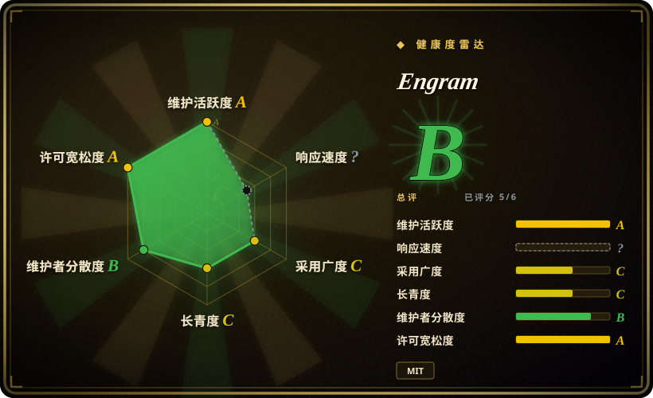
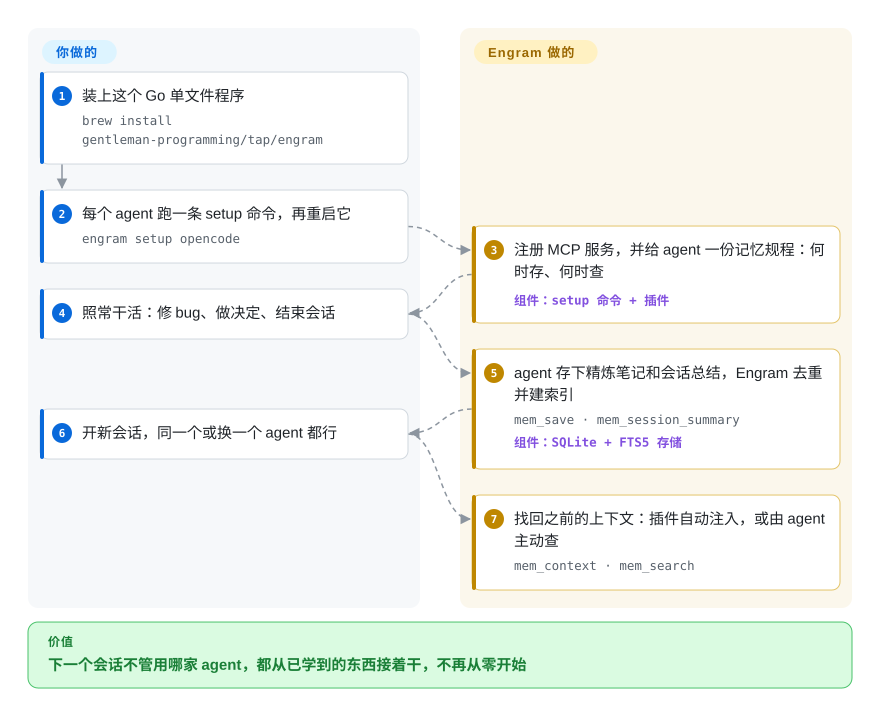

# Engram

每开一个新的编码 agent 会话都是一张白纸：你又得讲一遍鉴权怎么设计，agent 又把同一个 N+1 查询 bug 重新查一遍；从 Claude Code 换到 OpenCode，上一个工具学到的东西也一并丢了。Engram 是一个 Go 单文件程序，任何支持 MCP 的 agent 都能调用它，把 agent 自己写的简短笔记存进本地一个 SQLite 文件，下次会话再搜出来——不需要 Node、Python、向量数据库，也没有后台压缩服务。

## 何时使用

你同时在用不止一个编码 agent——上班用 Claude Code，家里用 OpenCode 接本地 Qwen 模型，副业项目用 Codex——每次开会话都要重复同一套开场白：“我们在 `internal/auth` 里用 JWT，那个重试 bug 是缺了幂等键，别碰老的导入器”。你看过的记忆工具，要么只绑一家（Claude Code 插件），要么为了压缩对话记录，得在固定端口跑一个 Node/Bun worker，再加一个向量数据库和一把 LLM API key。你只想要磁盘上的一样东西，哪个 agent 都能读写。

当决定性的取舍是 **“不挑 agent、零依赖”优先于“全自动”** 时，就想到 Engram：`engram setup <agent>` 通过 MCP 把同一个 `~/.engram/engram.db` 接进 README 点名的 14 家 agent，由 agent 自己用 `mem_save` 写下精炼的 `What / Why / Where / Learned` 笔记，再靠 SQLite 全文检索（FTS5——SQLite 自带的关键词搜索，不用向量嵌入）把它们找回来。你放弃的是“自动记录 agent 做过的一切”——存什么由 agent 决定；换来的是一个干净、能 grep 的存储，不用多照看一个进程，也没有额外的模型账单。以后想在另一台机器上用同一份记忆、或和团队共享，它可以把压缩分块导出到仓库里（`engram sync`），也可以复制到你自己托管的、以 Postgres 为后端的服务端。

## 怎么用起来

Engram 是“一个存储 + 一份规程”。存储是一个带全文索引的 SQLite 数据库，同一个程序提供四种访问方式：走 stdio 的 MCP 服务（最常见——agent 自己拉起 `engram mcp`）、`127.0.0.1:7437` 上的本地 HTTP API、命令行，以及终端界面。规程是一段写给 agent 的指令——在 Claude Code 里以 skill 形式提供，在 OpenCode 里由一个小插件注入系统提示词——告诉 agent **什么时候存**（修完 bug、做了决定、有了新发现）、**什么时候查**（重复做事之前），以及结束前写一份会话总结。所以分工是：你装好程序、对每个 agent 跑一条 setup 命令；“记”这件事由 agent 来做（它手里本来就有模型和上下文，所以不需要单独的压缩环节）；Engram 负责存储、去重，并分三步交还——先给简短的搜索命中，再给前后时间线，最后才给完整笔记。它更像一本规定 agent 要记的实验记录本，而不是一台录下整场会话的摄像机。装了 Claude Code 或 OpenCode 插件时，上一次会话的上下文还会在会话开始和上下文压缩之后自动注入；只接裸 MCP 时，得由 agent 主动调用 `mem_context` 去取。

<!-- flow-steps:begin (generated from flows/engram.json by tools/flow_card.py — do not edit) -->

流程文字版

1. **你**：装上这个 Go 单文件程序 — `brew install gentleman-programming/tap/engram`
2. **你**：每个 agent 跑一条 setup 命令，再重启它 — `engram setup opencode`
3. **Engram**：注册 MCP 服务，并给 agent 一份记忆规程：何时存、何时查 — 组件：`setup 命令 + 插件`
4. **你**：照常干活：修 bug、做决定、结束会话
5. **Engram**：agent 存下精炼笔记和会话总结，Engram 去重并建索引 — `mem_save · mem_session_summary` — 组件：`SQLite + FTS5 存储`
6. **你**：开新会话，同一个或换一个 agent 都行
7. **Engram**：找回之前的上下文：插件自动注入，或由 agent 主动查 — `mem_context · mem_search`

**价值**：下一个会话不管用哪家 agent，都从已学到的东西接着干，不再从零开始

<!-- flow-steps:end -->

## 何时不用

- **你想要不依赖 agent 自觉的记忆采集。** Engram 刻意不记录原始工具调用；模型要是忘了调 `mem_save` 或没写会话总结，就什么也没记下。想要全部自动采集再压缩，用 [claude-mem](claude-mem.zh.md)（每次工具调用都挂钩，由 LLM 压缩）或 [Beacon](agent-beacon.zh.md)（被动记录跨工具的会话轨迹），代价是多出来的运行时和采集量。
- **你需要在大量笔记里按“意思”召回。** 检索是 SQLite FTS5 的关键词 / 三元组匹配，召回路径里没有向量嵌入；可选的 LLM “语义”冲突扫描也只是对 FTS5 已经找出的配对重新判断。如果搜“那个缓存问题”必须命中标题为“Redis TTL stampede”的笔记，用带向量的存储，比如 mcp-memory-service（本地 ONNX 嵌入）或 [claude-mem](claude-mem.zh.md)（Chroma）。
- **你要把记忆嵌进自己发布的产品，而不是编码 agent。** Engram 没有给应用代码调用的 SDK，它是给开发者 agent 用的 MCP/HTTP 旁路进程。给终端用户做应用内记忆，用 [Mem0](../app-memory/mem0.zh.md) 或 [Letta](../app-memory/letta.zh.md)。
- **你需要在个人记忆和共享记忆之间有隐私边界。** `scope: personal` 只是搜索过滤条件，不是访问控制：按项目自己的团队使用指南，`engram sync` 和云同步会把一个项目下 personal 范围的记录连同 project 范围的一起导出。本地 HTTP API 在 `127.0.0.1` 上的搜索和读取接口不做认证；可选的 `ENGRAM_HTTP_TOKEN` 只保护删除、导出 / 导入和归属修复接口。在意按用户隔离，用 [OpenViking](openviking.zh.md)（服务端按账号隔离），或者别把敏感内容写进 Engram。
- **你需要一个变化慢、稳定的依赖。** 项目头约 7 个月（2026-02 → 2026-09）发了 113 个 GitHub release，v2 改了 Go 模块路径（`/v2`），文档对哪条线算“稳定版”说法还不一致（README 和安装文档说 Homebrew 停在 v1.20.0；截至 2026-09-28 tap 里的 formula 已是 2.2.1）。如果你没法在每次升级后重新验证，就锁定版本、读 release notes，或者选一个更老、节奏更慢的项目，比如 Basic Memory。
- **你的数据目录在 NFS/SMB 上。** SQLite 的 WAL 模式在网络文件系统上不安全，Engram 遇到已知的网络文件系统会直接拒绝启动；用本地磁盘，或者用带服务端的存储（Engram Cloud 的 Postgres，或 [OpenViking](openviking.zh.md)）。

## 横向对比

| 替代品 | 是否收录 | 我们的评价 | 取舍 |
|---|---|---|---|
| [claude-mem](claude-mem.zh.md) | ✅ | 想要一个零依赖、多家 agent 共用的单文件程序，并且愿意让 agent 自己决定存什么，选 Engram；想要每次工具调用都自动采集、压缩并在会话开始时注入，选 claude-mem。 | Engram：一个 Go 程序加一个 SQLite 文件、关键词搜索、不额外调 LLM，但召回质量取决于 agent 是否真的调用 `mem_save`。claude-mem：自动采集加向量搜索，但要在 37777 端口跑 Bun/uv/Chroma 一整套，每个会话还有一笔 LLM 压缩费用。（Engram 自己的 `docs/COMPARISON.md` 把 claude-mem 写成 AGPL-3.0；我们的 claude-mem 页截至 2026-09 记为 Apache-2.0。） |
| [Beacon](agent-beacon.zh.md) | ✅ | 想要被动记录各家工具的每场会话、经验经你审核后才复用，选 Beacon；想让 agent 通过 MCP 直接写、直接查精炼笔记，不要采集层，选 Engram。 | Beacon：不依赖 agent 自觉，还有人工审核闸门，但召回要靠 agent 调用的 skill/MCP，且有厂商托管档。Engram：面更小、不做遥测采集，但没有审核闸门——agent 存了什么，你拿到的就是什么。 |
| [ByteRover CLI](byterover.zh.md) | ✅ | 看重清晰的 MIT 许可和完全本地、可自托管的同步路径，选 Engram；想要 git 式带版本的上下文树，并能接受它的托管同步和尚未厘清的许可状态，选 ByteRover。 | ByteRover：结构化、带版本的记忆和云同步，但仓库很年轻，许可有 NOASSERTION 与 Elastic-2.0 之争。Engram：代码 MIT（名称受商标限制）、可自托管 Postgres 云端，但存储是扁平的观察记录，不是精心组织的树。 |
| Basic Memory | 未收录 | 想让记忆就是人也能直接编辑、浏览的 Markdown 笔记，选 Basic Memory；想要由 agent 维护、带去重和主题更新的观察记录，且不要 Python 运行时，选 Engram。 | Basic Memory（basicmachines-co，约 4.1k stars，AGPL-3.0，2024-12 创建，2026-09 仍活跃）：走 MCP 的纯文件知识库，AGPL。Engram：只有 SQLite 存储，MIT，以 agent 为先的规程。本批次 tab-intake 未收录。 |
| mcp-memory-service | 未收录 | 需要基于向量嵌入的语义召回，或需要一个通过 REST/OAuth 给多条 agent 流水线（LangGraph、CrewAI）共用的记忆服务，选 mcp-memory-service；关键词搜索够用、一个服务都不想跑，选 Engram。 | mcp-memory-service（doobidoo，约 2.0k stars，Apache-2.0，2024-12 创建，2026-09 仍活跃）：本地 ONNX 嵌入、多种后端，但要运维一个 Python 服务。Engram：没有嵌入，stdio 路径不需要任何服务。本批次 tab-intake 未收录。 |

## 技术栈

- **语言：** Go（模块 `github.com/Gentleman-Programming/engram/v2`，`go 1.25.10`），用 GoReleaser 打成单个二进制。
- **存储：** 通过 `modernc.org/sqlite`（纯 Go，无 CGO）使用 SQLite，带 FTS5 全文索引、WAL 模式；数据在 `~/.engram/engram.db`（可用 `ENGRAM_DATA_DIR` 改）。
- **agent 接口：** 基于 `mark3labs/mcp-go` 的 stdio MCP（默认 23 个工具，插件用的 `agent` 档是 19 个）；本地 HTTP JSON API（默认 `127.0.0.1:7437`，可选 Unix socket）；命令行；Bubble Tea 终端界面。
- **各家适配：** Claude Code 市场插件（bash/PowerShell 钩子加一个记忆规程 skill）、OpenCode 的 TypeScript 插件、Codex 插件资源、Pi 的 npm 包 `gentle-engram`；其余 agent 由 `engram setup <agent>` 写入 MCP 配置。
- **可选云端：** `engram cloud serve`，后端 PostgreSQL（`jackc/pgx`），带服务端渲染的看板（`a-h/templ`）；GHCR 上有容器镜像（linux/amd64、arm64）。
- **可选 LLM：** 冲突审计的 `--semantic` 模式会调用 `claude -p` 或 `opencode`（`ENGRAM_AGENT_CLI`）；核心的存 / 查路径不调用任何模型。

## 依赖

- **核心：** 只要这个二进制——Homebrew（`gentleman-programming/tap/engram`）、GitHub release 压缩包或 `go install`。不需要 Node、Python、Docker 或数据库服务。
- **一个支持 MCP 的编码 agent**（Claude Code、OpenCode、Codex、Gemini CLI、Cursor、Windsurf、VS Code Copilot、Kilo Code、Kimi、Qwen Code、Kiro、Pi、Antigravity、CommandCode，或手工配置 MCP）。
- **Claude Code 插件与钩子：** `PATH` 上要有 `jq` 和 `curl`（Windows 上 `jq` 得单独装）；缺了就退回裸 MCP，没有会话跟踪和上下文注入。
- **可选：** Engram Cloud 需要 PostgreSQL 加 Docker（或 GHCR 镜像）；语义冲突扫描需要 `claude` 或 `opencode` 命令行。
- **本地磁盘：** 数据目录不能放在 NFS 或 SMB/CIFS 上。

## 运维难度

**单机上低；一旦同步就是中等。** stdio 路径没有要运维的东西：agent 自己拉起程序，要备份的只有一个 SQLite 文件。插件会自动拉起一个本地 HTTP 服务，而在 macOS 上 Homebrew 升级会悄无声息地把它杀掉（文档建议配成 launchd 服务，自动同步才能扛过升级）。真正的工作量从共享开始：git 分块同步和云端复制都要按项目显式开启，云端服务要 Postgres、认证 token 和一次部署；更新日志里满是针对跨 schema 升级的数据库的归属修复和 `engram doctor` 修复——每次升级都要留时间读 release notes。未签名的 Windows 二进制曾被杀毒软件报毒（Defender、ESET，以及钩子执行时 Norton 的行为检测）；文档给的绕行办法是从源码 `go install`。

## 健康度与可持续性

- **维护——极其活跃、变动很大（截至 2026-09-28）。** 最近一次提交 2026-09-28；2026-09-25 发布 v2.2.1，此前在 2026-08-29 到 2026-09-16 之间发了 11 个 v2.0.0 候选版；自 2026-02-16 的 v0.1.0 起共 113 个 GitHub release。约 100 个 open issue，大多是维护者自己提的计划内工作。
- **治理与巴士因子——主要靠两个人撑。** 仓库归组织（`Gentleman-Programming`）所有，但前两位贡献者（Alan Buscaglia 473 次提交、`dnlrsls` 354 次）占了绝大多数，其余人都不到 30 次。有“先开 issue”的贡献流程，CODEOWNERS 指向组织。名称和 logo 是 Alan Buscaglia 个人的商标（TRADEMARKS.md）：分叉必须改名。
- **背书与 Lindy——很年轻，社区驱动。** 2026-02-16 创建（约 7 个月）。背后是一个西语开发者教育社区（Gentleman Programming，按维护者 GitHub 简介是一个 10 万+ 订阅的 YouTube 频道）及其配套的 “Gentle-AI” 工具，不是公司或基金会。太年轻，谈不上 Lindy 先验；当作一个快速变化中的押注。
- **采用情况。** 七个月约 6.9k stars、约 700 forks；文档列出 14 家 agent 集成；有 Homebrew tap 和给 Pi 用的 npm 包。没找到独立的生产使用报告 [未验证]。
- **风险信号。** 代码 MIT（无改许可历史）。安全流程还在完善：一个 open issue（#1262，2026-09-18）报告文档里写的私下披露渠道不可用；截至 2026-09-28，API 显示私下漏洞报告已开启。各版本之间文档有漂移（“稳定线”和安装说明互相矛盾）。

## 存疑（未验证）

- `[未验证]` star 和 fork 数（约 6.9k / 约 709，GitHub API 2026-09-28）是真实计数；其中多少反映真实使用、多少来自维护者的受众，没有评估。
- `[未验证]` 没找到独立的生产使用或基准测试报告；DOCS.md 里“FTS5 覆盖 95% 场景”的设计说法是项目自己的断言。
- `[未验证]` 14 家支持的 agent 名单来自 README 的 setup 表；我们没有逐一跑 `engram setup` 验证，而且各家集成深度不同（只有 Claude Code 和 OpenCode 插件会自动注入之前的上下文）。
- `[推断]` 大多数 open issue 看起来是维护者提的路线图条目（标题是 `feat(...)`/`bug(...)` 这类约定式提交格式），所以 open 数更多反映计划内工作，而非无人响应的积压；我们只抽看了标题，没统计分诊时长。
- `[未验证]` issue #1262 提到的那个安全问题是否已报告并修复，公开渠道看不到。
- `[推断]` “Gentleman Programming 是维护者的教育社区”依据的是他的 GitHub 简介（YouTube 10 万+）和组织的 Gentle-AI 链接；该组织在 GitHub 上没有简介。
- `[未验证]` 杀毒软件误报和 Homebrew 升级 / 守护进程的行为来自项目的安装文档和 open issue；未复现。
- `[未验证]` 健康度雷达的响应度轴是 `?`（`no_window_signal`）：评分器没找到可计时的外部报告者 issue，这与大多数 issue 由维护者自提相符；外部报告者的首次响应中位时长未测得。
