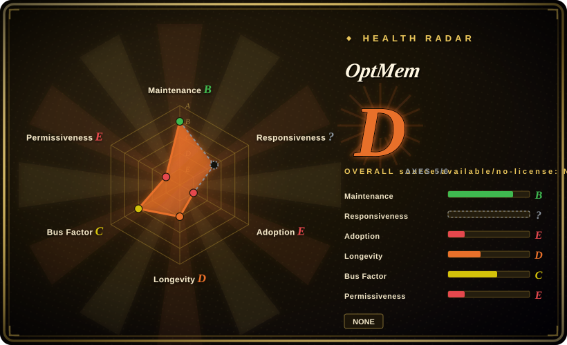
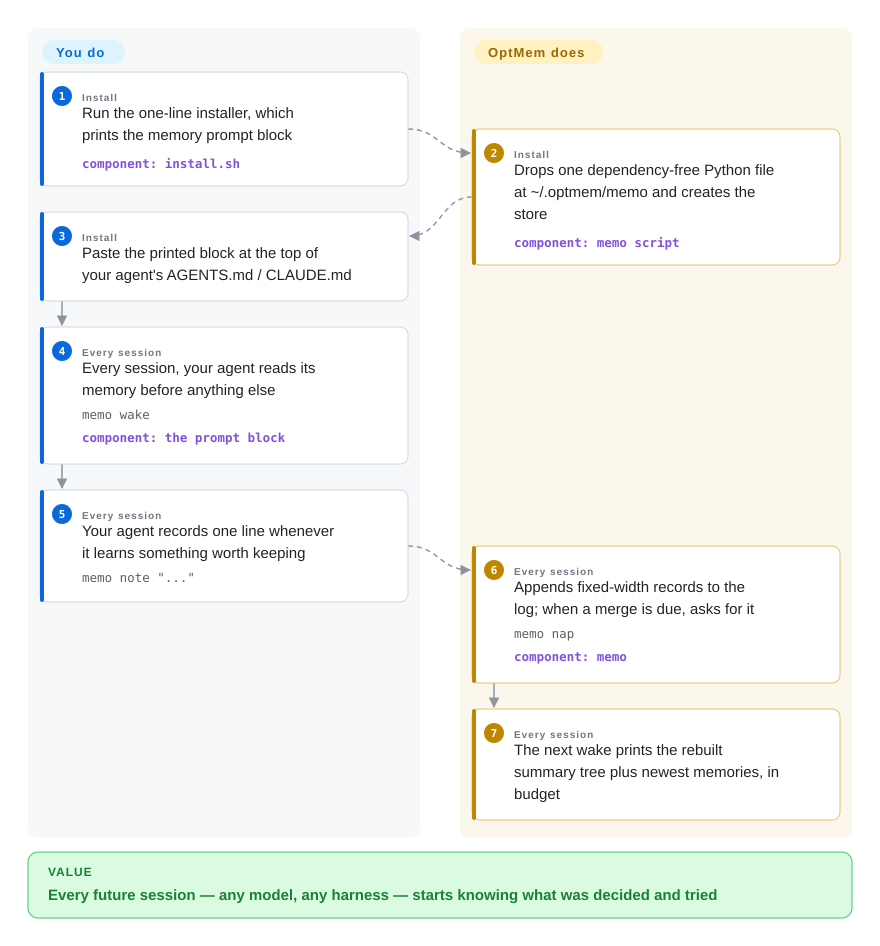

# OptMem

Your coding agent starts every session with amnesia: the decisions made last week, the user's constraints, the dead ends already tried — all re-explained from scratch, and one `/clear` wipes what's left. OptMem gives the agent a permanent memory out of one dependency-free Python script plus a prompt block pasted into `AGENTS.md`: the agent itself writes one-line memories to an append-only text log and reads back a compressed summary tree at the start of every session.

## When to use

You run coding agents — Claude Code, Codex, Cursor, anything that reads an `AGENTS.md`/`CLAUDE.md`-style file and can run shell commands — and the first ten minutes of every session go to rebuilding context the previous session already had. You've watched a `/clear` or a compaction erase the constraint you spent three turns establishing, and you've switched models or vendors mid-project and lost the thread entirely. You want the memory to outlive sessions, compactions, and vendor changes without adopting a service. Install is one `curl | sh` line; it prints a `## Memory` block you paste at the top of your agent file, and that is the whole integration: from then on the agent runs `memo wake` before anything else each session and calls `memo note` whenever it learns something worth keeping.

The deciding tradeoff against hook-based memory tools ([claude-mem](claude-mem.md), [Beacon](agent-beacon.md)) is voluntary capture in exchange for zero moving parts. Nothing runs in the background: no daemon, no port, no vector database, no embedding pipeline, and no API key of its own — compression happens inside the agent's own session, on tokens you are already spending. The entire tool is one 859-line, stdlib-only Python file storing plain text you can `cat`, back up by copying, and audit in an afternoon. Pick OptMem when that minimal, inspectable surface matters more to you than guaranteed capture; pick the hook tools when "the agent forgot to run `memo`" is a failure you cannot tolerate.

## How it works

OptMem keeps an **append-only log** (`LOG.txt`) — a text file where every memory is one line, at most 280 bytes, and lines are never edited or deleted. On top of the log sits a binary tree of summaries (`TREE/`): memories #0–1 get a one-line summary between them, each pair of summaries gets a summary above it, and so on up to a root covering everything — so any range of memories can be read as one line at the right level. The **agent**, not a background process, does the compressing: when `note` appends new memories and a merge comes due, the tool asks for it right there in the command's output, and the next `memo nap` records the answer. At session start `memo wake` prints the tree's top summaries plus the newest raw lines within a reading budget (`WAKE_LINES`, default 96 lines ≈ 8k tokens — a reading budget, not a storage limit); `memo recall <regex>` greps every raw memory ever recorded; `memo zoom <lo>-<hi>` opens one tree node into its two halves; `memo forget` drops a bad summary and the next nap rebuilds it. Records are fixed-width, so a record's position in the file *is* its identity and every lookup is a single seek. Your part is the installer plus the paste; the tool never runs a daemon and never calls a model — the agent does, following the pasted prompt block, which also forbids subagents from running `memo` at all to keep parallel sessions from duplicating notes.

<!-- flow-steps:begin (generated from flows/optmem.json by tools/flow_card.py — do not edit) -->

Text version of the flow

1. **You** (Install): Run the one-line installer, which prints the memory prompt block — component: `install.sh`
2. **OptMem** (Install): Drops one dependency-free Python file at ~/.optmem/memo and creates the store — component: `memo script`
3. **You** (Install): Paste the printed block at the top of your agent's AGENTS.md / CLAUDE.md
4. **You** (Every session): Every session, your agent reads its memory before anything else — `memo wake` — component: `the prompt block`
5. **You** (Every session): Your agent records one line whenever it learns something worth keeping — `memo note "..."`
6. **OptMem** (Every session): Appends fixed-width records to the log; when a merge is due, asks for it — `memo nap` — component: `memo`
7. **OptMem** (Every session): The next wake prints the rebuilt summary tree plus newest memories, in budget

**Value**: Every future session — any model, any harness — starts knowing what was decided and tried

<!-- flow-steps:end -->

## When NOT to use

- **You need capture that cannot be forgotten.** Nothing runs in the background — if the agent ignores the prompt (weak model, rushed session, or a subagent, which the prompt itself bans from memo), the moment is simply never recorded. Choose [claude-mem](claude-mem.md) or [Beacon](agent-beacon.md), which capture through lifecycle hooks whether or not the agent cooperates.
- **You need semantic or ranked retrieval.** `recall` is a regex over raw one-line memories — no embeddings, no relevance ranking, no "find everything about the auth refactor" beyond what your regex can spell. Choose [Engram](engram.md) (SQLite FTS5 keyword search over MCP) or claude-mem (vector index) when retrieval quality is the point.
- **You need per-project or scoped memory.** One memory per machine, one global namespace — switching projects loads the other projects' active state into every wake (issue #9 documents the cross-contamination; it is open and unanswered). `MEMORY_DIR` per project is the workaround but loses the shared layer; the fork OptMem-Split encodes cwd-scoped trees. For a team-wide shared store, choose [OpenViking](openviking.md).
- **You need a license.** There is **no LICENSE file**; default copyright means all rights reserved, and the open "license?" issue (#8, 2026-08-10) has no maintainer answer. Anything beyond personal evaluation — vendoring, redistributing, shipping inside a product — is legally undefined. Choose claude-mem (Apache-2.0) or Engram (MIT).
- **You want a maintained, pinned product.** All 41 commits landed in the launch week (2026-07-25 → 07-31); there are no releases or tags, the installer always fetches `main` HEAD (no version pinning), and open bug reports on the storage format (#10–#13: torn `TREE` records read as summaries; eight of Python's line separators can split one memory into two wake lines) have no maintainer response as of 2026-09-28. For an actively released tool, choose claude-mem; if you just want a tiny readable base to fork, that is exactly what this is.
- **You are embedding memory in your own application.** This is a developer-workstation prompt tool, not an SDK — there is no API to call from product code. Choose [Mem0](../app-memory/mem0.md) or [Memori](../app-memory/memori.md) for app-embedded memory.

## Comparison

| Alternative | In index | Our verdict | Tradeoff |
|---|---|---|---|
| [claude-mem](claude-mem.md) | ✅ | Choose claude-mem when capture must be automatic — hooks grab the session whether or not the agent cooperates — and you accept a local service stack; choose OptMem when you want zero moving parts and a memory the agent itself curates. | claude-mem wires lifecycle hooks into SQLite + Chroma with an LLM compression pass and a local worker/port; OptMem is one stdlib-only file over a plain-text log, with compression done by the agent in-session — voluntary capture and regex-only recall are the price of that surface. |
| [Engram](engram.md) | ✅ | Choose Engram when several agents must share one searchable store through MCP and keyword search; choose OptMem when your harness has no MCP surface and a prompt block plus CLI is enough. | Engram: one Go binary + SQLite FTS5 behind an MCP server, recall still depends on the agent choosing to save; OptMem: no server at all, fixed-width flat log plus summary tree, regex recall — lighter, but coarser retrieval and no network protocol. |
| [ByteRover CLI](byterover.md) | ✅ | Choose ByteRover when you want structured memory with git-like versioning and cloud sync and accept its youth and license ambiguity; choose OptMem when you want an auditable local plain-text store with no account and no sync service. | ByteRover ships versioning and a cloud tier but an ambiguous license; OptMem is append-only text you can point at a git repo via `MEMORY_DIR`, yet has no built-in versioning or sync and is explicitly unlicensed. |
| [OpenViking](openviking.md) | ✅ | Choose OpenViking when a team shares one store holding documents and long-term memory behind a server you run; choose OptMem when the memory is one developer's and no server may exist. | OpenViking unifies document RAG and session memory in a self-hosted server (AGPL-3.0, model dependencies); OptMem has no server, no embeddings, and is per-user by design — no team surface at all. |
| OptMem-Split (fork) | 未收录 | Choose the fork when per-directory, per-project memory scoping is the deciding feature; choose upstream OptMem when one global identity-level memory is the point. | Fork by a reader of issue #9 adds cwd-scoped memory trees on the same log design; not added in this tab-intake batch, and its maintenance and quality are unassessed. |

## Tech stack

- **Language:** Python 3 — the whole tool is one 859-line executable file (`memo`) using only the standard library (`os`, `re`, `sys`, `datetime`, `collections`, `fcntl` with an `msvcrt` fallback on Windows).
- **Storage:** append-only fixed-width text log (`LOG.txt`, 320 bytes per record) plus `TREE/`, a cache of one-line summaries in a binary merge tree — rebuildable from the log alone; a small `config` file holds the knobs (`WAKE_LINES`, `ENTRY_CHARS`, `PART_CHARS`, `PART_LINES`).
- **Concurrency:** advisory file locking (`fcntl`, `msvcrt` on Windows) so parallel sessions on one machine queue instead of corrupting the log.
- **Distribution:** `curl | sh` installer that downloads the single file from `main` HEAD; re-running updates the tool without touching existing memories. No releases, no tags, not on PyPI.
- **Tests:** `test.py` (614 lines) — deterministic invariants over a synthetic life of ~5,000 memories using a fake compressor; no CI configuration exists in the repo to run it.

## Dependencies

- **Python 3** on the machine — the installer checks for it and refuses otherwise.
- **An agent harness that reads a prompt file** (`AGENTS.md` / `CLAUDE.md` or equivalent) and can run shell commands — OptMem has no standalone use.
- **Nothing else:** no server, database, embedding service, or API key — the tool itself never calls a model; compression happens in the agent's own session.
- **Optional:** `$MEMORY_DIR` to place the store in a synced folder or git repo (the built-in answer to backup and versioning).
- **Windows:** native support via `msvcrt` locking (`WINDOWS.md`, merged PR #2); its 8-parallel-writer concurrency result is the project's own report. [未验证]

## Ops difficulty

**Low — deliberately.** One file, one append-only log, a rebuildable tree cache, four config knobs; failure modes are visible in plain text and the log survives even if the tree corrupts (nap rebuilds it). What you own instead: the update path is `curl | sh` from `main` with no version to pin (supply-chain trust in one maintainer), backup/versioning only via pointing `MEMORY_DIR` at a git repo, correctness depends on the agent obeying the prompt every session, and the memory handshake costs the agent real tool-call turns per session (wake reads, note writes, nap merges ride on your existing token spend — a closed issue #6 puts it at extra inference passes). Known format edge cases (line separators, torn tree records) are open bugs.

## Health & viability

- **Maintenance — dormant after a one-week burst (as of 2026-09-28).** All 41 commits landed 2026-07-25 → 2026-07-31; zero pushes in the two months since; no releases, tags, or changelog. Not archived, but not maintained in any active sense either.
- **Governance / bus factor — one person.** `User`-owned repo; 40 of 41 commits are the maintainer (VictorTaelin — Victor Taelin of Higher Order Company, author of HVM and Kind, per his GitHub bio). Community PRs #16/#17 were closed unmerged; the substantive August–September issues (license #8, scoping #9, integrity #10–#13) carry no maintainer replies.
- **Age & Lindy — two months old, no track record.** Created 2026-07-25. ~1.5k stars on a repo dormant since launch week reads as author-audience attention, not vetting; young-and-hyped is the opposite of a Lindy signal. Do not adopt it because it looks popular.
- **Adoption signals — real interest, no ecosystem.** 104 forks; an independent fork (OptMem-Split) with genuine design divergence; multi-user issue activity. No package-registry presence, no dependent packages, no docs beyond the README.
- **Risk flags — no license is the dominant blocker.** No LICENSE file (all rights reserved; the license issue is open and unanswered), open data-integrity bugs in the storage format, and an installer that always fetches `main` HEAD from a single maintainer's repo.

## Caveats (unverified)

- [未验证] The README's performance claim ("At a million memories (608 MB), `wake` takes 0.03s") is author-reported; not reproduced here.
- [未验证] The "426-token prompt" figure in the repo description was not independently tokenized.
- [推断] Star velocity (~1.5k in two months on a repo dormant since week one) is attributed to the maintainer's existing audience (HVM/Bend/Kind following) rather than to production adoption; the attribution is ours.
- [未验证] The Windows concurrency result (8 parallel `note` processes, 1600/1600 records persisted) is OptMem's own `WINDOWS.md` claim, not an independent test.
- [未验证] `test.py`'s current pass status was not executed here; the repo ships tests but has no CI configuration to run them.
- [未验证] The OptMem-Split fork's maintenance and quality were not assessed; it is known only from the issue #9 thread and its README.
