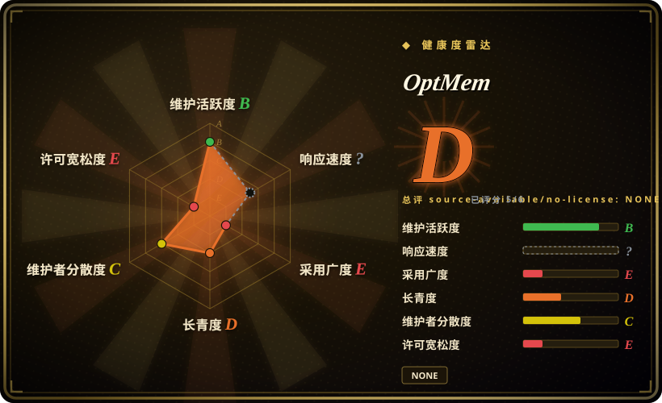
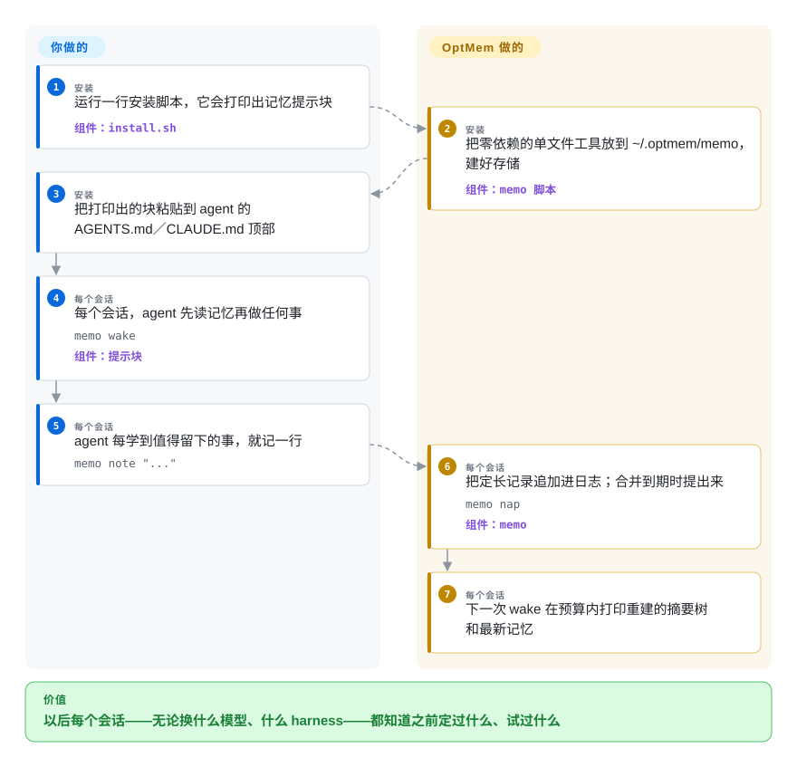

# OptMem

你的编码 agent 每次开会话都像失忆：上周定下的决策、用户的约束、已经试过的死胡同，全都要重新交代一遍，一次 `/clear` 连剩下的也一并清空。OptMem 用一个零依赖的 Python 脚本加一段贴进 `AGENTS.md` 的提示块给 agent 装上永久记忆：agent 自己往一份只追加的文本日志里一行行写记忆，每次会话开始时读回一棵压缩过的摘要树。

## 何时使用

你在用编码 agent——Claude Code、Codex、Cursor，任何会读 `AGENTS.md`／`CLAUDE.md` 这类文件、能跑 shell 命令的都算——而每个会话的头十分钟都在重建上一个会话早已建立的上下文。你见过一次 `/clear` 或一次压缩把你花了三轮对话才讲清楚的约束整个抹掉，也在项目中途换过模型或厂商、眼看着线索全部丢失。你想要一份活得比会话、压缩和厂商更换都长的记忆，又不想为此养一个服务。安装是一行 `curl | sh`，它打印出一个 `## Memory` 块，粘贴到 agent 文件顶部，集成到此为止：此后 agent 每个会话先跑 `memo wake` 再做任何事，学到值得留下的东西就调 `memo note`。

与基于钩子的记忆工具（[claude-mem](claude-mem.zh.md)、[Beacon](agent-beacon.zh.md)）相比，决定性的取舍是：用「自愿记录」换「零活动部件」。后台什么都不跑：没有常驻进程、没有端口、没有向量库、没有 embedding 管道，工具本身也不持有任何 API key——压缩发生在 agent 自己的会话里，花的是你本来就要花的 token。整个工具就是一个 859 行、只用标准库的 Python 文件，存的是你能 `cat`、能复制备份、一个下午能审计完的纯文本。当这块最小、可检查的表面对你比「保证捕获」更重要时选 OptMem；当「agent 忘了跑 `memo`」是你无法容忍的失败时，选钩子方案。

## 怎么用起来

OptMem 维护一份**只追加日志**（`LOG.txt`）——一个文本文件，每条记忆占一行、最多 280 字节，已有的行永不修改、永不删除。日志之上是一棵二叉摘要树（`TREE/`）：记忆 #0–1 之间生成一行摘要，每两行摘要再合并出更上一层的摘要，如此直到覆盖全部记忆的根——于是任意区间的记忆都能在合适的层级读成一行。做压缩的是**agent 本人**而不是后台进程：当 `note` 追加了新记忆、一次合并到期时，工具直接在那条命令的输出里提出请求，下一次 `memo nap` 把答案记下来。会话开始时 `memo wake` 在一个读取预算内（`WAKE_LINES`，默认 96 行，约 8k token——这是读取预算，不是存储上限）打印树顶摘要和最新的原始记忆；`memo recall <regex>` 逐字搜索有史以来记下的每条记忆；`memo zoom <lo>-<hi>` 把一个树节点展开成它的两半；`memo forget` 丢掉一条坏摘要，下一次 nap 会重建它。记录是定长的，所以一条记录在文件中的位置就是它的身份，每次查找都是一次 seek。你做的部分是安装和粘贴；工具不跑常驻进程、不调用模型——按粘贴的提示块行事的是 agent，而提示块还明确禁止子代理运行 `memo`，以免并行会话重复记笔记。

<!-- flow-steps:begin (generated from flows/optmem.json by tools/flow_card.py — do not edit) -->

流程文字版

1. **你**（安装）：运行一行安装脚本，它会打印出记忆提示块 — 组件：`install.sh`
2. **OptMem**（安装）：把零依赖的单文件工具放到 ~/.optmem/memo，建好存储 — 组件：`memo 脚本`
3. **你**（安装）：把打印出的块粘贴到 agent 的 AGENTS.md／CLAUDE.md 顶部
4. **你**（每个会话）：每个会话，agent 先读记忆再做任何事 — `memo wake` — 组件：`提示块`
5. **你**（每个会话）：agent 每学到值得留下的事，就记一行 — `memo note "..."`
6. **OptMem**（每个会话）：把定长记录追加进日志；合并到期时提出来 — `memo nap` — 组件：`memo`
7. **OptMem**（每个会话）：下一次 wake 在预算内打印重建的摘要树和最新记忆

**价值**：以后每个会话——无论换什么模型、什么 harness——都知道之前定过什么、试过什么

<!-- flow-steps:end -->

## 何时不用

- **你需要不可能被遗忘的捕获。** 后台什么都不跑——agent 没理会提示块（弱模型、赶进度的会话，或提示块本身就禁用 memo 的子代理）的那一刻就根本没被记下来。选 [claude-mem](claude-mem.zh.md) 或 [Beacon](agent-beacon.zh.md)，它们通过生命周期钩子捕获，不依赖 agent 配合。
- **你需要语义化或带排序的检索。** `recall` 是对单行原始记忆做正则搜索——没有 embedding、没有相关度排序，正则写不出来的「找出关于认证重构的一切」它就做不到。检索质量是重点时选 [Engram](engram.zh.md)（MCP 之上的 SQLite FTS5 关键词搜索）或 claude-mem（向量索引）。
- **你需要按项目隔离的记忆。** 一台机器一份记忆、一个全局命名空间——切换项目时别的项目的活跃状态会被装进每次 wake（issue #9 记录了这种串味，至今开着无人回应）。每项目设一个 `MEMORY_DIR` 是变通，但丢掉了共享层；fork 出的 OptMem-Split 把按当前目录分树写进了工具。要团队共享一份存储，选 [OpenViking](openviking.zh.md)。
- **你需要一个许可证。** 仓库**没有 LICENSE 文件**，默认版权即保留所有权利，公开的「license?」issue（#8，2026-08-10）没有维护者答复。个人试用之外的一切——内置分发、再分发、随产品发布——在法律上都是未定义的。选 claude-mem（Apache-2.0）或 Engram（MIT）。
- **你要的是一个有人维护、可锁定版本的产品。** 全部 41 次提交落在发布周内（2026-07-25 至 07-31）；没有 release 和 tag，安装器永远拉 `main` 的 HEAD（无法锁版本），存储格式上公开的缺陷报告（#10–#13：撕裂的 `TREE` 记录被当成摘要；Python 的八种行分隔符能把一条记忆拆成两行 wake 输出）截至 2026-09-28 无维护者回应。要持续发版的工具选 claude-mem；若你只是想要一个小而可读的底子来 fork，它恰恰就是这个。
- **你是要给自己的应用嵌入记忆。** 这是开发者工作站上的提示词工具，不是 SDK——没有可供产品代码调用的 API。选 [Mem0](../app-memory/mem0.zh.md) 或 [Memori](../app-memory/memori.zh.md)。

## 横向对比

| 替代品 | 是否收录 | 我们的评价 | 取舍 |
|---|---|---|---|
| [claude-mem](claude-mem.zh.md) | ✅ | 当捕获必须自动发生——钩子不管 agent 配不配合都抓全会话——且你能接受一套本地服务栈时，选 claude-mem；当你要零活动部件、由 agent 自己经营记忆时，选 OptMem。 | claude-mem 把生命周期钩子接进 SQLite 加 Chroma，带一次 LLM 压缩和一个本地 worker／端口；OptMem 是一个只依赖标准库的单文件，底层是纯文本日志，压缩由 agent 在会话内完成——自愿捕获和仅正则的检索是这份轻量的代价。 |
| [Engram](engram.zh.md) | ✅ | 当多个 agent 要通过 MCP 共享一份可检索的存储、用关键词搜索时，选 Engram；当你的 harness 没有 MCP 入口、提示块加命令行就够用时，选 OptMem。 | Engram 是一个 Go 程序加 SQLite FTS5、挂在 MCP 服务后面，但召回同样取决于 agent 肯不肯存；OptMem 完全没有服务端，定长扁平日志加摘要树、正则检索——更轻，但检索更粗、没有网络协议。 |
| [ByteRover CLI](byterover.zh.md) | ✅ | 当你要带 git 式版本控制和云同步的结构化记忆、能接受它的年轻和许可模糊时，选 ByteRover；当你要一份可审计的本地纯文本存储、不碰账户和同步服务时，选 OptMem。 | ByteRover 自带版本化和云端层，但许可模糊；OptMem 是只追加文本，可以用 `MEMORY_DIR` 指向 git 仓库，却没有内建版本化或同步，而且明确没有许可证。 |
| [OpenViking](openviking.zh.md) | ✅ | 当一个团队要共用一份既装文档又装长期记忆、由你运行服务端的存储时，选 OpenViking；当记忆只属于一个开发者、且不允许存在任何服务端时，选 OptMem。 | OpenViking 把文档 RAG 和会话记忆统一进一个自托管服务端（AGPL-3.0、依赖模型）；OptMem 没有服务端、没有 embedding，设计上就是每人一份——完全没有团队面。 |
| OptMem-Split（fork） | 未收录 | 当按目录、按项目隔离记忆是决定性功能时，选这个 fork；当一份全局的身份级记忆正是你要的东西时，选上游 OptMem。 | 该 fork 出自 issue #9 的读者，在同一套日志设计上加了按当前目录划分的记忆树；本次 tab-intake 批次未收录，其维护情况与质量未评估。 |

## 技术栈

- **语言：** Python 3——整个工具是一个 859 行的可执行文件（`memo`），只用标准库（`os`、`re`、`sys`、`datetime`、`collections`、`fcntl`，Windows 下回退到 `msvcrt`）。
- **存储：** 定长、只追加的文本日志（`LOG.txt`，每记录 320 字节）加 `TREE/`——二叉合并树形态的单行摘要缓存，可从日志单独重建；一个小 `config` 文件保存旋钮（`WAKE_LINES`、`ENTRY_CHARS`、`PART_CHARS`、`PART_LINES`）。
- **并发：** 建议式文件锁（`fcntl`，Windows 用 `msvcrt`），让一台机器上的并行会话排队而不是写坏日志。
- **分发：** `curl | sh` 安装器直接从 `main` 的 HEAD 下载这个单文件；重复运行只更新工具、不动已有记忆。没有 release、没有 tag、不在 PyPI 上。
- **测试：** `test.py`（614 行）——用一个假压缩器对约 5000 条合成记忆的一生做确定性不变量检查；仓库里没有任何 CI 配置去跑它。

## 依赖

- **机器上有 Python 3**——安装器会检查，没有就拒绝安装。
- **一个会读提示文件的 agent harness**（`AGENTS.md`／`CLAUDE.md` 或等价物）且能跑 shell 命令——OptMem 没有独立用途。
- **除此之外什么都没有：** 无服务端、无数据库、无 embedding 服务、无 API key——工具本身从不调用模型，压缩发生在 agent 自己的会话里。
- **可选：** 用 `$MEMORY_DIR` 把存储放进同步目录或 git 仓库（这就是它内建的备份与版本化答案）。
- **Windows：** 通过 `msvcrt` 锁定实现原生支持（`WINDOWS.md`、已合并的 PR #2）；其 8 进程并行写入的并发结果是项目自报的。[未验证]

## 运维难度

**低——刻意为之。** 一个文件、一份只追加日志、一个可重建的摘要树缓存、四个配置旋钮；失败模式在纯文本里看得见，树即使损坏日志也还在（nap 会重建）。换来的是你要自己承担：更新路径是从 `main` 做 `curl | sh`、没有可锁定的版本（对单一维护者的供应链信任）；备份和版本化只能靠把 `MEMORY_DIR` 指向 git 仓库；正确性依赖 agent 每个会话都遵守提示块；而且记忆握手每个会话都要消耗 agent 真实的工具调用轮次（wake 的读取、note 的写入、nap 的合并，都记在你本来要花的 token 上——一个已关闭的 issue #6 把它表述为额外的推理遍数）。已知的格式边界问题（行分隔符、撕裂的树记录）是挂着的缺陷。

## 健康度与可持续性

- **维护——一周爆发后休眠（截至 2026-09-28）。** 全部 41 次提交落在 2026-07-25 至 07-31；此后两个月零推送；没有 release、tag 或变更日志。未归档，但也不存在任何积极意义上的维护。
- **治理与巴士因子——一个人。** `User` 名下的仓库；41 次提交里 40 次来自维护者本人（VictorTaelin——即 Higher Order Company 的 Victor Taelin，HVM 与 Kind 的作者，依据其 GitHub 简介）。社区 PR #16／#17 被关闭未合并；八月到九月里实质性的 issue（许可 #8、隔离 #9、完整性 #10–#13）没有维护者答复。
- **年龄与 Lindy——两个月大，没有履历。** 创建于 2026-07-25。一个自发布周起就休眠的仓库在两个月里攒下约 1.5k star，读作作者受众的注意力而非审查背书；年轻加炒作正是 Lindy 信号的反面。不要因为它看起来流行就采纳。
- **采纳信号——兴趣是真的，生态不存在。** 104 个 fork；一个有真实设计分歧的独立 fork（OptMem-Split）；多用户的 issue 活动。没有包注册表存在感、没有依赖方、没有 README 之外的文档。
- **风险旗标——没有许可证是首要阻断项。** 没有 LICENSE 文件（保留所有权利；许可 issue 开着且无人回答）、存储格式上公开的数据完整性缺陷、以及一个永远从单一维护者仓库拉 `main` HEAD 的安装器。

## 存疑（未验证）

- [未验证] README 的性能声明（「一百万条记忆（608 MB）时，`wake` 耗时 0.03 秒」）为作者自报，此处未复现。
- [未验证] 仓库描述里的「426-token 提示块」未独立做 token 计数核实。
- [推断] 星标增速（两个月约 1.5k，且仓库自发布周起休眠）被我们归因于维护者既有的受众（HVM／Bend／Kind 的关注者）而非生产采纳；这一归因是我们的推断。
- [未验证] Windows 并发结果（8 个并行 `note` 进程，1600／1600 条记录落盘）是 OptMem 自己在 `WINDOWS.md` 里的声明，非独立测试。
- [未验证] `test.py` 当前的通过状态未在此执行；仓库带测试但没有任何 CI 配置去跑它们。
- [未验证] OptMem-Split fork 的维护情况与质量未评估；仅通过 issue #9 讨论串及其 README 得知。
