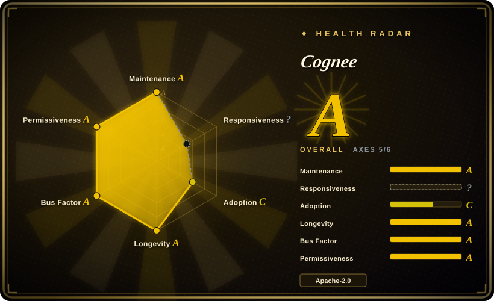
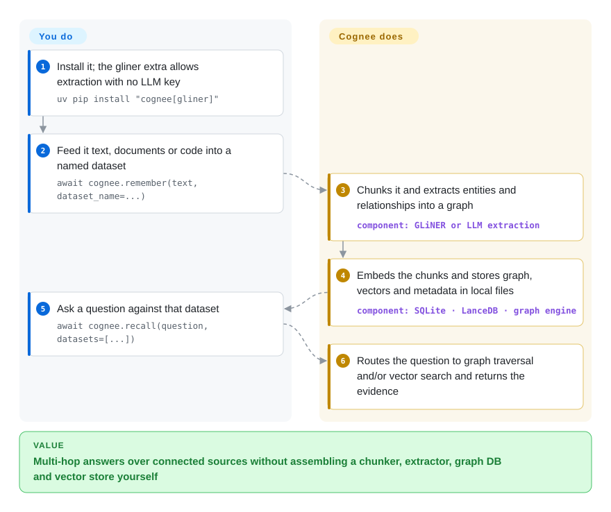

# Cognee

Your agent's memory is a heap of text chunks: vector search returns sentences that *look like* the question, but cannot follow "the customer who filed ticket 812 — which contract are they on, and who signed it?". Cognee turns what you feed it into a knowledge graph — entities and the relationships between them — kept alongside embeddings, and answers by walking the graph as well as searching the text.

## When to use

You are building a "company brain" or long-lived agent memory over material that is connected: docs, support tickets, meeting notes, a codebase, plus the lessons an agent learned in past sessions. Plain RAG keeps failing on multi-hop questions — it finds the ticket and the contract separately but never connects them — and you don't want to hand-assemble a pipeline of chunker, entity extractor, graph database and vector store. Cognee gives you that pipeline behind four calls (`remember`, `recall`, `improve`, `forget`), starts with embedded defaults (SQLite, LanceDB and an embedded graph engine in local files — no servers), can even extract with a small local model when you have no LLM key, and lets you move to Neo4j or PostgreSQL later.

Pick it over [Graphiti](graphiti.md) when the deciding factor is ingestion breadth and a zero-server start — Cognee ingests documents, code and session transcripts through one pipeline on embedded storage — while Graphiti's strength is a temporal graph where every fact carries a validity window, on Neo4j, FalkorDB or Neptune. Pick it over [Mem0](../app-memory/mem0.md) when relationships between facts matter more than a flat list of user preferences.

## How it works

**What Cognee does for you:** when you `remember` content, it splits it into chunks, extracts entities and relationships (with an LLM, or with the bundled GLiNER model — a small local model that tags names in text — when no key is set), writes those into a graph, embeds the chunks for similarity search, and keeps the source text for evidence. When you `recall`, it routes the question to graph traversal, vector search or both and returns the matching context, or a generated answer if an LLM is configured. `improve` enriches the graph afterwards and folds lessons from agent sessions into permanent memory. **What you do:** install it, choose which backends hold the relational, vector and graph data (defaults are local files), give it an LLM key if you want generated answers, and decide what to feed it. Think of it as a librarian who not only shelves every page but also draws a map of who and what each page mentions, so a question can follow the map instead of re-reading the shelf. You can reach the same memory from Python, the `cognee-cli`, a REST API (Docker), an MCP server, or the Claude Code / Codex plugins.

<!-- flow-steps:begin (generated from flows/cognee.json by tools/flow_card.py — do not edit) -->

Text version of the flow

1. **You**: Install it; the gliner extra allows extraction with no LLM key — `uv pip install "cognee[gliner]"`
2. **You**: Feed it text, documents or code into a named dataset — `await cognee.remember(text, dataset_name=...)`
3. **Cognee**: Chunks it and extracts entities and relationships into a graph — component: `GLiNER or LLM extraction`
4. **Cognee**: Embeds the chunks and stores graph, vectors and metadata in local files — component: `SQLite · LanceDB · graph engine`
5. **You**: Ask a question against that dataset — `await cognee.recall(question, datasets=[...])`
6. **Cognee**: Routes the question to graph traversal and/or vector search and returns the evidence

**Value**: Multi-hop answers over connected sources without assembling a chunker, extractor, graph DB and vector store yourself

<!-- flow-steps:end -->

## When NOT to use

- **You only need a chatbot to remember user preferences.** Every `remember` runs graph extraction, which costs an LLM call (or local-model CPU) per document and pulls in a heavy dependency tree. Use [Mem0](../app-memory/mem0.md) or [LangMem](../app-memory/langmem.md) instead, because flat fact memory needs no graph.
- **"What was true when" is the core requirement.** If every fact must carry a validity window and history must stay queryable, use [Graphiti](graphiti.md) instead, because temporal edges are its data model rather than an add-on.
- **You want the whole memory layer on one PostgreSQL in production.** The README marks Postgres-as-graph-store as a *demo* feature and says the production-ready version is a licensed product. Use Cognee with Neo4j, or [Graphiti](graphiti.md) on Neo4j/FalkorDB, instead of building production on the demo path.
- **You need keyless extraction quality in production.** The bundled GLiNER extractor is described upstream as a demo of the small-model pipeline; a production-grade version is offered by contacting the company. Plan on an LLM key (OpenAI by default, or Ollama/other providers via LiteLLM), or choose [Mem0](../app-memory/mem0.md) if you cannot afford per-document LLM extraction.
- **You run on macOS 13/14 with the embedded graph engine.** `pyproject.toml` pins those platforms to an older engine line (`ladybug` 0.17.x) that its own comment says stays exposed to storage-corruption defects fixed later. Use the Docker image or a Neo4j backend there instead of the embedded default.
- **You cannot absorb fast-moving APIs.** 1.0 shipped in April 2026 and releases land roughly weekly, some with breaking notes (v1.6.1 made `dlt` a core dependency). If you need a frozen API, pin a version and test upgrades, or use [Graphiti](graphiti.md)'s smaller surface.
- **You only want Claude Code to recall past sessions.** Use [claude-mem](../coding-agent-memory/claude-mem.md) instead; Cognee's Claude Code plugin earns its weight only when the same memory must also hold company docs or code.

## Comparison

| Alternative | In index | Our verdict | Tradeoff |
|---|---|---|---|
| [Graphiti](graphiti.md) | ✅ | Pick Graphiti when facts change over time and you must ask what was true at a given date; pick Cognee when you need one pipeline from mixed documents and code to a graph with no servers to start. | Graphiti gives first-class validity windows; it needs Neo4j, FalkorDB or Neptune from day one. |
| [Mem0](../app-memory/mem0.md) | ✅ | Pick Mem0 for per-user fact memory added to an existing agent; pick Cognee when answers depend on relationships across many documents. | Mem0 is lighter per write; you lose multi-hop traversal over entities. |
| [Hindsight](../app-memory/hindsight.md) | ✅ | Pick Hindsight when you want a memory server built around an agent's conversations; pick Cognee when the memory is mostly your organization's documents and code. | Hindsight centers on conversational facts; Cognee centers on ingesting and connecting heterogeneous sources. |
| [Zep](zep.md) | ✅ | Pick Zep when you want temporal-graph memory as a hosted service and accept a vendor cloud; pick Cognee when you must self-host under Apache-2.0. | Zep removes ops; its repo is now examples for Zep Cloud, so self-hosting means Graphiti, not Zep. |
| Microsoft GraphRAG (`microsoft/graphrag`) | not indexed | Pick GraphRAG for one-off, offline graph indexing of a fixed corpus to answer global "what are the themes" questions; pick Cognee for memory that agents keep writing to. | GraphRAG's community summaries suit static corpora; incremental agent writes are Cognee's job. |

## Tech stack

- **Python 3.10–3.14**, async throughout; FastAPI + uvicorn/gunicorn for the REST API; SQLAlchemy + Alembic for relational metadata.
- **Default storage (embedded, file-based):** SQLite (relational), LanceDB (vectors), and an embedded graph engine via the `ladybug` package (the graph provider key is still named `kuzu`). **Optional:** Neo4j, PostgreSQL + pgvector, Turso, remote graph engines.
- **Models:** LiteLLM + Instructor for LLM calls (OpenAI by default; Ollama and others configurable); fastembed (ONNX Runtime) for local embeddings; GLiNER (`cognee[gliner]` extra) for keyless entity extraction.
- **Other:** rdflib for ontologies, dlt for data loading, networkx; a separate `cognee-mcp` server, a Node.js-based local UI, TypeScript SDK and a Rust port (`cognee-rs`).

## Dependencies

- **Minimum local run:** Python and `pip install cognee` (add `[gliner]` for keyless extraction); models download on first use. No database servers.
- **For generated answers / better extraction:** an LLM API key (`LLM_API_KEY`, OpenAI by default) or a local Ollama setup; embeddings then also go to the provider unless configured otherwise.
- **For the API/UI stack:** Docker (`cognee/cognee` image; API on 8000, UI on 3000, MCP on 8001), Node.js/npm for the UI launcher.
- **For production scale:** a graph database (Neo4j) and/or PostgreSQL with pgvector, persistent volumes, and authentication configured (the API is multi-tenant and requires login unless you explicitly disable access control).

## Ops difficulty

**Low as a library, medium-to-high as a shared service.** Embedded mode is a pip install with local files, so a prototype has nothing to operate. Running it as the memory for a team means operating the API with auth on (the README's one-line Docker example disables access control — a single-user posture you must not expose), choosing and backing up graph/vector/relational stores, budgeting LLM calls for every ingest and `improve` pass, and tracking a weekly release train with occasional breaking notes and pinned native dependencies (LanceDB/Lance, the embedded graph engine).

## Health & viability

- **Very active (as of 2026-10-08).** Commits land daily (13 of the last 13 weeks active) and releases ship roughly weekly — v1.6.0 on 2026-09-18 through v1.6.3 on 2026-10-07. Maintenance A.
- **Company-backed, broad contributor base.** Built by topoteretes (Cognee the company, which also sells Cognee Cloud and licensed production features); 244 active contributors in the trailing year by the scorer's count, top contributor ~33%. Governance A — but the roadmap and the open-core line belong to the company.
- **Age and Lindy: about three years old** (repo created 2023-08-16, 1149 days) and still accelerating — longevity A, though 1.0 is only six months old, so the stable API is young.
- **Adoption C.** 86,048 PyPI downloads last month and 208,847 Docker pulls of `cognee/cognee`; ~31.6k stars run well ahead of those usage numbers.
- **Responsiveness is no longer scored.** The previous radar scored this axis; this scoring found no qualifying issue-response window (`?`), so issue triage speed is currently unknown rather than bad.
- **Risk flags:** Apache-2.0 core with open-core gating (Postgres-graph production version, production small-model extractor, Cognee Cloud); fast API churn after 1.0; the embedded graph engine moved off upstream Kuzu (archived 2025-10) onto `ladybug`.

## Caveats (unverified)

- [未验证] BEAM benchmark scores in the README (0.79 at 100K tokens, 0.67 at 10M) are vendor-reported with benchmark-specific prompts and retrieval settings; not reproduced here.
- [推断] `ladybug` appears to be a fork/continuation of the archived Kuzu engine (the provider key is still `kuzu`); its long-term maintenance is a separate dependency risk.
- [未验证] The boundary between open-source and licensed features may move; the list above comes from README wording on 2026-10-08.
- [未验证] Quality of keyless GLiNER extraction versus LLM extraction was not measured.
- [推断] The 244 "active contributors" count likely includes one-off and bot-assisted contributors; the core team is the handful at the top of the contributor list.
