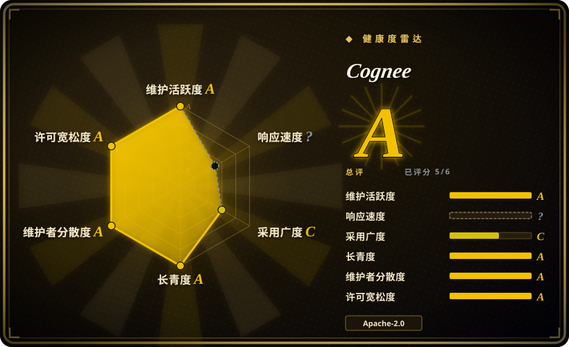
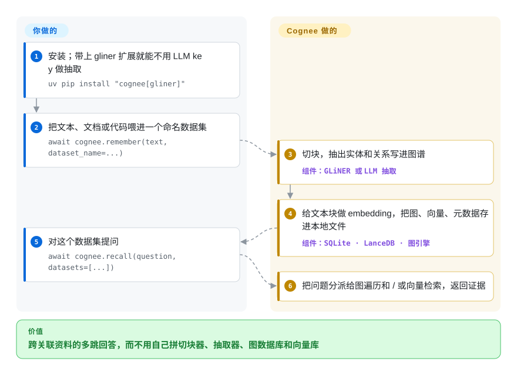

# Cognee

你的 agent 记忆是一堆文本碎片：向量检索返回的是和问题“长得像”的句子，却跟不上“提交 812 号工单的那个客户——签的是哪份合同、谁签的？”这种问题。Cognee 把你喂给它的内容变成一张知识图谱——实体以及实体之间的关系——和 embedding 存在一起，回答时既沿着图走，也搜原文。

## 何时使用

你在给一堆彼此关联的材料搭“公司大脑”或长期 agent 记忆：文档、客服工单、会议纪要、代码库，再加上 agent 在过往会话里学到的经验。普通 RAG 一碰到多跳问题就失败——它能分别找到那张工单和那份合同，却连不起来——而你又不想亲手拼一条“切块器 + 实体抽取 + 图数据库 + 向量库”的管线。Cognee 把这条管线收进四个调用（`remember`、`recall`、`improve`、`forget`），默认用嵌入式存储起步（SQLite、LanceDB 和一个嵌入式图引擎，全是本地文件，不用起服务器），没有 LLM key 时甚至能用本地小模型做抽取，以后再迁到 Neo4j 或 PostgreSQL。

和 [Graphiti](graphiti.zh.md) 比，决定因素是摄入面宽和零服务器起步——Cognee 用一条管线在嵌入式存储上摄入文档、代码和会话记录；Graphiti 的强项则是时间图谱，每条事实都带有效期，跑在 Neo4j、FalkorDB 或 Neptune 上。和 [Mem0](../app-memory/mem0.zh.md) 比，当事实之间的关系比一张扁平的用户偏好清单更重要时选 Cognee。

## 怎么用起来

**Cognee 替你做的：**你 `remember` 一段内容时，它把内容切块，抽出实体和关系（用 LLM；没配 key 时用自带的 GLiNER——一个在文本里标出人名、物名的本地小模型），写进图里，再给文本块做 embedding（把文字变成可比较远近的数字向量）以便相似检索，同时保留原文当证据。你 `recall` 时，它把问题分派给图遍历、向量检索或两者并用，返回匹配的上下文；配了 LLM 就直接生成答案。`improve` 在事后丰富图谱，并把 agent 会话里的经验沉淀进永久记忆。**你要做的：**安装，选关系、向量、图三类数据各放在哪个后端（默认都是本地文件），想要生成式答案就给它一个 LLM key，再决定喂什么。可以把它想成一个图书管理员：不光把每一页上架，还画一张“每页提到了谁、什么”的地图，问题可以顺着地图走，不必把书架重读一遍。同一份记忆可以从 Python、`cognee-cli`、REST API（Docker）、MCP 服务器或 Claude Code / Codex 插件访问。

<!-- flow-steps:begin (generated from flows/cognee.json by tools/flow_card.py — do not edit) -->

流程文字版

1. **你**：安装；带上 gliner 扩展就能不用 LLM key 做抽取 — `uv pip install "cognee[gliner]"`
2. **你**：把文本、文档或代码喂进一个命名数据集 — `await cognee.remember(text, dataset_name=...)`
3. **Cognee**：切块，抽出实体和关系写进图谱 — 组件：`GLiNER 或 LLM 抽取`
4. **Cognee**：给文本块做 embedding，把图、向量、元数据存进本地文件 — 组件：`SQLite · LanceDB · 图引擎`
5. **你**：对这个数据集提问 — `await cognee.recall(question, datasets=[...])`
6. **Cognee**：把问题分派给图遍历和 / 或向量检索，返回证据

**价值**：跨关联资料的多跳回答，而不用自己拼切块器、抽取器、图数据库和向量库

<!-- flow-steps:end -->

## 何时不用

- **你只需要聊天机器人记住用户偏好。** 每次 `remember` 都会跑图谱抽取，每篇文档要花一次 LLM 调用（或本地模型的 CPU），还会拉进一棵很重的依赖树。改用 [Mem0](../app-memory/mem0.zh.md) 或 [LangMem](../app-memory/langmem.zh.md)，因为扁平的事实记忆不需要图。
- **“当时什么是真的”是核心需求。** 如果每条事实都必须带有效期、历史必须可查询，改用 [Graphiti](graphiti.zh.md)，因为时间边是它的数据模型本身，而不是附加功能。
- **你想在生产上把整个记忆层放在一个 PostgreSQL 上。** README 把“Postgres 当图存储”标为*演示*功能，并说生产可用版本是付费授权产品。改用 Cognee 配 Neo4j，或者在 Neo4j / FalkorDB 上用 [Graphiti](graphiti.zh.md)，不要把生产建在演示路径上。
- **你需要生产级的无 key 抽取质量。** 上游把自带的 GLiNER 抽取器描述为小模型管线的演示，生产级版本要联系公司获取。要么准备 LLM key（默认 OpenAI，也可通过 LiteLLM 用 Ollama 或其他提供方），要么在付不起逐文档 LLM 抽取时改用 [Mem0](../app-memory/mem0.zh.md)。
- **你在 macOS 13/14 上用嵌入式图引擎。** `pyproject.toml` 把这两个系统钉在较老的引擎版本线（`ladybug` 0.17.x），它自己的注释写明这条线仍暴露在后来才修复的存储损坏缺陷下。在这类机器上改用 Docker 镜像或 Neo4j 后端，不要用嵌入式默认值。
- **你承受不了快速变化的 API。** 1.0 在 2026 年 4 月才发布，之后大约每周一个版本，部分带破坏性说明（v1.6.1 把 `dlt` 变成了核心依赖）。如果你要冻结的 API，就锁版本、升级前测试，或者用接口面更小的 [Graphiti](graphiti.zh.md)。
- **你只想让 Claude Code 记住过往会话。** 改用 [claude-mem](../coding-agent-memory/claude-mem.zh.md)；只有当同一份记忆还要装公司文档或代码时，Cognee 的 Claude Code 插件才值得它的分量。

## 横向对比

| 替代品 | 是否收录 | 我们的评价 | 取舍 |
|---|---|---|---|
| [Graphiti](graphiti.zh.md) | 已收录 | 事实会随时间变化、必须能问“某个日期时什么是真的”时选 Graphiti；需要一条从混合文档和代码到图谱的管线、并且零服务器起步时选 Cognee。 | Graphiti 把有效期做成一等公民；但从第一天起就要 Neo4j、FalkorDB 或 Neptune。 |
| [Mem0](../app-memory/mem0.zh.md) | 已收录 | 给已有 agent 加按用户划分的事实记忆时选 Mem0；答案依赖跨多份文档的关系时选 Cognee。 | Mem0 每次写入更轻；代价是失去在实体之间多跳遍历的能力。 |
| [Hindsight](../app-memory/hindsight.zh.md) | 已收录 | 想要一个围绕 agent 对话构建的记忆服务器时选 Hindsight；记忆主要是你组织的文档和代码时选 Cognee。 | Hindsight 以对话事实为中心；Cognee 以摄入并连接异构来源为中心。 |
| [Zep](zep.zh.md) | 已收录 | 想要托管的时间图谱记忆、接受厂商云时选 Zep；必须在 Apache-2.0 下自托管时选 Cognee。 | Zep 省掉运维；它的仓库现在是 Zep Cloud 的示例，想自托管就是 Graphiti，而不是 Zep。 |
| Microsoft GraphRAG（`microsoft/graphrag`） | 未收录 | 对一份固定语料做一次性离线图索引、回答“整体有哪些主题”这类全局问题时选 GraphRAG；要做 agent 持续写入的记忆时选 Cognee。 | GraphRAG 的社区摘要适合静态语料；agent 的增量写入是 Cognee 的活。 |

## 技术栈

- **Python 3.10–3.14**，全程异步；REST API 用 FastAPI + uvicorn / gunicorn；关系型元数据用 SQLAlchemy + Alembic。
- **默认存储（嵌入式、基于文件）：** SQLite（关系）、LanceDB（向量），以及通过 `ladybug` 包提供的嵌入式图引擎（图后端的配置键仍叫 `kuzu`）。**可选：** Neo4j、PostgreSQL + pgvector、Turso、远程图引擎。
- **模型：** LLM 调用走 LiteLLM + Instructor（默认 OpenAI，可配 Ollama 等）；本地 embedding 用 fastembed（ONNX Runtime）；无 key 实体抽取用 GLiNER（`cognee[gliner]` 扩展）。
- **其他：** rdflib 处理本体，dlt 负责数据加载，networkx；另有独立的 `cognee-mcp` 服务器、基于 Node.js 的本地 UI、TypeScript SDK 和 Rust 移植版（`cognee-rs`）。

## 依赖

- **最小本地运行：** Python 加 `pip install cognee`（要无 key 抽取就加 `[gliner]`）；模型首次使用时下载。不需要数据库服务器。
- **要生成式答案 / 更好的抽取：** 一个 LLM API key（`LLM_API_KEY`，默认 OpenAI）或本地 Ollama；此时 embedding 默认也会发给该提供方，除非另行配置。
- **要 API / UI 整套：** Docker（`cognee/cognee` 镜像；API 在 8000、UI 在 3000、MCP 在 8001），UI 启动器需要 Node.js / npm。
- **要生产规模：** 图数据库（Neo4j）和 / 或带 pgvector 的 PostgreSQL、持久卷，以及配好的认证（API 是多租户的，除非你显式关闭访问控制，否则每次调用都要登录）。

## 运维难度

**当库用低，当共享服务用中到高。** 嵌入式模式就是一次 pip 安装加本地文件，原型阶段没什么可运维的。把它做成团队的记忆，就要在开着认证的前提下运维 API（README 那条一行 Docker 示例关掉了访问控制——这是单用户姿态，不能对外暴露），选择并备份图、向量、关系三类存储，为每次摄入和 `improve` 预算 LLM 调用，还要跟上每周一版、偶有破坏性说明、并钉死原生依赖（LanceDB / Lance、嵌入式图引擎）的发版节奏。

## 健康度与可持续性

- **非常活跃（截至 2026-10-08）。** 每天都有提交（最近 13 周里 13 周活跃），大约每周发一个版本——从 2026-09-18 的 v1.6.0 到 2026-10-07 的 v1.6.3。维护度 A。
- **公司背书，贡献者面广。** 由 topoteretes（即 Cognee 公司，同时销售 Cognee Cloud 和付费的生产功能）打造；按评分器的统计过去一年 244 位活跃贡献者，头号贡献者约占 33%。治理 A——但路线图和开源 / 收费的分界线归公司所有。
- **年龄与 Lindy：约三年**（仓库 2023-08-16 创建，1149 天），而且还在加速——寿命 A；不过 1.0 才六个月，稳定 API 还很年轻。
- **采用度 C。** 上个月 PyPI 下载 86,048 次，`cognee/cognee` Docker 镜像拉取 208,847 次；约 3.16 万星远远跑在这些使用数字前面。
- **响应度不再有评分。** 上一版雷达对这一轴有评分；这次评分没找到合格的 issue 响应窗口（`?`），所以 issue 处理速度目前是“未知”，不是“差”。
- **风险信号：** 核心 Apache-2.0，但有开源 / 收费分层（Postgres 图存储的生产版、生产级小模型抽取器、Cognee Cloud）；1.0 之后 API 变化快；嵌入式图引擎已从上游 Kuzu（2025-10 归档）换到 `ladybug`。

## 存疑（未验证）

- [未验证] README 里的 BEAM 基准分数（10 万 token 0.79、1000 万 token 0.67）是厂商自报，用了针对基准的提示词和检索设置，本次没有复现。
- [推断] `ladybug` 看起来是已归档 Kuzu 引擎的分支 / 延续（配置键仍是 `kuzu`）；它的长期维护是另一项依赖风险。
- [未验证] 开源与付费功能的分界可能移动；上面的清单来自 2026-10-08 的 README 措辞。
- [未验证] 没有测量 GLiNER 无 key 抽取与 LLM 抽取的质量差距。
- [推断] “244 位活跃贡献者”很可能包含一次性和机器人辅助的贡献者；核心团队是贡献者列表顶部的少数几人。
