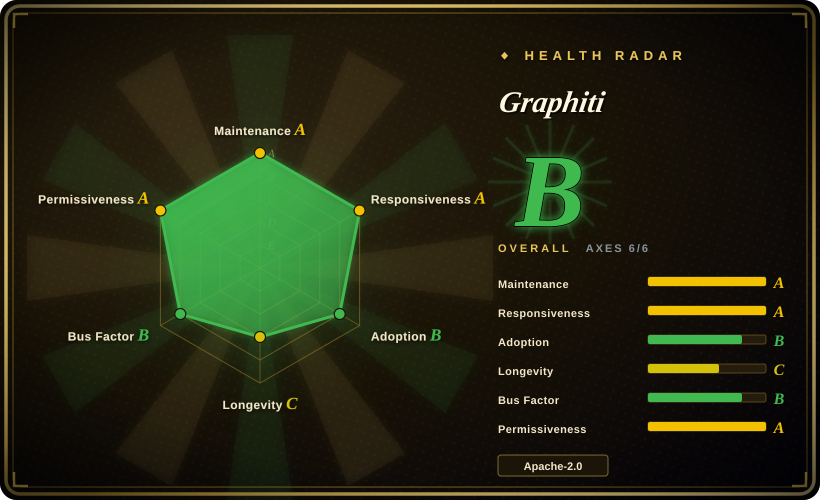
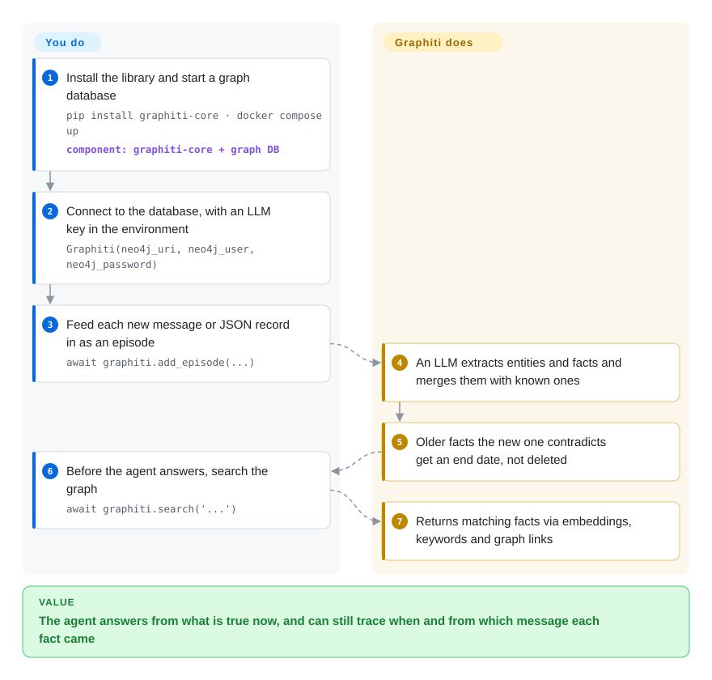

# Graphiti

Your agent remembers "the customer loves Adidas" from March and keeps recommending Adidas in June, after the customer said they switched to Puma — a vector store holds both sentences and cannot tell which one is still true. Graphiti turns every message or record you feed it into a graph of people, things and facts, where each fact carries the dates it was true, so a new fact retires the old one instead of sitting next to it.

## When to use

You're building a support or sales agent whose users change their minds, jobs, addresses and preferences over weeks, and plain vector memory has started to bite: the user said "I no longer like Adidas, I want Puma" two sessions ago, yet retrieval still surfaces "loves Adidas" because it is the closer embedding match. You need memory that knows *when* each fact held, can answer "what was true in March?", and can show which message a fact came from. You `pip install graphiti-core`, point it at a Neo4j or FalkorDB you run, feed each conversation turn or JSON record in as an "episode", and query it before every reply.

You pick Graphiti over [Mem0](../app-memory/mem0.md) when contradictions and history are the point — Graphiti's data model is facts with validity windows that get invalidated, whereas Mem0's ADD-only extraction keeps every memory it ever wrote. You pick it over [Cognee](cognee.md) when the input is a stream of changing facts rather than a pile of documents to digest. And you pick it over [Zep](zep.md) — the managed service built on Graphiti — when you must self-host under Apache-2.0 and are willing to run the graph database and write the user/session plumbing yourself.

## How it works

Graphiti is a Python library, not a server: it does the knowledge work, you supply the infrastructure and decide what goes in. Each time you call `add_episode` with a piece of text or JSON (an "episode" is just one unit of raw input, kept verbatim as provenance), Graphiti asks an LLM to pull out the entities — people, products, policies — and the facts linking them, merges them with entities it already knows, and, when a new fact contradicts an old one, stamps the old one with an end date instead of deleting it. That is the "temporal" part: every fact is like a dated entry in a ledger — superseded entries are crossed out, never torn out. Searching mixes three lookups — meaning-based similarity over embeddings (numeric fingerprints of text), keyword matching (BM25), and walking the graph's links — and returns facts, not text chunks. You run the graph database (Neo4j, FalkorDB or Amazon Neptune), supply LLM and embedding credentials (OpenAI by default), choose what counts as an episode, and decide what to put in the prompt; users, threads, dashboards and access control are yours to build. The repo also ships an MCP server and a FastAPI REST service if you'd rather not embed the library.

<!-- flow-steps:begin (generated from flows/graphiti.json by tools/flow_card.py — do not edit) -->

Text version of the flow

1. **You**: Install the library and start a graph database — `pip install graphiti-core · docker compose up` — component: `graphiti-core + graph DB`
2. **You**: Connect to the database, with an LLM key in the environment — `Graphiti(neo4j_uri, neo4j_user, neo4j_password)`
3. **You**: Feed each new message or JSON record in as an episode — `await graphiti.add_episode(...)`
4. **Graphiti**: An LLM extracts entities and facts and merges them with known ones
5. **Graphiti**: Older facts the new one contradicts get an end date, not deleted
6. **You**: Before the agent answers, search the graph — `await graphiti.search('...')`
7. **Graphiti**: Returns matching facts via embeddings, keywords and graph links

**Value**: The agent answers from what is true now, and can still trace when and from which message each fact came

<!-- flow-steps:end -->

## When NOT to use

- **You don't want to run a graph database.** Graphiti needs Neo4j 5.26+, FalkorDB or Amazon Neptune (+ OpenSearch) from day one; the embedded Kuzu backend is deprecated because upstream Kuzu is unmaintained. For memory on a plain vector store use [Mem0](../app-memory/mem0.md); for a zero-server start on embedded storage use [Cognee](cognee.md); for the same temporal graph as a hosted service use [Zep](zep.md) (Zep Cloud, not open source).
- **Facts rarely change and you just need "remember what the user told me".** Each episode costs several LLM calls (extraction, deduplication, invalidation), so ingest is slow and billed per message. If preferences are stable and a flat list of extracted memories is enough, [Mem0](../app-memory/mem0.md) is the cheaper path.
- **Your input is a static document corpus to summarize.** Graphiti is built for incremental, changing data. For "digest these 10,000 PDFs into a graph once", use [Cognee](cognee.md) or Microsoft GraphRAG (not indexed), which are shaped around document ingestion.
- **You must run on a small local model.** Extraction depends on structured JSON output; the README warns that small or local models frequently emit off-schema JSON and fail ingestion. If you are locked to a weak local model, pick vector memory such as [Mem0](../app-memory/mem0.md) or test extraction quality before committing.
- **You need users, threads, access control and a dashboard out of the box.** The README's own Zep-vs-Graphiti table says all of that is "build your own" in Graphiti. Use [Zep](zep.md) if you will pay for it, or an agent runtime with built-in memory management instead.
- **You need a frozen API or a no-phone-home library.** Graphiti is still 0.x — v0.30.0 (2026-09) changed which Neo4j database queries hit, and the prompt-override API changed shape. It also sends anonymous PostHog telemetry by default (opt out with `GRAPHITI_TELEMETRY_ENABLED=false`). Pin the version, read release notes before each upgrade and disable telemetry — or, if you cannot absorb engine changes, consume the same engine through [Zep](zep.md)'s versioned cloud SDK (v3) instead of embedding the library. (Don't expect [Cognee](cognee.md) to be calmer: its own page notes near-weekly releases with breaking notes.)

## Comparison

| Alternative | In index | Our verdict | Tradeoff |
|---|---|---|---|
| [Zep](zep.md) | ✅ | Pick Zep when you want this temporal graph as a managed service with users, threads, SDKs and a dashboard; pick Graphiti when you must self-host and own the data path. | Zep Cloud removes the graph database and adds governance, but it is a paid, closed service on a proprietary graph engine; the zep repo is only examples and integrations. |
| [Cognee](cognee.md) | ✅ | Pick Cognee when the input is mixed documents and code and you want to start with no servers; pick Graphiti when facts change over time and you must ask what was true at a given date. | Cognee has broader ingestion and embedded storage; Graphiti has first-class validity windows but needs a graph database from the first line. |
| [Mem0](../app-memory/mem0.md) | ✅ | Pick Mem0 for cheap per-user preference memory on a vector store; pick Graphiti when contradictions must retire old facts and history must stay queryable. | Mem0 is lighter to run and call; its extraction is ADD-only, so a contradicted memory is never retired and stale entries must be pruned by you. |
| Microsoft GraphRAG | not indexed | Pick GraphRAG to summarize a fixed corpus into community-level answers; pick Graphiti when data arrives continuously and queries must be sub-second. | GraphRAG batch-recomputes over a static corpus and answers via LLM summarization; Graphiti updates incrementally but does not produce corpus-wide summaries. |

## Tech stack

- **Language:** Python ≥ 3.10, async API; package `graphiti-core` on PyPI (v0.30.2 as of 2026-09-08).
- **Graph backends:** Neo4j 5.26+, FalkorDB (also FalkorDB Lite embedded, Python 3.12+), Amazon Neptune Database / Neptune Analytics with OpenSearch Serverless for full-text; Kuzu (deprecated).
- **LLM / embeddings:** OpenAI by default; extras for Anthropic, Gemini, Groq, Voyage, sentence-transformers, GLiNER2; any OpenAI-compatible endpoint (Ollama, vLLM, OpenRouter…) via `OpenAIGenericClient`.
- **Retrieval:** hybrid semantic (embeddings) + BM25 + graph traversal, with optional cross-encoder reranking.
- **Extras in the repo:** an MCP server (`mcp_server/`, Docker with FalkorDB or Neo4j) and a FastAPI REST service (`server/`).
- **Core deps:** `pydantic`, `neo4j`, `openai`, `tenacity`, `numpy`, `posthog` (telemetry).

## Dependencies

- **A graph database you operate:** Neo4j or FalkorDB (Docker Compose files provided), or Amazon Neptune + OpenSearch Serverless on AWS.
- **An LLM and an embedding provider:** `OPENAI_API_KEY` by default; the LLM must reliably honour structured (JSON-schema) output.
- **Network egress to PostHog** unless you set `GRAPHITI_TELEMETRY_ENABLED=false`.
- No GPU needed unless you choose local models or local rerankers.

## Ops difficulty

**Medium.** The library itself is a `pip install`, but production means operating a graph database (backups, memory sizing, upgrades) plus paying for and rate-limiting LLM calls on every ingest. Ingest concurrency is throttled by `SEMAPHORE_LIMIT` (default 10) to avoid provider 429 errors, so bulk backfills need tuning. Because the API is 0.x, budget time to read release notes on each upgrade — v0.30.0 shipped a behaviour change for Neo4j Enterprise multi-database setups.

## Health & viability

- **Maintenance (2026-10-08):** very active — commits within the last day, releases every few weeks (v0.29.3 on 2026-07-27, v0.30.0 on 2026-09-01, v0.30.2 on 2026-09-08), plus a separately versioned MCP server (mcp-v1.1.0). Issue first responses arrive in about a day.
- **Governance & backing:** owned by Zep (the `getzep` org); the top contributors are Zep staff, and a CLA bot gates contributions. The roadmap follows Zep's commercial product — Graphiti is the open core under Zep Cloud — which gives it funding but also means users, threads and governance features are kept on the paid side.
- **Age / Lindy:** created 2024-08 (~2 years) and still pre-1.0. Young for infrastructure you will store long-lived user memory in; the active backing offsets that only partly.
- **Adoption:** ~31.5k stars and 619,128 PyPI downloads in the last month (as of 2026-10); its architecture is written up in an arXiv paper (2501.13956).
- **Risk flags:** Apache-2.0 with no relicense history; on-by-default telemetry; deprecated Kuzu backend; open-core dependency on a single vendor's strategy (Zep already deprecated its own open-source Community Edition in 2025).

## Caveats (unverified)

- [未验证] The README's comparative claims (sub-second query latency, "high" scalability versus GraphRAG) are vendor statements; this page did not benchmark them.
- [未验证] Per-episode LLM call count and cost depend on configuration and episode size; "several calls per episode" is read from the pipeline description, not measured.
- [推断] That Graphiti's roadmap will keep reserving user/thread/governance features for Zep Cloud is inferred from the README's Zep-vs-Graphiti table and Zep's 2025 Community Edition deprecation, not from a stated policy.
- [未验证] Quality of extraction with OpenAI-compatible local models (Ollama, vLLM) was not tested here; the README itself warns small models often fail.
