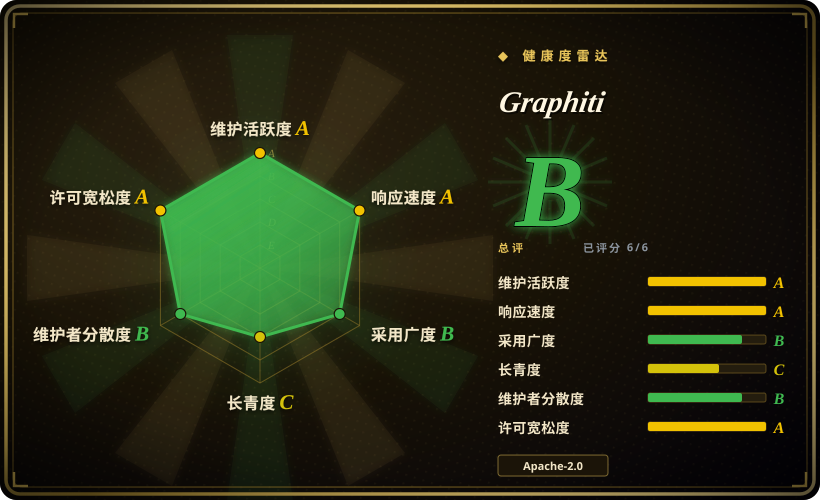
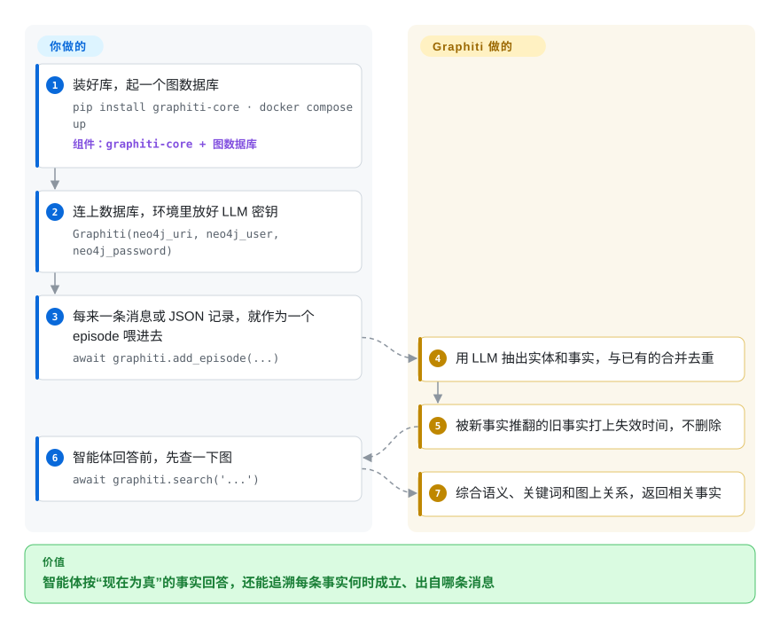

# Graphiti

用户三月说“我最喜欢 Adidas”，六月改口“我不喜欢 Adidas 了，想要 Puma”，你的智能体却还在推 Adidas：向量库里两句话都在，它分不出哪句仍然成立。Graphiti 把你喂进去的每条消息、每条记录整理成一张“人—物—事实”的图，每条事实都记着从何时到何时成立，新事实进来就让旧事实失效，而不是和它并排躺着。

## 何时使用

你在做一个客服或销售智能体，用户的偏好、工作、住址隔几周就变，普通的向量记忆开始出错：用户两次会话前说过“我不喜欢 Adidas 了，想要 Puma”，检索却还是把“喜欢 Adidas”捞出来，因为它和问题的向量更像。你需要的记忆得知道每条事实在**什么时间**成立，能回答“三月时什么是真的”，还能指出某条事实出自哪条消息。你 `pip install graphiti-core`，接上自己跑的 Neo4j 或 FalkorDB，把每轮对话或每条 JSON 记录作为一个 episode 喂进去，每次回答前查一遍。

和 [Mem0](../app-memory/mem0.zh.md) 比，当矛盾与历史本身就是重点时选 Graphiti：它的数据模型是带有效期、会被判失效的事实，而 Mem0 的抽取只增不改，写过的记忆一直都在。和 [Cognee](cognee.zh.md) 比，输入是一条不断变化的事实流、而不是一堆待消化的文档时选 Graphiti。和 [Zep](zep.zh.md)（基于 Graphiti 的托管服务）比，当你必须在 Apache-2.0 下自托管、并愿意自己运维图数据库、自己写用户和会话那一层时选 Graphiti。

## 怎么用起来

Graphiti 是一个 Python 库，不是服务：知识整理归它，基础设施和“喂什么”归你。每次你用一段文本或 JSON 调 `add_episode`（episode 就是一份原始输入，会原样留存作为出处），Graphiti 让 LLM 抽出其中的实体（人、产品、政策）和连接它们的事实，与图里已有的实体合并；如果新事实和旧事实矛盾，就给旧事实打上结束时间，而不是删掉它。这就是“时序”的含义：每条事实像账本里一笔带日期的记录，过时的划掉但不撕页。查询时同时用三种方式找：按语义相似度比对 embedding（文本的数值指纹）、按关键词匹配（BM25）、沿着图里的关系走，返回的是事实而不是文本片段。你负责运行图数据库（Neo4j、FalkorDB 或 Amazon Neptune），提供 LLM 和 embedding 的凭据（默认 OpenAI），决定什么算一个 episode，以及把查到的什么放进提示词；用户、会话、后台面板、权限控制都要自己搭。如果不想嵌入库，仓库里还带一个 MCP 服务器和一个 FastAPI REST 服务。

<!-- flow-steps:begin (generated from flows/graphiti.json by tools/flow_card.py — do not edit) -->

流程文字版

1. **你**：装好库，起一个图数据库 — `pip install graphiti-core · docker compose up` — 组件：`graphiti-core + 图数据库`
2. **你**：连上数据库，环境里放好 LLM 密钥 — `Graphiti(neo4j_uri, neo4j_user, neo4j_password)`
3. **你**：每来一条消息或 JSON 记录，就作为一个 episode 喂进去 — `await graphiti.add_episode(...)`
4. **Graphiti**：用 LLM 抽出实体和事实，与已有的合并去重
5. **Graphiti**：被新事实推翻的旧事实打上失效时间，不删除
6. **你**：智能体回答前，先查一下图 — `await graphiti.search('...')`
7. **Graphiti**：综合语义、关键词和图上关系，返回相关事实

**价值**：智能体按“现在为真”的事实回答，还能追溯每条事实何时成立、出自哪条消息

<!-- flow-steps:end -->

## 何时不用

- **你不想运维图数据库。** Graphiti 从第一天就要 Neo4j 5.26+、FalkorDB 或 Amazon Neptune（外加 OpenSearch）；嵌入式的 Kuzu 后端已被标为弃用，因为上游 Kuzu 不再维护。想在普通向量库上做记忆，用 [Mem0](../app-memory/mem0.zh.md)；想零服务器起步、用嵌入式存储，用 [Cognee](cognee.zh.md)；想要同样的时序图但交给别人托管，用 [Zep](zep.zh.md)（Zep Cloud，非开源）。
- **事实很少变，你只要“记住用户说过什么”。** 每个 episode 都要走几次 LLM 调用（抽取、去重、判失效），写入慢且按条计费。偏好稳定、一串抽取出来的记忆条目就够用时，[Mem0](../app-memory/mem0.zh.md) 更便宜。
- **输入是一批静态文档，要的是总结。** Graphiti 为增量变化的数据而设计。要“把一万份 PDF 一次性消化成图”，用 [Cognee](cognee.zh.md) 或 Microsoft GraphRAG（未收录），它们围绕文档导入来设计。
- **你只能跑小型本地模型。** 抽取依赖结构化 JSON 输出；README 明确警告小模型或本地模型经常吐出不符合 schema 的 JSON，导致写入失败。被锁在弱本地模型上时，改用 [Mem0](../app-memory/mem0.zh.md) 这类向量记忆，或先实测抽取质量再定。
- **你要开箱即用的用户、会话、权限和后台面板。** README 自己的 Zep 与 Graphiti 对照表里，这些在 Graphiti 一栏都写着“自己搭”。愿意付费就用 [Zep](zep.zh.md)，否则换一个自带记忆管理的智能体运行时。
- **你要冻结的 API，或不能“打电话回家”的库。** Graphiti 仍是 0.x：v0.30.0（2026-09）改变了查询落到哪个 Neo4j 数据库，提示词覆盖的 API 也改过形状。它还默认向 PostHog 发送匿名遥测（设 `GRAPHITI_TELEMETRY_ENABLED=false` 关闭）。要么锁版本、每次升级前读 release notes 并关掉遥测；要么在承受不了引擎变动时，改用 [Zep](zep.zh.md) 带版本号的云端 SDK（v3）来使用同一个引擎，而不是嵌入这个库。（别指望 [Cognee](cognee.zh.md) 更稳：它自己的页面就写着几乎每周发版、时有破坏性变更。）

## 横向对比

| 替代品 | 是否收录 | 我们的评价 | 取舍 |
|---|---|---|---|
| [Zep](zep.zh.md) | ✅ | 想要这套时序图的托管版、自带用户、会话、SDK 和面板时选 Zep；必须自托管、自己掌握数据链路时选 Graphiti。 | Zep Cloud 省掉图数据库并补上治理能力，但它是付费闭源服务，跑在专有图引擎上；zep 仓库本身只有示例和集成包。 |
| [Cognee](cognee.zh.md) | ✅ | 输入是混合文档和代码、想零服务器起步时选 Cognee；事实随时间变化、必须问“某天什么为真”时选 Graphiti。 | Cognee 导入面更宽、可用嵌入式存储；Graphiti 把有效期做成一等公民，但第一行代码就要图数据库。 |
| [Mem0](../app-memory/mem0.zh.md) | ✅ | 想在向量库上做便宜的按用户偏好记忆时选 Mem0；矛盾必须让旧事实失效、历史必须可查时选 Graphiti。 | Mem0 运行和调用都更轻；它的抽取只增不改，被推翻的记忆不会自动失效，过时条目要你自己清理。 |
| Microsoft GraphRAG | 未收录 | 要把一批固定语料总结成社区级答案时选 GraphRAG；数据持续流入、查询要亚秒级时选 Graphiti。 | GraphRAG 对静态语料批量重算，靠 LLM 总结作答；Graphiti 增量更新，但不产出全语料级总结。 |

## 技术栈

- **语言：** Python ≥ 3.10，异步 API；PyPI 包名 `graphiti-core`（截至 2026-09-08 为 v0.30.2）。
- **图后端：** Neo4j 5.26+、FalkorDB（Python 3.12+ 还可用嵌入式 FalkorDB Lite）、Amazon Neptune Database 或 Neptune Analytics 配 OpenSearch Serverless 做全文检索；Kuzu（已弃用）。
- **LLM 与 embedding：** 默认 OpenAI；可选 Anthropic、Gemini、Groq、Voyage、sentence-transformers、GLiNER2；任何 OpenAI 兼容端点（Ollama、vLLM、OpenRouter 等）通过 `OpenAIGenericClient` 接入。
- **检索：** 语义（embedding）+ BM25 + 图遍历的混合检索，可选 cross-encoder 重排。
- **仓库附带：** MCP 服务器（`mcp_server/`，Docker 配 FalkorDB 或 Neo4j）和 FastAPI REST 服务（`server/`）。
- **核心依赖：** `pydantic`、`neo4j`、`openai`、`tenacity`、`numpy`、`posthog`（遥测）。

## 依赖

- **一个你自己运维的图数据库：** Neo4j 或 FalkorDB（仓库提供 Docker Compose），或 AWS 上的 Amazon Neptune 加 OpenSearch Serverless。
- **一个 LLM 和一个 embedding 提供方：** 默认读 `OPENAI_API_KEY`；所用 LLM 必须能稳定遵守结构化（JSON schema）输出。
- **到 PostHog 的出网连接**，除非设置 `GRAPHITI_TELEMETRY_ENABLED=false`。
- 不需要 GPU，除非你选择本地模型或本地重排器。

## 运维难度

**中。** 库本身 `pip install` 即可，但上生产意味着要运维一个图数据库（备份、内存规划、升级），还要为每次写入的 LLM 调用付费并限流。写入并发由 `SEMAPHORE_LIMIT`（默认 10）控制，以免触发供应商的 429 限流，所以批量回填需要调参。API 仍是 0.x，每次升级都要留时间读 release notes：v0.30.0 就对 Neo4j 企业版多数据库部署做了行为变更。

## 健康度与可持续性

- **维护（2026-10-08）：** 非常活跃，最近一天内仍有提交，几周一个版本（v0.29.3 于 2026-07-27，v0.30.0 于 2026-09-01，v0.30.2 于 2026-09-08），MCP 服务器另有独立版本（mcp-v1.1.0）。issue 首次响应约一天。
- **治理与背书：** 归 Zep 公司（`getzep` 组织）所有，主要贡献者是 Zep 员工，贡献需签 CLA。路线图跟着 Zep 的商业产品走：Graphiti 是 Zep Cloud 底下的开源内核，这带来资金，也意味着用户、会话、治理这类功能留在付费侧。
- **年龄与 Lindy：** 2024-08 创建（约 2 年），仍未到 1.0。对一个要长期存放用户记忆的基础设施来说偏年轻，活跃的公司背书只能部分抵消。
- **采用：** 截至 2026-10 约 3.15 万 star、PyPI 近一个月下载 619,128 次；架构写成了一篇 arXiv 论文（2501.13956）。
- **风险信号：** Apache-2.0，无改许可证历史；遥测默认开启；Kuzu 后端已弃用；开源内核依赖单一厂商的策略（Zep 已在 2025 年弃用了自己的开源社区版）。

## 存疑（未验证）

- [未验证] README 里的对比说法（亚秒级查询延迟、相对 GraphRAG “高”可扩展性）是厂商自述，本页没有做基准测试。
- [未验证] 每个 episode 要几次 LLM 调用、花多少钱，取决于配置和 episode 大小；“几次调用”是根据流程描述读出来的，没有实测。
- [推断] “Graphiti 的路线图会继续把用户、会话、治理功能留给 Zep Cloud”，是依据 README 的 Zep 与 Graphiti 对照表和 Zep 2025 年弃用社区版推出来的，不是官方声明的政策。
- [未验证] 用 OpenAI 兼容的本地模型（Ollama、vLLM）时的抽取质量本页没有测试；README 自己也警告小模型常常失败。
