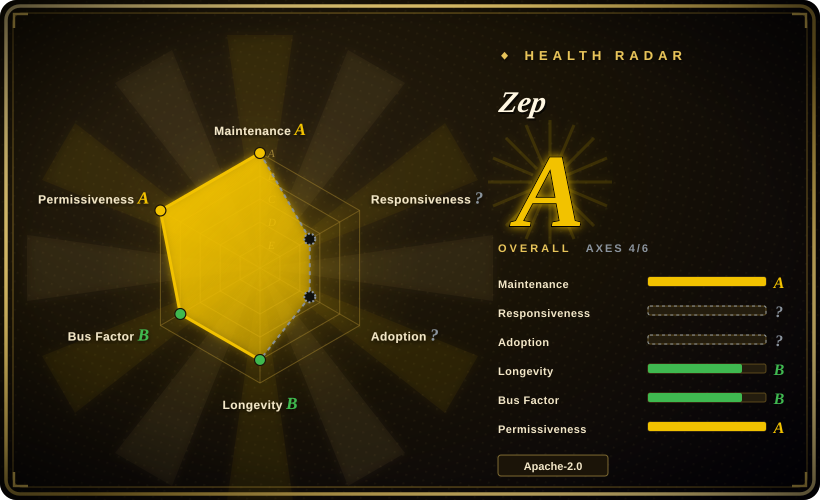
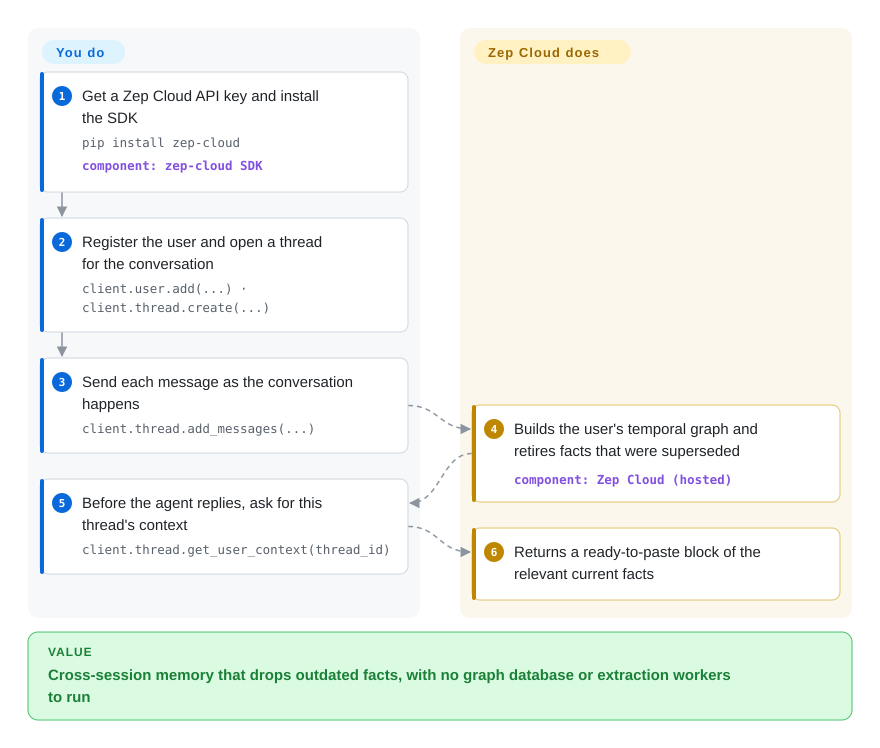

# Zep

You want your agent to remember each user across sessions — including that "loves Adidas" stopped being true once they switched to Puma — but you don't want to run a graph database or write the user/thread plumbing. Zep is a hosted memory service that does that for you; this repository is only its client side — SDK examples, ready-made adapters for agent frameworks and a bulk-ingest tool — because the self-hostable server was retired in 2025.

## When to use

You're shipping an assistant built on LangGraph, CrewAI, Google ADK, Pydantic AI or the Vercel AI SDK, and users complain it forgets them between sessions, or worse, quotes a preference they changed weeks ago. You've read about temporal knowledge graphs (facts with "valid from / valid until" dates) and like the idea, but your team has no appetite for operating Neo4j and building user, thread and access management around a library. You sign up for Zep Cloud, install `zep-cloud`, drop in the matching integration package from this repo's `integrations/` folder, and push each conversation turn; before every reply you ask Zep for that user's context block.

You pick Zep over [Graphiti](graphiti.md) — the open-source engine Zep is built on — when you would rather pay for a managed service than run a graph database and write the surrounding system yourself. You pick it over [Mem0](../app-memory/mem0.md) when facts that change over time are central and you want the old ones retired automatically rather than piling up. If you must self-host, this page is the wrong one: go to Graphiti.

## How it works

The memory itself lives in Zep Cloud, a paid service; nothing in this repository runs it. You create a user and a thread (one conversation) through the SDK and send each message as it happens; Zep's servers turn those messages into a per-user temporal knowledge graph — people, things and facts, each fact stamped with when it became true and, if superseded, when it stopped — using Graphiti on a proprietary graph engine. Before the agent replies, you call one method and get back a ready-to-paste context block of the facts relevant to this thread. What the repo gives you is the glue: runnable examples in Python, TypeScript and Go, one installable adapter per agent framework (so memory plugs into the framework's own hook instead of hand-written calls), `zep-ingest` for back-filling Slack exports, documents, email and CSV/JSON into a graph, an MCP server, and benchmark and eval harnesses. You own the API key, what you send, and how you use the returned context.

<!-- flow-steps:begin (generated from flows/zep.json by tools/flow_card.py — do not edit) -->

Text version of the flow

1. **You**: Get a Zep Cloud API key and install the SDK — `pip install zep-cloud` — component: `zep-cloud SDK`
2. **You**: Register the user and open a thread for the conversation — `client.user.add(...) · client.thread.create(...)`
3. **You**: Send each message as the conversation happens — `client.thread.add_messages(...)`
4. **Zep**: Builds the user's temporal graph and retires facts that were superseded — component: `Zep Cloud (hosted)`
5. **You**: Before the agent replies, ask for this thread's context — `client.thread.get_user_context(thread_id)`
6. **Zep**: Returns a ready-to-paste block of the relevant current facts

**Value**: Cross-session memory that drops outdated facts, with no graph database or extraction workers to run

<!-- flow-steps:end -->

## When NOT to use

- **You must self-host or keep data on your own infrastructure.** Zep Community Edition is deprecated and unsupported — its code was moved to `legacy/` in mid-2025. Use [Graphiti](graphiti.md), the Apache-2.0 engine under Zep, and run Neo4j or FalkorDB yourself; or [Mem0](../app-memory/mem0.md) / [Cognee](cognee.md) self-hosted.
- **You are evaluating this repo as the product.** The README states plainly that it is "not Zep's product or service". The Apache-2.0 license covers the examples and adapters, not the memory engine you depend on; your real dependency is a closed, paid service and its pricing and terms [未验证: pricing not checked].
- **You need to file bugs or get help here.** GitHub issues are disabled on this repository; support runs through Zep's own channels. If public issue tracking matters, pick an open project such as [Graphiti](graphiti.md) or [Mem0](../app-memory/mem0.md).
- **Your memory need is a flat list of stable preferences.** If facts rarely change, a temporal graph is overkill — per-message graph extraction costs more than a simple memory store. Use [Mem0](../app-memory/mem0.md) (library or its own hosted platform).
- **You need offline, air-gapped or single-binary memory for a coding agent.** Zep is a network service for application agents. For local coding-agent memory use a hook layer such as [claude-mem](../coding-agent-memory/claude-mem.md).

## Comparison

| Alternative | In index | Our verdict | Tradeoff |
|---|---|---|---|
| [Graphiti](graphiti.md) | ✅ | Pick Graphiti when you must self-host the temporal graph under Apache-2.0; pick Zep when you would rather pay than run a graph database and build users, threads and dashboards. | Graphiti gives you the engine and full data control, but you operate Neo4j/FalkorDB/Neptune and write the surrounding system; Zep supplies all of that as a closed service. |
| [Mem0](../app-memory/mem0.md) | ✅ | Pick Mem0 when you want memory you can run yourself today or a simpler hosted tier for stable preferences; pick Zep when contradicting facts must be retired automatically. | Mem0 is open source end to end and lighter per write; its ADD-only extraction leaves stale memories for you to prune. |
| [Cognee](cognee.md) | ✅ | Pick Cognee when you must self-host graph memory built from documents and code; pick Zep when the input is live conversations and you want no servers at all. | Cognee runs on embedded storage under your control; Zep removes ops but locks the data path into a vendor cloud. |
| [Supermemory](../app-memory/supermemory.md) | ✅ | Pick Supermemory when you want a hosted memory API that also offers a self-hosted binary; pick Zep when framework adapters and a temporal fact graph are the deciding features. | Supermemory keeps a self-host escape hatch; Zep has the broader per-framework integration set but no supported self-host option. |

## Tech stack

- **This repo:** Python (examples, most integrations, `zep-ingest`), TypeScript (Google ADK, Mastra, Vercel AI SDK adapters), Go (Google ADK adapter, MCP server under `mcp/`).
- **Official SDKs (separate repos):** `zep-cloud` (Python), `@getzep/zep-cloud` (TypeScript), `github.com/getzep/zep-go/v3` (Go).
- **Behind the API (not in this repo):** Zep Cloud, built on the [Graphiti](graphiti.md) temporal-graph framework and a proprietary "Context Graph Engine" graph database.
- **Legacy:** the deprecated Community Edition server (Go) under `legacy/`, unsupported.

## Dependencies

- **A Zep Cloud account and API key** (`ZEP_API_KEY`) — a hard, external, paid dependency.
- **The SDK for your language**, plus the adapter for your agent framework (e.g. `zep-crewai`, `zep-adk`, `zep-autogen`, `zep-livekit` on PyPI).
- **Optional:** `zep-ingest` for bulk back-fill, with an Anthropic or OpenAI key if you enable its LLM contextualization.
- No database, queue or GPU on your side.

## Ops difficulty

**Low on your side, with vendor dependency instead.** You run nothing but your app: no graph database, no extraction workers. The cost moves into the bill, into rate limits and episode-size limits the `zep-ingest` README warns about (10,000-character episodes, timestamps that silently default to ingestion time if you don't pass them), and into an outage or pricing change you cannot mitigate yourself. Back-filling history is the one heavier job; `zep-ingest` exists to get chunking, timestamps and batching right.

## Health & viability

- **Maintenance (2026-10-08):** active — commits in the last few days (a reference agent added 2026-10-04) and frequent releases of the ingest tool and adapters (`zep-ingest` v0.1.0 to v0.3.0 between 2026-07-30 and 2026-08-28). The radar's maintenance A measures this examples repo, not the service.
- **Governance:** single vendor (Zep); one maintainer (`danielchalef`) authored about two thirds of commits. Issues are disabled, so the radar cannot score responsiveness, and adoption is unscored because the repo is not one package.
- **Age / Lindy:** the repo dates from 2023-04 (~3.5 years), but its role changed in 2025 from open-source server to examples-for-a-SaaS. Lindy applies weakly: what you are betting on is the company and its cloud, whose track record already includes retiring its own open-source edition.
- **Risk flags:** Apache-2.0 for the repo, but the dependency is a closed service; deprecated Community Edition; the open engine (Graphiti) is healthy, which is your fallback if the service stops fitting.

## Caveats (unverified)

- [未验证] Zep Cloud pricing, free-tier limits, data-residency options and the "in your cloud" deployment mentioned in the Graphiti README were not checked against Zep's current terms.
- [未验证] That Zep Cloud runs Graphiti on a proprietary graph engine comes from the Graphiti README; the service internals cannot be inspected.
- [推断] The adapter list (13 framework/language packages as of 2026-10) and their release status will drift quickly; read `integrations/README.md` before choosing.
- [未验证] The exact date Community Edition was deprecated is taken from the `legacy/` reorg commit (2025-06-29) and the linked blog post; the post's own date was not checked.
