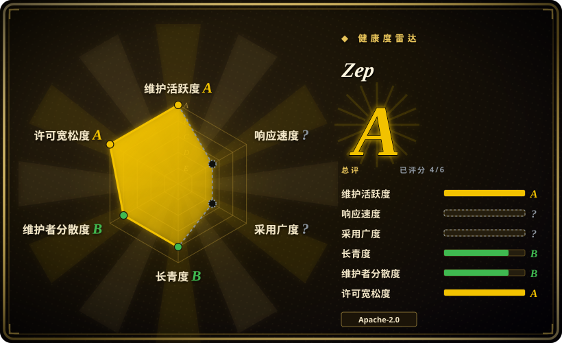
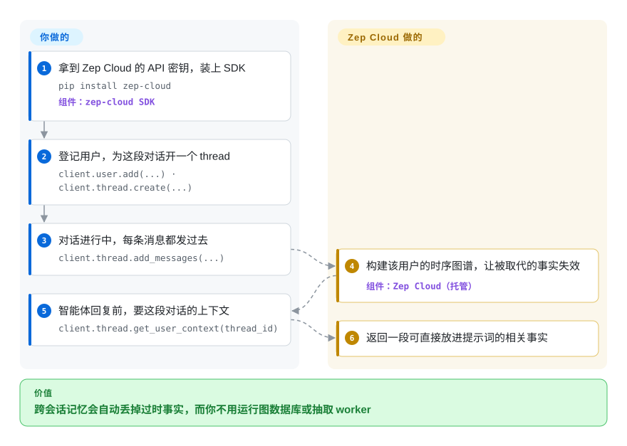

# Zep

你想让智能体跨会话记住每个用户，包括“喜欢 Adidas”在用户改投 Puma 之后就不再成立，但又不想自己运维图数据库、自己写用户和会话那一层。Zep 是一个替你做这件事的托管记忆服务；这个仓库只是它的客户端一侧：SDK 示例、各智能体框架的现成适配包和一个批量导入工具，因为可自托管的服务端已在 2025 年退役。

## 何时使用

你在 LangGraph、CrewAI、Google ADK、Pydantic AI 或 Vercel AI SDK 上做一个助手，用户抱怨它每次会话都不认识自己，更糟的是还在复述他们几周前就改掉的偏好。你了解过时序知识图谱（每条事实带“何时起生效、何时失效”），觉得对路，但团队没精力运维 Neo4j，也不想围着一个库再搭用户、会话、权限管理。于是你注册 Zep Cloud，装上 `zep-cloud`，从本仓库 `integrations/` 里拿对应框架的适配包，每轮对话推送进去；每次回复前向 Zep 要这个用户的上下文块。

和 [Graphiti](graphiti.zh.md)（Zep 底下的开源引擎）比，当你宁可付费买托管服务、也不想运维图数据库和自己写外围系统时选 Zep。和 [Mem0](../app-memory/mem0.zh.md) 比，当“事实会随时间变化”是核心、希望旧事实自动失效而不是越堆越多时选 Zep。如果你必须自托管，这一页就选错了，去看 Graphiti。

## 怎么用起来

记忆本身存放在 Zep Cloud 这个付费服务里，本仓库里没有任何东西在运行它。你通过 SDK 建一个用户、一个 thread（一段对话），消息一产生就发过去；Zep 的服务器把这些消息整理成每个用户一张的时序知识图谱：人、物和事实，每条事实都记着何时开始成立，被取代时再记下何时失效，底层用的是 Graphiti 加一个专有图引擎。智能体回答前，你调一个方法，拿回一段可直接贴进提示词的上下文，内容是与这段对话相关的事实。仓库给你的是胶水：Python、TypeScript、Go 的可运行示例，每个智能体框架一个可安装的适配包（让记忆挂在框架自己的扩展点上，而不用手写调用），把 Slack 导出、文档、邮件和 CSV/JSON 回灌进图谱的 `zep-ingest`，一个 MCP 服务器，以及基准测试和评测工具。API 密钥、发送什么、怎么用返回的上下文，归你。

<!-- flow-steps:begin (generated from flows/zep.json by tools/flow_card.py — do not edit) -->

流程文字版

1. **你**：拿到 Zep Cloud 的 API 密钥，装上 SDK — `pip install zep-cloud` — 组件：`zep-cloud SDK`
2. **你**：登记用户，为这段对话开一个 thread — `client.user.add(...) · client.thread.create(...)`
3. **你**：对话进行中，每条消息都发过去 — `client.thread.add_messages(...)`
4. **Zep**：构建该用户的时序图谱，让被取代的事实失效 — 组件：`Zep Cloud（托管）`
5. **你**：智能体回复前，要这段对话的上下文 — `client.thread.get_user_context(thread_id)`
6. **Zep**：返回一段可直接放进提示词的相关事实

**价值**：跨会话记忆会自动丢掉过时事实，而你不用运行图数据库或抽取 worker

<!-- flow-steps:end -->

## 何时不用

- **你必须自托管，或数据必须留在自己的基础设施上。** Zep 社区版已弃用且不再支持，代码在 2025 年年中被挪进 `legacy/`。改用 Zep 底下那个 Apache-2.0 的引擎 [Graphiti](graphiti.zh.md)，自己跑 Neo4j 或 FalkorDB；或者自托管 [Mem0](../app-memory/mem0.zh.md)、[Cognee](cognee.zh.md)。
- **你把这个仓库当成产品本身来评估。** README 写得很直白：它“不是 Zep 的产品或服务”。Apache-2.0 覆盖的是示例和适配包，不是你实际依赖的记忆引擎；你真正依赖的是一个闭源付费服务及其价格和条款 [未验证：未查价格]。
- **你要在这里提 bug 或求助。** 这个仓库关闭了 GitHub issues，支持走 Zep 自己的渠道。如果公开的问题跟踪对你重要，选开放的项目，例如 [Graphiti](graphiti.zh.md) 或 [Mem0](../app-memory/mem0.zh.md)。
- **你的记忆需求只是一串稳定的偏好。** 事实很少变时，时序图谱是杀鸡用牛刀，逐条消息做图谱抽取比简单的记忆库更贵。用 [Mem0](../app-memory/mem0.zh.md)（库或它自己的托管平台）。
- **你要给编码智能体做离线、隔离网络或单二进制的记忆。** Zep 是面向应用智能体的网络服务。本地编码智能体记忆用钩子层方案，例如 [claude-mem](../coding-agent-memory/claude-mem.zh.md)。

## 横向对比

| 替代品 | 是否收录 | 我们的评价 | 取舍 |
|---|---|---|---|
| [Graphiti](graphiti.zh.md) | ✅ | 必须在 Apache-2.0 下自托管时序图谱时选 Graphiti；宁可付费、也不想运维图数据库和自己搭用户、会话、面板时选 Zep。 | Graphiti 给你引擎和完整的数据控制权，但 Neo4j、FalkorDB 或 Neptune 要你运维，外围系统要你写；Zep 以闭源服务的形式把这些都包了。 |
| [Mem0](../app-memory/mem0.zh.md) | ✅ | 想要今天就能自己跑的记忆、或针对稳定偏好的更简单托管档时选 Mem0；矛盾事实必须自动失效时选 Zep。 | Mem0 从头到尾开源，单次写入更轻；它的抽取只增不改，过时记忆要你自己清理。 |
| [Cognee](cognee.zh.md) | ✅ | 必须自托管、记忆来自文档和代码时选 Cognee；输入是实时对话、而且一台服务器都不想管时选 Zep。 | Cognee 跑在你掌控的嵌入式存储上；Zep 免运维，但数据链路锁在厂商云里。 |
| [Supermemory](../app-memory/supermemory.zh.md) | ✅ | 想要托管记忆 API、同时保留自托管二进制这条退路时选 Supermemory；框架适配包和时序事实图谱是决定因素时选 Zep。 | Supermemory 留着自托管的后路；Zep 的逐框架集成更全，但没有受支持的自托管方案。 |

## 技术栈

- **本仓库：** Python（示例、大部分适配包、`zep-ingest`），TypeScript（Google ADK、Mastra、Vercel AI SDK 适配包），Go（Google ADK 适配包，`mcp/` 下的 MCP 服务器）。
- **官方 SDK（在其他仓库）：** `zep-cloud`（Python）、`@getzep/zep-cloud`（TypeScript）、`github.com/getzep/zep-go/v3`（Go）。
- **API 背后（不在本仓库）：** Zep Cloud，建立在 [Graphiti](graphiti.zh.md) 时序图框架和一个专有的“Context Graph Engine”图数据库之上。
- **遗留：** `legacy/` 下已弃用的社区版服务端（Go），不再支持。

## 依赖

- **一个 Zep Cloud 账号和 API 密钥**（`ZEP_API_KEY`）：硬性的、外部的、付费的依赖。
- **你所用语言的 SDK**，加上对应智能体框架的适配包（例如 PyPI 上的 `zep-crewai`、`zep-adk`、`zep-autogen`、`zep-livekit`）。
- **可选：** 用 `zep-ingest` 批量回灌历史；若开启它的 LLM 上下文补全，还需要 Anthropic 或 OpenAI 密钥。
- 你这一侧不需要数据库、队列或 GPU。

## 运维难度

**你这一侧低，代价是厂商依赖。** 除了你的应用什么都不用跑：没有图数据库，没有抽取 worker。成本转移到了账单上，转移到 `zep-ingest` README 警告过的限流和 episode 大小限制上（单个 episode 一万字符上限，不传时间戳就悄悄默认成导入时间），也转移到你无法自己化解的服务中断或涨价上。回灌历史是唯一较重的活，`zep-ingest` 就是为了把分块、时间戳和批量提交做对而存在的。

## 健康度与可持续性

- **维护（2026-10-08）：** 活跃，最近几天仍有提交（2026-10-04 新增了一个参考智能体），导入工具和适配包发版频繁（`zep-ingest` 在 2026-07-30 到 2026-08-28 之间从 v0.1.0 发到 v0.3.0）。雷达上的维护 A 衡量的是这个示例仓库，不是服务本身。
- **治理：** 单一厂商（Zep）；一位维护者（`danielchalef`）贡献了约三分之二的提交。仓库关闭了 issues，所以雷达无法给响应度打分；它也不是单个软件包，采用度同样无法打分。
- **年龄与 Lindy：** 仓库始于 2023-04（约 3.5 年），但它的角色在 2025 年从开源服务端变成了 SaaS 的示例集。Lindy 在这里作用很弱：你真正押注的是这家公司和它的云服务，而它的履历里已经有过亲手退役自家开源版的一笔。
- **风险信号：** 仓库是 Apache-2.0，但依赖的是闭源服务；社区版已弃用；开源引擎 Graphiti 很健康，这是服务不再合适时你的退路。

## 存疑（未验证）

- [未验证] Zep Cloud 的价格、免费档限制、数据驻留选项，以及 Graphiti README 提到的“部署在你的云里”，都没有对照 Zep 当前条款核实。
- [未验证] “Zep Cloud 用 Graphiti 加专有图引擎”来自 Graphiti README，服务内部无法查看。
- [推断] 适配包清单（截至 2026-10 共 13 个框架/语言包）和各自的发布状态会很快变化，选型前先读 `integrations/README.md`。
- [未验证] 社区版的弃用时间取自 `legacy/` 重组提交（2025-06-29）和其链接的博客文章，博客本身的日期没有核对。
