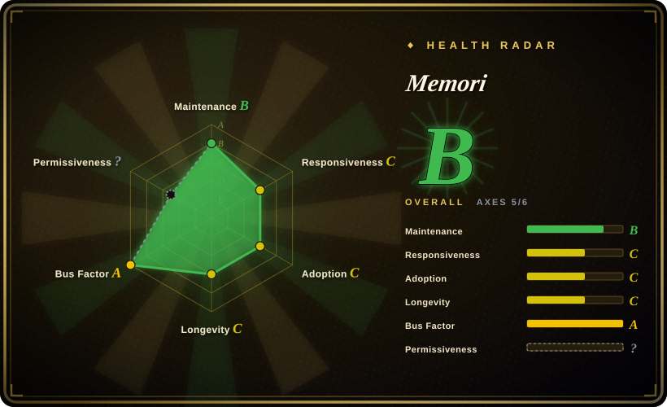
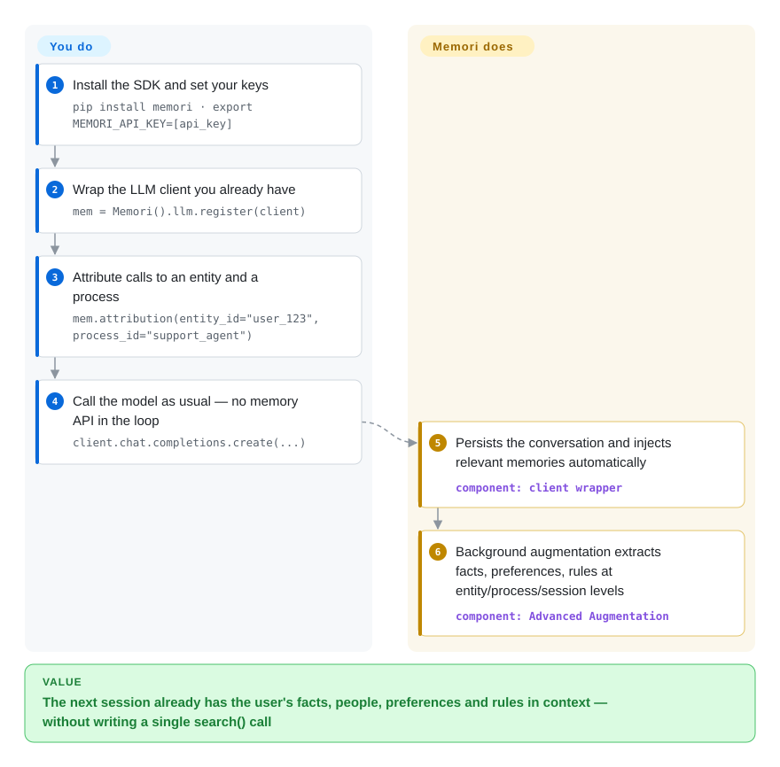

# Memori

Your agent calls the model fresh every session — it doesn't know the user or what it just did. Memori wraps the LLM client you already use: every call is captured and recalled automatically in the background, so relevant facts, people, preferences and rules are already in context next time, without you writing any `search()` calls.

## When to use

You're building a production support agent on top of OpenAI or Anthropic, and you keep re-solving the same problem: the model forgets everything between sessions, so each conversation starts cold. You don't want to hand-roll a vector store, write retrieval glue, or design a memory schema — you want the agent to *remember the user* (their entities, preferences, past decisions) the way a human teammate would. Memori sits between your code and the LLM: you register your existing client (`Memori().llm.register(client)`), tag a call with an `entity_id` and `process_id`, and conversations are persisted and recalled automatically in the background — so the next session, the relevant facts, people, preferences, and rules are already in context without you writing a retrieval pipeline.

It's a fit when you want memory that's keyed on *what agents do*, not just chat transcripts — the augmentation layer extracts attributes, events, facts, people, preferences, relationships, rules, and skills at entity / process / session levels in the background, claiming "no latency" on the hot path, and the BYODB docs add an Agent Trace surface (tool calls, decisions, outcomes captured as reusable primitives). Because it's pitched as LLM-, datastore-, and framework-agnostic (Anthropic, OpenAI, Bedrock, DeepSeek, Gemini, Grok; Agno, LangChain, Pydantic AI), you can also skip the SDK entirely: an MCP server wires it into Claude Code / Cursor / Codex / Warp in one command, and there are drop-in plugins for the OpenClaw gateway and Hermes agents.

## How it works

Memori is a wrapper, not a service you call separately. `Memori().llm.register(client)` monkey-patches your existing OpenAI/Anthropic/etc. client, and `mem.attribution(entity_id=..., process_id=...)` says whose memories these are (entity = the user; process = the agent or program). From then on every `chat.completions.create(...)` you make is captured synchronously into storage and the *recall* path — relevant facts pulled back out — is injected into later prompts automatically, so your application code never imports a memory API in the request path. Extraction of structured memories ("Advanced Augmentation": facts, preferences, rules, relationships, skills) happens asynchronously in the background, which is where the "no latency" claim comes from. With Memori Cloud the storage and augmentation are managed for you (`MEMORI_API_KEY`); with BYODB the same tables live in your own database (SQLite, PostgreSQL, MySQL, MongoDB, TiDB, … per the docs) and you pass a connection factory instead. What stays yours: attribution discipline (no entity/process ids, no memories), the DB you operate in BYODB mode, and whatever capability gap exists between the cloud and local augmentation paths.

<!-- flow-steps:begin (generated from flows/memori.json by tools/flow_card.py — do not edit) -->

Text version of the flow

1. **You**: Install the SDK and set your keys — `pip install memori · export MEMORI_API_KEY=[api_key]`
2. **You**: Wrap the LLM client you already have — `mem = Memori().llm.register(client)`
3. **You**: Attribute calls to an entity and a process — `mem.attribution(entity_id="user_123", process_id="support_agent")`
4. **You**: Call the model as usual — no memory API in the loop — `client.chat.completions.create(...)`
5. **Memori**: Persists the conversation and injects relevant memories automatically — component: `client wrapper`
6. **Memori**: Background augmentation extracts facts, preferences, rules at entity/process/session levels — component: `Advanced Augmentation`

**Value**: The next session already has the user's facts, people, preferences and rules in context — without writing a single search() call

<!-- flow-steps:end -->

## When NOT to use

- **You want zero external endpoints out of the box.** The default SDK path calls **Memori Cloud** and requires a `MEMORI_API_KEY` (sign-up at app.memorilabs.ai). The BYODB self-host mode is broader than the README suggests — the BYODB docs (2026-09) list CockroachDB, MariaDB, MongoDB, MySQL, OceanBase, Oracle, PostgreSQL, SQLite and TiDB, plus managed RDS/Aurora/Neon/Supabase through compatible engines — so *storage* can be fully local. What is not confirmed is how much of "Advanced Augmentation" still relies on Memori's hosted services in a pure-BYODB deployment `[未验证]`; validate before assuming air-gap parity.
- **You're avoiding vendor lock-in / SaaS dependency.** "Advanced Augmentation" (the entity/fact/relationship extraction that is the product's main draw) is described as available without an account but **rate-limited**, with higher limits behind Memori accounts; the README's Enterprise section markets private-VPC deployments. The open-source code and the commercial cloud are intertwined; budget time to check which behaviors survive off-cloud.
- **You want a battle-tested, stable API.** It's young, and the release train has *stalled*: v3.3.6 (2026-05-28) is still the latest on GitHub and PyPI as of 2026-09-27, while the TypeScript SDK sits at npm `0.0.11`. Pin versions and expect churn — and also expect fixes to be slow to ship.
- **You only need a thin vector-recall RAG.** If all you want is "embed chunks, top-k retrieve," a plain vector DB or [Mem0](mem0.md) is lighter than Memori's structured-state + augmentation model.
- **You need transparent, auditable retrieval.** Memory is injected by automatic background interception of the wrapped client — there are no explicit `search()` calls in the quickstart. If you need to see and control exactly what gets pulled into each prompt, the implicit model fights you.

## Comparison

| Alternative | In index | Our verdict | Tradeoff |
|---|---|---|---|
| [Mem0](mem0.md) | ✅ | Choose Mem0 when explicit add/search APIs and broad self-hosting matter more. | The most-cited agent-memory layer; add/search API over a vector store, broad self-host story. Memori leans on automatic client interception + structured entity/process state and an opinionated cloud, vs Mem0's more explicit, datastore-flexible retrieval. |
| [claude-subconscious](claude-subconscious.md) | ✅ | Choose claude-subconscious when you specifically want a Claude/Letta background-memory experiment. | A Claude-specific background-memory experiment (Letta lineage); narrower scope than Memori's multi-provider, multi-framework infrastructure. |
| [Letta (MemGPT)](letta.md) | ✅ | Choose Letta when you need a memory-management OS inside a stateful agent runtime. | Agent runtime with a memory-management OS (tiered context, self-editing memory); a heavier stateful-agent server, not a drop-in client wrapper. |
| [Zep](zep.md) | ✅ | Choose Zep when temporal knowledge-graph memory is the main architecture bet. | Temporal knowledge-graph memory service with a strong self-host/OSS core; comparable structured-memory ambition, different graph-first model. |
| [LangMem (LangChain)](langmem.md) | ✅ | Choose LangMem when your memory utilities should stay tied to LangGraph/LangChain. | Memory utilities tied to the LangGraph/LangChain stack; less standalone than Memori's framework-agnostic pitch. |
| plain vector DB (pgvector / Chroma) | 未收录 | Choose a plain vector DB when owning schema and retrieval outweighs augmentation features. | You own the schema and retrieval; no augmentation, no entity model, no cloud — maximum control, maximum wiring. |

## Tech stack

- **Language:** Python (~64%) with a TypeScript SDK (~19%) and a notable Rust share (~14%) per GitHub linguist (2026-09); `pip install memori` / `npm install @memorilabs/memori`. What the Rust code does is not explained in the README (see Caveats).
- **Memory model:** multi-level tracking at **entity / process / session** levels; background "Advanced Augmentation" extracting attributes, events, facts, people, preferences, relationships, rules, skills; BYODB docs add agent-trace capture (tool calls, decisions, outcomes) and a knowledge-graph concept.
- **Integration:** wraps existing LLM clients (OpenAI Chat Completions & Responses API, Anthropic, Bedrock, DeepSeek, Gemini, Grok); framework adapters for Agno, LangChain, Pydantic AI; **MCP server** connectable in one command (`claude mcp add --transport http memori https://api.memorilabs.ai/mcp/ …`); drop-in plugins for the OpenClaw gateway and Hermes agents.
- **Datastore:** Memori Cloud (managed, default) or **BYODB** self-host — docs (2026-09) list SQLite, PostgreSQL, MySQL/MariaDB, MongoDB, TiDB, CockroachDB, Oracle, OceanBase, plus RDS/Aurora/Neon/Supabase via compatible engines; TiDB Zero for disposable dev DBs.

## Dependencies

- **Runtime:** Python (SDK) and/or Node (TS SDK). A `MEMORI_API_KEY` for the default cloud path; the BYODB docs' quickstart needs only your DB connection and an LLM key (e.g. `OPENAI_API_KEY`).
- **External services:** Memori Cloud by default (account at app.memorilabs.ai). For self-host: a BYODB database from the list above that you operate. Advanced Augmentation without an account is IP-rate-limited.
- **LLM provider:** at least one supported provider client (OpenAI, Anthropic, etc.) — Memori is a layer over your existing LLM calls, not an LLM itself.
- **Optional:** MCP-capable client (Claude Code, Cursor, Codex, Warp) for the no-SDK MCP path; OpenClaw or Hermes for the plugin paths.

## Ops difficulty

**Low for the cloud path, medium for BYODB.** The managed-cloud quickstart is "zero config": set an API key, register your client, done — minimal ops. BYODB means you provision and operate a real database from the supported list and pass a connection factory (`Memori(conn=get_sqlite_connection)`), which is ordinary DB work. The harder question is not infrastructure but capability mapping: which parts of Advanced Augmentation survive off-account/off-cloud are rate-limited or gated — the README even markets a private-VPC "Enterprise" tier, so validate your required behaviors against the OSS path before committing.

## Health & viability

- **Responsiveness**: Grade C — median first-response time 199.3 hours across 4 qualifying issues/PRs; the sample is tiny, and recent README-level PRs merged within days, but issue responsiveness from the team is slow.
- **Maintenance (2026-09):** decelerating — last release v3.3.6 (2026-05-28, GitHub and PyPI agree), so ~4 months without a release as of 2026-09-27. Default-branch commits since 2026-06-15 are mostly README/badge edits plus one `asyncio` deprecation fix (2026-09-18); ~35 open issues. Not archived and not yet abandonment-quiet, but the "releases coming quickly" framing from June no longer holds.
- **Governance / bus factor:** owned by the `MemoriLabs` org (Memori Labs Inc., the company behind the commercial Memori Cloud). Single-vendor, open-core governance — the roadmap follows the SaaS, not a foundation or community. `[推断]`
- **Age & Lindy verdict:** ~1.2 years old (created 2025-07) — young and unproven on the Lindy axis, and the first multi-month release gap arrived before year two. No long track record to lean on; treat longevity as an open question and pin versions.
- **Adoption:** ~17k stars (GitHub API, 2026-09-27) but modest registry pull-through (29,750 PyPI downloads/month per the radar); the README cites a LoCoMo 87% result (721 tokens/query) with an arXiv paper (2603.19935) and one anonymous enterprise case study ("$2.1M/year token reduction") — all first-party claims `[未验证]`.
- **Risk flags:** open-core / SaaS coupling is the headline risk — Advanced Augmentation is rate-limited off-account and the README itself markets private-VPC capability as an "Enterprise" preview, so leaving the cloud may degrade or delay features. The stalled release cadence since May is the secondary signal to watch.

## Caveats (unverified)

- [未验证] License is Apache-2.0 per the repo's `LICENSE` file and README badge (standard text, no Commons Clause); `gh api` reports `license: NOASSERTION`, likely a detection artifact — verify against the live `LICENSE` if license matters.
- [未验证] Latest release v3.3.6 published 2026-05-28; last default-branch commit 2026-09-18; ~17.0k stars as of 2026-09-27 — all per GitHub/PyPI APIs; stars are time-sensitive and indicative only.
- [未验证] How much of "Advanced Augmentation" (entity/fact/relationship extraction) works without Memori's hosted services in a pure-BYODB deployment — the BYODB docs describe it but the cloud dependency of the async extraction path was not verified in source.
- [未验证] The Rust share (~14% of code per GitHub linguist) and its role are unexplained by the README/docs sampled.
- [未验证] LoCoMo 87% / 721-token figures, the arXiv paper (2603.19935) and the "$2.1M/year" enterprise case study are first-party marketing/benchmark claims, not independent results.
- [推断] "No latency" for background augmentation is the project's own framing; real-world impact depends on workload and was not independently measured.
- [推断] The TypeScript SDK's npm `0.0.11` version implies early maturity relative to Python; exact feature parity between the two SDKs was not compared.
