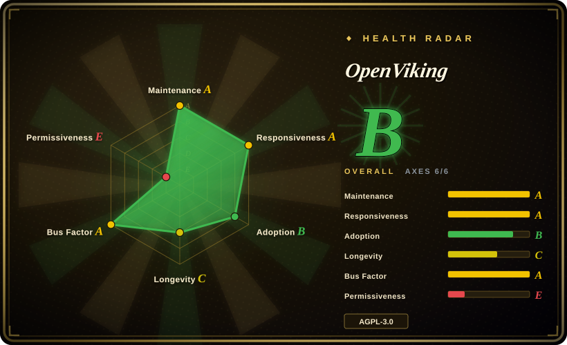
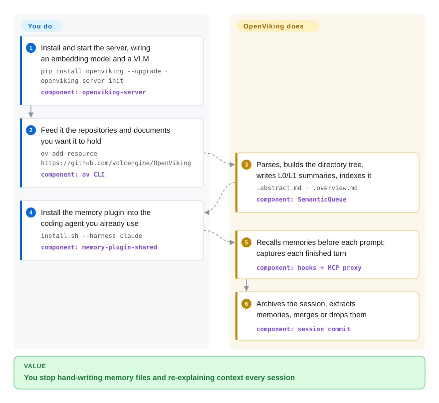

# OpenViking

A self-hosted context database: it puts an agent's documents, long-term memories and skills behind one `viking://` filesystem — semantic search over a directory tree with three levels of summary loading, plus a session-to-memory extraction loop — and hands the result to your coding agents through hooks, MCP or a native plugin slot.

## When to use

You run several coding agents across several repositories — Claude Code in one window, Codex or OpenClaw in another — and every one of them starts cold: your writing preferences, the decision to drop that queue, the design doc you pasted last week, all gone. The usual answers each stop halfway. Per-agent markdown memory files (OpenClaw keeps a `memory/` tree plus a small SQLite index) give you something to read but no way to find a half-remembered fact by meaning. A local hook tool like [claude-mem](claude-mem.md) fixes one machine for one agent but has no server, no shared store and no document side. An application memory API like [Mem0](mem0.md) or [Zep](zep.md) is shaped for product code, not for a workstation full of agents. You stand up `openviking-server`, point each agent's plugin at it, and get one store that holds both the documents you feed it and the memories your sessions generate.

The deciding tradeoff against the "just use files and skills" answer is organization plus discovery plus a memory lifecycle, not more storage. A file tree is a fine index only while the agent already knows where to look — OpenViking keeps the tree (agents still `ls`, `tree`, `read`) but puts a vector index underneath the names and a one-line abstract plus an overview above every directory, so a query can land on the right subtree without a filename. It also makes writing memory somebody's job: at the end of a session the server extracts, deduplicates and merges memories instead of hoping the agent remembers to file a note. What you pay for that is a server, two model dependencies and an AGPL-licensed component in your stack.

## How it works

You install the server and it owns everything behind the `viking://` URI: content lives in AGFS (local disk or S3), a separate vector index stores only URIs and embeddings, and each directory carries a generated abstract (L0) and overview (L1) so an agent can judge relevance before reading full text (L2). You feed it in two ways — `ov add-resource` for documents, or the agent's own plugin, which captures conversation turns as you work. Retrieval is not one vector lookup: a deep `search` expands your query into a few typed sub-queries, walks the directory tree from the root down, reranks, and returns URIs with snippets, while the automatic per-prompt recall deliberately searches memories and skills only, leaving resource documents for the model to fetch itself. The memory side runs on session commit: archived history gets summarized, candidates are extracted against a memory schema, then compared with existing memories to be created, merged or dropped. Your part is standing up the server, installing the plugin your harness needs, and seeding resources; after that the recall-and-capture loop is theirs, and the knob you actually tune is where memories are filed — by repository, since the plugin derives the memory scope from your git `origin` by default.

<!-- flow-steps:begin (generated from flows/openviking.json by tools/flow_card.py — do not edit) -->

Text version of the flow

1. **You**: Install and start the server, wiring an embedding model and a VLM — `pip install openviking --upgrade · openviking-server init` — component: `openviking-server`
2. **You**: Feed it the repositories and documents you want it to hold — `ov add-resource https://github.com/volcengine/OpenViking` — component: `ov CLI`
3. **OpenViking**: Parses, builds the directory tree, writes L0/L1 summaries, indexes it — `.abstract.md · .overview.md` — component: `SemanticQueue`
4. **You**: Install the memory plugin into the coding agent you already use — `install.sh --harness claude` — component: `memory-plugin-shared`
5. **OpenViking**: Recalls memories before each prompt; captures each finished turn — component: `hooks + MCP proxy`
6. **OpenViking**: Archives the session, extracts memories, merges or drops them — component: `session commit`

**Value**: You stop hand-writing memory files and re-explaining context every session

<!-- flow-steps:end -->

## When NOT to use

- **AGPL-3.0 is a blocker for you.** The main project is AGPL-3.0 (only `crates/ov_cli` and `examples/` are Apache-2.0), and Volcengine sells a licensed self-managed edition on top — a networked deployment pulls in copyleft obligations. The license is not incidental history either: the first commit (2026-01-29) shipped Apache-2.0, and it was switched to AGPL-3.0 on 2026-03-30 (PR #1085). If AGPL is unacceptable, pick a permissively licensed memory service instead, e.g. [Mem0](mem0.md) or [Zep](zep.md), or a hosted product you never redistribute.
- **You only need one developer's coding agent to remember one repo.** Use [claude-mem](claude-mem.md), or plain memory files and a careful `AGENTS.md`. OpenViking adds a server, an embedding model, a VLM and an index to a problem a local hook tool already covers, and you would be paying the ops cost for multi-tenancy you don't use.
- **You need memory inside the application you ship.** OpenViking is a service you run and call over HTTP/MCP, not an embeddable library — reach for [Mem0](mem0.md) or [LangMem](langmem.md) when the memory belongs in your product code.
- **You cannot supply an embedding model *and* a VLM.** Ingestion and semantic summarization need both (cloud providers or a local Ollama), so an offline, no-model deployment is not a supported shape.
- **Transcripts must not leave the process.** By design it captures every prompt, every assistant turn and tool output over 20,000 characters; with a local server that stays on your box, but the moment you point it at a shared or cloud endpoint you are uploading your work. If that is not acceptable, keep the store local or stay with file-based memory.
- **You need a stable interface to build on top of.** The repo is eight months old, self-labels `Development Status :: 3 - Alpha`, and carries ~500 open pull requests with a v0.3→v0.4 line already crossed `[推断]`; put memory in your critical path only if you can absorb that churn, otherwise choose an older service.
- **What you actually want is document RAG.** If there is no session memory in the picture, a vector database such as [Milvus](../rag-retrieval/milvus.md) or a document-tree retriever such as [PageIndex](../rag-retrieval/pageindex.md) is a smaller component than a context database that also manages agents.

## Comparison

| Alternative | In index | Our verdict | Tradeoff |
|---|---|---|---|
| [Mem0](mem0.md) | ✅ | Choose Mem0 when the memory belongs inside your application and you want a library call, not a service; choose OpenViking when one store must serve several agents plus your documents. | Mem0 gives you a model-agnostic memory API (Python/TS, any LLM) with no infrastructure of its own; OpenViking adds a server, resource ingestion and layered directory retrieval, and charges you the ops and license cost for them. |
| [Zep](zep.md) | ✅ | Choose Zep when memory means facts about users over time and you need temporal invalidation and graph queries; choose OpenViking when the context is code, docs and skills as much as conversation. | Both are self-hostable memory services; Zep's edge is a temporal knowledge graph that retires stale facts, OpenViking's is a `viking://` filesystem whose directories carry summaries and whose content can be any ingested document. |
| [claude-mem](claude-mem.md) | ✅ | Choose claude-mem for a single developer's machine and a local-only footprint; choose OpenViking when the same context has to be shared across a team or a fleet of agents. | claude-mem is a local hook/MCP layer with SQLite + a vector store and no server; OpenViking is per-account/per-user/per-peer multi-tenant, which is the capability you are buying and the operational burden you are accepting. |
| [Letta](letta.md) | ✅ | Choose Letta when you want a runtime to own the agent loop and its self-editing memory; choose OpenViking when your agents already exist and you only want to give them context. | Letta replaces the agent; OpenViking slots underneath Claude Code, Codex, OpenClaw and others through hooks, MCP or a `contextEngine` slot, so you keep your harness and inherit its lifecycle quirks. |
| [PageIndex](../rag-retrieval/pageindex.md) | ✅ | Our verdict: choose PageIndex for hierarchical question answering over documents without a vector database. Tradeoff: far less machinery, but nothing on the session-memory side — no capture loop, no memory extraction, no multi-tenant service. | PageIndex reasons over a document tree and needs no embeddings; OpenViking keeps a vector index and adds a memory lifecycle, which is more moving parts for a superset of jobs. |

## Tech stack

- **Implementation languages** (GitHub linguist bytes): Python ~20 MB, Rust ~3.5 MB, TypeScript ~2.3 MB, C++ ~0.45 MB, plus Go/Shell/HTML. Python is the server and pipeline; Rust builds `ov_cli` and `ragfs` (the AGFS rewrite); C++ backs the index/store engine (`src/`, exposed through an abi3 backend); TypeScript ships the web console and SDK.
- **Server:** FastAPI + uvicorn, HTTP API on port 1933; `openviking-server` and the `ov` CLI.
- **Storage:** dual layer — content in AGFS (backends: local filesystem, S3-compatible, in-memory) and a separate vector index (backends: local, HTTP, Volcengine VikingDB) with a hybrid index (`IndexType: flat_hybrid`, cosine, int8 quantization).
- **Model access:** `litellm`, `openai`, `volcengine-python-sdk[ark]`; provider setup covers Volcengine, OpenAI, Codex OAuth, Kimi, GLM and local Ollama.
- **Parsing/ingestion:** `pdfplumber` + `pdfminer-six`, `scrapy` + `trafilatura` + `feedparser` + `firecrawl-anydoc`, and pinned `tree-sitter` grammars for 11 languages (code-aware chunking).
- **Platform services:** OpenTelemetry (OTLP), `cryptography` + `argon2-cffi`, `mcp`, an internal task queue, and encryption/ACL/multi-tenant layers documented as first-class concepts.
- **Packaging:** PyPI `openviking` (>=3.10), Dockerfile + `docker-compose.yml`, Helm chart under `deploy/helm`, plus Python/Go/TypeScript SDKs.

## Dependencies

- **Python 3.10+** for the server; the JS plugins and installer want Node 18+ (the OpenClaw plugin states Node >= 22).
- **An embedding model and a VLM** — cloud (Volcengine/OpenAI and friends) or local Ollama; both are required for ingestion and summarization, not optional.
- **A vector index backend** — local persistence by default, or an external HTTP service / Volcengine VikingDB.
- **A content backend** — local disk by default; S3-compatible storage if you want the object-store path. Multi-write (primary + backups) is configured through `storage.agfs.backups`.
- **A supported agent** for the integration path: Claude Code, Codex, Cursor, Trae, zcode, OpenCode, DSH, pi, OpenClaw, Hermes, or any MCP client — plus LangChain/LangGraph for the SDK route.
- **Network access for ingestion** if you point it at URLs or repositories rather than local files.

## Ops difficulty

**Medium-to-high.** The install itself is short (`pip install openviking`, `openviking-server init`, run it), and the project ships the day-2 surface most self-hosted tools skip: a Helm chart, a Docker image, `/metrics`, at-rest encryption, ACLs, accounts and user isolation, plus transactions and queue-lifecycle documentation. The cost is that you now own a stateful service with three dependencies you did not have before — a model endpoint for embeddings, a model endpoint for the VLM, and an index store whose format upgrades are one-way (older releases cannot read the new local record format, so downgrades require restoring a backup taken before the first write). Add eight months of history and ~86 releases in that window, and upgrades are a real recurring task rather than a formality. Single-machine, single-user use is easy; letting it hold a team's context is a service you operate.

## Health & viability

- **Maintenance — very active (as of 2026-09-22).** 86 releases between 2026-02-05 and 2026-09-20 (latest `v0.4.21`), last push 2026-09-20, and 100 commits landed between 2026-09-16 and 2026-09-21 alone. Not archived.
- **Governance & bus factor — vendor-owned org repo with a spread contributor base, not a single maintainer.** It lives under the `volcengine` organization and `pyproject.toml` names ByteDance as the author. The score on 2026-09-21 measured 98 active maintainers over the trailing 12 months, with the top contributor holding 16.3% of commits and the top three 31.8% — a healthy spread rather than a bus-factor-one dependency, and the contributor list exceeds 100 by the GitHub API's own pagination. No `GOVERNANCE.md`, `MAINTAINERS.md`, or `CODE_OF_CONDUCT.md` was found at the repo root `[未验证]` what formal decision process exists.
- **Backing, funding & open-core.** Volcengine hosts a managed SaaS and sells a licensed self-managed/BYOC edition while the server stays AGPL-3.0 open source. That structure funds the project and also means feature boundaries can move toward the paid tiers; the license split is the thing to read before adopting, not the star count.
- **Age & Lindy — young and fast-moving, so unproven.** Created 2026-01-05, ~8.5 months old, with 38.2k stars and 3.0k forks already. By the Lindy prior that is a hyped-but-unproven shape: real engineering velocity, no track record of surviving a quiet year. Treat adoption here as attention, not vetting `[推断]`.
- **Adoption & ecosystem — real and measurable, not just stars.** 38.2k stars / 3.0k forks (API-verified 2026-09-22), 447,672 PyPI downloads in the last measured month (2026-09-21), SDKs in three languages, and out-of-the-box integrations for ten harnesses plus MCP, LangChain and a portable "Agent Plugins 1.0" bundle. The measured package-graph tier is empty (0 dependent repos), so ecosystem consumption is still mostly direct installs `[推断]`.
- **Risk flags — a verified relicense, plus open-core, alpha and churn.** The project shipped as Apache-2.0 on 2026-01-29 and was relicensed to AGPL-3.0 on 2026-03-30 (PR #1085, merged), which makes the health radar's license axis the only `E` on the card; a licensed commercial edition sits alongside the AGPL server, PyPI metadata self-labels `Development Status :: 3 - Alpha`, ~498 pull requests are open, and the benchmark numbers are published only by the vendor. None of these is a defect on its own; together they say "do not adopt on faith".

## Caveats (unverified)

- `[未验证]` **All headline benchmark numbers are vendor-published**: LoCoMo accuracy 24.20% → 82.08% for OpenClaw and 57.21% → 80.32% for Claude Code, input tokens down 91.0% / 63.2%, tau2-bench +6.87pp (retail) and +11.87pp (airline), HotpotQA 91.00% at 0.23s. Reproduction scripts exist under `benchmark/`, but I found no independent replication; LoCoMo also measures long-conversation memory, which is not the distribution of everyday coding work.
- `[未验证]` **The three papers cited in the README were not opened**: VikingMem (arXiv:2605.29640, claimed VLDB 2026), Directory-Aware Query and Maintenance in Vector Databases (arXiv:2606.16903, claimed ICDE), VikingRAG (arXiv:2609.11390, claimed submitted). Only the README's own references were checked.
- `[未验证]` **Windows and non-macOS server support.** The desktop app lists Windows x64 builds, but whether the AGFS/vector backends and the plugin family behave identically off macOS/Linux was not established.
- `[未验证]` **Governance process.** No governance, maintainers or code-of-conduct file exists at the root, and `CONTRIBUTING.md` showed no CLA or DCO language in the sections I read; how contributions are actually reviewed is unknown.
- `[未验证]` **The desktop app binaries are served from a ByteDance CDN** (`lf3-cdn-tos.bytegoofy.com`) rather than a release artifact, so their build provenance is not verifiable from the repository.
- `[推断]` **Open-core feature gating is inferred** from the AGPL + licensed-edition split and the README's "commercial editions" section; which capabilities sit behind the license key is not enumerated in the open-source docs I read.
- `[推断]` **The three-level recall degradation and the `contextEngine` takeover are documented behavior**, read from the vendor's docs and integration capability reference rather than inspected in source; I did not run either integration.
- `[未验证]` **Contributor count is bounded by the API page cap** (100 per page, two pages present), so "over 100" is a floor, not a total; per-maintainer commit shares come from the health block, which is computed at scoring time and drifts.
- `[未验证]` **The 86-release count mixes packages.** The repo publishes separate tags for the server, the Python SDK, the CLI and plugins, so release cadence is not the same as server-version cadence.
- `[未验证]` **PyPI metadata lists no license** (the top-level `license` field is empty) even though the repo and `pyproject.toml` both say AGPL-3.0; automation reading the registry may not see the license.
- `[未验证]` **The relicense motive is undocumented.** The LICENSE file's history confirms Apache-2.0 at the first commit (2026-01-29) and AGPL-3.0 from 2026-03-30 (PR #1085), but the PR body only restates the per-component split, so *why* it changed — and whether other components could follow — is unknown.
