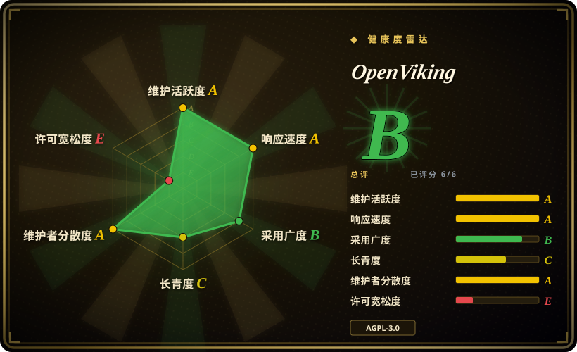
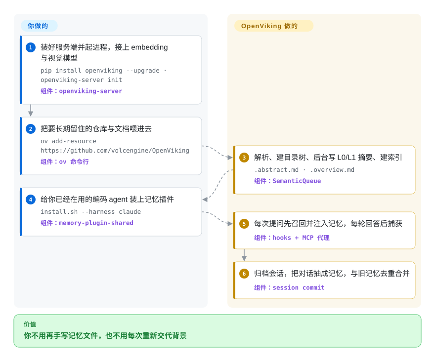

# OpenViking

自托管的上下文数据库：把 agent 的文档、长期记忆和技能放进同一个 `viking://` 虚拟文件系统，用「目录树 + 语义检索 + 三层摘要按需加载」组织，再靠 hooks、MCP 或宿主原生插件槽交给你的编码 agent 使用。

## 何时使用

你在多个仓库上同时开着几个编码 agent——一个窗口 Claude Code，另一个窗口 Codex 或 OpenClaw——而每一个都从零开始：你的写作偏好、上次决定砍掉的那个队列、上周贴进去的设计文档，全没了。常见答法各自只走了一半。按 agent 分的 markdown 记忆文件（OpenClaw 就是一棵 `memory/` 目录加一个小的 SQLite 索引）给你留下可读的东西，却没法按「意思」把一句半记得的话找回来；[claude-mem](claude-mem.zh.md) 这类本地钩子工具修好了单机上的单个 agent，但没有服务端、没有共享存储、也没有文档这一侧；[Mem0](mem0.zh.md) 或 [Zep](zep.zh.md) 这类应用记忆 API 是给产品代码用的形状，不是给一桌面 agent 用的。你起一个 `openviking-server`，把每个 agent 的插件指向它，就得到一份既装得下你喂进去的文档、又装得下会话产出的记忆的存储。

相对「纯文件加 skills」这个答法，决定性的取舍不是存得更多，而是**组织、发现和记忆生命周期**。文件树只有在 agent 已经知道该看哪里时才算好索引；OpenViking 保留了树（agent 照样 `ls`、`tree`、`read`），但在目录名底下加了向量索引，在每个目录上面加了一句摘要和一段概览，于是一次查询不必靠文件名也能落到对的子树。它还把「写记忆」变成有人负责的事：会话结束时由服务端抽取、去重、合并记忆，而不是指望 agent 自己记得归档一条笔记。代价是你为这些引入一个常驻服务、两个模型依赖，以及技术栈里一个 AGPL 组件。

## 怎么用起来

你装好服务端，`viking://` 后面的事全归它：正文存在 AGFS（本地盘或 S3），独立的向量索引只存 URI 和向量，每个目录都带自动生成的摘要（L0）和概览（L1），让 agent 在决定读全文（L2）之前先判断相关性。喂数据有两条路——文档走 `ov add-resource`，会话走 agent 自己的插件，你干活时它顺手捕获对话轮次。检索不是一次向量查询：深层 `search` 会把你的问题扩成几个带类型的子查询，从根目录逐层往下走、再重排，返回带片段和 URI 的结果；而每轮自动召回刻意只搜记忆和技能，资源文档留给模型自己主动取。记忆那条链以 session commit 为轴：归档的历史先被概括，再按记忆 schema 抽候选，然后和已有记忆比对，决定新建、合并还是丢弃。你要做的只是把服务起好、装上对应 harness 的插件、把资料喂进去；之后的召回与捕获循环归它，真正需要你调的旋钮是记忆归属——插件默认从 git `origin` 推导，所以一份仓库一份记忆。

<!-- flow-steps:begin (generated from flows/openviking.json by tools/flow_card.py — do not edit) -->

流程文字版

1. **你**：装好服务端并起进程，接上 embedding 与视觉模型 — `pip install openviking --upgrade · openviking-server init` — 组件：`openviking-server`
2. **你**：把要长期留住的仓库与文档喂进去 — `ov add-resource https://github.com/volcengine/OpenViking` — 组件：`ov 命令行`
3. **OpenViking**：解析、建目录树、后台写 L0/L1 摘要、建索引 — `.abstract.md · .overview.md` — 组件：`SemanticQueue`
4. **你**：给你已经在用的编码 agent 装上记忆插件 — `install.sh --harness claude` — 组件：`memory-plugin-shared`
5. **OpenViking**：每次提问先召回并注入记忆，每轮回答后捕获 — 组件：`hooks + MCP 代理`
6. **OpenViking**：归档会话，把对话抽成记忆，与旧记忆去重合并 — 组件：`session commit`

**价值**：你不用再手写记忆文件，也不用每次重新交代背景

<!-- flow-steps:end -->

## 何时不用

- **AGPL-3.0 对你就是阻碍。** 主仓是 AGPL-3.0（只有 `crates/ov_cli` 和 `examples/` 是 Apache-2.0），火山引擎还在上面卖授权自托管版，一旦做成对外提供的网络服务就牵扯 copyleft 义务。这个许可也不是无关紧要的历史：首次提交（2026-01-29）带的是 Apache-2.0，2026-03-30 才切成 AGPL-3.0（PR #1085）。如果不能接受，改选许可宽松的记忆服务，例如 [Mem0](mem0.zh.md) 或 [Zep](zep.zh.md)，或者直接用托管产品、不做再分发。
- **你只是想让单个开发者的单个编码 agent 记住一个仓库。** 用 [claude-mem](claude-mem.zh.md)，或者就写记忆文件加一份用心的 `AGENTS.md`。OpenViking 会给一个本地钩子工具已经解决的问题再添上服务端、embedding 模型、视觉模型和一套索引，而你并不使用那份多租户能力，却要付它的运维成本。
- **你需要把记忆嵌进自己要发布的应用里。** OpenViking 是你自己运行、通过 HTTP 或 MCP 调用的服务，不是可嵌入的库；记忆属于产品代码时，选 [Mem0](mem0.zh.md) 或 [LangMem](langmem.zh.md)。
- **你提供不了 embedding 模型，或者提供不了视觉模型。** 摄取和语义概括两个都要（云端或本地 Ollama 都行），所以「离线且不接模型」不是它支持的形态。
- **对话内容不能离开本进程。** 它按设计捕获每一次提问、每一轮回答，以及超过 20000 字符的工具输出；服务端在本机时数据留在你机器上，但一旦指向共享或云端端点，你就是在上传自己的工作内容。不能接受的话，就让存储留在本地，或者继续用基于文件的记忆。
- **你需要一个能长期在它之上搭建的稳定接口。** 仓库只有八个月大，PyPI 上自标 `Development Status :: 3 - Alpha`，还积着约 500 个待合的 PR，而且已经跨过 v0.3 到 v0.4 `[推断]`；只有能吸收这种变更节奏，才把记忆放进关键路径，否则换一个更老的服务。
- **你真正想要的其实是文档 RAG。** 如果场景里没有会话记忆，[Milvus](../rag-retrieval/milvus.zh.md) 这类向量库、或 [PageIndex](../rag-retrieval/pageindex.zh.md) 这类文档树检索器，都比一个顺手管 agent 的上下文数据库更小。

## 横向对比

| 替代品 | 是否收录 | 我们的评价 | 取舍 |
|---|---|---|---|
| [Mem0](mem0.zh.md) | ✅ | 记忆属于你的应用内部、你要的是一次库调用而不是一个服务时选 Mem0；一份存储要同时服务多个 agent 和你的文档时选 OpenViking。 | Mem0 给你与模型无关的记忆 API（Python/TypeScript，任意 LLM），自身不需要任何基础设施；OpenViking 多了服务端、资源摄取和分层目录检索，也因此把这些运维与许可成本记在你账上。 |
| [Zep](zep.zh.md) | ✅ | 记忆指的是关于用户随时间变化的事实、你需要时间失效和图查询时选 Zep；上下文里代码、文档和技能与对话同等重要时选 OpenViking。 | 两者都是可自托管的记忆服务；Zep 的强项是能把过期事实退掉的时间知识图谱，OpenViking 的强项是 `viking://` 文件系统——目录自带摘要，正文可以是任何摄取进来的文档。 |
| [claude-mem](claude-mem.zh.md) | ✅ | 单个开发者的机器、要本地化足迹时选 claude-mem；同一份上下文要跨团队或跨一批 agent 共享时选 OpenViking。 | claude-mem 是本地钩子加 MCP 的一层，用 SQLite 加向量库，没有服务端；OpenViking 做到账号、用户、peer 三级隔离，这正是你要买的能力，也正是你要接的运维负担。 |
| [Letta](letta.zh.md) | ✅ | 你想要一个运行时接管 agent 循环和它自编辑的记忆时选 Letta；agent 已经存在、你只想给它们上下文时选 OpenViking。 | Letta 会替换掉 agent 本体；OpenViking 靠 hooks、MCP 或 `contextEngine` 槽嵌在 Claude Code、Codex、OpenClaw 之下，你保住现有 harness，也一并继承它的生命周期习性。 |
| [PageIndex](../rag-retrieval/pageindex.zh.md) | ✅ | 我们的评价：只做文档上的层次化问答、且不想引入向量库时选 PageIndex。取舍：机器部件少得多，但记忆这一侧完全是空的——没有捕获循环、没有记忆抽取、也没有多租户服务。 | PageIndex 直接在文档树上推理、不需要 embedding；OpenViking 保留向量索引并补上记忆生命周期，为覆盖更多活儿付出更多活动部件。 |

## 技术栈

- **实现语言**（GitHub linguist 字节数）：Python 约 20 MB、Rust 约 3.5 MB、TypeScript 约 2.3 MB、C++ 约 0.45 MB，另有 Go、Shell、HTML。Python 是服务端和流水线；Rust 构建 `ov_cli` 与 `ragfs`（AGFS 的重写实现）；C++ 支撑索引与存储引擎（`src/`，通过 abi3 后端暴露）；TypeScript 提供 Web 控制台和 SDK。
- **服务端**：FastAPI + uvicorn，HTTP API 走 1933 端口；交付 `openviking-server` 与 `ov` 命令行。
- **存储**：双层结构——正文存 AGFS（后端有本地文件系统、S3 兼容、内存），索引单独存向量（后端有 local、http、火山引擎 VikingDB），索引类型为混合索引（`IndexType: flat_hybrid`，余弦距离，int8 量化）。
- **模型接入**：`litellm`、`openai`、`volcengine-python-sdk[ark]`；配置向导覆盖火山引擎、OpenAI、Codex OAuth、Kimi、GLM 以及本地 Ollama。
- **解析与摄取**：`pdfplumber` + `pdfminer-six`，`scrapy` + `trafilatura` + `feedparser` + `firecrawl-anydoc`，以及锁版本的 `tree-sitter` 语法（覆盖 11 种语言，用于按代码结构切分）。
- **平台能力**：OpenTelemetry（OTLP）、`cryptography` + `argon2-cffi`、`mcp`、内部任务队列，以及被当作一等概念写进文档的加密、ACL 与多租户。
- **打包**：PyPI 包 `openviking`（>=3.10）、Dockerfile 与 `docker-compose.yml`、`deploy/helm` 下的 Helm chart，另有 Python、Go、TypeScript 三种 SDK。

## 依赖

- **Python 3.10+** 跑服务端；JS 插件和安装脚本要 Node 18+（OpenClaw 插件写明 Node >= 22）。
- **一个 embedding 模型和一个视觉模型**——云端（火山引擎、OpenAI 等）或本地 Ollama；摄取和概括都要用，不是可选项。
- **一个向量索引后端**——默认本地持久化，也可以用外部 HTTP 服务或火山引擎 VikingDB。
- **一个内容后端**——默认本地盘；要走对象存储路径就用 S3 兼容存储。多写（主 + 备）通过 `storage.agfs.backups` 配置。
- **一个受支持的 agent** 才能走集成路径：Claude Code、Codex、Cursor、Trae、zcode、OpenCode、DSH、pi、OpenClaw、Hermes，或任何 MCP 客户端；SDK 路线另有 LangChain/LangGraph。
- **联网访问**：如果你喂的是 URL 或仓库而不是本地文件，摄取阶段需要外网。

## 运维难度

**中到高。** 安装本身很短（`pip install openviking`、`openviking-server init`、起进程），而且它把多数自托管工具会省掉的第二天运维面都给了：Helm chart、Docker 镜像、`/metrics`、静态加密、ACL、账号与用户隔离，以及事务和队列生命周期的文档。代价是你从此要负责一个有状态服务，外加三个本来没有的依赖——embedding 的模型端点、视觉模型的端点，以及一个格式升级单向的索引存储（旧版本读不了新的本地记录格式，想降级只能恢复第一次用新格式写入之前的备份）。再叠加八个月的历史和这期间约 86 个发布，升级就成了实打实的周期性任务，而不是走个形式。单机单人用很轻；让它承载一个团队的上下文，那就是一个你要运营的服务。

## 健康度与可持续性

- **维护——非常活跃（截至 2026-09-22）。** 2026-02-05 到 2026-09-20 之间发了 86 个 release（最新 `v0.4.21`），最后推送时间 2026-09-20，仅 2026-09-16 到 2026-09-21 就落了 100 个提交。仓库未归档。
- **治理与 bus factor——厂商名下的组织仓库，贡献者分布分散，不是单人项目。** 它挂在 `volcengine` 组织下，`pyproject.toml` 的作者写的是 ByteDance。2026-09-21 的打分实测：过去 12 个月有 98 位活跃维护者，提交占比最高的个人只占 16.3%，前三合计 31.8%——分布健康，不是「一个人空闲时间」的依赖，且贡献者列表按 GitHub 自己的分页也超过 100 人。仓库根目录没有 `GOVERNANCE.md`、`MAINTAINERS.md` 或 `CODE_OF_CONDUCT.md`，是否存在正式决策流程 `[未验证]`。
- **背书、资金与 open-core。** 火山引擎既托管 SaaS，也卖带 license key 的自托管/BYOC 版，服务端本身保持 AGPL-3.0 开源。这个结构让项目有资金，也意味着功能边界可能往付费档移动；采纳前该读的是许可证切分，而不是 star 数。
- **年龄与 Lindy——年轻且跑得快，因此未经证明。** 创建于 2026-01-05，约 8.5 个月，已经有 38.2k stars 和 3.0k forks。按 Lindy 先验，这是「热但未证明」的形状：工程速度是真的，但还没有熬过一个平静年份的履历。这里的采用度要当作注意力，不是尽调结论 `[推断]`。
- **采用与生态——有实测数字，不只是 star。** 38.2k stars / 3.0k forks（2026-09-22 经 API 核实），最近一个统计月的 PyPI 下载量为 447,672 次（2026-09-21），三种语言的 SDK，开箱集成覆盖十个 harness，另有 MCP、LangChain 和一个可移植的「Agent Plugins 1.0」打包规范。实测的包依赖图谱层级为空（下游依赖仓库 0 个），所以生态消费目前仍以直接安装为主 `[推断]`。
- **风险信号——一次可核实的换证，加上 open-core、alpha 与变更速度。** 项目 2026-01-29 首次提交时带的是 Apache-2.0，2026-03-30 换成了 AGPL-3.0（PR #1085 已合入），因此健康度卡片上许可证这一轴是唯一的 `E`；AGPL 服务端身旁有授权商业版，PyPI 元数据自标 `Development Status :: 3 - Alpha`，待合 PR 约 498 个，而且基准数字只有厂商自己发布。单看每一条都不是缺陷，合起来说明的是一句：不要凭信任采纳。

## 存疑（未验证）

- `[未验证]` **所有核心基准数字都出自厂商**：LoCoMo 准确率 OpenClaw 从 24.20% 到 82.08%、Claude Code 从 57.21% 到 80.32%，输入 token 分别下降 91.0% 与 63.2%；tau2-bench 提升 +6.87pp（零售）与 +11.87pp（航空）；HotpotQA 在 0.23 秒下 91.00%。`benchmark/` 下有复现脚本，但我没有找到第三方复现；而且 LoCoMo 量的是长对话记忆，不等于日常写代码的分布。
- `[未验证]` **README 引用的三篇论文我没有打开核对**：VikingMem（arXiv:2605.29640，自称 VLDB 2026）、Directory-Aware Query and Maintenance in Vector Databases（arXiv:2606.16903，自称 ICDE）、VikingRAG（arXiv:2609.11390，自称已投稿）。只核实了 README 自身的引用行。
- `[未验证]` **Windows 与非 macOS 的服务端支持。** 桌面应用列了 Windows x64 构建，但 AGFS 与向量后端、以及整套插件在 macOS/Linux 之外是否行为一致，没有验证。
- `[未验证]` **治理流程。** 仓库根目录没有治理、维护者或行为准则文件，我读到的 `CONTRIBUTING.md` 段落里也没有 CLA 或 DCO 字样；贡献实际怎么审不知道。
- `[未验证]` **桌面应用的二进制托管在字节的 CDN 上**（`lf3-cdn-tos.bytegoofy.com`）而不是 release 产物，构建来源无法从仓库验证。
- `[推断]` **open-core 的功能切分是推断的**，依据是 AGPL 加授权版的组合与 README 的「commercial editions」一节；哪些能力锁在 license key 后面，我读到的开源文档没有逐条列出。
- `[推断]` **三级召回降级与 `contextEngine` 接管属于文档所述行为**，来自厂商文档与集成能力参考，而非我读源码确认；两套集成我都没有实际跑过。
- `[未验证]` **贡献者数量受 API 分页上限约束**（每页 100，共两页），所以「超过 100」是下界而不是总数；单人提交占比来自健康度块，是打分当时的快照，会漂移。
- `[未验证]` **86 个 release 是混包的。** 仓库对服务端、Python SDK、CLI 和插件分别打 tag，因此发布节奏不等于服务端版本节奏。
- `[未验证]` **PyPI 元数据没有许可证字段**（顶层 `license` 为空），而仓库与 `pyproject.toml` 都写 AGPL-3.0；靠注册表自动读许可证的工具可能读不到。
- `[未验证]` **换证原因没有记录。** `LICENSE` 的提交历史确认了首次提交（2026-01-29）为 Apache-2.0、2026-03-30 起改为 AGPL-3.0（PR #1085），但那个 PR 的说明只重述了各组件许可切分，为什么换、以及其它组件是否也会跟进，都无从得知。
