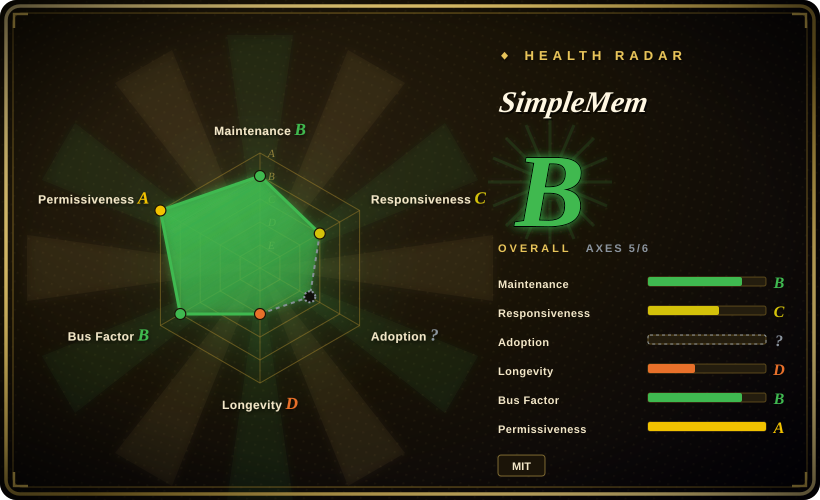
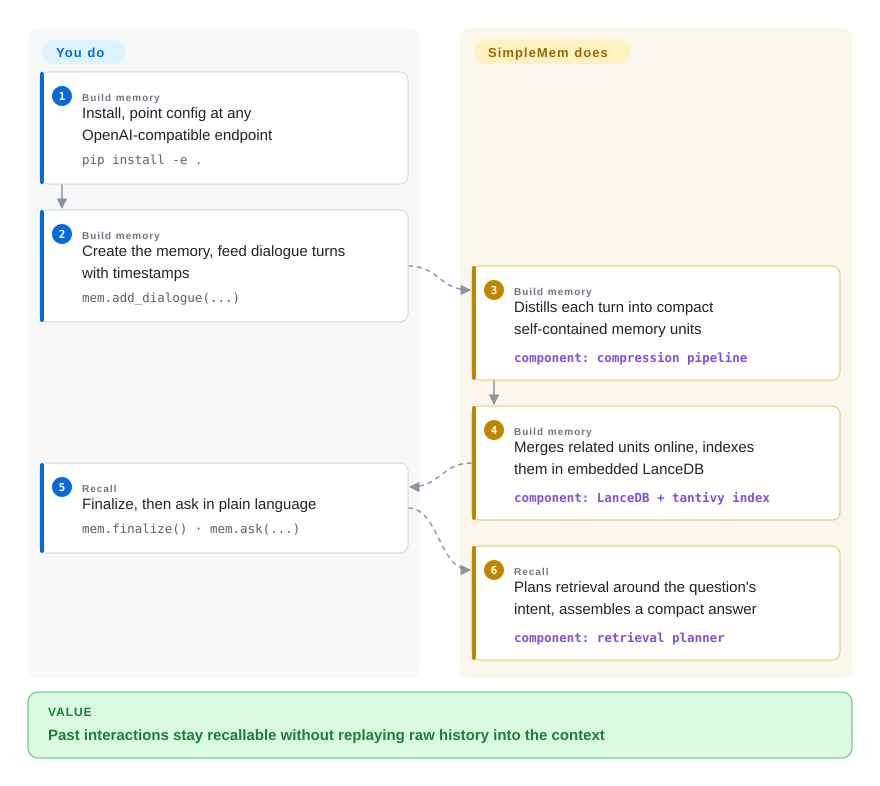

# SimpleMem

Every question about the past either replays the whole chat log into the context — token cost grows with history, not with the question — or pays for a slow reasoning pass to filter it. SimpleMem compresses interactions into small self-contained memory units as they are written, then plans retrieval around each question's intent, so recall stops costing the whole history.

## When to use

You build an LLM agent that has to remember long-horizon interactions — weeks of user dialogues, recurring sessions, decisions made last month — and the two standard answers both hurt: stuffing transcripts into the prompt blows the context window and the budget, while naive RAG over raw history returns the wrong Thursday meeting because keyword similarity can't tell which meeting the question means. You want a Python library that slots under your existing agent: `pip install -e .`, point `config.py` at any OpenAI-compatible endpoint, feed dialogues in, ask questions out. On its headline benchmark (LoCoMo, long-conversation memory) the authors report a 26.4% average F1 gain over prior memory systems while cutting inference-time token consumption by ~30x — the compression happens at write time, not query time.

Pick it over the platform-shaped substitutes when you want the memory layer without adopting a runtime: unlike [Letta](letta.md) it does not own your agent loop, and unlike [Zep](zep.md) or [Cognee](cognee.md) it doesn't ask you to run a graph-shaped engine for what is fundamentally dialogue memory. The published benchmark numbers and the intent-aware retrieval planner are the differentiators; the tradeoffs you accept are a young academic-team repo, a stale PyPI artifact, and an LLM call on every write (see When NOT to use).

## How it works

SimpleMem is a Python package you import, not a service you deploy (a hosted/self-hosted MCP server exists as a second surface). The write path is a three-stage pipeline: it distills each unstructured interaction into **atomic memory units** — self-contained facts with resolved coreferences and absolute timestamps — then **merges related context online** while the session is being built (redundancy is removed as memory grows, not at query time), and indexes everything in an embedded **LanceDB** store through multiple views (semantic embeddings, keyword, metadata). When you ask a question, an **intent-aware retrieval planner** first infers what the query is really after, then decides which views to search and assembles a compact context — the answer comes back small, not as a replay of history. Your part is configuration (API key, model names) and feeding data; the compression, merging, and retrieval planning are theirs. `from simplemem import SimpleMem` auto-routes to the multimodal backend if your first call is `add_image()`/`add_audio()`/`add_video()`, and `simplemem.optimize(...)` runs EvolveMem's self-evolution loop to tune retrieval hyperparameters on your own dev questions.

<!-- flow-steps:begin (generated from flows/simplemem.json by tools/flow_card.py — do not edit) -->

Text version of the flow

1. **You** (Build memory): Install, point config at any OpenAI-compatible endpoint — `pip install -e .`
2. **You** (Build memory): Create the memory, feed dialogue turns with timestamps — `mem.add_dialogue(...)`
3. **SimpleMem** (Build memory): Distills each turn into compact self-contained memory units — component: `compression pipeline`
4. **SimpleMem** (Build memory): Merges related units online, indexes them in embedded LanceDB — component: `LanceDB + tantivy index`
5. **You** (Recall): Finalize, then ask in plain language — `mem.finalize() · mem.ask(...)`
6. **SimpleMem** (Recall): Plans retrieval around the question's intent, assembles a compact answer — component: `retrieval planner`

**Value**: Past interactions stay recallable without replaying raw history into the context

<!-- flow-steps:end -->

## When NOT to use

- **You need audio/video memory that is actually validated.** The maintainer stated in issue #69 (2026-06) that the reported benchmarks (LoCoMo, Mem-Gallery) exercise **text and image only** — audio/video support is "architectural/qualitative", with ingestion machinery but no head-to-head numbers. If hearing a recorded call matters, transcribe to text first (the pipeline itself has a Whisper path) or use benchmark-validated text memory like [Mem0](mem0.md) or [Zep](zep.md) — don't buy the "text, image, audio & video" headline at face value.
- **You want memory for your coding agent's own sessions, wired automatically.** That is claude-mem's job — hooks capture sessions with zero instrumentation. SimpleMem's `cross/` subproject targets the same problem (session lifecycle, automatic context injection, redaction) but is a young add-on directory whose "+64% vs Claude-Mem" LoCoMo number is self-run; [claude-mem](claude-mem.md) is the purpose-built, hook-wired choice.
- **You need a production-stable dependency.** The PyPI package `simplemem` is frozen at 0.1.0 (uploaded 2026-01-21) while the repo is at v0.3.0 with the unified package only installable from source; and two storage-layer correctness bugs were open at verification time — keyword search misses entries inserted after the first batch (#78), and the LanceDB table check breaks past 10 memory tables (#85). For a memory layer you can pin and forget, [Mem0](mem0.md) or [Letta](letta.md) have the release discipline this repo lacks.
- **The memory layer must outlive the paper.** This is an academic-team repo (AIMING Lab, UNC-Chapel Hill) whose maintenance pulse typically follows the publication cycle; the last push was 2026-07-24 with the open bugs above unanswered. If a vendor or community will still be shipping fixes in three years, [Mem0](mem0.md), [Letta](letta.md), or [Zep](zep.md) are the safer bets.
- **Writes must be free, instant, or offline.** Every memory-build step calls an LLM to compress (plus embedding models) — that is the whole design, and it costs latency and tokens per write. For high-frequency telemetry or anything you can't afford to compress, write to a plain embedded vector store (LanceDB directly) and reserve SimpleMem for where recall quality pays the bill.

## Comparison

| Alternative | In index | Our verdict | Tradeoff |
|---|---|---|---|
| [Mem0](mem0.md) | ✅ | Choose Mem0 when you need a production-hardened, model-agnostic memory API with a live registry release train; pick SimpleMem when write-time compression and published long-horizon recall numbers matter more than release stability. | Mem0: mature platform, stable PyPI releases, broad adoption. SimpleMem: compression-first pipeline with LoCoMo evidence, but a frozen PyPI package, an academic maintenance model, and open storage bugs. |
| [Letta (MemGPT)](letta.md) | ✅ | Choose Letta when you want a stateful runtime to own the whole agent loop and its memory OS; pick SimpleMem when you already have an agent and only need a memory library under it. | Letta: server runtime, self-editing memory, agent framework lock-in. SimpleMem: import-and-go library, no runtime to adopt, no framework opinions. |
| [claude-mem](claude-mem.md) | ✅ | Choose claude-mem when the target is a developer's coding-agent sessions and automatic hook capture is the requirement; pick SimpleMem when memory is a first-class subsystem of your own application. | claude-mem: workstation tool, hooks capture everything unattended. SimpleMem: you instrument the calls (`add_dialogue`/`ask`), but you get dialogue compression and intent-aware retrieval in return. |
| [Zep](zep.md) | ✅ | Choose Zep when facts carry time — they expire, get superseded, and invalidation semantics are central; pick SimpleMem when the asset is compressed dialogue history and you don't need temporal fact graphs. | Zep: temporal knowledge graph, hosted/self-host service to run. SimpleMem: embedded store, no server on the library path, but only merge/decay heuristics instead of invalidation semantics. |
| [Cognee](cognee.md) | ✅ | Choose Cognee when memory is document-shaped and you want a knowledge-graph engine over files; pick SimpleMem for interaction-shaped memory compressed at write time. | Cognee: graph engine ingest pipeline, heavier ops surface. SimpleMem: dialogue-native API, lighter to run, multimodal ingestion claimed but only text+image benchmarked. |

## Tech stack

- **Language:** Python 3.10+; single `simplemem` package auto-routing between the text core, Omni-SimpleMem (multimodal), and EvolveMem (retrieval self-tuning).
- **Storage:** embedded **LanceDB** (columnar vector store) with a **tantivy** full-text index — no separate database server on the library path; the MCP/cross services add SQLite.
- **Retrieval:** local **sentence-transformers** embeddings (default `Qwen/Qwen3-Embedding-0.6B`), BM25 keyword search, structured metadata filters; the omni path adds FAISS+BM25 hybrid retrieval with token-budget expansion and knowledge-graph augmentation [推断] (per README architecture description; the Omni subproject's own dependency manifest was not read).
- **LLM calls:** any OpenAI-compatible endpoint via the `openai` SDK (`OPENAI_API_KEY`, `OPENAI_BASE_URL`, default `LLM_MODEL=gpt-4.1-mini`); the MCP server additionally supports Ollama, OpenRouter, and Requesty providers.
- **Server surface (optional):** FastAPI + MCP streamable HTTP (MCP 2025-03-26), Docker Compose, multi-tenant JWT auth; cloud instance at mcp.simplemem.cloud.
- **Note:** the pinned `requirements.txt` (langchain/langgraph/langmem/litellm/qdrant…) is the research/benchmark environment; the default `pip install -e .` dependency set from `setup.py` is much lighter (openai, pydantic, lancedb, sentence-transformers, tantivy, torch, open_clip, librosa).

## Dependencies

- **Python 3.10+** and an **OpenAI-compatible LLM endpoint** (cloud API or local server) — memory construction and retrieval planning both call it; initialization fails without a key.
- **Local embedding models** run in-process via sentence-transformers/torch (first use downloads `Qwen3-Embedding-0.6B` from Hugging Face).
- **Embedded LanceDB** — provisioned as local files; no external database to run for the library path.
- **Multimodal ingestion** (if used) pulls torch, open_clip_torch, librosa/soundfile, and a Whisper transcription path for audio.
- **Optional server:** Docker + Docker Compose for the self-hosted multi-tenant MCP server (JWT secret, encryption key, volume for `./data`); otherwise nothing beyond pip.

## Ops difficulty

**Low for the library path, medium if you self-host the server.** Library: one config file, one pip install (from source — PyPI lags), embedded stores, no services to babysit; what you own is the data directory, the API bill (every write compresses via LLM), and staying current with a moving research codebase. Server: Docker Compose with secrets to set (`.env`: JWT, encryption), multi-tenant user management, and the same LLM dependency; the cloud endpoint mcp.simplemem.cloud removes the ops but puts tenant memory on a third-party service.

## Health & viability

- **Maintenance — active-slowing (as of 2026-09-28).** Created 2026-01-01; three releases (v0.1.0 2026-03-10 → v0.3.0 2026-05-21); last push 2026-07-24, a burst of security hardening (CORS/credentials, JWT default secrets, `eval` removal) plus the Omni MCP server. Two months quiet since, with storage-layer bugs #78/#85/#86 open and unanswered — the post-paper wind-down shape.
- **Governance / bus factor — academic lab, two co-leads.** AIMING Lab @ UNC-Chapel Hill (org bio, verified); the two lead authors hold ~38 commits each with a student/external tail. No foundation, no vendor roadmap; bus factor is okay short-term, uncertain long-term.
- **Age & Lindy — 9 months, young.** Created 2026-01; a paper artifact (arXiv 2601.02553, "ICML'26" per repo description [未验证：会议官网未查]). Age × still-active says unproven, not Lindy-safe.
- **Adoption — GitHub-visible, registry-near-nil.** ~3.8k stars / 400 forks is strong for a paper repo; PyPI `simplemem` shows ~111 downloads/month (2026-09) at version 0.1.0 — the recommended install path is from source, so registry numbers understate use but confirm nobody pins it as a dependency.
- **Risk flags.** MIT, clean (LICENSE read). Benchmark protocol was publicly challenged (issues #64/#68, closed with answers; #68 alleged category-conditioned routing inflated Mem-Gallery scores) and the audio/video claim was honestly downgraded in #69 — treat headline numbers as author-reported. Cloud MCP endpoint stores tenant memory server-side; README carries an Atlas Cloud promotion (minor commercial tie).

## Caveats (unverified)

- `[未验证]` All headline numbers (LoCoMo +26.4% F1 / ~30x token cut; omni F1=0.613 and +47%; EvolveMem +25.7%; cross-session "+64% vs Claude-Mem") are author-/README-reported; no independent reproduction was attempted, and #68's category-routing allegation was answered but not re-audited here.
- `[未验证]` "ICML'26" acceptance is the repo description's self-claim; the conference program was not checked.
- `[未验证]` mcp.simplemem.cloud's data retention/privacy policy was not reviewed; using it means tenant memory on a third-party server.
- `[推断]` "Active-slowing / post-paper wind-down" is inferred from the 2-month push gap plus open unanswered bugs; no announcement says so.
- `[推断]` The omni path's FAISS+BM25 hybrid is taken from the README's architecture description; the Omni subproject's dependency manifest was not read (faiss is absent from the root requirements).
- `[未验证]` The `cross/` claim that original SimpleMem code is preserved "byte-identical" is the subproject's own statement.
