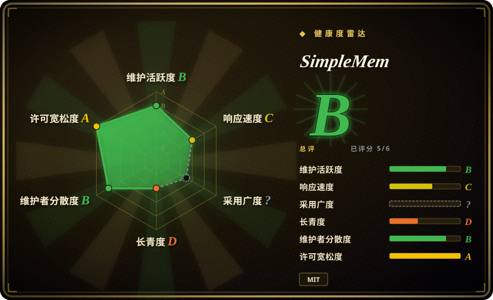
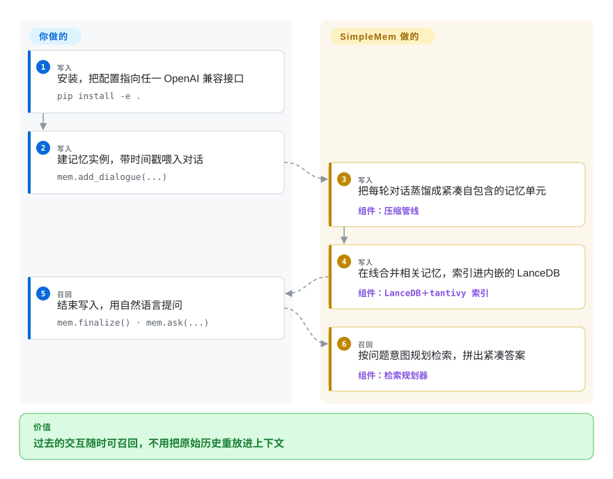

# SimpleMem

想让智能体回答一个关于过去的问题，要么把整段聊天记录塞回上下文——token 成本跟着历史长度走而不是跟着问题走，要么为一次过滤付一轮慢速推理的钱。SimpleMem 在写入时就把交互压缩成一条条自包含的小记忆单元，查询时按问题意图规划检索，召回不再需要重放整段历史。

## 何时使用

你在做一个要长期记住交互的 LLM 智能体——几周的用户对话、反复的会话、上个月做过的决定——而两条常规路线都疼：把原始记录灌进 prompt，上下文窗口和账单一起爆；对原始历史做朴素 RAG，问「上周四开会定了什么」却检索到另一个周四，因为关键词相似度分不清问的是哪次会议。你想要的是一个垫在现有智能体底下的 Python 库：`pip install -e .`，把 `config.py` 指向任一 OpenAI 兼容接口，对话喂进去、问题问出来。在其主打基准（LoCoMo 长对话记忆）上，作者报告平均 F1 比既有记忆系统高 26.4%，同时推理期 token 消耗降约 30 倍——压缩发生在写入时，而不是查询时。

与平台型替代品的取舍：选它而不是 [Letta](letta.zh.md)，是因为你不必让出智能体主循环；选它而不是 [Zep](zep.zh.md) 或 [Cognee](cognee.zh.md)，是因为对话形态的记忆不必引入一个图引擎来跑。发布过的基准数字和意图感知的检索规划器是它的差异化；你付出的代价是一个年轻的学术团队仓库、停滞的 PyPI 包、以及每次写入都要调一次 LLM（见「何时不用」）。

## 怎么用起来

SimpleMem 是一个你 import 的 Python 包，不是要部署的服务（MCP 服务端是第二张面孔，可云端可自托管）。写入路径是一条三段管线：先把每段非结构化交互蒸馏成**原子记忆单元**——指代已消解、带绝对时间戳的自包含事实；再在会话构建过程中**在线合并**相关内容（冗余在记忆增长时就被去掉，而不是留到查询时）；最后把全部内容索引进内嵌的 **LanceDB**（语义向量、关键词、元数据多个视图）。你提问时，**意图感知的检索规划器**先推断这个问题真正要什么，再决定查哪些视图、拼出一段紧凑上下文——返回的答案很小，而不是历史的重放。你负责配置（API key、模型名）和喂数据；压缩、合并、检索规划都是它的事。`from simplemem import SimpleMem` 会在第一个调用是 `add_image()`／`add_audio()`／`add_video()` 时自动切到多模态后端；`simplemem.optimize(...)` 则用 EvolveMem 的自进化循环在你自己的开发集上调优检索超参。

<!-- flow-steps:begin (generated from flows/simplemem.json by tools/flow_card.py — do not edit) -->

流程文字版

1. **你**（写入）：安装，把配置指向任一 OpenAI 兼容接口 — `pip install -e .`
2. **你**（写入）：建记忆实例，带时间戳喂入对话 — `mem.add_dialogue(...)`
3. **SimpleMem**（写入）：把每轮对话蒸馏成紧凑自包含的记忆单元 — 组件：`压缩管线`
4. **SimpleMem**（写入）：在线合并相关记忆，索引进内嵌的 LanceDB — 组件：`LanceDB＋tantivy 索引`
5. **你**（召回）：结束写入，用自然语言提问 — `mem.finalize() · mem.ask(...)`
6. **SimpleMem**（召回）：按问题意图规划检索，拼出紧凑答案 — 组件：`检索规划器`

**价值**：过去的交互随时可召回，不用把原始历史重放进上下文

<!-- flow-steps:end -->

## 何时不用

- **你要的是经过验证的音视频记忆。** 维护者在 issue #69（2026-06）中明确：已报告的基准（LoCoMo、Mem-Gallery）只覆盖**文本和图像**——音视频支持是「架构级／定性」的，有摄取管线但没有对标数字。如果听回放录音是硬需求，先转写回文本（管线本身带 Whisper 路径），或用有基准验证的文本记忆方案如 [Mem0](mem0.zh.md) 或 [Zep](zep.zh.md)——别按「text, image, audio & video」的宣传语照单全收。
- **你要给自己的编码智能体挂会话记忆、且希望全自动。** 那是 claude-mem 的活——钩子无需埋点就能捕获会话。SimpleMem 的 `cross/` 子项目冲着同一问题去（会话生命周期、自动上下文注入、脱敏），但它是个年轻的附加目录，「+64% vs Claude-Mem」的 LoCoMo 数字是自测的；[claude-mem](claude-mem.zh.md) 才是专门造好、钩子齐全的选择。
- **你需要可生产固化的依赖。** PyPI 包 `simplemem` 冻在 0.1.0（2026-01-21 上传），而仓库已到 v0.3.0、统一包只能从源码装；核验时还有两个存储层正确性 bug 开着——首批之后插入的条目对关键词检索不可见（#78）、LanceDB 表超过 10 张时存在性检查出错（#85）。要一个能 pin 住就不管的记忆层，[Mem0](mem0.zh.md) 或 [Letta](letta.zh.md) 才有那个发布纪律。
- **记忆层得比论文活得久。** 这是学术团队仓库（AIMING Lab，UNC 教堂山分校），维护节奏通常跟着发表周期走；最后一次推送是 2026-07-24，上述 bug 无人应答。如果三年后还得有人修 bug，[Mem0](mem0.zh.md)、[Letta](letta.zh.md)、[Zep](zep.zh.md) 是更稳的押注。
- **写入必须免费、即时或离线。** 每次记忆构建都要调 LLM 做压缩（外加嵌入模型）——这就是它的设计本身，每次写入都花时延和 token。对高频遥测这类不值得压缩的数据，直接写裸的内嵌向量库（直接用 LanceDB），把 SimpleMem 留给召回质量能回本的场景。

## 横向对比

| 替代品 | 是否收录 | 我们的评价 | 取舍 |
|---|---|---|---|
| [Mem0](mem0.zh.md) | ✅ | 如果你要的是生产级、模型无关、发版持续更新的记忆 API，选 Mem0；如果写入时压缩和公开的长程召回数字更重要、能接受发版不稳，选 SimpleMem。 | Mem0：成熟平台、PyPI 稳定发版、采用面广。SimpleMem：压缩优先管线、有 LoCoMo 证据，但 PyPI 冻结、学术维护模式、存储 bug 未修。 |
| [Letta (MemGPT)](letta.zh.md) | ✅ | 如果你想让一个有状态运行时接管整个智能体循环和它的记忆 OS，选 Letta；如果智能体已经有了、只缺垫在底下的记忆库，选 SimpleMem。 | Letta：服务端运行时、自编辑记忆、绑定 agent 框架。SimpleMem：import 即用，不引入运行时，不预设框架。 |
| [claude-mem](claude-mem.zh.md) | ✅ | 如果目标是开发者的编码智能体会话、要求钩子自动捕获，选 claude-mem；如果记忆是自己应用里的一等子系统，选 SimpleMem。 | claude-mem：工作站工具，钩子无人值守全捕获。SimpleMem：调用（`add_dialogue`／`ask`）要你自己接，换来对话压缩和意图感知检索。 |
| [Zep](zep.zh.md) | ✅ | 如果事实带时间——会过期、会被取代、失效语义是核心，选 Zep；如果资产是被压缩的对话历史、不需要时间事实图谱，选 SimpleMem。 | Zep：时间知识图谱，要跑托管／自托管服务。SimpleMem：库路径内嵌存储、零服务端，但只有合并／衰减启发式，没有失效语义。 |
| [Cognee](cognee.zh.md) | ✅ | 如果记忆是文档形态、你想要跑在文件上的知识图谱引擎，选 Cognee；如果是写入时压缩的交互形态记忆，选 SimpleMem。 | Cognee：图谱引擎摄取管线，运维面更重。SimpleMem：对话原生 API、更轻，但多模态摄取只有文本＋图像有基准。 |

## 技术栈

- **语言：** Python 3.10+；单一 `simplemem` 包在文本内核、Omni-SimpleMem（多模态）、EvolveMem（检索自调优）之间自动路由。
- **存储：** 内嵌 **LanceDB**（列式向量库）加 **tantivy** 全文索引——库路径不需要独立数据库服务；MCP／cross 服务另加 SQLite。
- **检索：** 本地 **sentence-transformers** 嵌入（默认 `Qwen/Qwen3-Embedding-0.6B`）、BM25 关键词、结构化元数据过滤；omni 路径另加 FAISS＋BM25 混合检索与 token 预算扩张、知识图谱增强 [推断]（出自 README 架构描述；Omni 子项目自己的依赖清单未读）。
- **LLM 调用：** 经 `openai` SDK 打任一 OpenAI 兼容端点（`OPENAI_API_KEY`、`OPENAI_BASE_URL`，默认 `LLM_MODEL=gpt-4.1-mini`）；MCP 服务端另支持 Ollama、OpenRouter、Requesty。
- **服务端（可选）：** FastAPI ＋ MCP streamable HTTP（MCP 2025-03-26）、Docker Compose、多租户 JWT 认证；云端实例在 mcp.simplemem.cloud。
- **说明：** 锁版本的 `requirements.txt`（langchain／langgraph／langmem／litellm／qdrant……）是科研复现环境；`setup.py` 里 `pip install -e .` 的默认依赖轻得多（openai、pydantic、lancedb、sentence-transformers、tantivy、torch、open_clip、librosa）。

## 依赖

- **Python 3.10+** 和一个 **OpenAI 兼容 LLM 端点**（云端 API 或本地服务）——记忆构建和检索规划都要调它；没有 key 初始化就会失败。
- **本地嵌入模型**经 sentence-transformers／torch 在进程内运行（首次使用会从 Hugging Face 下载 `Qwen3-Embedding-0.6B`）。
- **内嵌 LanceDB**——落地为本地文件；库路径不需要外部数据库。
- **多模态摄取**（如使用）引入 torch、open_clip_torch、librosa／soundfile，以及音频的 Whisper 转写路径。
- **可选服务端：** 自托管多租户 MCP 服务端需要 Docker ＋ Docker Compose（`.env` 里配 JWT 密钥、加密密钥，`./data` 卷）；除此之外只有 pip。

## 运维难度

**库路径低，自托管服务端中等。** 库：一份配置文件、一次源码安装（PyPI 滞后）、内嵌存储、没有要盯的服务；你拥有的是数据目录、API 账单（每次写入都过 LLM 压缩），以及跟着一个快速演进的研究代码库走。服务端：Docker Compose 要设密钥（`.env`：JWT、加密）、管多租户用户、依赖同样的 LLM；云端 mcp.simplemem.cloud 免运维，但租户记忆落在第三方服务器上。

## 健康度与可持续性

- **维护——活跃转缓（截至 2026-09-28）。** 仓库创建于 2026-01-01；三个版本（v0.1.0 2026-03-10 → v0.3.0 2026-05-21）；最后一次推送 2026-07-24，是一波安全加固（CORS／凭据、JWT 默认密钥、移除 `eval`）加 Omni 的 MCP 服务端。此后静默两个月，存储层 bug #78／#85／#86 开着无人应答——论文后收尾的形状。
- **治理／bus factor——学术实验室、双主角。** AIMING Lab @ UNC 教堂山分校（组织简介，已核实）；两位一作各持约 38 次提交，带学生和外部贡献者长尾。无基金会、无厂商路线图；短期 bus factor 尚可，长期不确定。
- **年龄与 Lindy——9 个月，年轻。** 创建于 2026-01；论文产物（arXiv 2601.02553，「ICML'26」为仓库自述 [未验证：会议官网未查]）。年龄 × 仍活跃的结论是未经验证，不是 Lindy 安全。
- **采用——GitHub 可见，注册表近零。** 对论文仓库而言约 3.8k star／400 fork 算强；PyPI `simplemem` 约 111 次月下载（2026-09）、版本停在 0.1.0——推荐安装路径是源码，注册表数字低估了使用，但确实说明没人把它当被依赖 pin 住。
- **风险标志。** MIT，干净（LICENSE 已读）。基准协议被公开质疑过（issue #64／#68，均已答复关闭；#68 指控类别条件路由抬高了 Mem-Gallery 分数），音视频口径在 #69 被诚实地降级——头条数字按作者自报对待。云端 MCP 端点会把租户记忆存在服务端；README 带 Atlas Cloud 推广（轻微商业关联）。

## 存疑（未验证）

- `[未验证]` 所有头条数字（LoCoMo +26.4% F1／约 30 倍 token 缩减；omni F1=0.613 与 +47%；EvolveMem +25.7%；跨会话「+64% vs Claude-Mem」）均为作者／README 自报；未做独立复现，#68 的类别路由指控有答复但此处未重新审计。
- `[未验证]` 「ICML'26」录用是仓库描述的自我声明；未核对会议官网。
- `[未验证]` mcp.simplemem.cloud 的数据留存／隐私政策未审阅；使用它即租户记忆上第三方服务器。
- `[推断]` 「活跃转缓／论文后收尾」由两个月推送空窗加无人应答的 bug 推断；并无公告如此说。
- `[推断]` omni 路径的 FAISS＋BM25 混合取自 README 架构描述；Omni 子项目的依赖清单未读（faiss 不在根 requirements 里）。
- `[未验证]` `cross/` 声称原版 SimpleMem 代码「逐字节保留」是该子项目自己的说法。
