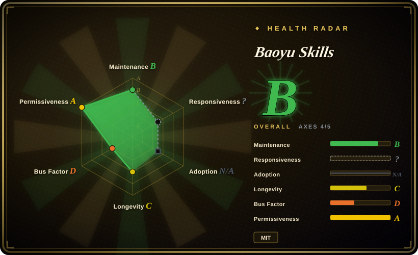
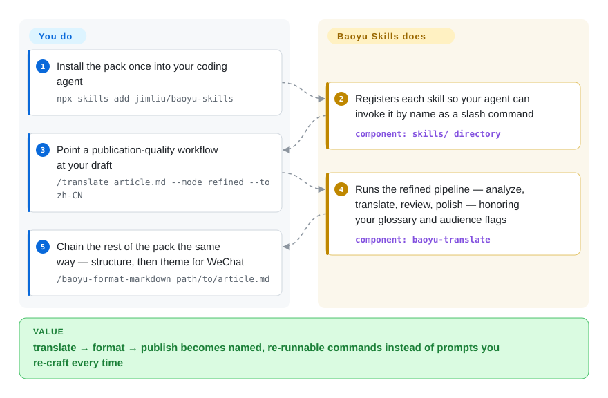

# Baoyu Skills

You re-paste the same prompt every time you translate an essay, structure a raw draft, or capture a transcript — and the translation still comes out machine-flavored. Baoyu Skills bakes those publishing chores into 21 named agent skills: install once, say `/translate article.md --mode refined --to zh-CN`, and the whole analyze → translate → review → polish workflow runs for you.

## When to use

You're a bilingual content creator or developer who lives in the terminal, and your real job around the code is *publishing*: translating an English essay into publication-quality Chinese, turning a raw transcript into a clean article, formatting messy markdown for WeChat, or pulling a YouTube transcript before you write a summary. Your coding agent can do any one of these if you hand-craft the prompt each time — but you keep re-explaining the same workflow, and the translation comes out stiff and machine-flavored instead of reading like a human wrote it. You want a curated, opinionated set of these moves baked in once and invoked by name.

Baoyu Skills covers that writing/translation slice: `baoyu-translate` runs three modes — quick (direct), normal (analyze → translate), refined (analyze → translate → review → polish) — with audience, style, and custom-glossary flags (`--glossary my-terms.md`); `baoyu-format-markdown` structures raw text into titled, frontmattered articles; `baoyu-markdown-to-html` themes it for WeChat; `baoyu-url-to-markdown` / `baoyu-youtube-transcript` feed the pipeline clean source text; and image/diagram/slide/Xiaohongshu-card skills handle the visual side. Install once (`npx skills add jimliu/baoyu-skills`, or the bundled plugin marketplace: `/plugin marketplace add JimLiu/baoyu-skills` then `/plugin install baoyu-skills@baoyu-skills`), and each workflow is a named slash command instead of a prompt you re-craft. Compared to hand-writing your own `SKILL.md` set, the trade you're making is ready-made, actively-updated opinion for third-party surface you don't control.

## How it works

The repo is 21 directories under `skills/`, each a folder following the Agent Skills layout: a `SKILL.md` instruction file (the prompt the agent loads), plus small TypeScript helper packages for steps that need real code execution — image generation, browser capture, posting via the WeChat/X APIs. Installing registers these folders with your harness's skill loader — Claude Code via the plugin marketplace, Codex via copying whole skill directories into `<project>/.agents/skills/`, or any skill-capable agent through the skills CLI (`npx skills add …`) — after which the agent sees each skill by name and pulls in its full instructions only when you invoke it. What it does for you: the multi-stage workflows (translation review passes, format rules, posting sequences) are pre-scripted and versioned upstream. What stays yours: choosing which skill to call and with which flags, supplying credentials in `~/.baoyu-skills/.env` or the project-level `.baoyu-skills/.env` for the posting/generation skills, and reviewing the output — the skills orchestrate whatever model your agent runs and ship no translation or image engine of their own.

<!-- flow-steps:begin (generated from flows/baoyu-skills.json by tools/flow_card.py — do not edit) -->

Text version of the flow

1. **You**: Install the pack once into your coding agent — `npx skills add jimliu/baoyu-skills`
2. **Baoyu Skills**: Registers each skill so your agent can invoke it by name as a slash command — component: `skills/ directory`
3. **You**: Point a publication-quality workflow at your draft — `/translate article.md --mode refined --to zh-CN`
4. **Baoyu Skills**: Runs the refined pipeline — analyze, translate, review, polish — honoring your glossary and audience flags — component: `baoyu-translate`
5. **You**: Chain the rest of the pack the same way — structure, then theme for WeChat — `/baoyu-format-markdown path/to/article.md`

**Value**: translate → format → publish becomes named, re-runnable commands instead of prompts you re-craft every time

<!-- flow-steps:end -->

## When NOT to use

- **You only want one skill, not the bundle.** The repo's own README tips you off: "bulk-installing every skill adds unnecessary context overhead for your AI agent on every run." If all you need is Chinese de-AI/voice work, the focused [Humanizer-zh](../de-ai-writing/humanizer-zh.md) is a leaner pick; for a single generation skill, ClawHub installs them individually (`clawhub install baoyu-image-gen`).
- **You already run a curated skill/voice system.** Layering Baoyu's opinionated workflows on top of your own translation or humanizing skills invites double-routing and conflicting glossary/voice instructions — pick one source of truth.
- **You're not on a supported harness.** The README targets Claude Code and Codex (plus skill-capable agents via the skills CLI); on a bespoke agent with no skill loader, these markdown folders won't auto-fire. [推断]
- **You distrust unofficial / reverse-engineered backends.** Some skills (`baoyu-danger-gemini-web`, `baoyu-danger-x-to-markdown`) explicitly wrap unofficial APIs and carry the project's own disclaimers; the writing skills don't, but they ship in the same repo and ride the same cadence.
- **You need hard enforcement.** Skill behavior is prompt/markdown-driven and advisory — the agent can deviate; "refined mode" is a documented workflow, not a guarantee. [推断]
- **Single-maintainer, moving target.** Releases stalled at v2.5.2 (2026-06) while `main` keeps committing (last 2026-09-10) — the skills-CLI install tracks the live tree, not a tag, so pin what you depend on and re-check after updates.

## Comparison

| Alternative | In index | Our verdict | Tradeoff |
|---|---|---|---|
| [Humanizer-zh](../de-ai-writing/humanizer-zh.md) | ✅ | Choose Humanizer-zh when focused Chinese de-AI/voice work is the only job. | A focused Chinese AI-text humanizing skill — narrow and single-purpose (de-AI / voice), where Baoyu Skills is a broad content/publishing bundle whose translation skill is one of 21. Reach for the focused one if all you want is humanizing; reach for Baoyu if you want the whole translate→format→publish pipeline. |
| Hand-written project skills | 未收录 | Choose hand-written skills when full control and zero third-party surface matter most. | Writing your own `SKILL.md` set for translate/format gives full control and zero third-party surface, but you rebuild and maintain the refined-mode workflow, glossary handling, and WeChat HTML theming yourself — and you won't get upstream fixes. |
| Single de-AI / translation prompt | 未收录 | Choose a one-off prompt when the task does not need persistence, versioning, or named loading. | A one-off prompt is the lightest possible option for one task, but it doesn't persist, version, or load by name across sessions the way an installed skill does. |
| Built-in agent skill ecosystems | 未收录 | Choose built-in marketplace skills when native harness equivalents should avoid third-party overlap. | The harness's own marketplace skills; Baoyu is a third-party curated bundle layered on top, so it can overlap or conflict with native equivalents. |

## Health & viability

- **Responsiveness**: Cannot be scored — type_na.
- **Maintenance (2026-09)** — **active**: not archived, last commit on `main` 2026-09-10; the newest tagged release is still v2.5.2 (2026-06-18), so development happens on the live tree rather than in versions — the skills CLI tracks `main`, which favors freshness over pinability.
- **Governance & bus factor** — **`User`-owned, single-maintainer repo ("宝玉"/JimLiu), 26.2k stars (2026-09) — a bus-factor flag.** Personal project, no team or org backing; cadence and continuity ride on one author.
- **Age & Lindy** — created 2026-01, so ~8.5 months old as of 2026-09: **young, no Lindy track record yet**. Popular (26k+ stars) but unproven over time. [推断]
- **Adoption & channels** — distributed three ways (skills CLI, Claude Code plugin marketplace, per-skill ClawHub publish); note that publishing to ClawHub releases each skill under **MIT-0** per the registry's rules, one notch more permissive than the repo's MIT.
- **Risk flags** — fast-moving tree means an update can change a skill's prompt, modes, or routing — pin and re-check after upgrades. [未验证] Some `baoyu-danger-*` skills wrap unofficial/reverse-engineered backends (may break or violate third-party terms); the writing skills don't, but share the same repo and cadence. MIT license.

## Caveats (unverified)

- [未验证] Individual skill behavior (mode routing, glossary handling, output quality) was not executed in this pass — facts here come from the README and the live `skills/` tree (21 directories, 2026-09-27), and both change release-to-release.
- [未验证] Supported harnesses (Claude Code, Codex, other skill-capable agents) and install paths (`npx skills add`, plugin marketplace, `.agents/skills/` copies, ClawHub) are README-stated; activation fidelity per harness was not independently confirmed.
- [未验证] `baoyu-danger-*` skills wrap unofficial/reverse-engineered backends per the README and may break or violate third-party terms; the writing-focused skills do not, but share the same repo and cadence.
- [未验证] "Publishing to ClawHub releases the published skill under MIT-0" is the README's statement about ClawHub's registry rules; the repo itself is MIT.
- [推断] Because skill logic lives in markdown loaded by the agent (with TypeScript helper packages), enforcement is advisory — documented modes/workflows are prompt-level instructions, not hard guarantees.
- [推断] Translation/humanizing quality depends on the underlying model the agent runs; the skill orchestrates the workflow but adds no translation engine of its own.
