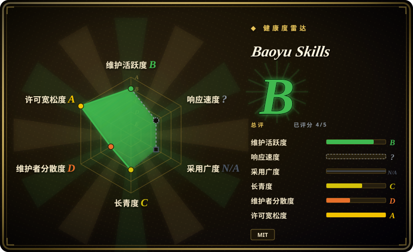
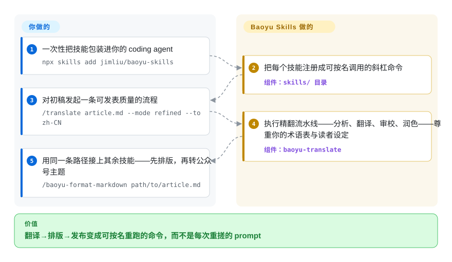

# Baoyu Skills

每次翻文章、排初稿、抓字幕都要重贴同一套 prompt，翻出来的稿子还一股机器味。宝玉把这类发布活儿沉淀成 21 个可按名调用的 agent 技能——装一次，说一句 `/translate article.md --mode refined --to zh-CN`，分析→翻译→审校→润色整条流水线替你跑完。

## 何时使用

你是一个常驻终端的双语内容创作者或开发者，而你围绕代码的真正工作是**发布**：把一篇英文随笔翻成可发表质量的中文、把原始字幕整理成干净文章、把杂乱 markdown 排版成适配公众号的样式，或在动笔写摘要前先抓下一段 YouTube 字幕。这些活儿你的 coding agent 单拎出来都能干——前提是你每次手搓 prompt；但你总在重复讲同一套流程，而且翻出来的稿子机器味重、读着不像人写的。你想把这些动作一次性沉淀成一组有主见、可按名调用的技能。

Baoyu Skills 正好覆盖写作/翻译这一片：`baoyu-translate` 跑三档流程——快翻（直译）、普通（分析→翻译）、精翻（分析→翻译→审校→润色）——支持读者画像、文风和自定义术语表（`--glossary my-terms.md`）；`baoyu-format-markdown` 把原始文本整理成带标题、摘要和 frontmatter 的文章；`baoyu-markdown-to-html` 套上公众号主题；`baoyu-url-to-markdown` / `baoyu-youtube-transcript` 给流水线喂干净的源文本；图片/图表/幻灯片/小红书卡片技能管视觉那头。安装一次（`npx skills add jimliu/baoyu-skills`，或自带的插件 marketplace：`/plugin marketplace add JimLiu/baoyu-skills` 然后 `/plugin install baoyu-skills@baoyu-skills`），此后每条工作流都是一条具名斜杠命令，而不是你每次重搓的 prompt。和你自己手写一套 `SKILL.md` 相比，你换来的是现成、持续更新的主见，代价是一片不受你控制的第三方表面积。

## 怎么用起来

仓库就是 `skills/` 下的 21 个目录，每个按 Agent Skills 规范摆：一份 `SKILL.md` 指令文件（agent 加载的提示词），外加小型 TypeScript 辅助包，负责那些真要跑代码的步骤——图片生成、浏览器抓取、经微信/X 接口发布。装好后技能目录就注册进你的 harness 的 skill 加载器——Claude Code 走插件 marketplace，Codex 走把整个技能目录拷进 `<project>/.agents/skills/`，其他支持 skill 的 agent 走 skills CLI（`npx skills add …`）——之后 agent 按名字看见每个技能，只在你调用它时才拉入完整指令。它替你做：多阶段工作流（翻译的审校回合、排版规则、发布序列）已预先编排并随上游版本演进。留给你的：决定叫哪个技能、带什么参数，为发布/生成类技能在 `~/.baoyu-skills/.env` 或项目级 `.baoyu-skills/.env` 里备好凭据，以及人工审读产出——技能只编排你的 agent 所跑的模型，本身不带翻译或图像引擎。

<!-- flow-steps:begin (generated from flows/baoyu-skills.json by tools/flow_card.py — do not edit) -->

流程文字版

1. **你**：一次性把技能包装进你的 coding agent — `npx skills add jimliu/baoyu-skills`
2. **Baoyu Skills**：把每个技能注册成可按名调用的斜杠命令 — 组件：`skills/ 目录`
3. **你**：对初稿发起一条可发表质量的流程 — `/translate article.md --mode refined --to zh-CN`
4. **Baoyu Skills**：执行精翻流水线——分析、翻译、审校、润色——尊重你的术语表与读者设定 — 组件：`baoyu-translate`
5. **你**：用同一条路径接上其余技能——先排版，再转公众号主题 — `/baoyu-format-markdown path/to/article.md`

**价值**：翻译→排版→发布变成可按名重跑的命令，而不是每次重搓的 prompt

<!-- flow-steps:end -->

## 何时不用

- **你只想要一个技能而不是整包。** 仓库 README 自己就提醒：“批量安装所有技能会给 AI agent 每次运行增加不必要的上下文开销”。只要中文去机器味/voice 调整，选更聚焦的 [Humanizer-zh](../de-ai-writing/humanizer-zh.zh.md)；只要单个生成技能，ClawHub 支持逐技能安装（`clawhub install baoyu-image-gen`）。
- **你已有一套自管的技能/voice 体系。** 把宝玉这套有主见的工作流叠在自己的翻译或去机器味技能之上，会造成双路由、术语表/voice 指令冲突——只保留一个事实源。
- **你不在受支持的 harness 上。** README 面向 Claude Code 和 Codex（外加经 skills CLI 的支持 skill 的 agent）；在没有 skill 加载器的自研 agent 上，这些 markdown 目录不会自动触发。[推断]
- **你不信任非官方/逆向后端。** 部分技能（`baoyu-danger-gemini-web`、`baoyu-danger-x-to-markdown`）明确包了非官方 API 并带着项目自己的免责声明；写作类技能没有，但它们同仓发布、同节奏演进。
- **你需要硬性强制。** 技能行为由 prompt/markdown 驱动，属建议性——agent 可以偏离；“精翻档”是一份有文档的工作流，不是保证。[推断]
- **单人维护、移动的靶。** tag 停在 v2.5.2（2026-06），而 `main` 一直在提交（最近 2026-09-10）——skills CLI 安装跟的是活动目录树而非 tag，所以依赖什么就锁什么，更新后重新核对。

## 横向对比

| 替代品 | 是否收录 | 我们的评价 | 取舍 |
|---|---|---|---|
| [Humanizer-zh](../de-ai-writing/humanizer-zh.zh.md) | ✅ | 只需要聚焦中文去机器味和 voice 调整时，选 Humanizer-zh。 | 一个聚焦的中文 AI 文本去机器味技能——窄而单一（去 AI / voice），而 Baoyu Skills 是宽口径的内容/发布套件，其翻译技能只是 21 个之一。只想去机器味就选聚焦的那个；想要整条 翻译→排版→发布 流水线就选 Baoyu。 |
| 手写项目技能 | 未收录 | 完全控制和零第三方表面积最重要时，选手写项目技能。 | 自己写一套 `SKILL.md` 做翻译/排版能拿到完全控制权、零第三方表面积，但精翻流程、术语表处理、公众号 HTML 主题都得你自建自维护——而且拿不到上游修复。 |
| 单条去 AI / 翻译 prompt | 未收录 | 任务不需要持久化、版本化或按名加载时，选一次性 prompt。 | 一次性 prompt 是单任务下最轻的选择，但它不会像已安装技能那样跨会话持久化、版本化、按名加载。 |
| harness 自带技能生态 | 未收录 | 想优先用原生 harness 等价技能、避免第三方重叠时，选自带技能生态。 | harness 自家市场里的技能；Baoyu 是叠在其上的第三方合集，可能与原生等价物重叠或冲突。 |

## 健康度与可持续性

- **响应速度**：无法计算——type_na。
- **维护（2026-09）** —— **活跃**：未归档，`main` 最近提交 2026-09-10；最新 tag 仍停在 v2.5.2（2026-06-18），开发发生在活动目录树而非版本号里——skills CLI 跟的是 `main`，新鲜度优先于可锁定性。
- **治理与 bus factor** —— **`User` 所有、单人维护（「宝玉」/JimLiu），26.2k star（2026-09）——这是一个 bus-factor 风险标记。** 个人项目，无团队或组织背书；节奏与延续性都压在一个作者身上。
- **年龄与 Lindy** —— 创建于 2026-01，截至 2026-09 约 8 个半月：**年轻，尚无 Lindy 履历**。热门（26k+ star）但未经时间检验。[推断]
- **采用与分发渠道** —— 三条路（skills CLI、Claude Code 插件 marketplace、逐技能发 ClawHub）；注意发进 ClawHub 的技能按 registry 规则以 **MIT-0** 发布，比仓库本身的 MIT 再宽一档。
- **风险标记** —— 目录树移动快，一次更新可能改掉某技能的 prompt、档位或路由——请锁版本，升级后重新核对。[未验证] 部分 `baoyu-danger-*` 技能包裹非官方/逆向后端（可能失效或违反第三方条款）；写作类技能不涉及，但同仓、同节奏。MIT 许可。

## 存疑（未验证）

- [未验证] 各技能的实际行为（档位路由、术语表处理、产出质量）本轮未实跑——本页事实来自 README 与当前 `skills/` 目录树（21 个目录，2026-09-27），两者都会随版本变化。
- [未验证] 受支持 harness（Claude Code、Codex 等支持 skill 的 agent）与安装路径（`npx skills add`、插件 marketplace、`.agents/skills/` 拷贝、ClawHub）均为 README 所述；在各 harness 上的激活保真度未独立确认。
- [未验证] `baoyu-danger-*` 类技能据 README 包裹非官方/逆向后端，可能失效或违反第三方条款；写作类技能不涉及，但同仓、同节奏。
- [未验证] “发布到 ClawHub 的技能按 registry 规则以 MIT-0 发布”是 README 的陈述；仓库本身是 MIT。
- [推断] 由于技能逻辑存于 agent 加载的 markdown（TypeScript 辅助包打下手），强制力属建议性——有文档的档位/工作流是 prompt 级指令，非硬性保证。
- [推断] 翻译/去机器味的质量取决于 agent 所跑的底层模型；技能编排工作流，本身不附带翻译引擎。
