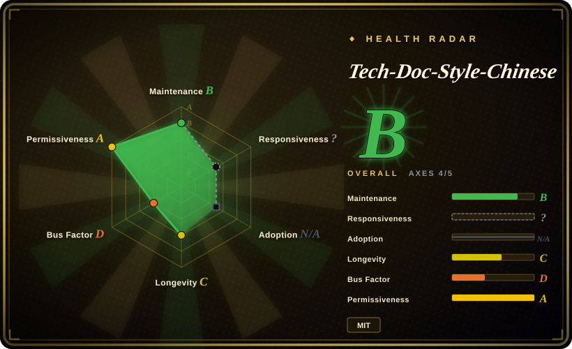
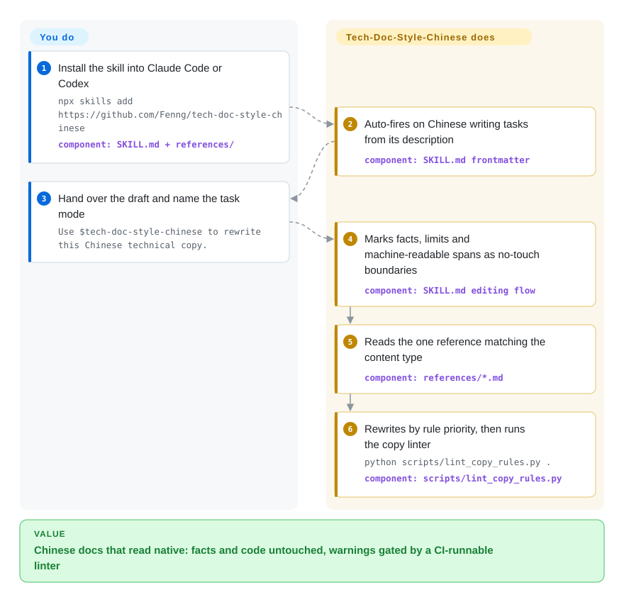

# Tech-Doc-Style-Chinese

You ask a coding agent to polish a Chinese API page or README and it hands back translation-ese: `Invalid` stiffened into 「非法」, buzzwords like 赋能 and 闭环 sprinkled through, Chinese and Latin run together with no spacing. This skill installs a Chinese technical-writing contract into Claude Code or Codex — facts, numbers and machine-readable text stay untouched while tone, terminology and typography follow an explicit rule priority.

## When to use

You ship a product whose developer docs are written and rewritten by an agent. You ask Claude Code to clean up a Chinese API reference and what comes back is grammatical but not native: 「Success」 mechanically rendered as 「成功」 everywhere, 互联网黑话 creeping into the copy, straight and curly quotes mixed, `中文API路径` crammed without a space. Tech-Doc-Style-Chinese is an installable Agent Skill (`SKILL.md` + per-topic references) that gives the agent a writing contract for Chinese technical content: it first decides the task mode (write / rewrite / proofread / review), marks facts, limits and machine-readable spans as a no-touch boundary, and applies rules in a fixed priority — preserve facts and legal meaning first, defer to the target project's conventions second, typography last.

You pick this over prose-only style guides and de-AI rewriters when the job is specifically **Chinese technical documentation** — API status copy, error messages, runbooks, landing-page first screens. It is the only in-index option that pairs agent-followable rules for that domain with a deterministic gate: `scripts/lint_copy_rules.py` runs error/warning/style findings with `--strict` and a per-line disable marker, and the repo's own GitHub Actions workflow proves the CI wiring. It also ships an explicit project-override mechanism (`references/project-overrides-example.md`), so your repo's terminology and quote style win over the skill's defaults instead of fighting them. Install is a one-liner (`npx skills add …`) or a pinned release tag for team reproducibility.

## How it works

The skill is Markdown rules plus two stdlib-only Python scripts — there is no runtime, service, or package dependency. You install it into a harness's skills directory; the harness auto-fires it on Chinese-writing tasks because `SKILL.md`'s frontmatter `description` names the trigger scope (the README states Claude Code decides invocation from that description). On invocation the agent walks the authored flow: declare task mode → mark the immutable boundary (code literals, JSON keys, URLs, API paths, verbatim error strings) → load the one reference that fits the content type (typography/terminology, API status wording, ASD-STE100-inspired controlled Chinese for ops docs, or your project-override file) → rewrite → run the copy linter and hand human judgment the warnings. The rules themselves are opinionated defaults the skill invites you to override — e.g. 直角引号 「」 everywhere in prose; enforcement is advisory, prompt-level: an agent can still deviate from Markdown instructions [推断] — the linter is the part that actually gates, and it covers only a subset of the prose rules [未验证].

<!-- flow-steps:begin (generated from flows/tech-doc-style-chinese.json by tools/flow_card.py — do not edit) -->

Text version of the flow

1. **You**: Install the skill into Claude Code or Codex — `npx skills add https://github.com/Fenng/tech-doc-style-chinese` — component: `SKILL.md + references/`
2. **Tech-Doc-Style-Chinese**: Auto-fires on Chinese writing tasks from its description — component: `SKILL.md frontmatter`
3. **You**: Hand over the draft and name the task mode — `Use $tech-doc-style-chinese to rewrite this Chinese technical copy.`
4. **Tech-Doc-Style-Chinese**: Marks facts, limits and machine-readable spans as no-touch boundaries — component: `SKILL.md editing flow`
5. **Tech-Doc-Style-Chinese**: Reads the one reference matching the content type — component: `references/*.md`
6. **Tech-Doc-Style-Chinese**: Rewrites by rule priority, then runs the copy linter — `python scripts/lint_copy_rules.py .` — component: `scripts/lint_copy_rules.py`

**Value**: Chinese docs that read native: facts and code untouched, warnings gated by a CI-runnable linter

<!-- flow-steps:end -->

## When NOT to use

- **You need an article pipeline, not a style layer.** This skill never turns a topic into a draft; it has no evidence ledger, no planning stages, no publishing workflow. For producing long-form Chinese articles end to end, pick [writing-agent](writing-agent.md) (staged pipeline with fact-check gate) or [huashu-skills](huashu-skills.md) (broad creator toolkit) instead.
- **You want an existing draft to stop sounding AI-written while keeping the author's voice.** Its rules target technical docs; `controlled-technical-chinese.md` itself says do not apply them to brand copy, narrative, or fixed quotations. For de-AI rewriting of finished Chinese prose pick [shuorenhua](../de-ai-writing/shuorenhua.md) or [humanizer-zh](../de-ai-writing/humanizer-zh.md) — they specialize in stripping template tells and preserving stance, which this style contract does not aim at.
- **You want deterministic reformatting with no LLM in the loop.** `lint_copy_rules.py` reports findings but does not rewrite; `unwrap_md_paragraphs.py` only undoes hard line breaks. If CI must auto-fix spacing/punctuation, [zhlint](https://github.com/zhlint-project/zhlint) (`未收录` — a real formatter+checker repo, not added in this tab-intake batch) is the lint-and-fix tool for that job.
- **Non-Chinese prose.** Every rule is Chinese-specific (corner quotes, CJK–Latin spacing, status-word translation, 黑话 blacklist). For English de-slop, use [humanizer](../de-ai-writing/humanizer.md) or stop-slop.
- **You need a stable, enforced house standard.** The repo is ~5.5 months old, single-maintainer, and its rules have already flipped: the hard-wrap paragraph rule was reversed on 2026-09-10 (commit, shipped in v0.3.2 [推断]). Pin a release tag, diff the rules between upgrades, and treat the linter's rule list as the contract — the prose is guidance the model may not follow exactly.

## Comparison

| Alternative | In index | Our verdict | Tradeoff |
|---|---|---|---|
| [shuorenhua](../de-ai-writing/shuorenhua.md) | ✅ | Pick shuorenhua when a finished Chinese draft must stop reading like AI output while the author's voice survives; pick this page when you are writing or reviewing technical docs and need typography, status-word and fact-fidelity rules rather than de-AI cleanup. | De-AI rewrite specialist vs technical-doc style contract; shuorenhua optimizes voice, this skill adds a CI-runnable linter and per-genre references. |
| [humanizer-zh](../de-ai-writing/humanizer-zh.md) | ✅ | Choose humanizer-zh to strip template prose from existing Chinese text keeping hedges and stance; choose this page when the target is docs UI/API copy quality, not AI-taste removal. | 31-checkpoint editor brief vs a full writing contract with project overrides; humanizer-zh ships no linter. |
| [writing-agent](writing-agent.md) | ✅ | Pick writing-agent when you need topic → published article (planning, evidence ledger, review gates); pick this page as a style layer applied to docs you already have or are writing by hand. | Whole production pipeline vs a rules pack; heavier workflow vs trivial install and CI use. |
| zhlint | 未收录 | Pick zhlint when spacing/punctuation must be enforced deterministically in CI without any model in the loop; pick this page when tone, terminology choice and factual fidelity decisions need judgment a formatter cannot make. | Formatter+checker vs agent skill; lint-and-fix vs lint-and-report. Not added in this tab-intake batch. |
| sparanoid/chinese-copywriting-guidelines | 未收录 | The classic prose-only 中文文案排版指北 (15.7k stars as of 2026-09): reach for it as a human reference of typography norms; reach for this page when an agent should actually apply (and a linter should gate) those norms on your docs. | Static guidelines vs installable, invocable skill with scripts; nothing in the guidelines enforces itself. Not added in this tab-intake batch. |

## Health & viability

- **Maintenance (2026-09):** active — last push 2026-09-29, v0.3.2 released the same day; 5 releases since creation (2026-04-12), with dense small fixes through September (code-span boundary handling).
- **Governance / bus factor:** User-owned repo, no org; 32 of 34 commits by the owner (3 contributors total) — bus factor ≈ 1. No CODEOWNERS, CONTRIBUTING, or SECURITY.md in the tree (2026-09-29).
- **Backing & age / Lindy (2026-09):** no foundation or vendor; created 2026-04-12, ~5.5 months old at ~1.2k stars — young with strong traction, so the Lindy verdict is **unproven, not seasoned**. The author (GitHub: Fenng) is a visible figure in Chinese developer communities [推断: the repo itself documents no backing beyond the profile bio].
- **Adoption:** install channels documented for Claude Code and Codex (`npx skills add`, pinned `git clone --branch <tag>`), and the repo's own Actions workflow runs the linter on every PR; no production dependents or external adoption evidence found [未验证].
- **Risk flags:** MIT, no relicense history; irregular version numbering (v0.2.0.4.x → v0.3.2) makes upgrade diffs harder to bisect; style rules already reversed once between releases; enforcement is prompt-level, so treat the linter output, not the prose, as the testable contract.

## Caveats (unverified)

- [未验证] Star count (~1.2k per GitHub API on 2026-09-29) is volatile and date-sensitive; treat as indicative, not a quality signal.
- [推断] The 2026-09-10 hard-wrap reversal commit shipped in v0.3.2 (2026-09-29) inferred from release/commit date ordering; the release notes were not opened.
- [未验证] Auto-trigger fidelity and rule compliance across Claude Code / Codex versions were not measured; behavior lives in Markdown instructions and varies by harness skill-loading.
- [未验证] Whether `lint_copy_rules.py` covers all prose rules was not audited; observed checks include forbidden quote forms and direct-address patterns, while status-word and 黑话 guidance sit mainly in the references.
- [推断] Author identity (Fenng = 冯大辉, known from the Chinese tech scene) comes from outside knowledge; the repo only exposes the profile bio 「不写代码的前 CTO。谢谢。」
- [未验证] No third-party production adoption found; claims about team usage rest on README install instructions only.
