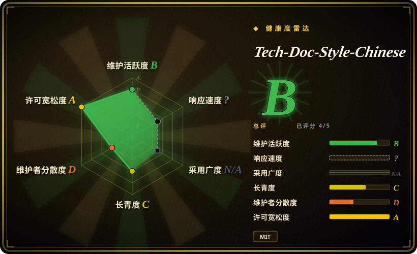
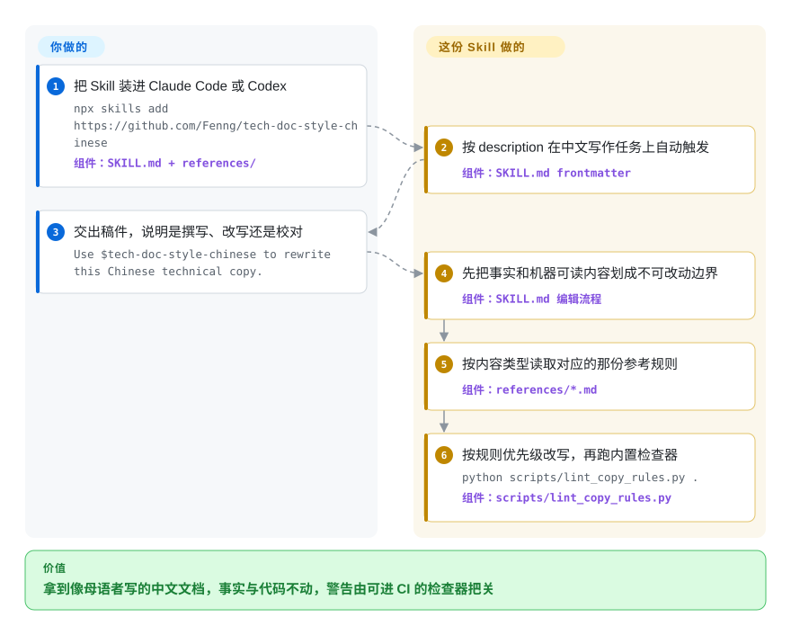

# Tech-Doc-Style-Chinese

让 coding agent 润色一篇中文 API 文档，它经常交回一股翻译腔：`Invalid` 被硬翻成「非法」，正文混进「赋能」「闭环」这类黑话，中英文挤在一起不空格。这份 Skill 给 Claude Code 或 Codex 装上一套中文技术写作合同：事实、数字和机器可读内容原样保留，语气、术语和排版按显式优先级处理。

## 何时使用

你在做一个中文开发者文档由 agent 撰写和改写的产品。你让 Claude Code 清理一篇中文 API 参考，拿回来的稿子语法没错但不像母语者写的：`Success` 被机械翻成「成功」铺满全篇，互联网黑话混进文案，直引号和弯引号混用，`中文API路径`之间没有空格。Tech-Doc-Style-Chinese 是一份可安装的 Agent Skill（`SKILL.md` 加分主题参考），给 agent 一份中文技术内容写作合同：先判定任务模式（撰写、改写、校对、审阅），再把事实、限制条件和机器可读内容划成不可改动边界，然后按固定优先级落规则——保事实与法律含义最优先，服从目标项目约定其次，排版细节最后。

和纯散文规范或去 AI 味改写器相比，选它的理由是工作对象恰好是**中文技术文档**——API 状态文案、错误提示、运维手册、首页首屏。它是索引内唯一把这个领域的 agent 规则和确定性闸门配齐的选项：`scripts/lint_copy_rules.py` 按 error、warning、style 三档出检查结果，支持 `--strict` 与行级豁免标记，仓库自己的 GitHub Actions workflow 就是现成的 CI 接线证明。它还提供显式的项目覆盖机制（`references/project-overrides-example.md`），你仓库的术语和引号约定压过 Skill 默认值，而不是被默认值绑架。安装要么一行 `npx skills add …`，要么按 release tag 固定版本供团队复现。

## 怎么用起来

这份 Skill 是 Markdown 规则加两个只用标准库的 Python 脚本，没有运行时、服务或包依赖。你把它装进 harness 的 skills 目录，harness 会在中文写作任务上自动触发它，因为 `SKILL.md` frontmatter 的 `description` 写明了触发范围（README 说 Claude Code 依据该 description 自行判断调用时机）。触发后 agent 按成文流程走：判定任务模式，把代码字面量、JSON 键名、URL、API 路径和错误原文划成不可改动边界，按内容类型读取对应参考（术语排版、API 状态文案、借鉴 ASD-STE100 思路的受控中文技术写作、或你的项目覆盖文件），改写，最后跑内置检查器并把 warning 交给人判断。规则本身是有主张的默认值，Skill 明确邀请你覆盖，比如正文一律用直角引号「」。执行是提示级的软约束——agent 仍可能偏离 Markdown 指令 [推断]。真正可门禁的是检查器，但它只覆盖规则的一部分 [未验证]。

<!-- flow-steps:begin (generated from flows/tech-doc-style-chinese.json by tools/flow_card.py — do not edit) -->

流程文字版

1. **你**：把 Skill 装进 Claude Code 或 Codex — `npx skills add https://github.com/Fenng/tech-doc-style-chinese` — 组件：`SKILL.md + references/`
2. **Tech-Doc-Style-Chinese**：按 description 在中文写作任务上自动触发 — 组件：`SKILL.md frontmatter`
3. **你**：交出稿件，说明是撰写、改写还是校对 — `Use $tech-doc-style-chinese to rewrite this Chinese technical copy.`
4. **Tech-Doc-Style-Chinese**：先把事实和机器可读内容划成不可改动边界 — 组件：`SKILL.md 编辑流程`
5. **Tech-Doc-Style-Chinese**：按内容类型读取对应的那份参考规则 — 组件：`references/*.md`
6. **Tech-Doc-Style-Chinese**：按规则优先级改写，再跑内置检查器 — `python scripts/lint_copy_rules.py .` — 组件：`scripts/lint_copy_rules.py`

**价值**：拿到像母语者写的中文文档，事实与代码不动，警告由可进 CI 的检查器把关

<!-- flow-steps:end -->

## 何时不用

- **你要的是文章流水线，不是风格层。** 本 Skill 不会把选题变成初稿，没有证据账本、分阶段策划和发布流程。要端到端产出中文长文，选 [writing-agent](writing-agent.zh.md)（带事实核查闸门的流水线）或 [huashu-skills](huashu-skills.zh.md)（宽创作者工具箱）。
- **你想让已成稿的中文去掉 AI 腔同时保住作者声音。** 它的规则面向技术文档，`controlled-technical-chinese.md` 自己就写明品牌文案、叙事和固定引用不要机械套用。给成稿去 AI 味，选 [shuorenhua](../de-ai-writing/shuorenhua.zh.md) 或 [humanizer-zh](../de-ai-writing/humanizer-zh.zh.md)，它们专攻剥离模板腔并保留立场，正是这份写作合同不追求的事。
- **你要无模型参与的确定性排版修复。** `lint_copy_rules.py` 只报告不改写，`unwrap_md_paragraphs.py` 只处理段落硬换行。想让 CI 自动修空格和标点，[zhlint](https://github.com/zhlint-project/zhlint)（`未收录`，是真实仓库，本批 tab-intake 未收录）才是 lint 加 fix 的工具。
- **非中文文本。** 每条规则都是中文特化的（直角引号、中西文留白、状态词翻译、黑话清单）。英文去 AI 腔用 [humanizer](../de-ai-writing/humanizer.zh.md) 或 stop-slop。
- **你要稳定且强制执行的团队标准。** 仓库才约 5 个半月，单一维护者，规则已经翻转过一次：段落硬换行规则在 2026-09-10 提交中被反转（由 v0.3.2 发布，[推断]）。请固定 release tag、升级时 diff 规则变化，并把检查器规则清单当合同——散文部分模型未必逐条遵守。

## 横向对比

| 替代品 | 是否收录 | 我们的评价 | 取舍 |
|---|---|---|---|
| [shuorenhua](../de-ai-writing/shuorenhua.zh.md) | ✅ | 已有中文成稿要去掉机器腔、同时保住作者声音时选 shuorenhua；你在撰写或审阅技术文档、需要排版、状态词和事实保真规则时选本页。 | 去 AI 改写专精对技术文档写作合同；前者优化声音，后者多了可进 CI 的检查器和分主题参考。 |
| [humanizer-zh](../de-ai-writing/humanizer-zh.zh.md) | ✅ | 要给存量中文稿去模板腔并保留确定程度与立场时选 humanizer-zh；目标是文档与界面文案的写作质量时选本页。 | 31 检查点的编辑简报对完整写作合同；humanizer-zh 不带 lint 脚本和项目覆盖机制。 |
| [writing-agent](writing-agent.zh.md) | ✅ | 需要从选题到发布的中文文章流水线（策划、证据账本、审稿闸门）时选 writing-agent；只需要一个作用于现成文档的风格层时选本页。 | 整条生产线对规则包；前者流程重、后者安装轻且可直接进 CI。 |
| zhlint | 未收录 | 需要不经模型、在 CI 里确定性强制留白和标点时选 zhlint；需要语气、术语选型和事实保真这类格式器做不了的判断时选本页。 | 格式化加检查器对 agent skill；可自动修复对只报告；本批 tab-intake 未收录。 |
| sparanoid/chinese-copywriting-guidelines | 未收录 | 中文文案排版指北是纯散文的经典规范（2026-09 约 15.7k stars）：给人当排版规范参考读它，要让 agent 真正执行且由检查器把关你的文档时选本页。 | 静态规范文档对可安装可触发的 skill 加脚本；指北没有任何东西替它执法；本批 tab-intake 未收录。 |

## 健康度与可持续性

- **维护性（2026-09）：** 活跃——最后 push 2026-09-29，v0.3.2 同日发布；自创建（2026-04-12）以来 5 个 release，9 月有密集小修（代码跨度边界保护）。
- **治理与公交因子：** 个人 User 仓库，无组织；34 个提交中 32 个出自 owner（贡献者共 3 人），公交因子约等于 1。树内无 CODEOWNERS、CONTRIBUTING、SECURITY.md（2026-09-29 核查）。
- **背书与年龄（Lindy，2026-09）：** 无基金会或厂商背书。创建于 2026-04-12，约 5 个半月、约 1.2k stars——年轻且有热度，Lindy 判断是**未经时间验证，尚未沉淀**。作者（GitHub：Fenng）是中文开发者社区的知名面孔 [推断：仓库本身除主页简介外未记录任何背书]。
- **采用度：** README 记录了 Claude Code 与 Codex 两条安装路径（`npx skills add`、按 tag 固定 `git clone`），仓库自身 Actions 在每个 PR 上跑检查器；未找到生产环境采用证据 [未验证]。
- **风险信号：** MIT，无重许可史。版本号不规则（v0.2.0.4.x 到 v0.3.2），升级 diff 不好二分。风格规则已在版本间翻转过一次。强制力是提示级的，可测的合同是检查器输出而非散文规则。

## 存疑（未验证）

- [未验证] Star 数（GitHub API 2026-09-29 约 1.2k）波动且日期敏感，只作参考，不是质量信号。
- [推断] 2026-09-10 的硬换行反转提交由 v0.3.2（2026-09-29）带出，依据 release 与提交日期顺序推断，未打开 release 说明核对。
- [未验证] 未实测各版本 Claude Code、Codex 下的自动触发与规则遵循度。行为存在于 Markdown 指令中，遵循效果随 harness 的技能装载机制变化。
- [未验证] 未审计 `lint_copy_rules.py` 是否覆盖全部散文规则。已核实的检查含禁用引号形态和直呼模式，状态词与黑话指导主要在 references 文档里。
- [推断] 作者身份（Fenng 即中文技术圈知名的冯大辉）来自仓库外常识。仓库内可见的只有主页简介「不写代码的前 CTO。谢谢。」
- [未验证] 未找到第三方生产采用案例，关于团队使用的判断只基于 README 的安装说明。
