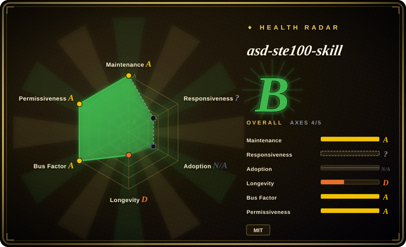
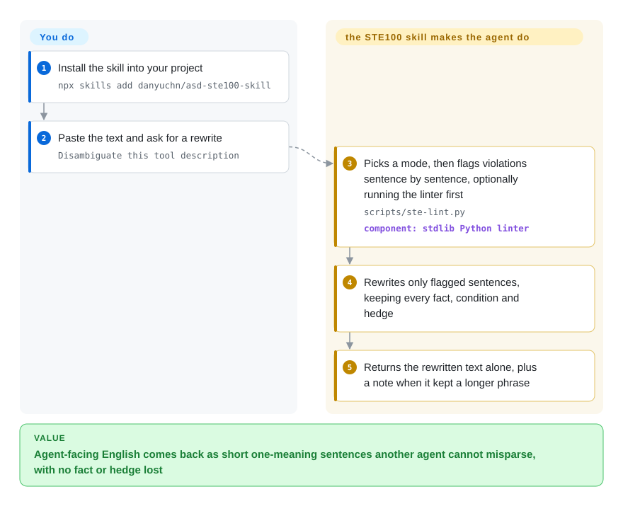

# asd-ste100-skill

A tool description that says "it may resolve it automatically depending on the strategy that has been set, or otherwise it will surface the conflict" leaves the next agent guessing which clause governs what. This skill rewrites such English into short, one-instruction, active-voice sentences under the aerospace ASD-STE100 rules, without dropping a fact, a condition or a hedge.

## When to use

You build agents, and a lot of what you write is never read by a person: tool and function descriptions, error strings, system prompts, the hand-off message one agent leaves for another. You find a downstream agent doing the wrong thing, trace it back, and the cause is one of your own 44-word sentences — "if a conflict is detected it may resolve it automatically depending on the strategy that has been set, or otherwise it will surface the conflict for manual review" — that the model parsed with a different clause attached to "otherwise" than you meant.

That is the case for this skill over the rest of this leaf. [avoid-ai-writing](avoid-ai-writing.md), [stop-slop](stop-slop.md) and [no-ai-slop](no-ai-slop.md) all aim at text that *sounds* machine-written to a human reader; this one aims at text a machine must *parse* without anyone to ask. It borrows a 1986 aerospace controlled-language standard instead of a list of AI tells: one instruction per sentence, length caps (20 words for procedures, 25 for descriptions), simple tenses, active voice, no semicolons or soft phrasal verbs. Its distinctive rule is about what it will *not* shorten — "may have failed" stays "may have failed" — and it ships a stdlib-only linter that by design never flags hedges. Pick it when the reader is an agent or a non-native reader and a misreading has a cost; pick a de-AI skill when the reader is a person and the problem is tone.

## How it works

The repo is one `SKILL.md` (about 16 KB) plus a rules summary, worked examples and a single Python script. Installed into your agent's skills directory, the skill fires when you ask to "disambiguate" or apply STE100 to a text. The agent then does all the work: it picks one of two modes from the kind of text — **Strict** for procedures, error messages and tool descriptions; **STE-flavored** for READMEs and PR descriptions, which keeps the sentence-shape rules but drops the one-word-one-meaning lockdown — walks the text sentence by sentence against the rule tables and a six-item scan checklist, and rewrites only the flagged sentences. The rules split into *structural* ones (sentence shape, which the skill enforces) and *lexical* ones (which approved word to use), and the lexical ones stay advisory because ASD's roughly 900-word approved dictionary is not redistributable and is deliberately absent. `scripts/ste-lint.py` is a regex checker — pattern matching, not a grammar parser — for semicolons, a short phrasal-verb list, nominalizations (actions turned into nouns, like "perform an analysis of"), marketing adjectives, passive voice, present perfect, long sentences and synonym rotation; the agent may run it as a first pass, and you can run it in CI with a `--baseline` count. Your part is to hand it the text and paste back what returns: by default only the rewritten text, plus a `Kept as-is:` line when keeping precision meant keeping a longer phrase. Think of it as the maintenance-manual editor, not the copy editor: it changes how a sentence is built, not what it says.

<!-- flow-steps:begin (generated from flows/asd-ste100-skill.json by tools/flow_card.py — do not edit) -->

Text version of the flow

1. **You**: Install the skill into your project — `npx skills add danyuchn/asd-ste100-skill`
2. **You**: Paste the text and ask for a rewrite — `Disambiguate this tool description`
3. **asd-ste100-skill**: Picks a mode, then flags violations sentence by sentence, optionally running the linter first — `scripts/ste-lint.py` — component: `stdlib Python linter`
4. **asd-ste100-skill**: Rewrites only flagged sentences, keeping every fact, condition and hedge
5. **asd-ste100-skill**: Returns the rewritten text alone, plus a note when it kept a longer phrase

**Value**: Agent-facing English comes back as short one-meaning sentences another agent cannot misparse, with no fact or hedge lost

<!-- flow-steps:end -->

## When NOT to use

- **Your text is not English.** Every rule, example and linter regex is English; a Chinese sentence with a fullwidth semicolon `；` and a perfect-tense marker came back from `ste-lint.py` with 0 violations in this pass. For Chinese technical copy use [Tech-Doc-Style-Chinese](../content-production/tech-doc-style-chinese.md), which ships its own ASD-STE100-inspired controlled-Chinese reference and a copy linter; for Chinese de-AI cleanup use [shuorenhua](shuorenhua.md).
- **You need certified STE compliance** (aircraft maintenance manuals, defence documentation, a customer contract that names ASD-STE100). The skill states it is "not a certified STE authoring tool" and does not carry the approved dictionary, so word-level compliance is unchecked. Get the official standard from ASD and use a dictionary-backed STE checker instead.
- **The reader is a person and voice is the point** — blog posts, marketing pages, founder letters, fiction. STE is flat and literal by design and the README excludes these. Use [no-ai-slop](no-ai-slop.md), whose first rule is preserving the writer's voice, or [humanizer](humanizer.md) for a gentler English de-AI pass.
- **You want a dependable CI gate on prose.** The linter is regex heuristics: it does not check noun-cluster length, knows only six phrasal verbs (so "take off the panel" passes), and open issue #17 reports sentence-segmentation defects — a sentence hard-wrapped across two Markdown lines was not measured at all when reproduced here. For a configurable, markup-aware prose linter use Vale (not indexed); for an English de-AI finding count with a GitHub Action, use [avoid-ai-writing](avoid-ai-writing.md).
- **You need proof the rewrite kept the meaning.** The README says the linter "does not compare an original text with a rewrite" — modality preservation is a prompt rule the agent follows, not a check. Diff original and rewrite yourself, or wait for a fidelity checker to mature (upstream issue #19 proposes one, two days old on 2026-10-05). [推断]
- **The text has nothing to say.** The skill's own boundary: a hollow paragraph comes out "short, clean, and still empty". Fix the content first; no rewriter in this leaf solves that.

## Comparison

| Alternative | In index | Our verdict | Tradeoff |
|---|---|---|---|
| [avoid-ai-writing](avoid-ai-writing.md) | ✅ | When the job is English prose for humans that must not read machine-written, and you want a CI-gateable finding count, pick avoid-ai-writing; pick asd-ste100-skill when the reader is another agent and the failure is a misparse, not a tone. | avoid-ai-writing brings a ~104 KB catalog, an npm detector and a GitHub Action; asd-ste100-skill is a 16 KB skill with a single stdlib Python linter and stricter sentence-shape rules but no AI-tell catalog. |
| [stop-slop](stop-slop.md) | ✅ | For a quick hard-rules pass over English prose with almost no context cost, pick stop-slop; pick asd-ste100-skill when you need explicit length caps, one-instruction sentences and a rule that forbids upgrading a hedge to a fact. | stop-slop is shorter and easier to paste into instructions; asd-ste100-skill adds two modes, a fact- and modality-preservation contract and a runnable linter, at the price of more instructions to load. |
| [no-ai-slop](no-ai-slop.md) | ✅ | If the rewritten text must still sound like its author, pick no-ai-slop; asd-ste100-skill deliberately flattens voice, which is right for tool descriptions and wrong for anything signed by a person. | no-ai-slop minimises edits to preserve voice; asd-ste100-skill maximises parse-safety and accepts a "personality transplant" in Strict mode. |
| [Tech-Doc-Style-Chinese](../content-production/tech-doc-style-chinese.md) | ✅ | For Chinese technical docs, API status copy or UI strings, pick Tech-Doc-Style-Chinese; asd-ste100-skill only works on English. | Tech-Doc-Style-Chinese is a broader Chinese style contract with project overrides and a CI linter; asd-ste100-skill is a narrower English controlled-language rewriter aimed at agent-facing text. |
| Vale | not indexed | When you need a prose linter you can configure per repo and run in CI across Markdown, AsciiDoc and code comments, pick Vale and write STE-like rules as a style; pick asd-ste100-skill when you want an agent to do the rewrite, not only flag it. | Not added in this tab batch. Vale is a mature Go binary with markup awareness but rewrites nothing; asd-ste100-skill rewrites but its linter is a ~22 KB regex script with known segmentation gaps. |

## Health & viability

- **Maintenance (2026-10-05):** created 2026-07-20, last push 2026-10-04, `archived=false`, 26 commits. There are no GitHub releases or tags; the only version marker is `version: 0.4.0` in `SKILL.md` frontmatter, so pin a commit SHA if you vendor it. Active, but the project is weeks old.
- **Governance / bus factor:** a personal repository (owner type User). The owner holds 14 of 26 listed contributions; eight outside contributors have landed PRs (the linter itself came from one), and the owner merges and edits them. The roadmap is one person's.
- **Adoption — read with suspicion:** about 3,666 stars and 210 forks in 77 days, against 9 watchers and no package to count downloads from. That ratio is attention, not usage evidence. One concrete downstream signal: issue #17 was filed by someone vendoring the skill into another repository. [推断]
- **Lindy:** the repo is too young for the Lindy prior to help. The *rules* are the old part — ASD-STE100 dates from 1986 and is at Issue 9 (January 2025) — so the method is unlikely to go stale even if this packaging does.
- **Risk flags:** MIT licence; the skill deliberately excludes ASD's copyrighted dictionary, which removes a redistribution risk but caps how "STE" it can be. The `npx skills add` install path sends anonymous telemetry unless `DISABLE_TELEMETRY=1` (stated in the README). Two issues open on 2026-10-05 (#17 linter defects, #19 fidelity-check proposal).

## Caveats (unverified)

- [推断] The star/fork count (3,666 / 210 in 77 days, 9 watchers) reads as a social-media spike rather than measured adoption; no install count from skills.sh was checked.
- [未验证] Rewrite quality — whether an agent following `SKILL.md` actually keeps every fact and hedge — was not evaluated in this pass; only the linter was run (`--selftest` OK, and the README's `--baseline 41 SKILL.md` claim reproduced as 41 hard violations).
- [未验证] Issue #17's segmentation defects (a) and (b) were not reproduced here; (c), a hard-wrapped sentence going unmeasured, was reproduced with Python 3.13.
- [推断] The claim that an STE-shaped tool description reduces downstream misparsing is the project's premise, argued by analogy to maintenance manuals; no benchmark in the repo measures it.
- [未验证] ASD-STE100 facts (1986 origin, Issue 9 of January 2025, 53 rules, ~900-word dictionary, redistribution limits) were read from the repo's `references/writing-rules.md` and `SKILL.md`, not from the standard itself.
- [推断] Behaviour in harnesses other than Claude Code was not tested; the `SKILL.md` format is generic, but trigger reliability depends on each harness's skill loader.
