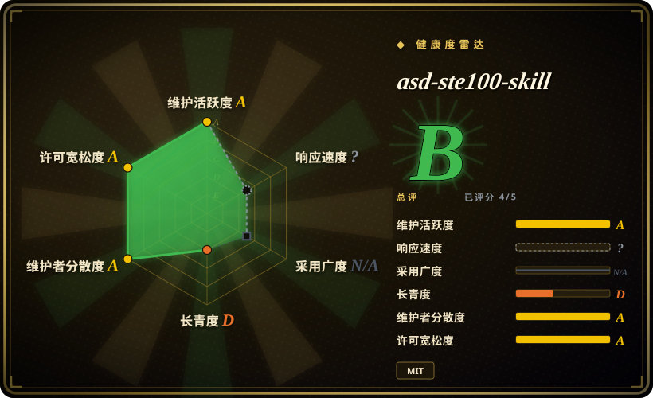
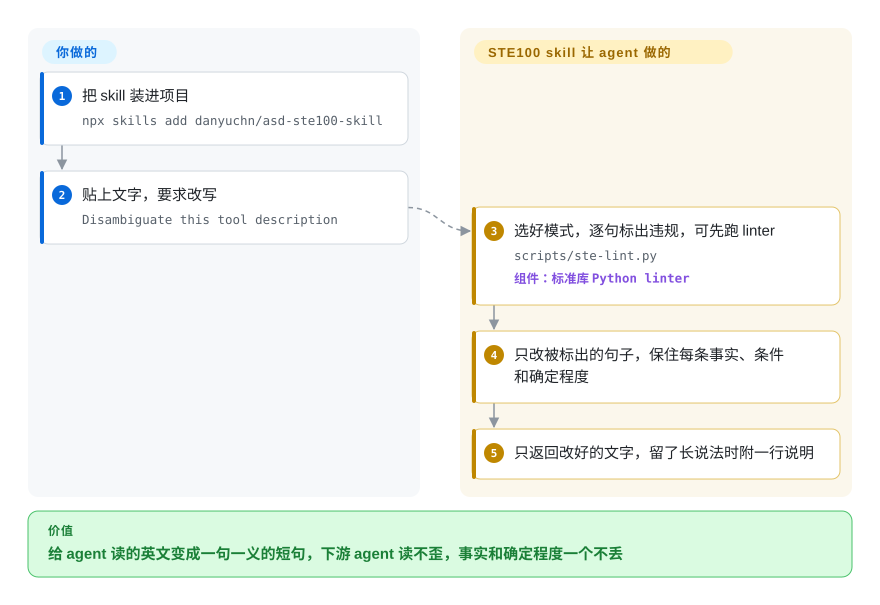

# asd-ste100-skill

你写的工具说明里有一句“如果检测到冲突，可能会按已设置的策略自动解决，否则会把冲突提交人工复核”，下游 agent 读到“否则”时，未必挂在你以为的那个分句上。这个 skill 用航空业的 ASD-STE100 受控英语规则，把这类英文改写成一句一个指令、主动语态的短句，而且不丢事实、不丢条件、不丢“可能”。

## 何时使用

你在做 agent，写下的很多英文根本不是给人看的：工具和函数的说明、报错字符串、系统提示词、一个 agent 留给下一个 agent 的交接消息。某天下游 agent 做错了事，你一路追查，发现根源是你自己写的一句 44 个词的长句——“if a conflict is detected it may resolve it automatically depending on the strategy that has been set, or otherwise it will surface the conflict for manual review”——模型把 “otherwise” 接到了另一个分句上。

这正是它和本叶子其他项目的分界。[avoid-ai-writing](avoid-ai-writing.zh.md)、[stop-slop](stop-slop.zh.md)、[no-ai-slop](no-ai-slop.zh.md) 针对的都是“人读起来像机器写的”文字；这个 skill 针对的是“机器必须读懂、又没人可问”的文字。它借用的不是一份 AI 腔词表，而是 1986 年起用的航空受控语言标准：一句只下一个指令，长度有上限（操作步骤 20 词、描述 25 词），只用简单时态和主动语态，不用分号和软性短语动词。它最有特色的规则是“什么不能删”——“may have failed” 必须保持 “may have failed”——随附的纯标准库 linter 也被刻意设计成从不标记确定程度词。读者是 agent 或非母语读者、读错要付代价时选它；读者是人、问题出在语气时选去 AI 味 skill。

## 怎么用起来

仓库只有一个约 16 KB 的 `SKILL.md`，加一份规则摘要、一份改写示例和一个 Python 脚本。装进 agent 的 skills 目录后，你说 “disambiguate” 或要求对某段文字套用 STE100，它就会触发。之后活都由 agent 干：先按文字类型选模式——**Strict** 用于操作步骤、报错和工具说明；**STE-flavored** 用于 README 和 PR 描述，保留句子形状规则，放开“一词一义”的限制——再逐句对照规则表和六项扫描清单找问题，只改被标出的句子。规则分两类：*结构类*（句子长什么样，skill 会强制执行）和*词汇类*（该用哪个批准词，只作建议），后者降级是因为 ASD 那份约 900 词的批准词典不允许转载，仓库刻意没收。`scripts/ste-lint.py` 是一个正则检查器（靠模式匹配，不是语法分析器），查分号、一小串短语动词、名词化（把动作写成名词，比如 “perform an analysis of”）、营销形容词、被动语态、现在完成时、超长句和同义词轮换；agent 可以先跑它做一遍机械检查，你也可以带 `--baseline` 计数放进 CI。你要做的只是把文字交给它，再把结果贴回去：默认只返回改好的文字，如果为了保住精度留了较长的说法，会多一行 `Kept as-is:`。把它想成维修手册的审校，而不是文案编辑：它改句子的搭法，不改句子的意思。

<!-- flow-steps:begin (generated from flows/asd-ste100-skill.json by tools/flow_card.py — do not edit) -->

流程文字版

1. **你**：把 skill 装进项目 — `npx skills add danyuchn/asd-ste100-skill`
2. **你**：贴上文字，要求改写 — `Disambiguate this tool description`
3. **asd-ste100-skill**：选好模式，逐句标出违规，可先跑 linter — `scripts/ste-lint.py` — 组件：`标准库 Python linter`
4. **asd-ste100-skill**：只改被标出的句子，保住每条事实、条件和确定程度
5. **asd-ste100-skill**：只返回改好的文字，留了长说法时附一行说明

**价值**：给 agent 读的英文变成一句一义的短句，下游 agent 读不歪，事实和确定程度一个不丢

<!-- flow-steps:end -->

## 何时不用

- **文字不是英文。** 规则、示例和 linter 的正则全是英文的；本次把一句带全角分号 `；` 和“已经……了”的中文丢给 `ste-lint.py`，结果是 0 个违规。中文技术文案用 [Tech-Doc-Style-Chinese](../content-production/tech-doc-style-chinese.zh.md)，它自带借鉴 ASD-STE100 的受控中文参考和文案 linter；中文去 AI 味用 [shuorenhua](shuorenhua.zh.md)。
- **你需要经认证的 STE 合规**（飞机维修手册、国防文档、合同里写明要符合 ASD-STE100）。skill 自己声明“不是认证的 STE 写作工具”，也没有批准词典，词级合规完全没查。去 ASD 申请官方标准，配合带词典的 STE 检查工具。
- **读者是人，语气本身就是重点**——博客、营销页、署名信、小说。STE 刻意平直，README 也把这些排除在外。用 [no-ai-slop](no-ai-slop.zh.md)（第一条规则就是保住作者的声音），或用 [humanizer](humanizer.zh.md) 做更温和的英文去 AI 味。
- **你要一道靠得住的 prose CI 门禁。** linter 是正则启发式：不查名词串长度，短语动词只认六个（所以 “take off the panel” 能通过），未关闭的 issue #17 还报告了断句缺陷——本次复现时，一个在 Markdown 里折成两行的长句根本没被测量。要可配置、懂标记语法的 prose linter 用 Vale（未收录）；要英文去 AI 味命中数加 GitHub Action，用 [avoid-ai-writing](avoid-ai-writing.zh.md)。
- **你需要证明改写没改意思。** README 明说 linter “不对比原文和改写”——保住确定程度只是 agent 遵守的提示词规则，不是检查。自己对照原文和改写稿，或等保真检查工具成熟（上游 issue #19 提议了一个，到 2026-10-05 只有两天历史）。[推断]
- **文字本身没内容。** 这是 skill 自己划的边界：空洞的段落改完还是“短、干净、照样空”。先补内容；本叶子没有哪个改写工具能解决这个。

## 横向对比

| 替代品 | 是否收录 | 我们的评价 | 取舍 |
|---|---|---|---|
| [avoid-ai-writing](avoid-ai-writing.zh.md) | ✅ | 写给人看的英文、要求读起来不像机器写、还想要能在 CI 里卡的命中数，选 avoid-ai-writing；读者是另一个 agent、失败模式是读错而不是语气时，选 asd-ste100-skill。 | avoid-ai-writing 带约 104 KB 的模式目录、npm 检测器和 GitHub Action；asd-ste100-skill 只有 16 KB 的 skill 和一个标准库 Python linter，句子形状规则更严，但没有 AI 腔目录。 |
| [stop-slop](stop-slop.zh.md) | ✅ | 想用几乎不占上下文的硬规则快速过一遍英文，选 stop-slop；需要明确的长度上限、一句一指令，以及“不准把猜测升级成事实”这条规则时，选 asd-ste100-skill。 | stop-slop 更短、更容易贴进指令；asd-ste100-skill 多了两种模式、事实与确定程度保全契约和可运行 linter，代价是要加载的指令更多。 |
| [no-ai-slop](no-ai-slop.zh.md) | ✅ | 改完还必须像作者本人写的，选 no-ai-slop；asd-ste100-skill 刻意抹平语气，这对工具说明是对的，对任何署名文字都是错的。 | no-ai-slop 尽量少改以保住声音；asd-ste100-skill 追求不被读错，在 Strict 模式下接受“换了个人格”。 |
| [Tech-Doc-Style-Chinese](../content-production/tech-doc-style-chinese.zh.md) | ✅ | 中文技术文档、API 状态文案或界面文字，选 Tech-Doc-Style-Chinese；asd-ste100-skill 只处理英文。 | Tech-Doc-Style-Chinese 是更宽的中文风格契约，带项目覆盖机制和 CI linter；asd-ste100-skill 是更窄的英文受控语言改写器，瞄准给 agent 读的文字。 |
| Vale | 未收录 | 需要能按仓库配置、在 CI 里跑遍 Markdown、AsciiDoc 和代码注释的 prose linter，选 Vale，把类 STE 规则写成一个 style；想让 agent 直接改写而不只是标出问题，选 asd-ste100-skill。 | 本批未收录。Vale 是成熟的 Go 二进制、懂标记语法，但不改写任何东西；asd-ste100-skill 会改写，但它的 linter 只是约 22 KB 的正则脚本，断句有已知缺口。 |

## 健康度与可持续性

- **维护（2026-10-05）：** 2026-07-20 创建，最后推送 2026-10-04，`archived=false`，共 26 个提交。没有 GitHub release 也没有 tag，唯一的版本标记是 `SKILL.md` 头部的 `version: 0.4.0`，要 vendor 就钉提交 SHA。活跃，但项目只有几周大。
- **治理与巴士因子：** 个人仓库（owner 类型为 User）。owner 占列出的 26 次贡献中的 14 次；另有 8 名外部贡献者的 PR 被合入（linter 本身就来自外部 PR），由 owner 合并和改写。路线图在一个人手里。
- **采用度——要带着怀疑看：** 77 天约 3,666 star、210 fork，但 watcher 只有 9 个，也没有可数下载量的包。这个比例说明的是关注度，不是使用证据。一个具体的下游信号：issue #17 的提交者正在把这个 skill vendor 进另一个仓库。[推断]
- **Lindy：** 仓库太年轻，Lindy 先验帮不上忙。老的是*规则*——ASD-STE100 始于 1986 年，现行 Issue 9（2025 年 1 月）——所以即便这层包装过时，方法本身不太会过时。
- **风险信号：** MIT 许可证；skill 刻意不收 ASD 有版权的词典，避开了转载风险，但也限定了它能有多“STE”。`npx skills add` 安装路径会发送匿名遥测，除非设 `DISABLE_TELEMETRY=1`（README 写明）。2026-10-05 有两个未关闭 issue（#17 linter 缺陷，#19 保真检查提议）。

## 存疑（未验证）

- [推断] star / fork 数（77 天 3,666 / 210，watcher 9）更像社交媒体带来的一波关注，而不是测得的采用度；没有核对 skills.sh 的安装数。
- [未验证] 改写质量——agent 按 `SKILL.md` 改写时是否真的保住每条事实和每个确定程度词——本次没有评测，只跑了 linter（`--selftest` 通过，README 里 `--baseline 41 SKILL.md` 的说法复现为恰好 41 个硬违规）。
- [未验证] issue #17 里的断句缺陷 (a)、(b) 本次没有复现；(c) 折行长句不被测量，已用 Python 3.13 复现。
- [推断] “按 STE 改写的工具说明能减少下游读错”是项目的前提，靠类比维修手册来论证；仓库里没有任何基准测量这一点。
- [未验证] ASD-STE100 的事实（1986 年起源、2025 年 1 月 Issue 9、53 条规则、约 900 词词典、转载限制）读自仓库的 `references/writing-rules.md` 和 `SKILL.md`，没有对照标准原文。
- [推断] 没有在 Claude Code 以外的 harness 里测试；`SKILL.md` 格式是通用的，但能否可靠触发取决于各 harness 的 skill 加载器。
