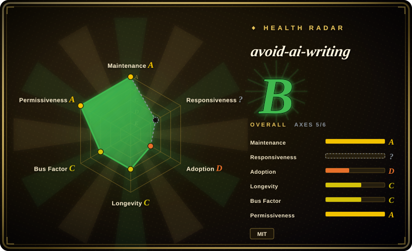
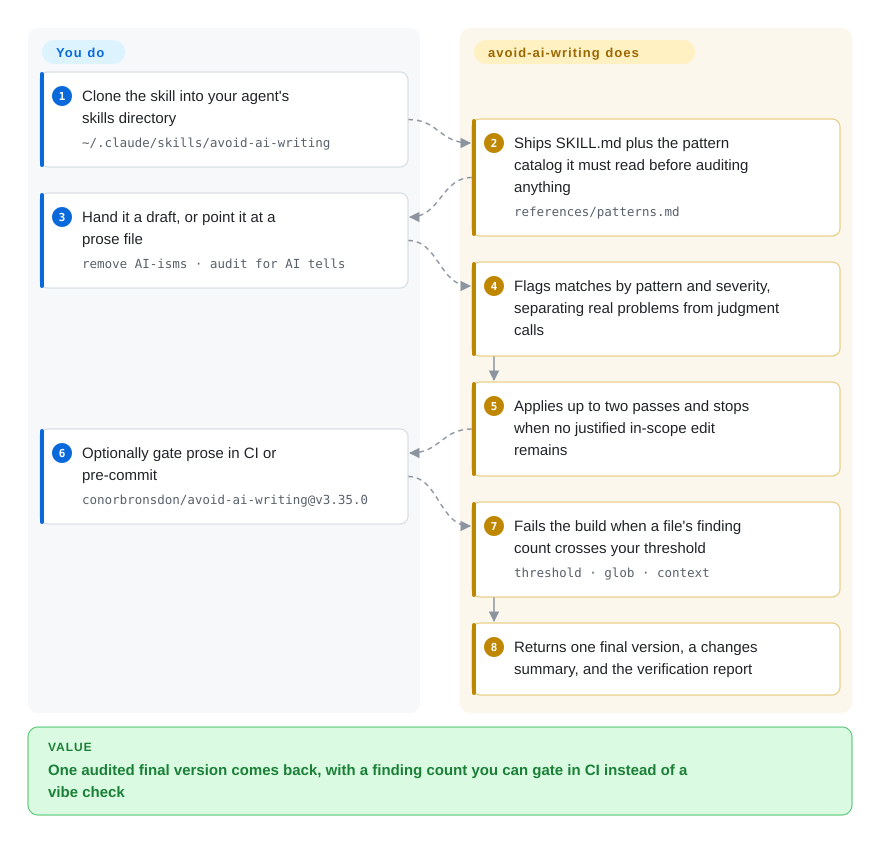

# avoid-ai-writing

A portable de-AI writing skill that ships a runnable detector, a CI gate, and — unusually for this field — a published measurement of its own false-positive rate.

## When to use

You edit English prose at volume — product docs, changelogs, blog drafts, PR descriptions — and you have stopped trusting your own ear for what reads machine-written. You want the cleanup pass to be repeatable, and more than that you want it to be *checkable*: a number you can put in CI so a paragraph that drifts back into promotional register fails the build instead of shipping.

That is the decision point against this leaf's other English options. [humanizer](humanizer.md) is a broader, gentler rubric and [stop-slop](stop-slop.md) is a shorter, harder one, but both are instructions only — there is nothing in either to run, score, or gate. avoid-ai-writing ships both halves: `SKILL.md` plus a roughly 104 KB pattern catalog for the agent, and a zero-dependency Node detector behind `npx` that a GitHub Action or pre-commit hook can fail on. Pick it when the de-AI pass should be an engineering artifact rather than a vibe, and when the prose is English.

## How it works

Two halves ship together. The instruction half is Markdown: `SKILL.md` defines the editing contract — three modes (rewrite, detect, edit-in-place), an `--iterate 1|2` ceiling on editing passes, severity tiers, and an output contract — and it requires the agent to read `references/patterns.md` in full before touching any text, because that is where the word tiers, the pattern categories and the register/voice profiles live. The mechanical half is `detector/`, a zero-dependency Node module that turns a subset of the same rules into a 0–100 score and a categorised finding list, exposed through `bin/avoid-ai-writing.js` as a CLI. The split of labour is the point: you decide what the text is for and what must not change, the agent does the editing and the preservation check, and the detector is what turns "this got worse" into a failing build. Your part is small — install it once, hand it prose or a file, and decide whether you care about the score or only about not regressing.

<!-- flow-steps:begin (generated from flows/avoid-ai-writing.json by tools/flow_card.py — do not edit) -->

Text version of the flow

1. **You**: Clone the skill into your agent's skills directory — `~/.claude/skills/avoid-ai-writing`
2. **avoid-ai-writing**: Ships SKILL.md plus the pattern catalog it must read before auditing anything — `references/patterns.md`
3. **You**: Hand it a draft, or point it at a prose file — `remove AI-isms · audit for AI tells`
4. **avoid-ai-writing**: Flags matches by pattern and severity, separating real problems from judgment calls
5. **avoid-ai-writing**: Applies up to two passes and stops when no justified in-scope edit remains
6. **You**: Optionally gate prose in CI or pre-commit — `conorbronsdon/avoid-ai-writing@v3.35.0`
7. **avoid-ai-writing**: Fails the build when a file's finding count crosses your threshold — `threshold · glob · context`
8. **avoid-ai-writing**: Returns one final version, a changes summary, and the verification report

**Value**: One audited final version comes back, with a finding count you can gate in CI instead of a vibe check

<!-- flow-steps:end -->

## When NOT to use

- **Your text is Chinese.** Chinese support is an open upstream issue (#320 on 2026-09-21), not a shipped feature. Use [shuorenhua](shuorenhua.md) for Chinese-first scene rules with protected spans, or [Humanizer-zh](humanizer-zh.md) for a Chinese checklist; this skill's catalog, register profiles and detector are English.
- **Your question is "did a human or a model write this?"** Then do not reach for this — or any detector in this leaf. The project's own human-control corpus measures the composite score at ROC-AUC 0.501 paragraph-level and 0.623 document-level, states plainly that it "cannot reliably separate machine text from human text", and reports that the headline word table fires slightly *more* on human writing than machine writing. For consequential calls (integrity, hiring, attribution) use provenance plus human review instead.
- **You want a paste-and-go prompt with no context cost.** Use [stop-slop](stop-slop.md); this skill asks the agent to load a ~104 KB catalog before every audit, which is a real slice of context in a long editing session.
- **You need to know the rewrite is *better*, not merely fact-preserving.** Upstream's rewrite evaluation gates preservation regressions only and says it does not prove semantic fidelity or writing quality. If that distinction matters, prefer [humanizer](humanizer.md)'s gentler draft→audit loop with a human editor, or skip automated de-AI on that piece entirely.
- **Your register is formal, legal, academic or literary.** Vocabulary rules are register-blind; the repo ships tolerance profiles, but no de-AI pass here has measured edit quality. [humanizer](humanizer.md) is the more cautious automated option, and the honest default is not to automate at all.
- **You need slow-moving, pinned rules.** v3.31 → v3.35 shipped in nine days; pin the release tag (`conorbronsdon/avoid-ai-writing@v3.35.0`) if anything depends on it. [推断]

## Comparison

| Alternative | In index | Our verdict | Tradeoff |
|---|---|---|---|
| [humanizer](humanizer.md) | ✅ | Choose humanizer for the broad English upstream rubric without a runnable scorer; choose avoid-ai-writing when the de-AI pass has to produce a finding count you can gate in CI. | avoid-ai-writing adds an npm detector, a CI/pre-commit gate and published false-positive measurements, but asks the agent to load a much larger catalog and ships a score its own corpus rates as near-chance for authorship. |
| [stop-slop](stop-slop.md) | ✅ | Choose stop-slop for a one-file hard-edged rubric you paste into instructions; choose avoid-ai-writing when you want modes, severity tiers and a deterministic, gateable finding count. | stop-slop costs almost no context and is easier to reason about; avoid-ai-writing is a heavier install with more moving parts (skill + detector + CI gate + generated copies). |
| [shuorenhua](shuorenhua.md) | ✅ | Choose shuorenhua whenever the prose is Chinese; avoid-ai-writing is English-first and its Chinese support is still an open issue rather than a feature. | shuorenhua gives Chinese scene rules and protected spans; avoid-ai-writing gives a measurable English pipeline. |
| [Humanizer-zh](humanizer-zh.md) | ✅ | Choose Humanizer-zh for Simplified Chinese text in Claude Code; avoid-ai-writing has no Chinese catalog to localize into. | Humanizer-zh is a Chinese checklist that borrows upstream ideas; avoid-ai-writing is a wider English toolchain with a detector. |
| [De-AI-Prompt-Enhancer-Writer-Booster-SKILL](de-ai-prompt-enhancer-writer-booster-skill.md) | ✅ | Choose the Chinese writer-booster suite when author-style reconstruction is the goal; choose avoid-ai-writing when deterministic findings and CI enforcement are the goal. | That suite is Chinese and author-voice oriented with unclear licensing; avoid-ai-writing is MIT, English, and engineered around a score. |

## Health & viability

- **Maintenance snapshot (2026-09-21):** GitHub reports `archived=false` and `pushed_at=2026-09-19T19:04:16Z`, with release cadence near weekly (v3.35.0 on 2026-09-14, v3.31.0 on 2026-09-05). Locally, `node scripts/run-tests.js` passes 20/20 and `node scripts/self-scan.js` runs the CI-gated self-check.
- **Governance / bus factor:** the contributor API lists ~40 people, and the maintainer is the largest by a wide margin (304 commits for the top contributor; 0.63 of commits in the last 12 months), so roadmap and release authority effectively rest with one person.
- **Adoption:** ~4,586 stars and 399 forks as of 2026-09; the detector is published on npm as `avoid-ai-writing-detector` 3.35.0, but the package shows 0 dependent repos and roughly 1,244 downloads in the last month, so downstream production use is still thin. Stars are attention, not evidence that the edits are good.
- **Lindy:** young — created 2026-03-06, about six months old. That is exactly the profile the Lindy prior discounts; what lifts it above a hype repo is the shipped test suite, the deterministic engine and the self-measurement, not the star count. [推断]
- **Risk flags:** the published false-positive table is from v3.22.0 under a preprocessing path the repo has since replaced, so it may not describe the current engine; catalog claims are under an upstream citation audit (#249, #329); churn is high; and several generated copies of the same skill (root `SKILL.md`, `SKILL.full.md`, `dist/`, `plugins/`, `cursor-rules/`) must be kept in sync by scripts and CI.

## Caveats (unverified)

- [未验证] The corpus figures (875 human / 779 machine paragraphs; 4.2% FPR at score ≥5 against 7.2% TPR; ROC-AUC 0.501 paragraph-level and 0.623 document-level; `tier1` lift 0.9; `em-dash` lift 0.2) were read from `corpus/README.md`, dated v3.22.0 / 2026-07-31 under the legacy preprocessing path. This pass did not reproduce the measurement, and the current engine is v3.35.0.
- [未验证] The rewrite-quality gap is upstream's own statement in `evals/rewrite/README.md` ("does not prove semantic fidelity"; no human-validated writing-quality evidence); no rewrite evaluation was run in this pass.
- [未验证] Chinese-language behavior was not tested here; upstream issue #320 "Support Chinese" was open with one comment on 2026-09-21.
- [推断] 4,586 stars gained in about six months is a hype signal as much as a quality signal; treat star count as attention only.
- [推断] The pattern and word-table counts are upstream claims enforced by its CI against `references/patterns.md`; this pass verified file sizes and that the CI checks exist but did not recount the entries.
- [推断] High release cadence means the rules and this page's specifics drift quickly; pin a release tag for anything CI-gated.
