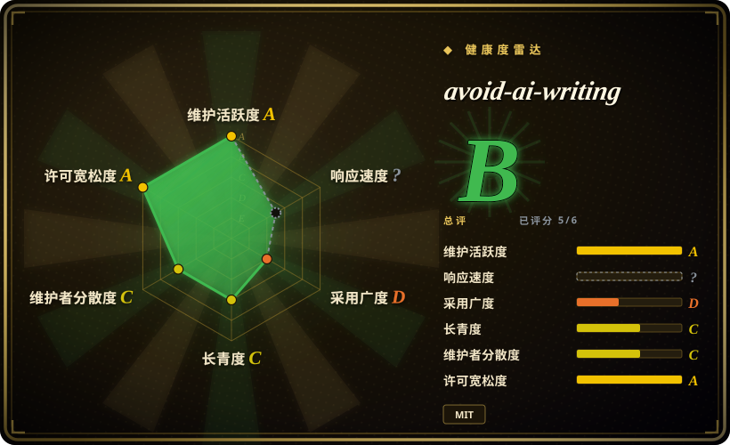
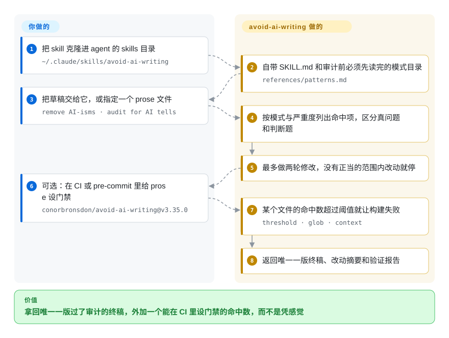

# avoid-ai-writing

一个可移植的去 AI 味写作 skill，自带可运行的检测器、CI 门禁，以及——在这类项目里少见——一份公开的自身误报率测量。

## 何时使用

你要大量编辑英文 prose：产品文档、CHANGELOG、博客草稿、PR 描述，而你已经不再相信自己凭耳朵判断“这段读起来像不像机器写的”。你希望这道清理工序可重复，而且比可重复更进一步：**可核查**——给你一个能塞进 CI 的数字，让某段文字重新滑回宣传腔时构建失败，而不是直接发出去。

这就是它在本叶子里相对其他英文选项的分水岭。[humanizer](humanizer.zh.md) 更宽、更温和，[stop-slop](stop-slop.zh.md) 更短、更硬，但两者都只是指令，没有任何可运行、可打分、可设门禁的东西。avoid-ai-writing 两半都给了：给 agent 用的 `SKILL.md` 加一份约 104 KB 的模式目录，以及一个零依赖的 Node 检测器和 `npx` 入口，GitHub Action 或 pre-commit hook 可以拿它卡构建。当你希望去 AI 味是一道工程工序而不是凭感觉时选它，前提是文本为英文。

## 怎么用起来

它由两半组成，一起发行。指令那一半是 Markdown：`SKILL.md` 定义编辑契约——三种模式（rewrite、detect、edit-in-place）、`--iterate 1|2` 的改稿轮数上限、严重度分级和输出契约——并要求 agent 在动任何文本前先读完 `references/patterns.md`，因为词表分级、模式目录、register 与 voice 配置都在那份文件里。机械那一半是 `detector/`：一个零依赖的 Node 模块，把同一套规则的一个子集变成 0–100 分和一份分类命中清单，通过 `bin/avoid-ai-writing.js` 暴露成 CLI。这个分工才是关键：你决定文本是给谁看的、哪些内容不许改；agent 负责改写和保真检查；检测器负责把“这段变差了”变成构建失败。你要做的事很少——装一次，把草稿或文件交给它，然后决定你是在意分数，还是只在意不回归。

<!-- flow-steps:begin (generated from flows/avoid-ai-writing.json by tools/flow_card.py — do not edit) -->

流程文字版

1. **你**：把 skill 克隆进 agent 的 skills 目录 — `~/.claude/skills/avoid-ai-writing`
2. **avoid-ai-writing**：自带 SKILL.md 和审计前必须先读完的模式目录 — `references/patterns.md`
3. **你**：把草稿交给它，或指定一个 prose 文件 — `remove AI-isms · audit for AI tells`
4. **avoid-ai-writing**：按模式与严重度列出命中项，区分真问题和判断题
5. **avoid-ai-writing**：最多做两轮修改，没有正当的范围内改动就停
6. **你**：可选：在 CI 或 pre-commit 里给 prose 设门禁 — `conorbronsdon/avoid-ai-writing@v3.35.0`
7. **avoid-ai-writing**：某个文件的命中数超过阈值就让构建失败 — `threshold · glob · context`
8. **avoid-ai-writing**：返回唯一一版终稿、改动摘要和验证报告

**价值**：拿回唯一一版过了审计的终稿，外加一个能在 CI 里设门禁的命中数，而不是凭感觉

<!-- flow-steps:end -->

## 何时不用

- **你的文本是中文。** 中文支持目前是上游一个未关闭的 issue（#320，2026-09-21 仍为 open），不是已交付能力。中文优先的场景规则和 protected spans 用 [shuorenhua](shuorenhua.zh.md)，中文清单用 [Humanizer-zh](humanizer-zh.zh.md)；这个 skill 的目录、register 配置和检测器都是英文的。
- **你的问题是“这段到底是人写的还是模型写的”。** 那就不要用它，也不要用本叶子里任何检测器。项目自己的人控语料测出综合分 ROC-AUC 段落级 0.501、文档级 0.623，并明确写出它“无法可靠区分机器文本与人类文本”，还测出作为招牌的词表在人类写作上命中得略多。涉及后果的判断（学术诚信、招聘、署名）应该用来源证据加人工复核。
- **你想要一个粘贴即用、不占上下文的 prompt。** 用 [stop-slop](stop-slop.zh.md)；这个 skill 每次审计前都要求 agent 读完约 104 KB 的目录，在长编辑会话里是实打实的上下文开销。
- **你需要知道改写“更好”，而不只是没改坏事实。** 上游的改写评测只卡保真回归，自己写明不证明语义保真、也没有经过人工确认的写作质量证据。你在意这个区别时，选 [humanizer](humanizer.zh.md) 更温和的 draft→audit 循环加人工编辑，或者干脆不要对这一篇做自动化去 AI 味。
- **你的文体是正式、法律、学术或文学。** 词表规则不区分文体；仓库提供了 tolerance 配置，但没有任何一方测过编辑质量。要自动化就选更谨慎的 [humanizer](humanizer.zh.md)，诚实的默认答案是不自动化。
- **你需要规则慢速、可锁定。** v3.31 → v3.35 只用了九天；任何依赖它的东西都要锁发布 tag（`conorbronsdon/avoid-ai-writing@v3.35.0`）。[推断]

## 横向对比

| 替代品 | 是否收录 | 我们的评价 | 取舍 |
|---|---|---|---|
| [humanizer](humanizer.zh.md) | ✅ | 需要宽泛的英文上游清单、且不需要可运行的打分器时选 humanizer；需要去 AI 味流程产出可设门禁的命中数时选 avoid-ai-writing。 | avoid-ai-writing 多给了 npm 检测器、CI / pre-commit 门禁和公开的误报测量，代价是 agent 要读大得多的目录，而且它那个分数被自家语料评为对作者身份近乎抛硬币。 |
| [stop-slop](stop-slop.zh.md) | ✅ | 想要单文件、硬规则、直接粘进指令时选 stop-slop；想要模式、严重度分级和确定性的可门禁命中数时选 avoid-ai-writing。 | stop-slop 几乎不占上下文、更容易推理；avoid-ai-writing 安装更重、活动部件更多（skill + 检测器 + CI 门禁 + 多份生成副本）。 |
| [shuorenhua](shuorenhua.zh.md) | ✅ | 只要 prose 是中文就选 shuorenhua；avoid-ai-writing 以英文为先，中文支持仍是未关闭的 issue 而不是功能。 | shuorenhua 提供中文场景规则和 protected spans；avoid-ai-writing 提供可量测的英文流水线。 |
| [Humanizer-zh](humanizer-zh.zh.md) | ✅ | Claude Code 里处理简体中文选 Humanizer-zh；avoid-ai-writing 没有可本地化的中文目录。 | Humanizer-zh 是借鉴上游思路的中文清单；avoid-ai-writing 是带检测器的更宽的英文工具链。 |
| [De-AI-Prompt-Enhancer-Writer-Booster-SKILL](de-ai-prompt-enhancer-writer-booster-skill.zh.md) | ✅ | 目标是作者风格复现时选中文 writer-booster 套件；目标是确定性命中项和 CI 约束时选 avoid-ai-writing。 | 那套是中文、面向作者声音、许可证不清；avoid-ai-writing 是 MIT、英文、围绕一个分数做工程化。 |

## 健康度与可持续性

- **维护快照（2026-09-21）：** GitHub 返回 `archived=false`、`pushed_at=2026-09-19T19:04:16Z`，发布节奏接近每周（v3.35.0 于 2026-09-14，v3.31.0 于 2026-09-05）。本地实测 `node scripts/run-tests.js` 20/20 通过，`node scripts/self-scan.js` 能跑起它自己的 CI 自查。
- **治理 / bus factor：** contributors API 列出约 40 人，维护者本人以很大差距居首（首位贡献者 304 条提交；近 12 个月占 0.63），路线图和发布权实际在一个人手里。
- **采用情况：** 2026-09 约 4,586 stars、399 forks；检测器以 `avoid-ai-writing-detector` 3.35.0 发布在 npm，但该包有 0 个依赖仓库、近一月约 1,244 次下载，下游生产使用还很薄。stars 是关注度，不是“改写质量好”的证据。
- **Lindy：** 很年轻——2026-03-06 创建，约半年。这正是 Lindy 先验要打折的画像；让它不至于只是热度的是已交付的测试套件、确定性引擎和自我测量，而不是 star 数。[推断]
- **风险信号：** 公开的误报表出自 v3.22.0，且用的是仓库后来替换掉的预处理路径，未必描述当前引擎；目录里的断言正在被上游做引用审计（#249、#329）；版本 churn 高；同一份 skill 在仓库里有多份生成副本（根目录 `SKILL.md`、`SKILL.full.md`、`dist/`、`plugins/`、`cursor-rules/`），靠脚本和 CI 保持同步。

## 存疑（未验证）

- [未验证] 语料数字（875 个人类段落 / 779 个机器段落；score ≥5 时 FPR 4.2% 对 TPR 7.2%；ROC-AUC 段落级 0.501、文档级 0.623；`tier1` lift 0.9；`em-dash` lift 0.2）读自 `corpus/README.md`，标注版本 v3.22.0 / 2026-07-31，且使用旧的预处理路径。本次没有复现测量，而当前引擎是 v3.35.0。
- [未验证] “改写质量未被验证”是上游 `evals/rewrite/README.md` 自己的说法（不证明语义保真、没有人审过的写作质量证据）；本次没有跑任何改写评测。
- [未验证] 本次没有实测中文行为；上游 issue #320 “Support Chinese” 在 2026-09-21 是 open 且只有一条评论。
- [推断] 半年涨到 4,586 stars 既是质量信号也是热度信号；只把它当关注度看。
- [推断] 模式数与词表条数是上游声称、并由其 CI 对照 `references/patterns.md` 强制的；本次只核实了文件大小和 CI 检查存在，没有重新逐条清点。
- [推断] 高发布频率意味着规则和本页的具体数字会很快漂移；凡是被 CI 依赖的部分都锁发布 tag。
