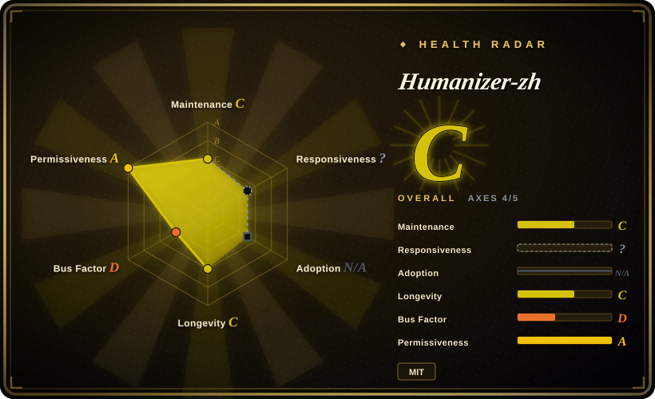
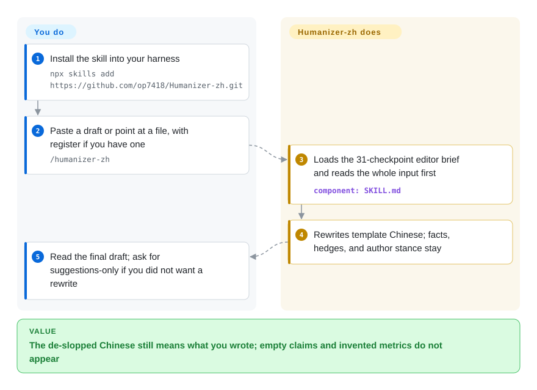

# Humanizer-zh

You de-slopped a Chinese draft and the meaning moved — "可能" became "确定", or the rewrite invented a metric the original never had. Humanizer-zh is an editor skill that strips template Chinese while keeping facts, hedges, and the author's stance.

## When to use

You're a Chinese writer, editor, or marketer who already uses an LLM, and the failure is not leftover slop but a *wrong* cleanup: a product blurb that grew fake numbers, a postmortem that turned "尚未确认" into a cause, or a three-item feature list that got padded or cut because "AI lists come in threes". You want the agent to act as an editor of *existing* prose — comments, articles, docs — not as a detector of who wrote it.

Pick Humanizer-zh when the input is a Chinese paragraph or file and the output should be a final rewrite that may leave clean sentences untouched. The 2026-09-23 rewrite (CHANGELOG: keep facts, numbers, negation, conditions, time, attribution, and author attitude; 31 checkpoints from upstream [humanizer](humanizer.md) v3.0.0 plus PR #39) is the reason to reach for it over a hand-written "去 AI 腔" line. Install is `npx skills add https://github.com/op7418/Humanizer-zh.git`, then `/humanizer-zh`.

Pick it over [shuorenhua](shuorenhua.md) when you want this checklist plus a file-structure check script, and you do not need multi-harness install docs as the product. Pick it over [humanizer](humanizer.md) when the tells are Chinese (长定语、四字格、套话收尾), not English throat-clearing. Pick it over [no-ai-slop](no-ai-slop.md) when the draft is Chinese; that skill's pattern inventory is English-only.

## How it works

There is no rewrite engine — the artifact is `SKILL.md`, a brief the agent reads. Constraint order is explicit: keep information and certainty first, honour the user's scope and register, match author voice, *then* hit expression problems. Pattern matches do not override those. Default delivery is the final draft only: no hit list, no self-score. File mode tells the agent to leave code, commands, paths, link targets, YAML, data, headings, and anchors alone unless you asked to change structure.

You install and paste (or point at a file). The project supplies the 31 checkpoints (A–F: throat-clearing, formula rhythm, puffery, decorative markup, chat residue, Chinese extras), teaching examples that must not invent facts, and `tests/check_structure.py` for a protected-parts diff on Markdown. The README states it cannot prove authorship and cannot promise to pass any AI detector.

<!-- flow-steps:begin (generated from flows/humanizer-zh.json by tools/flow_card.py — do not edit) -->

Text version of the flow

1. **You**: Install the skill into your harness — `npx skills add https://github.com/op7418/Humanizer-zh.git`
2. **You**: Paste a draft or point at a file, with register if you have one — `/humanizer-zh`
3. **Humanizer-zh**: Loads the 31-checkpoint editor brief and reads the whole input first — component: `SKILL.md`
4. **Humanizer-zh**: Rewrites template Chinese; facts, hedges, and author stance stay
5. **You**: Read the final draft; ask for suggestions-only if you did not want a rewrite

**Value**: The de-slopped Chinese still means what you wrote; empty claims and invented metrics do not appear

<!-- flow-steps:end -->

## When NOT to use

- **The draft is English.** Use [humanizer](humanizer.md) or [no-ai-slop](no-ai-slop.md); this rubric and its extra checks (26–31) are Simplified Chinese.
- **You need first-class multi-harness wiring and protected-span machinery.** Use [shuorenhua](shuorenhua.md): it documents Codex / Cursor / ChatGPT paths and treats commands, code, names, and responsibility-bearing spans as a product feature. Humanizer-zh's install docs are Claude Code / `SKILL.md` first.
- **You need a CI-gateable finding count, not a rewrite.** Use [avoid-ai-writing](avoid-ai-writing.md); this skill is advisory prompt text, and its structure script only diffs Markdown parts after an edit.
- **You need it to beat an AI detector.** The README says it cannot prove who wrote the text and does not claim detector evasion.
- **You need brand-voice cloning.** Use a private voice guide or [De-AI-Prompt-Enhancer-Writer-Booster-SKILL](de-ai-prompt-enhancer-writer-booster-skill.md). This skill may borrow habits from a sample you provide, but it forbids copying the sample's experiences, data, or views into the draft.
- **You are betting on release hygiene.** There is still no tagged release; pin a commit. Single-author (`op7418`) localization of [humanizer](humanizer.md).

## Comparison

| Alternative | In index | Our verdict | Tradeoff |
|---|---|---|---|
| [humanizer](humanizer.md) | ✅ | When the prose is English, pick humanizer; when the tells are Chinese template closers, 四字格, and 被字句, pick Humanizer-zh. | humanizer is the v3.0.0 source for A–E; Humanizer-zh adds Chinese checks F and rewrote examples so they stop inventing facts. |
| [shuorenhua](shuorenhua.md) | ✅ | When you need scene-aware Chinese cleanup with documented Codex/Cursor/ChatGPT install and protected spans, pick shuorenhua; when you want the 31-checkpoint editor brief aligned to humanizer v3.0.0 plus a Markdown structure check, pick Humanizer-zh. | shuorenhua is a broader Chinese product-copy toolkit; Humanizer-zh is a thinner Claude-first skill that now also leads with fact/hedge preservation. |
| [no-ai-slop](no-ai-slop.md) | ✅ | When the draft is English and must still sound like its author after the pass, pick no-ai-slop; when the draft is Chinese, pick Humanizer-zh. | no-ai-slop inventories voice and has a detect mode; Humanizer-zh defaults to a final Chinese draft with no hit list. |
| [stop-slop](stop-slop.md) | ✅ | When you want the shortest English hard-rules rubric, pick stop-slop; when mechanical deletion of real three-item lists, dashes, or 排比 would break the Chinese draft, pick Humanizer-zh. | stop-slop is compact and forceful; the 2026-09-23 Humanizer-zh changelog explicitly stops that class of over-edit. |
| Hand-written de-slop line in `CLAUDE.md` | 未收录 | When a few house rules you already maintain are enough, write them yourself; pick Humanizer-zh when you want the 31 checkpoints and the "do not invent metrics" examples. | Inline rules have zero dependency; you then own drift against upstream humanizer. |

## Health & viability

- **Maintenance snapshot (2026-09-23):** GitHub reports `archived=false`, `pushed_at=2026-09-23T02:24:28Z`, default-branch SHA `f4518a8eab97b8bfebc66a89d34320a89bef6930`. Last commit age is **0 days**, so the five-month idle call on the previous page is stale. The scorer still grades maintenance `C` because `active_weeks_13` is 0 — today's burst is not a 13-week cadence. **No tagged release.** Overall radar is `C` over 4 of 5 applicable axes.
- **Adoption snapshot:** GitHub API reports **17,834** stars and 1,167 forks as of 2026-09-23, up from ~11.6k in the 2026-06 page. Treat as attention. Adoption is `N/A` (`no_install_channel`). GitHub now reports `primaryLanguage: Python` because of `tests/check_structure.py`; what you install is still Markdown.
- **License snapshot:** MIT from GitHub metadata and root `LICENSE`; `risk_license` is `A`.
- **Lindy / governance:** created 2026-01-19 (~247 days). Longevity `C`. Governance `D`: one maintainer, 100% share, User-owned (`op7418`). CHANGELOG credits PR #39 / #34 but says this rewrite did not merge those branches.
- **Risk flags:** enforcement is still prompt-level. The 18 short cases and two long-article contrasts are the project's own single-run check (CHANGELOG / `tests/README.md`); they do not publish a pass rate across models. Bus factor remains one person.

## Caveats (unverified)

- [未验证] The 18-case plus two-long-article contrast on 2026-09-23 was not reproduced here; `tests/README.md` says it was a single local run, no cross-model test, and user articles were not published.
- [未验证] `/humanizer-zh` activation and `npx skills add` were not executed in this pass; README is the source.
- [未验证] Whether a given harness honours "default final draft only, no self-score" depends on the model; the skill instructs it.
- [推断] ~17.8k stars on an 8-month User-owned localization is attention, not proof the 31 checkpoints hold on your register.
- [推断] GitHub `language: Python` is the test script, not a runtime you must operate; the selection artifact remains `SKILL.md`.
