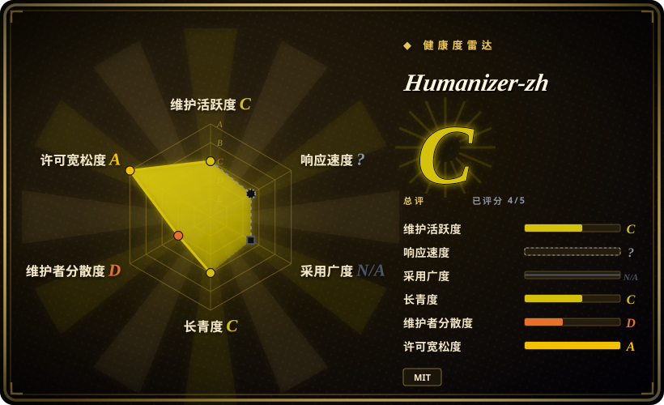
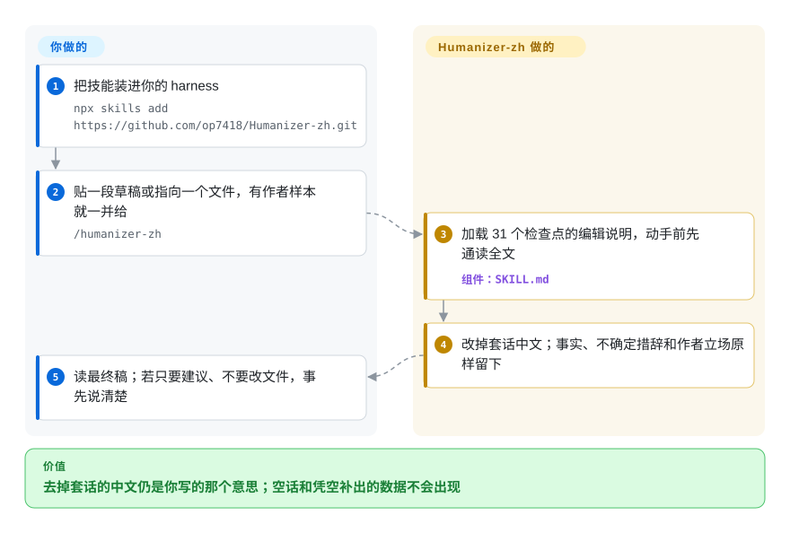

# Humanizer-zh

你把中文稿去了 AI 味，意思却跑了：「可能」变成「确定」，或者润色补出了原文没有的数据。Humanizer-zh 是一份编辑技能：去掉套话和模板腔，同时保住事实、确定程度和作者立场。

## 何时使用

你是已经在用 LLM 的中文写手、编辑或市场人员，失败模式不是稿子里还剩套话，而是**清理把意思改坏了**：产品介绍长出原文没有的数字，复盘把「尚未确认」写成了原因，三项真实功能因为「AI 列表都是三项」被删掉或凑项。你要 agent 当**已有文字**的编辑——评论、文章、文档——而不是去鉴定谁写的。

输入是一段中文或一个文件、输出应是最终改写稿、通顺的句子可以不改时，选 Humanizer-zh。2026-09-23 那次重写（CHANGELOG：保留事实、数字、否定、条件、时间、归因和作者态度；31 个检查点来自上游 [humanizer](humanizer.zh.md) v3.0.0 和 PR #39）是它相对自己在 `CLAUDE.md` 里写一句「去 AI 腔」的理由。安装是 `npx skills add https://github.com/op7418/Humanizer-zh.git`，然后 `/humanizer-zh`。

要这份清单外加 Markdown 结构检查脚本、而不需要把多 harness 安装文档当产品时，选它而不是 [shuorenhua](shuorenhua.zh.md)。痕迹是中文套话收尾、四字格、被字句时，选它而不是 [humanizer](humanizer.zh.md)。草稿是中文时，选它而不是 [no-ai-slop](no-ai-slop.zh.md)——后者的模式清单是英文。

## 怎么用起来

没有改写引擎，产物就是 `SKILL.md`，一份给 agent 读的编辑说明。约束顺序写死了：先保留信息和确定程度，再遵守用户给的范围和文体，再匹配作者声音，**然后**才处理表达问题。模式命中不能压过前面几条。默认只交最终稿：没有命中清单，也没有自评分。文件模式要求 agent 留下代码、命令、路径、链接目标、YAML、数据、标题和锚点，除非你明确要求改结构。

你负责安装和粘贴（或指向文件）。项目提供 31 个检查点（A–F：铺垫、公式节奏、拔高、装饰排版、聊天残留、中文补充）、不得凭空补事实的教学示例，以及用来对 Markdown 受保护部分做 diff 的 `tests/check_structure.py`。README 写明：它不能证明文章由谁撰写，也不保证通过任何 AI 检测器。

<!-- flow-steps:begin (generated from flows/humanizer-zh.json by tools/flow_card.py — do not edit) -->

流程文字版

1. **你**：把技能装进你的 harness — `npx skills add https://github.com/op7418/Humanizer-zh.git`
2. **你**：贴一段草稿或指向一个文件，有作者样本就一并给 — `/humanizer-zh`
3. **Humanizer-zh**：加载 31 个检查点的编辑说明，动手前先通读全文 — 组件：`SKILL.md`
4. **Humanizer-zh**：改掉套话中文；事实、不确定措辞和作者立场原样留下
5. **你**：读最终稿；若只要建议、不要改文件，事先说清楚

**价值**：去掉套话的中文仍是你写的那个意思；空话和凭空补出的数据不会出现

<!-- flow-steps:end -->

## 何时不用

- **草稿是英文。** 用 [humanizer](humanizer.zh.md) 或 [no-ai-slop](no-ai-slop.zh.md)；这份规则和额外检查（26–31）是简体中文。
- **你要一流的多 harness 接线和受保护片段机制。** 用 [shuorenhua](shuorenhua.zh.md)：它写了 Codex / Cursor / ChatGPT 路径，并把命令、代码、名称、责任表述当成产品能力。Humanizer-zh 的安装文档以 Claude Code / `SKILL.md` 为主。
- **你要的是可进 CI 的命中数，不是改写。** 用 [avoid-ai-writing](avoid-ai-writing.zh.md)；本技能是建议层提示词，结构脚本只在改完后对比 Markdown 片段。
- **你要靠它过 AI 检测器。** README 说它不能证明谁写的，也不声称规避检测。
- **你要复现某个品牌或作者的声音。** 用私有 voice guide 或 [De-AI-Prompt-Enhancer-Writer-Booster-SKILL](de-ai-prompt-enhancer-writer-booster-skill.zh.md)。本技能可以借鉴你给的样本习惯，但禁止把样本里的经历、数据或观点搬进原文。
- **你押的是发行卫生。** 仍然没有 tagged release；钉住一次 commit。单作者（`op7418`）对 [humanizer](humanizer.zh.md) 的本地化。

## 横向对比

| 替代品 | 是否收录 | 我们的评价 | 取舍 |
|---|---|---|---|
| [humanizer](humanizer.zh.md) | ✅ | 文稿是英文，选 humanizer；痕迹是中文套话收尾、四字格、被字句，选 Humanizer-zh。 | humanizer 是 A–E 的 v3.0.0 来源；Humanizer-zh 补了中文检查 F，并重写示例，避免凭空补事实。 |
| [shuorenhua](shuorenhua.zh.md) | ✅ | 需要分场景的中文清理、且要把 Codex/Cursor/ChatGPT 安装和受保护片段写成产品时，选 shuorenhua；要与 humanizer v3.0.0 对齐的 31 个检查点，外加 Markdown 结构检查时，选 Humanizer-zh。 | shuorenhua 是更宽的中文产品文案工具；Humanizer-zh 更薄、偏 Claude，但现在同样把保事实和不确定措辞放在最前。 |
| [no-ai-slop](no-ai-slop.zh.md) | ✅ | 草稿是英文、改完还得像作者本人，选 no-ai-slop；草稿是中文，选 Humanizer-zh。 | no-ai-slop 会盘点声音并带 detect 模式；Humanizer-zh 默认只交中文最终稿，没有命中清单。 |
| [stop-slop](stop-slop.zh.md) | ✅ | 只要最短的英文硬规则清单，选 stop-slop；真实的三项列表、破折号或排比不该被机械删掉时，选 Humanizer-zh。 | stop-slop 短而硬；Humanizer-zh 在 2026-09-23 的更新记录里明确停掉这类改过头。 |
| 写在 `CLAUDE.md` 里的自制去味句 | 未收录 | 家里已经维护着几条规则就够用时，自己写；要 31 个检查点和「不许补造指标」的示例时，选 Humanizer-zh。 | 内联规则零依赖；漂移就要你自己跟上游 humanizer 对齐。 |

## 健康度与可持续性

- **维护快照（2026-09-23）：** GitHub 返回 `archived=false`，`pushed_at=2026-09-23T02:24:28Z`，默认分支 SHA `f4518a8eab97b8bfebc66a89d34320a89bef6930`。最近一次提交年龄是 **0 天**，上一版「约五个月无更新」已经过时。评分器仍给维护 `C`，因为 `active_weeks_13` 是 0——今天这一下不等于 13 周节奏。**没有 tagged release。** 总分雷达是 `C`，覆盖 5 个适用轴里的 4 个。
- **采用快照：** GitHub API 在 2026-09-23 返回 **17,834** 个 star、1,167 个 fork，高于 2026-06 页的约 1.16 万。当关注度看。采用轴是 `N/A`（`no_install_channel`）。GitHub 现在把 `primaryLanguage` 报成 Python，是因为 `tests/check_structure.py`；你安装的仍是 Markdown。
- **许可证快照：** GitHub 元数据和根目录 `LICENSE` 均为 MIT；`risk_license` 为 `A`。
- **Lindy / 治理：** 创建于 2026-01-19（约 247 天）。寿命 `C`。治理 `D`：一名维护者、占比 100%，User 所有（`op7418`）。CHANGELOG 致谢 PR #39 / #34，但写明这次修订没有直接合并那些分支。
- **风险信号：** 约束仍在提示词层。18 条短例和两篇长文对照是项目自己的单次检查（CHANGELOG / `tests/README.md`）；没有跨模型通过率。巴士因子仍是一个人。

## 存疑（未验证）

- [未验证] 2026-09-23 的 18 条短例加两篇长文对照此处未复现；`tests/README.md` 写明是本地单次运行、无跨模型测试，用户文章未随仓库发布。
- [未验证] `/humanizer-zh` 激活和 `npx skills add` 本轮未执行；来源是 README。
- [未验证] 某个 harness 是否遵守「默认只交最终稿、不要自评分」，取决于模型；技能只是这样要求。
- [推断] 约 8 个月、User 所有的本地化仓库有约 1.78 万 star，代表关注度，不能证明 31 个检查点在你的文体上成立。
- [推断] GitHub 的 `language: Python` 是测试脚本，不是你必须运维的运行时；选型产物仍是 `SKILL.md`。
