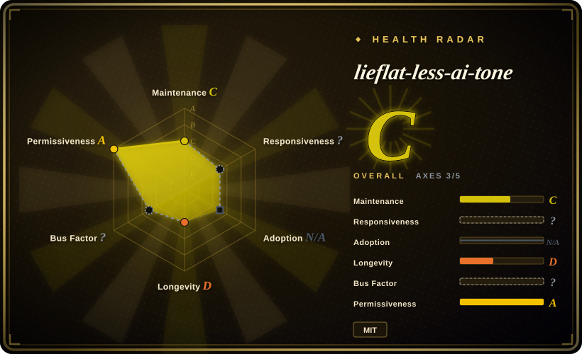
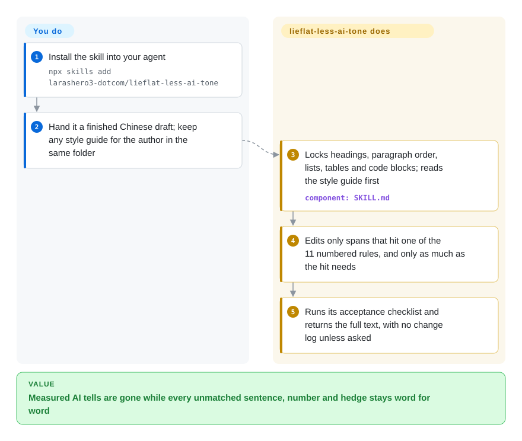

# lieflat-less-ai-tone

You ask an agent to "take the AI tone out" of a Chinese article and it deletes your rhetorical questions, chops sentences to "vary the rhythm", and quietly turns "可能提升" (may improve) into "提升" (improves). This skill replaces that folk checklist with 11 rewrite rules that held up when someone counted them in human and model-written Chinese, and leaves every sentence that matches none of them word for word.

## When to use

You write Chinese long-form — WeChat articles, product essays, newsletters — with Claude, DeepSeek or Kimi doing the first draft, and you run a de-AI pass before publishing. The passes you have tried edit by feel: `真正的壁垒不是技术，而是认知——这一点至关重要。` gets fixed, but so does `难道我们真的需要更多数据吗？`, a metaphor you chose on purpose, and a hedge your legal reviewer insisted on. You want a pass that changes less, and can say why each change is allowed.

Reach for lieflat-less-ai-tone when the deciding property is **restraint backed by measurement**. Each of its 11 rules (antithesis "不是…而是", dense 顿号 enumerations, look-alike adjacent sentences, em dashes, cue colons, numbered 一、二、三 headings, idealized-persona metaphors, summaries that overwrite data already given, 说白了 openers, five translationese constructions, paragraph openers that comment without saying on what) carries a generated-vs-human frequency ratio. It also ships a hard "not a reason to rewrite" table for the popular tells its corpus did not support: sentence-length uniformity, rhetorical questions, metaphor itself, passives, nominalization. Pick it over [Humanizer-zh](humanizer-zh.md) when you would rather miss a tell than have the agent touch an unlisted sentence; Humanizer-zh is the broader 31-checkpoint editor. Pick it over KKKKhazix/human-writing when you want colons and dashes judged by rule rather than banned outright.

## How it works

There is no program in the loop: the product is `SKILL.md`, a whitelist brief the agent reads. Before editing, the agent freezes the article's skeleton (heading levels, paragraph count and order, lists, tables, quotes, code blocks). It then walks the 11 numbered rules; each rule names a trigger marker it can point at, such as "a non-first paragraph opening with 值得注意的是 and no 这/那 pointing back". It changes only the words that marker covers. An information-conservation rule forbids adding names, numbers, dates, quotes or causes, and forbids dropping hedges. The test is that every content word in the output must trace back to the source. If a style document such as a `语言DNA.md` sits in the same folder, it overrides the rules, so an author who really writes with dashes keeps them. The research half is separate and optional: `RESEARCH.md` and three stdlib Python scripts recompute the frequency ratios on a corpus *you* supply. The 2.83-million-character corpus behind the published numbers is not in the repo.

<!-- flow-steps:begin (generated from flows/lieflat-less-ai-tone.json by tools/flow_card.py — do not edit) -->

Text version of the flow

1. **You**: Install the skill into your agent — `npx skills add larashero3-dotcom/lieflat-less-ai-tone`
2. **You**: Hand it a finished Chinese draft; keep any style guide for the author in the same folder
3. **lieflat-less-ai-tone**: Locks headings, paragraph order, lists, tables and code blocks; reads the style guide first — component: `SKILL.md`
4. **lieflat-less-ai-tone**: Edits only spans that hit one of the 11 numbered rules, and only as much as the hit needs
5. **lieflat-less-ai-tone**: Runs its acceptance checklist and returns the full text, with no change log unless asked

**Value**: Measured AI tells are gone while every unmatched sentence, number and hedge stays word for word

<!-- flow-steps:end -->

## When NOT to use

- **You are drafting from scratch, not cleaning a finished draft.** The skill is framed as post-draft cleanup, and issue #1 reports the model announcing that some rules do not apply during creation. For write-and-revise in one skill use KKKKhazix/human-writing (not indexed). For imitating one author, use the same author's writing-dna-skill, which bundles a copy of this rule set.
- **The text is English.** Every rule, trigger list and example is Chinese. Use [humanizer](humanizer.md) for the broad English rubric, or [no-ai-slop](no-ai-slop.md) when voice preservation decides.
- **You want to check the corpus numbers yourself.** The 629-article / 2,826,972-character corpus is withheld for copyright and privacy; the README calls this "a substantive defect". The three scripts only re-run the method on your own corpus. By this pass's reading, roughly half of the 26 tested features have no shipped operator, including passed rules 6 (numbered headings), 7 (persona metaphors), 8 (numeral density) and 9 (说白了). If you need a reproducible corpus, take tangwenwen-md/chinese-de-ai-writing (not indexed). It ships a small validation corpus and its own scanner, but it is a 3-star repo first pushed 2026-09-29.
- **You need a per-document finding list or a CI gate.** The scripts compare two corpus folders and print aggregate rates per thousand characters. They give no line numbers, no score and no exit code. Use [avoid-ai-writing](avoid-ai-writing.md) for English. For Chinese, chinese-de-ai-writing's scanner prints per-line hits.
- **Your model is newer than the study's snapshot.** The per-model numbers are dated (em dashes: DeepSeek 5.16, Claude 4.25, GPT 0.11 per thousand characters). A third-party re-test in issue #4 measured a 2026-09 Claude at 0.1–0.6 em dashes per thousand characters, an order of magnitude lower. Treat the ratios as a prior and re-measure your own model's output with `scripts/compare-human-ai.py` before trusting a rule's weight.
- **The register is medical, legal or otherwise expert.** Issue #4 reports cue colons such as `建议：` and `问题：` are common in human doctors' replies, so rule 5 misfires there. For regulated text, run a suggestions-only pass that a human approves, or skip automated de-AI.
- **You need a log of what changed.** Default output is the full rewritten text with no explanation ("用户问时再说明"). Ask for the change list explicitly, or use [no-ai-slop](no-ai-slop.md)'s detect mode when quoted evidence must come first.

## Comparison

| Alternative | In index | Our verdict | Tradeoff |
|---|---|---|---|
| [Humanizer-zh](humanizer-zh.md) | ✅ | When you want a broad Chinese editor brief that rewrites anything template-sounding, pick Humanizer-zh; when the pass must touch only measured tells and leave all else verbatim, pick lieflat-less-ai-tone. | Humanizer-zh covers more ground (31 checkpoints, a Markdown structure check script); lieflat-less-ai-tone covers 11 rules but publishes a ratio and a "do not change" table for each. |
| [shuorenhua](shuorenhua.md) | ✅ | When the job is Chinese product copy across Codex / Cursor / Claude Code with protected spans for commands and names, pick shuorenhua; when it is long-form articles and you want corpus-backed rules, pick lieflat-less-ai-tone. | shuorenhua is scenario-driven with multi-harness install docs; lieflat-less-ai-tone is one brief with no scenario modes but explicit evidence per rule. |
| KKKKhazix/human-writing | not indexed | When you want one skill to both draft and revise Chinese with a hard ban on colons and dashes, pick human-writing; when you only clean finished drafts and want colons kept where humans use them too, pick lieflat-less-ai-tone. | Not added in this tab batch. human-writing is a creation skill with genre references and a `check_prose.py`; lieflat-less-ai-tone borrows its antithesis rule wording but rejects absolute bans the corpus did not support. |
| tangwenwen-md/chinese-de-ai-writing | not indexed | When you need a Chinese scanner with line-level hits and a corpus you can inspect, pick chinese-de-ai-writing; when you want the original study's rule set as an installable brief, pick lieflat-less-ai-tone. | Not added in this tab batch. It reuses this repo's ratio table and adds evidence grades and validation files, but it was 9 days old with 3 stars on 2026-10-08. |
| [avoid-ai-writing](avoid-ai-writing.md) | ✅ | When the prose is English and the de-AI pass must yield a CI-gateable finding count, pick avoid-ai-writing; for Chinese prose pick lieflat-less-ai-tone. | avoid-ai-writing publishes its own false-positive measurement on a shipped corpus; lieflat-less-ai-tone publishes ratios from a corpus nobody else can see. |

## Health & viability

- **Maintenance (2026-10-08):** 13 commits between 2026-08-20 and 2026-08-24, then nothing for 45 days; no tagged release. The rule set is effectively a frozen snapshot of one study. Of four issues, two got short maintainer replies (#2, #3) and two are unanswered (#1, #4), including the third-party replication data in #4.
- **Governance / bus factor:** User-owned account (`larashero3-dotcom`, display name "lieflat"), 12 of 13 commits by that account. The other commit (by "shiujan") added the Moxt promotion, and the MIT `LICENSE` names "shiujan" as copyright holder. The GitHub contributors API returns an empty list, so the scorer cannot see the commit history either.
- **Backing:** the README says the skill "was created at moxt.ai" and closes with a Moxt product section; the hero image links to MoxtHub. Read it as a vendor showcase written by one author. Whether Moxt keeps it updated is unknown.
- **Age / Lindy:** created 2026-08-20, about 7 weeks old and idle since week one. It gets no Lindy credit.
- **Adoption:** ~2,450 stars and 158 forks in 7 weeks is attention, not proof the rules improve your text. Concrete reuse exists: the author's writing-dna-skill bundles a synced copy (last sync 2026-08-24), and chinese-de-ai-writing builds its baseline on this repo's ratio table.
- **Risk flags:** MIT license. Rule 1 (翻案腔) and rule 9 closely follow KKKKhazix/human-writing (also MIT), credited by a one-line link without that project's license notice. The published numbers cannot be checked independently. Ratio direction is inconsistent across artifacts: the README defines R = generated ÷ human, `compare-human-ai.py` prints human ÷ generated, and SKILL.md rule 2 cites "倍率 0.56" where the README gives 1.8.

## Caveats (unverified)

- [未验证] All corpus statistics (629 articles, 2,826,972 Chinese characters, 26 candidate features, every per-feature and per-model ratio) are author-reported. The corpus is withheld, so they cannot be reproduced here.
- [未验证] The generation setup (five models named claude-opus-4-6, deepseek-v4-pro, gemini-3.1-pro, gpt-5.6-sol and kimi-k3; 60 articles each; no web access; topic-only prompts) is author-reported and could not be checked.
- [推断] "Roughly half of the 26 features have no shipped operator" comes from reading the regexes in the three scripts against the README's feature tables, not from running them on the study corpus. All three scripts were smoke-run on a two-file toy corpus with `python3 -I` and need only the standard library. That run also showed a display bug in `compare-human-ai.py`: a feature at zero on both sides prints ∞ and the verdict "人类明显更多".
- [未验证] Issue #4's re-test numbers (HC3-Chinese, a 2026-09 Claude) are a third party's and were not reproduced here.
- [未验证] `npx skills add larashero3-dotcom/lieflat-less-ai-tone` was not executed in this pass, and whether a given model honours "edit only whitelisted spans" is prompt-level behaviour, not enforced by code.
- [推断] The relationship between the license holder "shiujan" and the repo owner is not stated anywhere. That shiujan's only commit added the Moxt link suggests a colleague at Moxt, but this is unconfirmed.
- [推断] 2,450 stars in seven weeks for a single-author repo with no releases is an attention signal, partly driven by the author's other popular repos; it says nothing about rewrite quality.
- [推断] Issue #3 (a third-party methods critique) argues that human and model texts were produced under different conditions (no web access for models), so a gap such as numeral density may reflect missing source material rather than model style. The README's own limitations section names the unpaired topics but not this confound.
