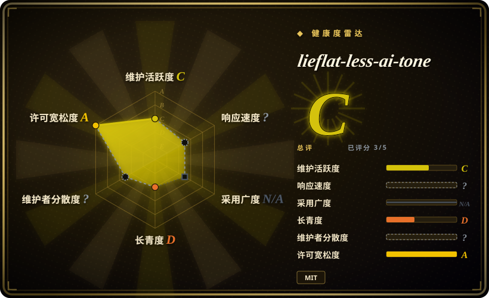
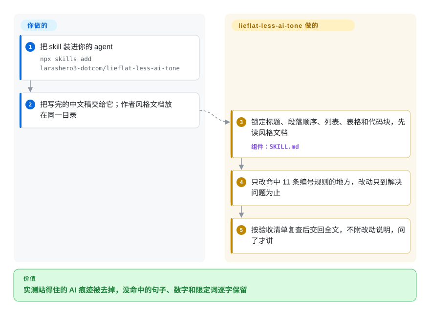

# lieflat-less-ai-tone

让 agent 给一篇中文稿“去 AI 味”，它顺手删了你的反问句，为了“制造节奏”把句子剁碎，还悄悄把“可能提升”改成“提升”。这个 skill 只留 11 条在人类文章和模型文章里实际数过、站得住的改写规则，没命中任何一条的句子一个字都不动。

## 何时使用

你写中文长文，公众号、产品随笔、周报都有，初稿交给 Claude、DeepSeek 或 Kimi，发布前再过一遍去 AI 味。以前试过的做法都凭感觉改：`真正的壁垒不是技术，而是认知——这一点至关重要。` 是该改，可 `难道我们真的需要更多数据吗？`、你特意写的比喻、法务坚持要留的限定词也一并被改掉了。你要的是一遍改得更少、每处改动都说得出依据的清理。

决定性的理由是**克制，而且克制有测量撑着**。它的 11 条规则分别是：“不是……而是”式翻案、顿号密集罗列、相邻句同一骨架、破折号、提示语冒号、“一、二、三”通篇编号的小标题、理想化职业人格的比喻、用概括语盖掉原文已有的数据、“说白了”起手、五种翻译腔、段首评论不交代评论对象。每条都附了模型侧与人类侧的频率倍率。它还有一张硬性的“不作为改写理由”表，列出语料里没站住的流行说法：句长不够参差、反问句、比喻本身、被动句、名词化。如果你宁可漏掉一处 AI 痕迹，也不愿 agent 碰清单外的句子，选它而不是 [Humanizer-zh](humanizer-zh.zh.md)，后者是覆盖更广的 31 个检查点的编辑说明。如果你希望冒号和破折号按规则判断、而不是一律禁用，选它而不是 KKKKhazix/human-writing。

## 怎么用起来

整个流程里没有程序在跑，交付物是 `SKILL.md`，一份白名单式的说明，由 agent 读了照做。动手前，agent 先把文章骨架冻住：标题层级、段落数量和顺序、列表、表格、引用、代码块都不许动。然后逐条过 11 条编号规则。每条都给出能指认的触发标记，比如“非首段以‘值得注意的是’开头，整句没有‘这／那’回指上文”，命中了也只改标记覆盖的那几个字。信息守恒规则禁止新增姓名、数字、日期、引语和因果，也禁止删掉限定词。检验办法是改写后的每个实词都要能在原文里找到出处。如果同一目录里有风格文档（比如 `语言DNA.md`），以它为准，所以本来就爱用破折号的作者不会被删掉破折号。研究这一半是独立的、可选的：`RESEARCH.md` 和三个只用标准库的 Python 脚本，可以在**你自己提供**的语料上重算频率倍率。支撑公开数字的那份 283 万字语料不在仓库里。

<!-- flow-steps:begin (generated from flows/lieflat-less-ai-tone.json by tools/flow_card.py — do not edit) -->

流程文字版

1. **你**：把 skill 装进你的 agent — `npx skills add larashero3-dotcom/lieflat-less-ai-tone`
2. **你**：把写完的中文稿交给它；作者风格文档放在同一目录
3. **lieflat-less-ai-tone**：锁定标题、段落顺序、列表、表格和代码块，先读风格文档 — 组件：`SKILL.md`
4. **lieflat-less-ai-tone**：只改命中 11 条编号规则的地方，改动只到解决问题为止
5. **lieflat-less-ai-tone**：按验收清单复查后交回全文，不附改动说明，问了才讲

**价值**：实测站得住的 AI 痕迹被去掉，没命中的句子、数字和限定词逐字保留

<!-- flow-steps:end -->

## 何时不用

- **你是从零写作，不是清理写完的稿子。** 它的定位是成稿后的清理，issue #1 反映模型在创作时会提示“部分条款不适用”。要一个 skill 同时管写作和改稿，用 KKKKhazix/human-writing（未收录）。要模仿某位作者的文风，用同一作者的 writing-dna-skill，它内置了这套规则的一份副本。
- **文本是英文。** 所有规则、触发词和示例都是中文。英文的通用清单用 [humanizer](humanizer.zh.md)，以保留作者声音为先就用 [no-ai-slop](no-ai-slop.zh.md)。
- **你想自己核对语料数字。** 629 篇、2,826,972 字的语料因版权和隐私没有公开，README 自己说这是“实质性缺陷”。三个脚本只能在你自己的语料上重跑方法。按本次对脚本的阅读，26 个候选特征里大约一半没有随仓库发布的算子，其中包括已收录的第 6 条（编号小标题）、第 7 条（拟人喻体）、第 8 条（数字密度）和第 9 条（说白了）。如果你需要可复现的语料，用 tangwenwen-md/chinese-de-ai-writing（未收录）。它带一份小型验证语料和自己的扫描器，但只有 3 星，2026-09-29 才首次推送。
- **你要逐篇的命中清单或 CI 门禁。** 脚本比较的是两个语料目录，输出的是每千字的汇总频率，没有行号、没有分数、也没有退出码。英文用 [avoid-ai-writing](avoid-ai-writing.zh.md)。中文可以用 chinese-de-ai-writing 的扫描器，它按行列出命中。
- **你用的模型比研究快照新。** 分模型数字有时效（破折号每千字：DeepSeek 5.16、Claude 4.25、GPT 0.11）。issue #4 里有第三方复测：2026-09 版 Claude 每千字只有 0.1–0.6 个破折号，低了一个数量级。把倍率当先验，先用 `scripts/compare-human-ai.py` 在你自己的模型输出上重测，再决定信多少。
- **文体是医疗、法律等专业文本。** issue #4 反映 `建议：`、`问题：` 这类提示语冒号在真人医生的回复里很常见，第 5 条会误伤。受监管的文本只让它出建议、由人确认，或者干脆不做自动去 AI 味。
- **你需要改动记录。** 默认只交回改写后的全文，不解释改了什么（“用户问时再说明”）。要么明确要求列出改动，要么在必须先看引证的场合用 [no-ai-slop](no-ai-slop.zh.md) 的 detect 模式。

## 横向对比

| 替代品 | 是否收录 | 我们的评价 | 取舍 |
|---|---|---|---|
| [Humanizer-zh](humanizer-zh.zh.md) | ✅ | 想要一份覆盖面广、凡是套话都改的中文编辑说明，选 Humanizer-zh；要求只碰实测站得住的痕迹、其余逐字保留，选 lieflat-less-ai-tone。 | Humanizer-zh 覆盖更多（31 个检查点，附 Markdown 结构检查脚本）；lieflat-less-ai-tone 只有 11 条，但每条都公开倍率和“不改”表。 |
| [shuorenhua](shuorenhua.zh.md) | ✅ | 任务是跨 Codex、Cursor、Claude Code 的中文产品文案，并且要保护命令和名称，选 shuorenhua；任务是长文、想要有语料依据的规则，选 lieflat-less-ai-tone。 | shuorenhua 按场景组织、带多 harness 安装文档；lieflat-less-ai-tone 是单份说明，没有场景模式，但每条规则都有证据。 |
| KKKKhazix/human-writing | 未收录 | 想用一个 skill 同时写稿和改稿、并且一律禁用冒号和破折号，选 human-writing；只清理成稿、希望人类也常用的冒号得以保留，选 lieflat-less-ai-tone。 | 本批未收录。human-writing 是创作型 skill，带体裁参考和 `check_prose.py`；lieflat-less-ai-tone 借用了它的翻案腔条文，但拒绝语料不支持的一刀切禁令。 |
| tangwenwen-md/chinese-de-ai-writing | 未收录 | 需要能按行报命中、语料可查的中文扫描器，选 chinese-de-ai-writing；想直接装上原研究的规则集，选 lieflat-less-ai-tone。 | 本批未收录。它复用了本仓库的倍率表，加了证据分级和验证文件，但截至 2026-10-08 仅创建 9 天、3 星。 |
| [avoid-ai-writing](avoid-ai-writing.zh.md) | ✅ | 文本是英文、去 AI 味流程要产出可卡 CI 的命中数，选 avoid-ai-writing；中文文本选 lieflat-less-ai-tone。 | avoid-ai-writing 在随仓库发布的语料上公开了自己的误报率；lieflat-less-ai-tone 公布的倍率来自外人看不到的语料。 |

## 健康度与可持续性

- **维护（2026-10-08）：** 2026-08-20 到 2026-08-24 之间 13 次提交，此后 45 天没有动静；没有打过 release。这套规则实际上是一次研究的冻结快照。4 个 issue 里两个得到维护者的简短回复（#2、#3），两个没人回（#1、#4），#4 里还有第三方复测数据。
- **治理与巴士系数：** 个人账号（`larashero3-dotcom`，显示名 “lieflat”），13 次提交里 12 次出自该账号。另一次提交出自 “shiujan”，内容是加上 Moxt 推广，MIT `LICENSE` 上的版权人也写的是 “shiujan”。GitHub contributors API 返回空列表，评分器同样看不到提交历史。
- **背后支持：** README 说这个 skill “在 moxt.ai 上创建”，结尾有一节 Moxt 产品介绍，头图也链到 MoxtHub。把它当作单人撰写的厂商展示仓库来看。Moxt 会不会继续更新它，目前不得而知。
- **年龄与 Lindy：** 2026-08-20 创建，约 7 周，第一周之后就没再更新。谈不上 Lindy 加成。
- **采用度：** 7 周约 2,450 星、158 个 fork，这是关注度，不能证明规则能改好你的文本。确实有具体复用：作者的 writing-dna-skill 内置了一份同步副本（最后同步 2026-08-24），chinese-de-ai-writing 也以本仓库的倍率表作基线。
- **风险信号：** MIT 许可。第 1 条（翻案腔）和第 9 条的条文与 KKKKhazix/human-writing（同为 MIT）高度相似，只用一行链接致谢，没有附上那边的许可声明。公开的数字无法独立核对。各文件里的倍率方向不一致：README 定义 R = 模型 ÷ 人类，`compare-human-ai.py` 打印的是人类 ÷ 模型，SKILL.md 第 2 条写“倍率 0.56”，README 给的却是 1.8。

## 存疑（未验证）

- [未验证] 所有语料统计（629 篇、2,826,972 汉字、26 个候选特征、每个特征和每个模型的倍率）都是作者自报。语料没有公开，本次无法复现。
- [未验证] 生成设置（五个模型 claude-opus-4-6、deepseek-v4-pro、gemini-3.1-pro、gpt-5.6-sol、kimi-k3，各 60 篇，不联网，只给话题）是作者自报，无法核对。
- [推断] “26 个特征里约一半没有随仓库发布的算子”是把三个脚本里的正则和 README 的特征表对照读出来的，没有在研究语料上实际运行。三个脚本都用 `python3 -I` 在两个文件的玩具语料上试跑过，只依赖标准库。试跑还发现 `compare-human-ai.py` 的一个显示问题：两边都为零的特征会显示 ∞，判读写成“人类明显更多”。
- [未验证] issue #4 的复测数字（HC3-Chinese、2026-09 版 Claude）来自第三方，本次没有复现。
- [未验证] 本次没有实际执行 `npx skills add larashero3-dotcom/lieflat-less-ai-tone`。模型是否真的“只改白名单命中处”取决于提示词约束，没有代码强制。
- [推断] 版权人 “shiujan” 与仓库所有者的关系没有任何地方说明。shiujan 唯一一次提交是加 Moxt 链接，看起来像 Moxt 的同事，但未经确认。
- [推断] 单人、无 release 的仓库 7 周拿到 2,450 星是关注度信号，部分来自作者其他热门仓库的带动，和改写质量无关。
- [推断] issue #3（第三方方法评论）指出，人类文章和模型文章的生产条件不同（模型不联网），所以像数字密度这样的差距可能来自缺材料，而不是模型文风。README 的局限一节提到了话题不严格配对，但没提这个混杂因素。
