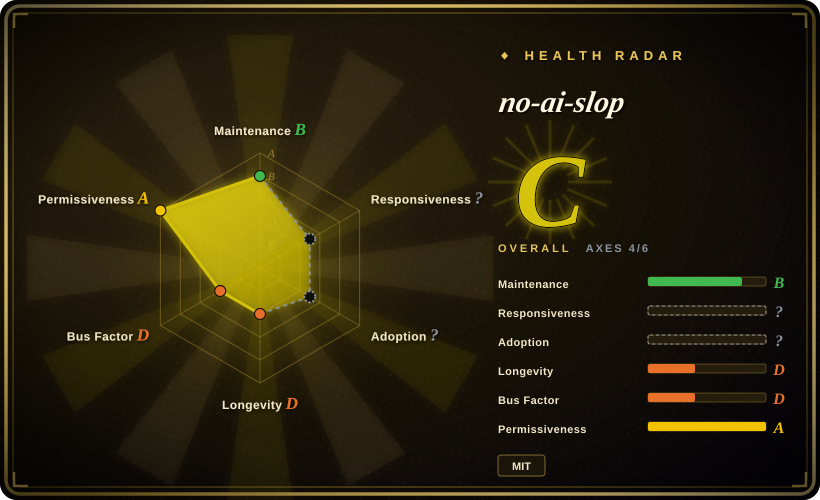
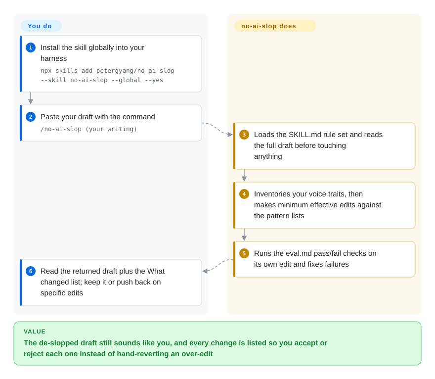

# no-ai-slop

Your agent's de-slop pass strips the "It's not X. It's Y." lines but also flattens the cadence, bluntness, and digressions that made the draft yours — no-ai-slop is an editor skill whose first rule is to inventory and preserve the writer's voice, then make the minimum effective edit against 20+ named AI patterns, with a detect mode that quotes each hit as evidence instead of guessing authorship.

## When to use

You hand your own draft to a coding agent for an editing pass and the outcome you fear is not missed slop but a homogenized rewrite — this skill's editing principles open by cataloguing the writer's vocabulary, cadence, humor, and uncertainty and forbid rewriting distinctive lines "merely for consistency". Reach for it when the draft must still sound like you after the pass.

It also fits when you need **evidence-based slop detection**: `/no-ai-slop is this slop?` returns each named pattern with the quoted line and a short fix, explicitly refusing to score the draft or claim AI authorship — useful when you want checkable findings rather than an AI-detector verdict.

Install paths are first-class (`npx skills add petergyang/no-ai-slop --skill no-ai-slop --global --yes`, plus a ChatGPT/Codex plugin channel via `.codex-plugin/`), so it fits harnesses beyond Claude Code.

## How it works

The skill is a single `SKILL.md` rule set with two jobs. **Edit** (default): the agent reads the full draft, identifies the core point and the voice traits to preserve, makes minimum effective edits against the pattern list (binary contrasts, throat-clearing openers, faux-insight setups, colon reveals, importance puffery, weasel attribution, synonym cycling, fake-profound kickers, plus a banned-word and filler-phrase list), then runs itself through `eval.md` — a pass/fail checklist of ~30 checks covering voice preservation, pattern removal, and a final read-aloud test — and returns the full edited draft plus a short **What changed** section. **Detect**: no rewriting; each pattern found is named with a quoted line and a few-word fix, and the skill states up front that AI detectors guess while named patterns are evidence the user can check.

<!-- flow-steps:begin (generated from flows/no-ai-slop.json by tools/flow_card.py — do not edit) -->

Text version of the flow

1. **You**: Install the skill globally into your harness — `npx skills add petergyang/no-ai-slop --skill no-ai-slop --global --yes`
2. **You**: Paste your draft with the command — `/no-ai-slop (your writing)`
3. **no-ai-slop**: Loads the SKILL.md rule set and reads the full draft before touching anything
4. **no-ai-slop**: Inventories your voice traits, then makes minimum effective edits against the pattern lists
5. **no-ai-slop**: Runs the eval.md pass/fail checks on its own edit and fixes failures
6. **You**: Read the returned draft plus the What changed list; keep it or push back on specific edits

**Value**: The de-slopped draft still sounds like you, and every change is listed so you accept or reject each one instead of hand-reverting an over-edit

<!-- flow-steps:end -->

## When NOT to use

- **Your prose is Chinese.** Every pattern, banned word, and filler phrase in `SKILL.md` is English-language material; use [shuorenhua](shuorenhua.md) or [Humanizer-zh](humanizer-zh.md), which handle Chinese-specific tells.
- **You need a deterministic, CI-gateable finding count.** The eval here is an LLM running a checklist on itself, not a program; [avoid-ai-writing](avoid-ai-writing.md) ships a zero-dependency npm detector and a pre-commit/CI gate on hit counts.
- **You want the shortest rubric to paste into your own instructions.** [stop-slop](stop-slop.md) is far smaller; this skill's principles + words + patterns + eval form a long prompt that costs context every editing turn.
- **You need plugin-marketplace packaging as a hard requirement.** Upstream documents skills.sh and a ChatGPT plugin channel, but if your harness only loads Claude plugin packages, [humanizer](humanizer.md) documents those install paths explicitly.
- **You are betting on a stable standard.** The rule set is one author's editorial taste in a 2.5-month-old repo; pin the commit you reviewed.

## Comparison

| Alternative | In index | Our verdict | Tradeoff |
|---|---|---|---|
| [humanizer](humanizer.md) | ✅ | Choose humanizer for a broader English upstream skill with explicit false-positive guidance and Claude plugin install paths; choose no-ai-slop when voice preservation is the priority or you need the detect-only mode. | humanizer rewrites toward "human" generically; no-ai-slop inventories and protects *your* voice traits first, and its detect mode returns quoted evidence instead of a rewrite. |
| [stop-slop](stop-slop.md) | ✅ | Choose stop-slop for a compact hard-rules rubric you paste in one read; choose no-ai-slop for a two-job skill (edit + detect) with a self-check eval loop. | stop-slop is stricter and cheaper but has no detect mode and no eval pass; no-ai-slop is a longer prompt that explicitly protects voice over uniform polish. |
| [avoid-ai-writing](avoid-ai-writing.md) | ✅ | Choose avoid-ai-writing when the de-AI pass must produce a machine-verifiable finding count for CI; choose no-ai-slop for a conversational editing pass inside an agent session. | avoid-ai-writing is deterministic and gateable but heavier to install; no-ai-slop needs no pipeline yet its checks are only as good as the model running them. |
| [Humanizer-zh](humanizer-zh.md) | ✅ | Choose Humanizer-zh for Simplified Chinese prose; no-ai-slop's pattern inventory is English-only. | Chinese AI tells (四字格堆砌、翻译腔) are outside no-ai-slop's material. |
| [shuorenhua](shuorenhua.md) | ✅ | Choose shuorenhua for Chinese engineering/product writing with protected spans and fact preservation rules. | shuorenhua is scenario-aware for Chinese contexts; no-ai-slop has no protected-span machinery. |

## Health & viability

- **Maintenance snapshot (2026-09-22):** GitHub reports `archived=false`, last push 2026-09-02, 23 commits total since creation 2026-07-07; the repo is active but its history is weeks, not years.
- **Bus factor:** 22 of 23 commits are the single author (petergyang); one additional contributor. The rule set is one person's editorial judgment.
- **Adoption snapshot:** ~11,010 stars and 745 forks as of 2026-09 on a 2.5-month-old repo — attention velocity this high on a young repo is a durability unknown, not a Lindy signal.
- **Backing:** individual creator (Peter Yang, creatoreconomy.so); the README funnels to his paid Behind the Craft skill bundle — the repo is MIT and self-contained, but roadmap incentives are tied to a personal brand.
- **Risk flags:** none on license (MIT verified from GitHub metadata and the root `LICENSE`); main risks are single-maintainer churn and pattern-list drift with the author's taste.

## Caveats (unverified)

- [未验证] ChatGPT plugin availability ("also available as a plugin in ChatGPT") is the README's claim; this pass did not check the ChatGPT marketplace listing.
- [推断] The "20+ patterns" count is upstream's own rounding: this pass counted ~19 named pattern groups in `SKILL.md` plus separate banned-word and filler-phrase lists.
- [推断] Whether the editing model actually executes the `eval.md` self-check each turn depends on the harness and model; the skill instructs it, but compliance is not guaranteed behavior.
