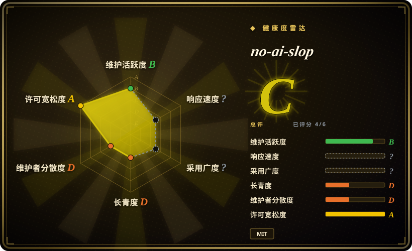
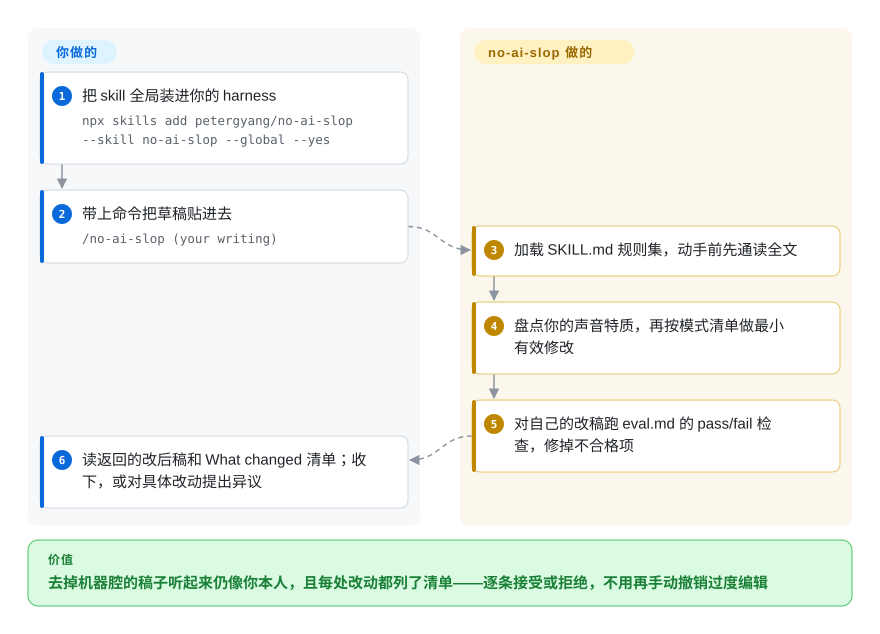

# no-ai-slop

让 agent 改稿，AI 腔是没了，但你的节奏、狠话和跑题也没了？no-ai-slop 是一个编辑 skill：第一条规则就是盘点并保留作者本人的声音，然后按 20 多种具名 AI 模式做最小有效修改；另有 detect 模式只引用每处命中的原文当证据，不猜这篇文章是不是 AI 写的。

## 何时使用

你把自己的草稿交给 coding agent 做编辑，真正怕的不是漏掉机器腔，而是被改成一滩均质的「 polished 」文——这个 skill 的编辑原则第一步就清点作者的词汇、节奏、幽默和不确定性，并禁止「只为一致性」重写有个人印记的句子。草稿改完还得像你本人写的，选它。

它也适合需要**有证据的 slop 检测**的场景：`/no-ai-slop is this slop?` 对每个命中的模式给出具名、引用原句和几个字的修法，明确拒绝给草稿打分或断言 AI 作者——要的是可核对的发现，不是 AI 检测器的判决时用它。

安装路径是一等公民（`npx skills add petergyang/no-ai-slop --skill no-ai-slop --global --yes`，另有经 `.codex-plugin/` 的 ChatGPT／Codex 插件通道），不止 Claude Code 可用。

## 怎么用起来

这个 skill 是一份单文件 `SKILL.md` 规则集，两个 job。**Edit**（默认）：agent 通读全文，识别核心观点和要保留的声音特质，按模式清单（二元对比、清嗓子开头、伪洞察铺垫、冒号揭示、重要性吹捧、含糊归因、同义词轮换、假深刻结尾，外加禁词表和空话短语表）做最小有效修改，然后自己过一遍 `eval.md`——约 30 条 pass/fail 检查，覆盖声音保留、模式清除和终读测试——最后返回完整改后稿加一段简短的 **What changed**。**Detect**：不重写；每个命中的模式具名、引用原句、给几个字的修法，skill 开头就写明 AI 检测器是在猜，而具名模式是用户可以核对的证据。

<!-- flow-steps:begin (generated from flows/no-ai-slop.json by tools/flow_card.py — do not edit) -->

流程文字版

1. **你**：把 skill 全局装进你的 harness — `npx skills add petergyang/no-ai-slop --skill no-ai-slop --global --yes`
2. **你**：带上命令把草稿贴进去 — `/no-ai-slop (your writing)`
3. **no-ai-slop**：加载 SKILL.md 规则集，动手前先通读全文
4. **no-ai-slop**：盘点你的声音特质，再按模式清单做最小有效修改
5. **no-ai-slop**：对自己的改稿跑 eval.md 的 pass/fail 检查，修掉不合格项
6. **你**：读返回的改后稿和 What changed 清单；收下，或对具体改动提出异议

**价值**：去掉机器腔的稿子听起来仍像你本人，且每处改动都列了清单——逐条接受或拒绝，不用再手动撤销过度编辑

<!-- flow-steps:end -->

## 何时不用

- **你的文本是中文。** `SKILL.md` 里的模式、禁词、空话短语全是英文语料；用 [shuorenhua](shuorenhua.zh.md) 或 [Humanizer-zh](humanizer-zh.zh.md)，它们处理中文特有的痕迹。
- **你要确定性的、能卡 CI 的命中数。** 这里的 eval 是 LLM 对自己跑检查单，不是程序；[avoid-ai-writing](avoid-ai-writing.zh.md) 自带零依赖 npm 检测器和基于命中数的 pre-commit／CI 门禁。
- **你只想要最短的规则集粘进自己的指令。** [stop-slop](stop-slop.zh.md) 小得多；本 skill 的原则＋词表＋模式＋eval 是一份长 prompt，每个编辑回合都吃上下文。
- **插件市场打包是硬要求。** 上游文档写了 skills.sh 和 ChatGPT 插件通道，但你的 harness 只认 Claude plugin 包时，[humanizer](humanizer.zh.md) 明确写了那些安装路径。
- **你在赌一个稳定标准。** 规则集是单一作者的个人编辑口味，仓库才两个半月大；把你审查过的 commit 钉住。

## 横向对比

| 替代品 | 是否收录 | 我们的评价 | 取舍 |
|---|---|---|---|
| [humanizer](humanizer.zh.md) | ✅ | 要更宽的英文上游 skill、误报处理和 Claude 插件安装路径选 humanizer；声音保留优先、或需要 detect-only 模式选 no-ai-slop。 | humanizer 泛化地把文改「像人」；no-ai-slop 先清点并保护「你的」声音特质，detect 模式回引用证据而不是直接重写。 |
| [stop-slop](stop-slop.zh.md) | ✅ | 要一份一次读完就能粘贴的硬规则选 stop-slop；要 edit＋detect 双 job 加自检 eval 闭环选 no-ai-slop。 | stop-slop 更严更省但没有 detect 模式和 eval 过检；no-ai-slop 是更长的 prompt，明确以声音保护优先于均质打磨。 |
| [avoid-ai-writing](avoid-ai-writing.zh.md) | ✅ | 去 AI 味必须产出机器可验证的命中数卡 CI 选 avoid-ai-writing；要在 agent 会话里对话式过一遍选 no-ai-slop。 | avoid-ai-writing 确定性强、可设门禁但安装更重；no-ai-slop 不需要流水线，但检查质量上限就是跑它的那个模型。 |
| [Humanizer-zh](humanizer-zh.zh.md) | ✅ | 简体中文文本选 Humanizer-zh；no-ai-slop 的模式清单只覆盖英文。 | 中文 AI 痕迹（四字格堆砌、翻译腔）不在 no-ai-slop 的材料里。 |
| [shuorenhua](shuorenhua.zh.md) | ✅ | 中文工程／产品写作、要保护片段和事实保留规则选 shuorenhua。 | shuorenhua 对中文场景有感知；no-ai-slop 没有保护片段机制。 |

## 健康度与可持续性

- **维护快照（2026-09-22）：** GitHub 显示 `archived=false`，最近推送 2026-09-02，2026-07-07 建仓至今共 23 个 commit；活跃，但历史以周计而不是年计。
- **Bus factor：** 23 个 commit 里 22 个来自单一作者（petergyang），外加一位贡献者；规则集是一个人的编辑判断。
- **采用快照：** 截至 2026-09 约 11,010 stars、745 forks——建仓两个半月就到这个量级，关注度的爆发是续航能力的未知数，不是 Lindy 信号。
- **背书：** 个人创作者（Peter Yang，creatoreconomy.so）；README 导流其付费的 Behind the Craft skill 捆绑包——仓库本身 MIT 且自包含，但路线图激励系于个人品牌。
- **风险标记：** 许可无风险（MIT，经 GitHub 元数据与根 `LICENSE` 核实）；主要风险是单维护者漂移和模式清单随作者口味变动。

## 存疑（未验证）

- [未验证] ChatGPT 插件可用性（「also available as a plugin in ChatGPT」）是 README 的自述；本轮未核对 ChatGPT 市场条目。
- [推断] 「20+ 模式」是上游自己的约整说法：本轮在 `SKILL.md` 里数到约 19 组具名模式，另有独立的禁词表和空话短语表。
- [推断] 编辑模型是否每回合真的执行 `eval.md` 自检，取决于 harness 和模型；skill 有此指令，但依从性不是有保证的行为。
