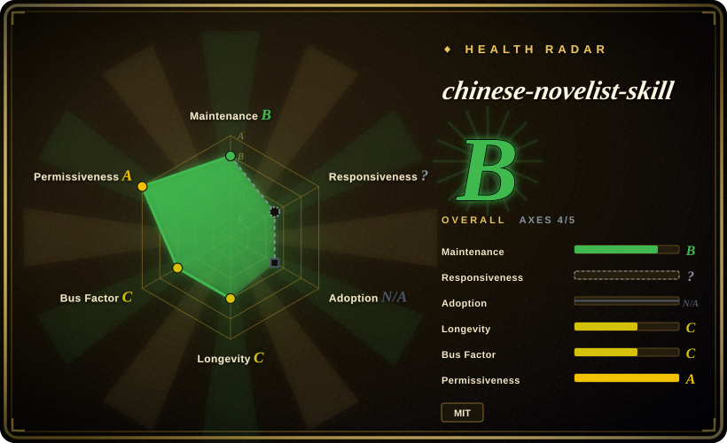

# chinese-novelist-skill

A pure prompt-and-reference skill pack that walks a coding agent through Q&A → outline → chapter-by-chapter drafting of a 10–50 chapter Chinese novel, with cross-session preference memory, resume-after-interruption, and a word-count validation loop.

## When to use

You're writing Chinese web fiction and already work inside a `SKILL.md`-capable coding agent (Claude Code, Codex, OpenCode, and similar). You don't want one more "write me a novel" prompt that forgets the story after five chapters — you want a repeatable pipeline: a three-layer Q&A that pins genre, protagonist, and core conflict, a generated outline, character file, and machine-readable writing plan, then a per-chapter loop (write → polish → word-count check) that ends with a completeness pass. Install it with `npx skills add PenglongHuang/chinese-novelist-skill` and invoke the `chinese-novelist` skill.

Pick this over [Webnovel Writer](webnovel-writer.md) when what you want is a **lightweight MIT prompt pack with no runtime** — no Python CLI, no SQLite/RAG state, no Claude Code plugin contract — and you accept trading away Webnovel Writer's queryable continuity system for a folder of Markdown flows and guides any skill-capable agent can follow. The pack keeps continuity through a setting dictionary, per-chapter summaries in the outline, and a `03-文风基准.md` style anchor; that is prompt discipline, not indexed retrieval. The deciding tradeoff is **install simplicity and model/harness portability vs. the heavier state machine** a long serial eventually needs.

## When NOT to use

- **You need continuity that survives dozens of chapters and can be queried or audited.** Use [Webnovel Writer](webnovel-writer.md) instead, because it maintains explicit story contracts plus a searchable index, while this pack relies on outline summaries the agent must re-read every chapter — and its own issue tracker carries reports of repeated paragraph blocks (`#31`, `#25`), loops (`#32`), and broken resume (`#22`).
- **Your task is non-fiction or article production with a fact-check gate.** Use [writing-agent](../content-production/writing-agent.md) instead; this pack is a fiction generator with no evidence ledger, citation step, or factual gate.
- **You want a broad multi-task skill bundle, not a single-purpose novel generator.** Use [Baoyu Skills](../content-production/baoyu-skills.md) or [huashu-skills](../content-production/huashu-skills.md) instead; they cover translation, formatting, images, and publishing alongside writing, while this pack only produces a novel project folder.
- **Prose de-AI-ing is a separate, reusable step you run on arbitrary text.** Use a dedicated de-AI skill such as [Humanizer-zh](../de-ai-writing/humanizer-zh.md) instead; here the "remove AI flavor" pass is a bullet list baked into the chapter flow, with no standalone rewriting entry point.
- **You are not inside a skill-capable coding agent, or you write in a language other than Chinese.** Use a standalone desktop editor such as novelWriter (not indexed) or a plain chat workflow instead; this pack has no runtime of its own and its prompts, templates, and examples are Chinese-first.

## Comparison

| Alternative | In index | Our verdict | Tradeoff |
|---|---|---|---|
| [Webnovel Writer](webnovel-writer.md) | ✅ | Choose chinese-novelist-skill when you want a zero-runtime, MIT, harness-portable prompt pack; choose Webnovel Writer when a long serial needs queryable continuity state and review gates. | The light pack installs anywhere and stays readable/editable, but gives up retrieval, chapter commits, and an audit trail — its continuity is only as good as the agent's outline re-reads. |
| [writing-agent](../content-production/writing-agent.md) | ✅ | Choose chinese-novelist-skill for fiction chapters with hooks and character consistency; choose writing-agent when the deliverable is a fact-checked Chinese article with an evidence ledger. | Fiction vs. non-fiction: the pack optimizes suspense, dialogue ratio, and 3000–5000-character chapters; writing-agent optimizes sourced claims and de-AI editorial gates. |
| [Baoyu Skills](../content-production/baoyu-skills.md) | ✅ | Choose chinese-novelist-skill when the whole job is a chaptered novel; choose Baoyu Skills when you need a general Chinese content/formatting toolbox and will assemble the novel flow yourself. | Narrow and opinionated vs. broad and composable: the pack gives a ready chapter pipeline, Baoyu gives many smaller skills with no novel-specific state. |
| [huashu-skills](../content-production/huashu-skills.md) | ✅ | Choose chinese-novelist-skill for a focused, permissively licensed novel generator; choose huashu-skills only if you accept its license ambiguity and want an all-in-one creator toolkit. | License clarity and scope: MIT and one job here, vs. NOASSERTION and a wider but heavier skill set there. |
| novelWriter | not indexed | Choose novelWriter when you want a standalone, cross-platform desktop app to write and organize a novel with no LLM involved; choose chinese-novelist-skill when an agent should generate the draft. | Local editor control and no model cost vs. automated drafting that depends on your agent, model budget, and context window. |

## Health & viability

- **Maintenance (2026-09-19):** active and unarchived; the default branch was last pushed 2026-09-06. History is short — created 2026-01-25, about eight months old — with 38 commits. There are **zero GitHub releases**; the README's "v2.0" refers to a merged pull request, and the only git tag is `v1.0`.
- **Governance / bus factor:** effectively one person. The contributor API shows `PenglongHuang` (36 commits) plus `Aziteee` (2); the project is donation-funded (爱发电), with no foundation or vendor behind the roadmap. [推断]
- **Age / Lindy:** 3.1k stars and 451 forks in under a year is attention, not survival. Per the index's Lindy prior, treat the fast star growth as hype risk until the project keeps shipping across several years.
- **Adoption signal:** 451 forks indicate people are copying and adapting it, but a fork is intent, not production use; no dependents or downstream ecosystem were verified.
- **Risk flags:** the MIT `LICENSE` was added only on 2026-09-06, so the project spent most of its life without an explicit license. Open issues describe repeated content (`#31`, `#25`), uncontrolled style (`#30`), loops (`#32`), and resume failures (`#22`) — quality reports that undercut the README's "automatic validation" framing.

## Caveats (unverified)

- [推断] The open issues above predate or span the v2 rewrite; they are used as directional quality evidence, not a measured failure rate of the current flow.
- [未验证] Whether the per-chapter "coherence check" is effective is not reproduced here; source inspection shows Phase 4's automated validation and rewrite loop is word-count-gated only, while coherence is a manual instruction inside Phase 3.
- [未验证] The claim of compatibility with "mainstream coding agents" is taken from the README; only the `npx skills add` install path was verified, not behavior across each named harness.
- [未验证] Actual prose quality, repetition rate, and whether 3000–5000-character chapters stay on-outline were not tested in this review; no independent benchmark was found.
- [未验证] There is no package-registry footprint (it is a Markdown skill, not a published library), so adoption is inferred from stars and forks alone.
