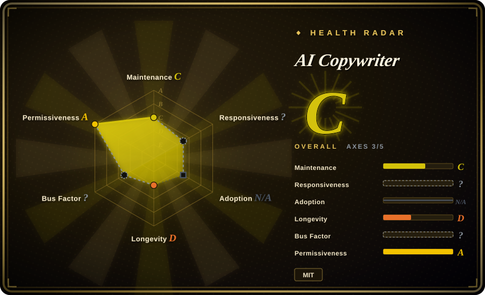
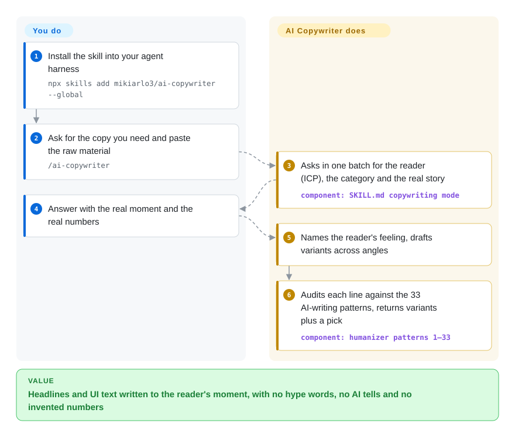

# AI Copywriter

Ask a model for a headline and you get "Unlock the Ultimate Guide to Revolutionize Your Workflow"; ask it to tone that down and you get something nobody clicks. AI Copywriter is a single Markdown skill that makes the agent first ask you who the reader is and what really happened, then write short copy from that and scrub it against 33 known AI-writing tells before you see it.

## When to use

You are a founder or product engineer who writes your own launch copy with a coding agent: the blog-post title, the 155-character meta description, the empty state and error message on a new screen, the email subject line, the LinkedIn post about last quarter. What comes back is "🚀 Introducing CaseNotes: The Ultimate Game-Changing Solution…", and when you ask for less hype it turns into a line so flat it says nothing. You want the agent to behave like a copywriter who interrupts you first ("who exactly is this for, and what would they type into a search box at 11pm?") and refuses to invent the $40,000 number that would make the headline work.

Reach for AI Copywriter when the job is **short, conversion-facing copy plus the humanizing pass in one skill**. Over its upstream [humanizer](../de-ai-writing/humanizer.md), it adds the writing direction: an intake that asks for the ICP (ideal customer profile — who the copy is for), the category and the story in one batch, 5–10 title variants across angles with a pick justified by the reader's feeling, and per-format rules for microcopy, subject lines, LinkedIn posts and "strategic" founder blog posts. Over the broad [marketingskills](marketingskills.md) pack, it is one file you can read end to end (544 lines) with the anti-slop audit built into every line it writes, rather than 50 marketing skills that assume a shared product-marketing context file.

## How it works

There is no program: the whole product is `SKILL.md`, an instruction document the agent loads when you invoke it. For a copy request it switches to "copywriting mode": before drafting, it must answer two questions for itself — what the reader feels at the moment the line reaches them, and how to explain the product in kitchen-table words — and if your brief cannot answer them, it asks you for the ICP, the category (the "mental shelf" the reader files you on) and the real story, then keeps probing while the answers are generic. It then drafts variants and runs them through the same checklist it uses for humanizing: 33 numbered patterns copied unchanged from blader/humanizer v2.9.1 (significance inflation, "not just X, it's Y", rule of three, em dashes, chatbot sign-offs…) plus three copy questions ("would this line survive alone on a billboard?"). Think of an editor who both writes the line and then proofreads it for robot tells before handing it over.

You supply the facts, numbers and the true story — the skill is told never to invent them and to ask instead — and you choose among the variants it proposes. It also has three other modes you can enter the same way: paste text to humanize it (you get a draft, a short "what still sounds AI" list and a final rewrite), point at a file to have its prose rewritten in place, or let another agent call it as one step and get only the final text.

<!-- flow-steps:begin (generated from flows/ai-copywriter.json by tools/flow_card.py — do not edit) -->

Text version of the flow

1. **You**: Install the skill into your agent harness — `npx skills add mikiarlo3/ai-copywriter --global`
2. **You**: Ask for the copy you need and paste the raw material — `/ai-copywriter`
3. **AI Copywriter**: Asks in one batch for the reader (ICP), the category and the real story — component: `SKILL.md copywriting mode`
4. **You**: Answer with the real moment and the real numbers
5. **AI Copywriter**: Names the reader's feeling, drafts variants across angles
6. **AI Copywriter**: Audits each line against the 33 AI-writing patterns, returns variants plus a pick — component: `humanizer patterns 1–33`

**Value**: Headlines and UI text written to the reader's moment, with no hype words, no AI tells and no invented numbers

<!-- flow-steps:end -->

## When NOT to use

- **You only need to de-AI existing English prose, not write new copy.** Use [humanizer](../de-ai-writing/humanizer.md) itself: this fork froze its 33 patterns at humanizer v2.9.1, while upstream has since shipped v3.0.0 (2026-09-06) and v3.1.0 (2026-09-28) with a rewritten rule set. Or use [no-ai-slop](../de-ai-writing/no-ai-slop.md) when keeping the writer's own voice is the first priority.
- **Your copy is Chinese (or any non-English language).** Every pattern, banned-word list and example is English, and the typography rules (no em dashes, straight quotes) are English conventions. Use [shuorenhua](../de-ai-writing/shuorenhua.md) for Chinese product copy or [Humanizer-zh](../de-ai-writing/humanizer-zh.md) for Chinese de-AI editing. A Hebrew/right-to-left extension exists only as an unmerged PR (#2).
- **You need a whole marketing function, not lines of copy.** Pricing pages, CRO experiments, email sequences, ads, SEO audits and launch plans are out of scope; use [marketingskills](marketingskills.md), whose `copywriting` skill is one of ~50 that share a `product-marketing` context file.
- **You want unattended bulk generation** (hundreds of product blurbs from a spreadsheet). The method depends on the intake interview; in embedded mode it "writes from what exists and names what was missing", which in a batch means generic copy plus a gap list per item. Use a scripted template, or marketingskills with one shared product-marketing context file that every request reads.
- **Your house style uses em dashes, curly quotes or Title Case.** The final rewrite is required to contain no em or en dashes and to straighten quotes and sentence-case headings unless you hand it a voice sample that uses them. If the rules must bend to a brand guide, use a private voice guide or [no-ai-slop](../de-ai-writing/no-ai-slop.md).
- **You want findings, not edits, or a CI gate.** File mode rewrites the file in place; the only script (`scripts/validate-package.py`) checks the package's version sync and pattern count, not your text. Use [avoid-ai-writing](../de-ai-writing/avoid-ai-writing.md), which ships a deterministic detector and a finding-count gate.
- **You are betting on upkeep.** One maintainer, no commit on the default branch since 2026-07-25, two community PRs open without a maintainer reply. Pin the commit you reviewed.

## Comparison

| Alternative | In index | Our verdict | Tradeoff |
|---|---|---|---|
| [humanizer](../de-ai-writing/humanizer.md) | ✅ | When the job is cleaning up English prose you already have, pick humanizer; pick AI Copywriter only when you also want the agent to write headlines, microcopy or LinkedIn posts from an intake. | humanizer is the actively released upstream (v3.1.0 on 2026-09-28); AI Copywriter carries a frozen v2.9.1 copy of its patterns, so you gain the copywriting mode but lose two major upstream revisions. |
| [marketingskills](marketingskills.md) | ✅ | When copy is one task among pricing, CRO, email, ads and SEO for a SaaS product, pick marketingskills; when you only write titles, blurbs and UI text and want every line audited for AI tells, pick AI Copywriter. | marketingskills spreads ~50 skills over a shared product-marketing context and a larger team; AI Copywriter is a single 544-line file with one maintainer and no strategy coverage. |
| [no-ai-slop](../de-ai-writing/no-ai-slop.md) | ✅ | When an English draft must end up sounding like its author, pick no-ai-slop; when you need persuasive copy written from scratch with variants and a pick, pick AI Copywriter. | no-ai-slop makes minimum edits and has a detect mode; AI Copywriter rewrites more aggressively (all dashes out) and adds a selling mode. |
| [shuorenhua](../de-ai-writing/shuorenhua.md) | ✅ | When the copy is Chinese — product text, release notes, social posts — pick shuorenhua; for English marketing lines, pick AI Copywriter. | shuorenhua is Chinese-first with protected spans for commands and names; AI Copywriter's rules and banned words are English-only. |

## Health & viability

- **Maintenance snapshot (2026-09-28):** `archived=false`; the default branch last moved on 2026-07-25 (v1.6.0), and the 2026-08-01 `pushed_at` comes from a side branch that installs an unrelated skill. All ten default-branch commits landed in the first ~13 hours after creation; nothing since. Maintenance grades C (65 days since last commit, 1 active week in 13). No tagged releases — versions live only in `SKILL.md` metadata, `plugin.json` and the README history.
- **Governance / bus factor:** a User-owned repo (Mickey Haslavsky, GitHub bio "Founder of enso"). Every commit is attributed to the `claude` account (Claude Code web sessions on `claude/*` branches), so the scorer cannot attribute authorship and governance is `?`, not a low grade. Two community PRs from 2026-07-25 (LQA mode, Hebrew/RTL) have no maintainer reply; the one comment on #1 is from another contributor.
- **Backing & Lindy:** 66 days old — longevity D. No Lindy credit: the project is too young, and it has not shown a second burst of work. The copywriting method is attributed to the author's own company's research page, so the roadmap follows one founder's marketing interests.
- **Adoption:** ~1.2k stars, 65 forks, 5 watchers (2026-09-28); adoption axis is `N/A` because there is no package registry channel to count installs. Attention, not proof of use. Overall radar C on 3 of 5 applicable axes.
- **Risk flags:** MIT (root `LICENSE`, dual copyright with the original humanizer author) — `risk_license` A. The real risk is drift: its humanizer half is a frozen fork of v2.9.1 while upstream moved to v3.1.0, and the default branch is a machine-named `claude/*` branch that `main` does not track.

## Caveats (unverified)

- [未验证] Output quality of the copywriting mode (whether the variants actually convert better) is untested: the repo ships no evals, and the README example is the author's own illustration. Not reproducible without an A/B test on real traffic.
- [未验证] Install commands (`npx skills add mikiarlo3/ai-copywriter --global`, the Claude Code plugin marketplace path, Manus import) were read from the README and CI workflow, not executed in this pass.
- [未验证] The README's "about 8,000 tokens" for `SKILL.md` was not measured; the file is 544 lines / 7,614 words on the default branch (2026-09-28), so the real count depends on the tokenizer and may be higher.
- [未验证] The reader-first method is attributed to enso.bot/research; that page is the author's own company site (GitHub bio: "Founder of enso"), and this pass did not check what research it contains.
- [推断] Tools that install from `main` rather than the default branch get v1.5.1 without the strategic blog template: `main` stops at the v1.5.1 commit while the default branch `claude/humanizer-copywriting-skill-u5x4vd` carries v1.6.0. Which branch each installer reads was not tested.
- [未验证] Star history could not be inspected (the stargazers API returned 404 on 2026-09-28), so whether ~1.2k stars in two months is organic cannot be told.
