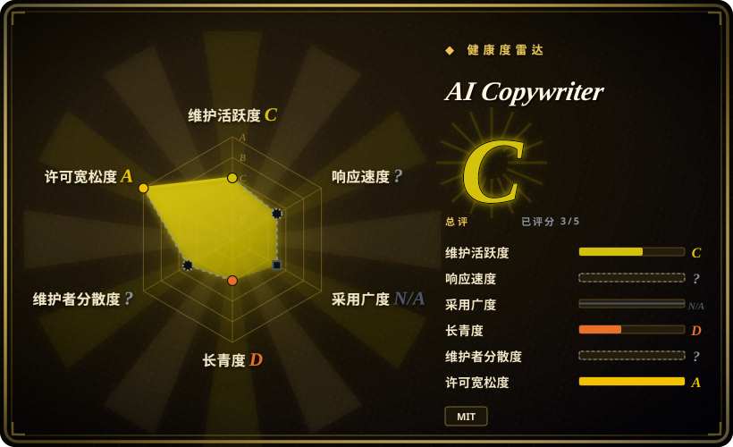
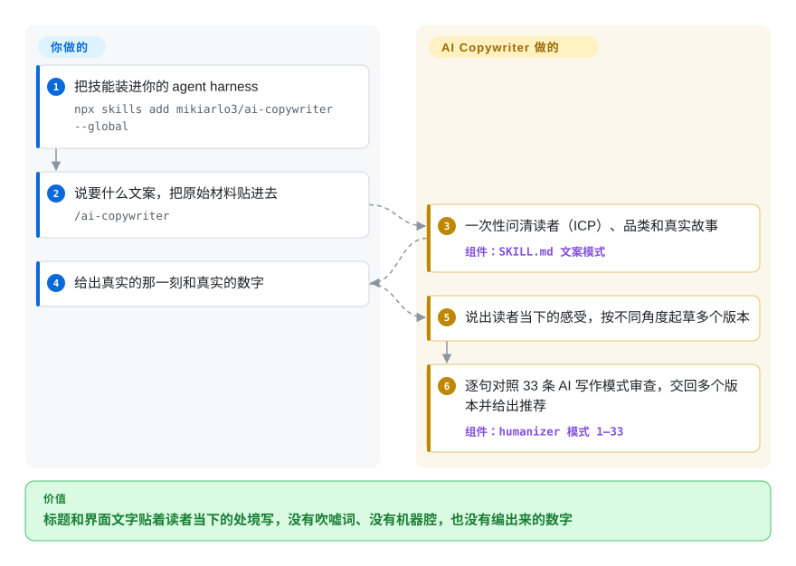

# AI Copywriter

让模型起个标题，它给你“解锁终极指南，彻底革新你的工作流”；让它收着点，又平淡到没人想点。AI Copywriter 是一份 Markdown 技能：先逼 agent 问清读者是谁、真实发生了什么，再据此写短文案，并在交给你之前按 33 种常见 AI 写作痕迹逐条过一遍。

## 何时使用

你是自己写上线文案的创始人或产品工程师，手边用着 coding agent：博客标题、155 字符的 meta description、新页面的空状态和报错提示、邮件主题行、复盘上季度的 LinkedIn 帖子。拿回来的是“🚀 隆重推出 CaseNotes：法律人士的终极颠覆性解决方案……”，让它别那么夸张，又变成一句什么也没说的话。你想要的 agent 像个会先打断你的文案：“这到底写给谁？他们半夜 11 点会往搜索框里敲什么？”，并且拒绝替你编出那个能让标题成立的“省了 4 万美元”。

要的是**面向转化的短文案，外加去 AI 味，一个技能包办**时，选 AI Copywriter。相对它的上游 [humanizer](../de-ai-writing/humanizer.zh.md)，它补上了“写”的那一半：一次性问清 ICP（理想客户画像，即文案写给谁）、品类和故事的访谈；按不同角度出 5–10 个标题并给出推荐，理由落在读者当下的感受上；还有微文案、邮件主题行、LinkedIn 帖子和面向创始人的“战略型”博客的分格式规则。相对面更宽的 [marketingskills](marketingskills.zh.md)，它是一份能从头读到尾的文件（544 行），每写一句都自带去 AI 味审查，而不是约 50 个共用一份产品营销上下文文件的营销技能。

## 怎么用起来

这里没有程序：整个产品就是 `SKILL.md`，一份你调用时 agent 加载的指令文档。收到写文案的请求，它切进“文案模式”：动笔前必须先自答两个问题——这句话到达读者那一刻，读者是什么感受；怎样用厨房餐桌上的大白话讲清产品——你的需求答不出来，它就一次性问你要 ICP、品类（读者把你归到哪个“心理货架”）和真实故事，答案还泛泛时继续追问。之后它起草多个版本，并用去 AI 味时的同一份清单过一遍：33 条编号模式原样取自 blader/humanizer v2.9.1（夸大意义、“不只是 X，而是 Y”、凑三项、破折号、聊天机器人式收尾……），外加三道文案题（“这句话单独挂在广告牌上还站得住吗？”）。好比一个编辑，自己写完这句话，交稿前再亲手查一遍机器腔。

事实、数字和真实故事由你提供——技能被要求绝不编造，缺就问——从它给的几个版本里挑哪一个也由你决定。它还有另外三种用法，入口相同：贴一段文字让它去 AI 味（交回初稿、一小段“哪里还像 AI”和最终改写）；指向一个文件，让它原地改写其中的正文；或者让别的 agent 把它当作一步来调用，只拿最终文本。

<!-- flow-steps:begin (generated from flows/ai-copywriter.json by tools/flow_card.py — do not edit) -->

流程文字版

1. **你**：把技能装进你的 agent harness — `npx skills add mikiarlo3/ai-copywriter --global`
2. **你**：说要什么文案，把原始材料贴进去 — `/ai-copywriter`
3. **AI Copywriter**：一次性问清读者（ICP）、品类和真实故事 — 组件：`SKILL.md 文案模式`
4. **你**：给出真实的那一刻和真实的数字
5. **AI Copywriter**：说出读者当下的感受，按不同角度起草多个版本
6. **AI Copywriter**：逐句对照 33 条 AI 写作模式审查，交回多个版本并给出推荐 — 组件：`humanizer 模式 1–33`

**价值**：标题和界面文字贴着读者当下的处境写，没有吹嘘词、没有机器腔，也没有编出来的数字

<!-- flow-steps:end -->

## 何时不用

- **你只想给现成的英文稿去 AI 味，不需要写新文案。** 直接用 [humanizer](../de-ai-writing/humanizer.zh.md)：本分叉把 33 条模式冻结在 humanizer v2.9.1，而上游此后已发布 v3.0.0（2026-09-06）和 v3.1.0（2026-09-28），规则集重写过。若首要目标是保住作者本人的声音，用 [no-ai-slop](../de-ai-writing/no-ai-slop.zh.md)。
- **文案是中文（或任何非英文语言）。** 所有模式、禁用词清单和示例都是英文，排版规则（不用破折号、用直引号）也是英文习惯。中文产品文案用 [shuorenhua](../de-ai-writing/shuorenhua.zh.md)，中文去 AI 味编辑用 [Humanizer-zh](../de-ai-writing/humanizer-zh.zh.md)。希伯来语／从右到左的扩展只以未合并的 PR（#2）存在。
- **你需要的是整套营销职能，而不是几句文案。** 定价页、CRO 实验、邮件序列、广告、SEO 审计和发布计划都不在范围内；用 [marketingskills](marketingskills.zh.md)，它的 `copywriting` 技能是约 50 个技能之一，共用一份 `product-marketing` 上下文文件。
- **你要无人值守地批量生成**（从表格里生成几百条商品简介）。这套方法依赖访谈；嵌入模式下它“按现有材料写，并写明缺了什么”，放到批处理里就是每条一句泛泛的文案加一张缺口清单。改用脚本化模板，或者用 marketingskills，让每次请求都读同一份产品营销上下文文件。
- **你们的品牌规范要用破折号、弯引号或标题式大写。** 最终改写被要求不含任何长／短破折号，并把引号拉直、标题改成句首大写，除非你给一份本身就这样写的声音样本。规则必须服从品牌指南时，用私有的风格指南或 [no-ai-slop](../de-ai-writing/no-ai-slop.zh.md)。
- **你要的是问题清单而不是改稿，或者要一道 CI 门禁。** 文件模式会原地改写文件；仓库里唯一的脚本 `scripts/validate-package.py` 只检查包的版本号是否同步、模式数量对不对，不检查你的文本。用 [avoid-ai-writing](../de-ai-writing/avoid-ai-writing.zh.md)，它带确定性检测器和按命中数卡的门禁。
- **你押的是长期维护。** 单一维护者，默认分支自 2026-07-25 起没有提交，两个社区 PR 至今没有维护者回复。钉住你审过的那次 commit。

## 横向对比

| 替代品 | 是否收录 | 我们的评价 | 取舍 |
|---|---|---|---|
| [humanizer](../de-ai-writing/humanizer.zh.md) | ✅ | 要清理手上已有的英文稿，选 humanizer；只有同时还要 agent 先访谈、再写标题、微文案或 LinkedIn 帖子时，才选 AI Copywriter。 | humanizer 是仍在发版的上游（2026-09-28 发布 v3.1.0）；AI Copywriter 带的是冻结在 v2.9.1 的模式副本，多了文案模式，却落后上游两次大改。 |
| [marketingskills](marketingskills.zh.md) | ✅ | 文案只是 SaaS 产品定价、CRO、邮件、广告、SEO 中的一项时，选 marketingskills；只写标题、简介和界面文字、并希望每句都查过 AI 痕迹时，选 AI Copywriter。 | marketingskills 把约 50 个技能挂在一份共享的产品营销上下文上，贡献者也更多；AI Copywriter 是一份 544 行的单文件，只有一名维护者，不覆盖营销策略。 |
| [no-ai-slop](../de-ai-writing/no-ai-slop.zh.md) | ✅ | 英文稿改完必须仍像作者本人写的，选 no-ai-slop；要从零写有说服力的文案、出多个版本并给推荐，选 AI Copywriter。 | no-ai-slop 做最小修改，还有只检测不改的模式；AI Copywriter 改得更狠（破折号一律去掉），另加一套“卖”的模式。 |
| [shuorenhua](../de-ai-writing/shuorenhua.zh.md) | ✅ | 文案是中文——产品文字、发布说明、社交帖子——选 shuorenhua；英文营销短句选 AI Copywriter。 | shuorenhua 中文优先，会保护命令和名称等片段；AI Copywriter 的规则和禁用词只有英文。 |

## 健康度与可持续性

- **维护快照（2026-09-28）：** `archived=false`；默认分支最后一次变动是 2026-07-25（v1.6.0），2026-08-01 的 `pushed_at` 来自一条安装无关技能的旁支。默认分支的十次提交全部落在建仓后约 13 小时内，此后再无提交。维护评为 C（距上次提交 65 天，13 周里只有 1 周活跃）。没有 tagged release，版本号只写在 `SKILL.md` 元数据、`plugin.json` 和 README 版本历史里。
- **治理／巴士因子：** User 所有的仓库（Mickey Haslavsky，GitHub 简介“Founder of enso”）。每次提交都归在 `claude` 账号名下（`claude/*` 分支上的 Claude Code 网页会话），评分器无法归属作者，所以治理是 `?`，不是低分。2026-07-25 的两个社区 PR（LQA 模式、希伯来语／从右到左）没有维护者回复；#1 下唯一的评论来自另一位贡献者。
- **背书与 Lindy：** 仓库 66 天——寿命 D。不给 Lindy 加分：太年轻，也没出现第二轮开发。文案方法注明出自作者自家公司的研究页，路线图跟着一位创始人的营销需要走。
- **采用：** 约 1.2k star、65 个 fork、5 个 watcher（2026-09-28）；没有可统计安装量的包仓库渠道，采用轴为 `N/A`。这是关注度，不是使用证据。雷达总分 C，覆盖 5 个适用轴中的 3 个。
- **风险信号：** MIT（根目录 `LICENSE`，与原 humanizer 作者双重版权）——`risk_license` 为 A。真正的风险是漂移：去 AI 味那一半是冻结在 v2.9.1 的分叉，上游已到 v3.1.0；默认分支是机器命名的 `claude/*` 分支，`main` 并不跟随它。

## 存疑（未验证）

- [未验证] 文案模式的产出质量（这些版本是否真的转化更好）没有测过：仓库不带任何评测，README 里的示例是作者自己的演示。没有真实流量上的 A/B 测试就无法复现。
- [未验证] 安装命令（`npx skills add mikiarlo3/ai-copywriter --global`、Claude Code 插件市场路径、Manus 导入）读自 README 和 CI workflow，本轮未执行。
- [未验证] README 说 `SKILL.md` “约 8,000 token”，本轮未实测；默认分支上的文件在 2026-09-28 是 544 行、7,614 个英文词，实际 token 数取决于分词器，可能更高。
- [未验证] “读者优先”方法注明出自 enso.bot/research；那是作者自己公司的站点（GitHub 简介：“Founder of enso”），本轮没有核对其中有哪些研究。
- [推断] 从 `main` 而不是默认分支安装的工具，拿到的是不含战略型博客模板的 v1.5.1：`main` 停在 v1.5.1 那次提交，默认分支 `claude/humanizer-copywriting-skill-u5x4vd` 才是 v1.6.0。各安装器具体读哪个分支未测试。
- [未验证] 无法查看 star 历史（2026-09-28 调 stargazers API 返回 404），因此两个月约 1.2k star 是否自然增长无从判断。
