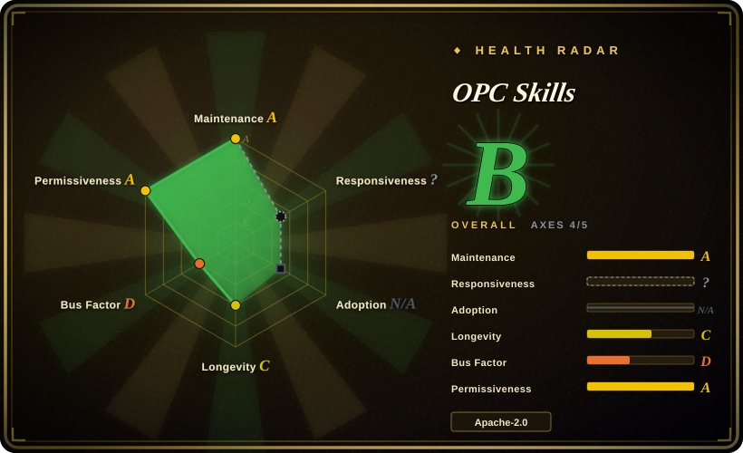
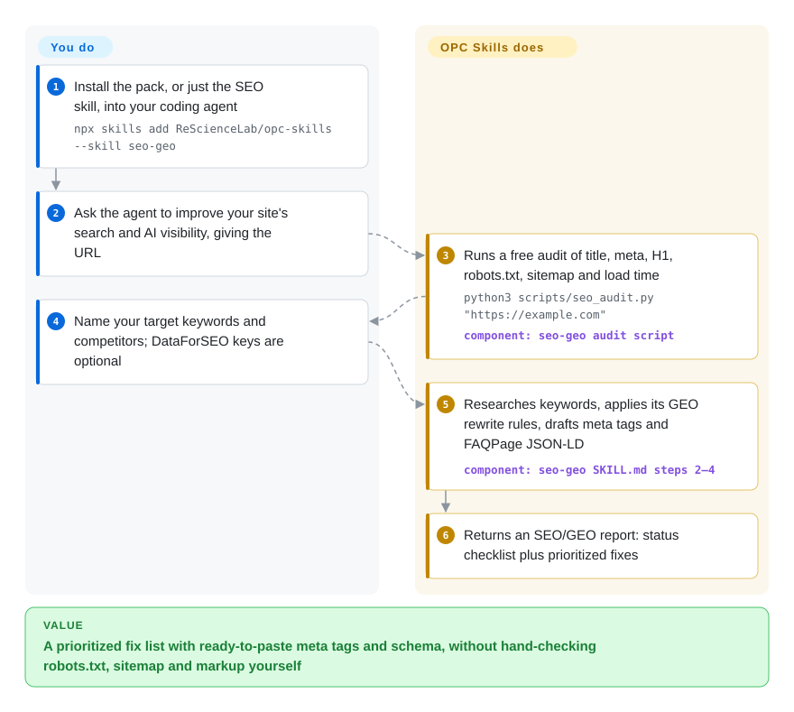

# OPC Skills

You run a product alone and the launch chores pile up outside the code: the site doesn't show up when someone asks ChatGPT about your niche, you need a domain and a logo by Friday, and "what do users actually complain about?" means an evening of scrolling Reddit. OPC Skills is a bag of ten small agent skills for those chores — an SEO/AI-search audit, demand research, domain shopping, logo and banner generation, and Reddit/X/Product Hunt lookups — each a prompt plus a few Python scripts that call free or paid web APIs with your keys.

## When to use

You are an indie hacker shipping a SaaS on your own, already living in Claude Code, Cursor or Codex. The landing page is live, but `site:yourdomain.com` returns three results, nothing on the page is marked up for search engines, and robots.txt (the file that tells crawlers what they may read) may be blocking `PerplexityBot` without you knowing. You do not want to learn Ahrefs or pay for Semrush to find out. You want to type "make this site visible to Google and AI search" into the agent you already use and get back a checklist plus paste-ready meta tags and JSON-LD (the structured-data block search engines read).

Reach for OPC Skills when that job is the center — its `seo-geo` skill accounts for 50,000 of the pack's 70,828 skills.sh installs — and when the side jobs of a one-person launch (pick a domain, draw a logo, sanity-check demand on Reddit and X) are worth having in the same install. Compared with [marketingskills](marketingskills.md), it is narrower and more hands-on: fewer strategy prompts, but scripts that actually fetch the page, call Reddit's public JSON, or generate an image. Compared with [open-seo](open-seo.md), there is nothing to deploy: the audit runs as a stdlib Python script, and paid SEO data (DataForSEO) is optional rather than the core.

## How it works

Each skill is a folder with a `SKILL.md` — an instruction sheet the agent loads when your request matches its description — plus a `scripts/` directory of small Python command-line tools the agent runs for you. The pack does the recipe and the plumbing: which checks to run, which API endpoint to hit, what the report should look like. You bring the accounts: an environment variable per paid service (Gemini for images, twitterapi.io for X, a Product Hunt token, a RequestHunt account), and you decide what to change on your site. Think of a toolbox where every tool comes with its own laminated instruction card; the agent reads the card, the tool still needs your batteries. Three skills lean on others (`domain-hunter` and `seo-geo` call `twitter` and `reddit`; `logo-creator` and `banner-creator` call `nanobanana`), so install those together. A separate `archive` skill writes session notes into `.archive/` and, installed as a plugin, a SessionStart hook reads `.archive/MEMORY.md` back into each new session.

<!-- flow-steps:begin (generated from flows/opc-skills.json by tools/flow_card.py — do not edit) -->

Text version of the flow

1. **You**: Install the pack, or just the SEO skill, into your coding agent — `npx skills add ReScienceLab/opc-skills --skill seo-geo`
2. **You**: Ask the agent to improve your site's search and AI visibility, giving the URL
3. **OPC Skills**: Runs a free audit of title, meta, H1, robots.txt, sitemap and load time — `python3 scripts/seo_audit.py "https://example.com"` — component: `seo-geo audit script`
4. **You**: Name your target keywords and competitors; DataForSEO keys are optional
5. **OPC Skills**: Researches keywords, applies its GEO rewrite rules, drafts meta tags and FAQPage JSON-LD — component: `seo-geo SKILL.md steps 2–4`
6. **OPC Skills**: Returns an SEO/GEO report: status checklist plus prioritized fixes

**Value**: A prioritized fix list with ready-to-paste meta tags and schema, without hand-checking robots.txt, sitemap and markup yourself

<!-- flow-steps:end -->

## When NOT to use

- **SEO is your actual job, not a launch chore.** `seo-geo` is one 250-line instruction file and ten small scripts; keyword research defaults to running web searches against Ahrefs/Semrush pages unless you add DataForSEO keys. For technical SEO depth (E-E-A-T, local, international, e-commerce, sub-agents per audit area) use claude-seo (not indexed); for rank tracking and stored competitor data over time use [open-seo](open-seo.md).
- **You need the GEO numbers to be true.** The skill's table assigns per-method boosts (+40% "Cite Sources", +37% statistics, "+40% AI visibility" for FAQPage schema) attributed to the Princeton GEO paper. Checked against that paper's Table 1 (arXiv:2311.09735, position-adjusted word count, 19.5 without optimization), the ranking is off: quotations gain about 43%, statistics 33%, citing sources 28%, authoritative tone 12% and unique words 6%, against the skill's 30%, 37%, 40%, 25% and 15%. None of the paper's nine methods is schema markup, so the FAQPage figure does not come from it. Treat the table as heuristics and measure your own citations in AI answers before reporting the uplift to anyone.
- **You want demand research without a vendor account.** `requesthunt` is a thin client for RequestHunt, a credit-metered SaaS from the same lab (free tier 100 credits/month). Its CLI ships as prebuilt binaries only: the `requesthunt-cli` repo holds a README and release assets, so the skill's "build from source with `cargo install --path cli`" cannot be followed from the public repo. Use [last30days](../../../deep-research/last30days.md) for a cited brief from the last month of Reddit/X/YouTube, or [Agent-Reach](../../../deep-research/agent-reach.md) to read those platforms directly.
- **You can't or won't pay per API.** The X skill needs a twitterapi.io key, images need a Gemini key, `logo-creator` adds remove.bg and Recraft keys for background removal and vectorizing, Product Hunt needs a developer token. Only `reddit` (public JSON endpoints) and the `seo-geo` audit run with no key. If zero-fee platform access is the constraint, use [Agent-Reach](../../../deep-research/agent-reach.md).
- **You install through the Claude Code plugin marketplace and need it to validate.** Every plugin manifest declares `"skills": ["./SKILL.md"]` — a file where Claude Code expects a directory. Issue #87 (2026-07-26) reports `claude plugin validate` failing on all nine plugins; the fix PR #80 was closed unmerged and PR #95 sat unreviewed as of 2026-10-01. Use `npx skills add ReScienceLab/opc-skills`, which the repo's CI tests on Linux, macOS and Windows.
- **Your team is on bash, Windows, or a secrets manager.** The SKILL files tell you to `export` keys in `~/.zshrc`, and the logo scripts fall back to `grep`-ing `~/.zshrc` for `REMOVE_BG_API_KEY` / `RECRAFT_API_KEY` when the variable is unset. Set the variables in the agent's environment explicitly, or wrap the scripts.
- **You want real cross-session memory.** `archive` is a convention (dated Markdown files plus an index the hook pastes into context), not retrieval: the whole `MEMORY.md` goes in every session and lookup is `grep`. Use [claude-mem](../../../agent-memory/coding-agent-memory/claude-mem.md) for captured, searchable memory.
- **You need a vendored, legally clean license.** The root `LICENSE` is Apache-2.0, but the README badge, every `plugin.json` and the marketplace entries say MIT. Pin a commit and go by the `LICENSE` file, and record the conflict in your notices.

## Comparison

| Alternative | In index | Our verdict | Tradeoff |
|---|---|---|---|
| [marketingskills](marketingskills.md) | ✅ | When the agent has to think like a marketing team — positioning, CRO, pricing pages, email, ads — pick marketingskills; pick OPC Skills when the work is a solo launch checklist that needs scripts to fetch your page, Reddit or an image API. | marketingskills is a far larger, prompt-first pack around a shared product-marketing context; OPC Skills has fewer, narrower skills but runnable Python tools and paid-API wiring you must key. |
| [open-seo](open-seo.md) | ✅ | When SEO is an ongoing operation with rank tracking, backlink data and a dashboard, pick open-seo; pick OPC Skills for a one-off audit and on-page fixes from inside the agent with nothing deployed. | open-seo needs a self-hosted app and paid DataForSEO data but keeps history; OPC Skills runs a stateless stdlib script plus web searches and remembers nothing between runs. |
| claude-seo (AgriciDaniel/claude-seo) | not indexed | When you want a deep SEO specialist — technical, E-E-A-T, local, international, schema, Google APIs — pick claude-seo; pick OPC Skills when SEO is one of several launch chores and you also want domain, logo and social-data skills. | claude-seo (MIT, ~18.1k stars, pushed 2026-09-29) splits SEO into 26 sub-skills and 19 sub-agents; OPC Skills' SEO is one file, broader across chores but much shallower. Not added in this tab batch. |
| [last30days](../../../deep-research/last30days.md) | ✅ | When "what are people asking for?" should come back as one cited, ranked brief from the last month, pick last30days; pick OPC Skills' `requesthunt` only if you already pay for RequestHunt and want its categorized feature-request database. | last30days scrapes community sources itself with a heavy prompt and some credential risk; `requesthunt` is light on your machine but sends every query to a closed, credit-metered service. |
| [Agent-Reach](../../../deep-research/agent-reach.md) | ✅ | When your agent just needs to read X, Reddit, YouTube or GitHub without buying API keys, pick Agent-Reach; pick OPC Skills' `twitter`/`reddit` skills when a paid twitterapi.io key is acceptable and you want fixed per-endpoint scripts. | Agent-Reach routes through free upstream tools with fallbacks per platform; OPC Skills' X access is one paid third-party API, its Reddit access the public JSON endpoints only. |

## Health & viability

- **Maintenance snapshot (2026-10-01):** `archived=false` and `pushed_at` is today, but that is a GitHub Actions bot committing skills.sh install counts daily. The last change to any skill was `requesthunt` 2.3.0 on 2026-04-20; v1.4.0 (2026-09-14) only touched the website and blog. GitHub Releases stop at v1.0.10 (2026-02-23) while `CHANGELOG.md` runs to v1.4.0, so watch the changelog, not releases. Read as **coasting**: the SEO and social skills have not moved in over five months. The radar's maintenance A (13 of 13 weeks active) counts those bot commits, so discount it; overall B rests on 4 of 5 applicable axes, with governance D and responsiveness unscored.
- **Responsiveness:** three bug reports from 2026-07-26 (#85–#87: broken plugin manifests, a version mismatch, a `commands` path to a folder that no longer exists) and four community PRs (#90–#92, #95) had no maintainer reply on 2026-10-01; the one plugin-manifest fix PR (#80) was closed unmerged.
- **Governance / bus factor:** an Organization repo (ReScience Lab, org created 2025-06), but every human commit comes from one account (Jing-yilin, 207 commits; the other top contributor is the bot). Bus factor one. The roadmap follows the lab's own products: `requesthunt` fronts its paid SaaS, and the v1.4.0 release promoted another lab project.
- **Backing & Lindy:** created 2026-01-17, under nine months old, and its maintained surface has shrunk to one skill. No Lindy credit.
- **Adoption:** ~1,846 stars, 169 forks, 11 watchers (2026-10-01); the repo's own bot-collected skills.sh counter reports 70,828 installs, 71% of them `seo-geo`. Attention concentrated on one skill, not proof of production use.
- **Risk flags:** license metadata conflict (Apache-2.0 `LICENSE` vs MIT everywhere else); paid third-party APIs per skill; a closed-source binary installed via `curl | sh` for `requesthunt`; a second copy of `seo-geo` under `.agents/skills/` whose `SKILL.md` differs from `skills/seo-geo/SKILL.md`, so which one you get depends on the installer path.

## Caveats (unverified)

- [未验证] Issue #87's report that `claude plugin validate` fails on all nine plugins was not reproduced locally; what was verified is the manifest content (`"skills": ["./SKILL.md"]` in `skills/seo-geo/.claude-plugin/plugin.json`) and that fix PR #80 was closed unmerged on 2026-06-23.
- [未验证] Install counts (70,828 total, 50,000 for `seo-geo`) come from the repo's `website/install-stats.json`, written by its own workflow from skills.sh; skills.sh itself was not queried, and the round 50,000 suggests a rounded or capped display value.
- [未验证] The `npx skills add` path is exercised by the repo's `test-installer.yml` CI matrix (three OSes, nine skills — `archive` is not in the matrix); the install was not run in this pass, and none of the Python scripts were executed against live APIs.
- [推断] On Windows or bash-only setups the `~/.zshrc` key fallback in `logo-creator` scripts silently finds nothing; the scripts were read, not run.
- [未验证] Which `seo-geo` copy (`skills/` or `.agents/skills/`) each installer picks up was not tested; the two `SKILL.md` blobs differ (different git SHAs), the audit script is identical.
- [未验证] RequestHunt's pricing (free 100 credits/month, Pro 2,000) is as stated in `skills/requesthunt/SKILL.md`; requesthunt.com's pricing page was not read.
