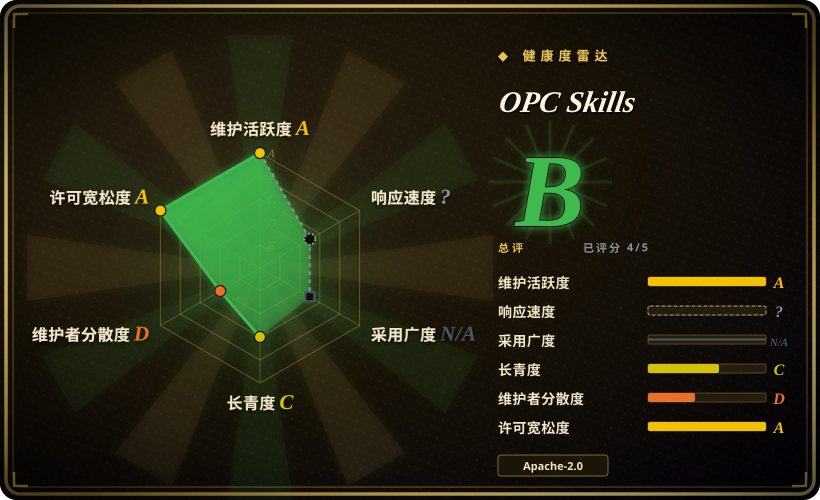
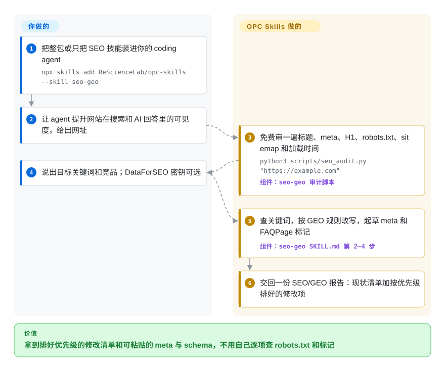

# OPC Skills

一个人做产品，代码之外的上线杂活越堆越多：有人问 ChatGPT 你这个领域的工具，回答里从来没有你的网站；周五前要定域名、出 logo；想知道用户到底在抱怨什么，就得花一晚上刷 Reddit。OPC Skills 把这些杂活拆成十个小 agent 技能——SEO 与 AI 搜索体检、需求调研、比价买域名、生成 logo 和横幅、查 Reddit／X／Product Hunt——每个都是一份提示词加几个 Python 小脚本，用你自己的密钥去调免费或付费的网络 API。

## 何时使用

你是独立开发者，一个人上线一款 SaaS，平时就在 Claude Code、Cursor 或 Codex 里干活。落地页已经上线，但 `site:yourdomain.com` 只搜出三条结果，页面上没有任何给搜索引擎看的结构化标记，robots.txt（告诉爬虫哪些内容可以读的文件）说不定还挡着 `PerplexityBot`，你自己都不知道。你不想为了查清这些去学 Ahrefs，也不想付 Semrush 的钱。你想在已经在用的 agent 里说一句“让这个站在 Google 和 AI 搜索里能被找到”，然后拿回一份检查清单，外加能直接粘贴的 meta 标签和 JSON-LD（搜索引擎读取的结构化数据块）。

当这件事是主活时就选 OPC Skills——它的 `seo-geo` 技能占了全包 70,828 次 skills.sh 安装里的 50,000 次；如果一人公司上线时的旁支杂活（挑域名、画 logo、去 Reddit 和 X 上验证需求）也值得装在同一处，就更合适。和 [marketingskills](marketingskills.zh.md) 比，它更窄也更动手：策略类提示词少，但脚本真的会去抓你的页面、调 Reddit 的公开 JSON、调出图 API。和 [open-seo](open-seo.zh.md) 比，它不用部署任何东西：体检是一个只用标准库的 Python 脚本，付费 SEO 数据（DataForSEO）是可选项而不是核心。

## 怎么用起来

每个技能是一个文件夹：里面一份 `SKILL.md`——一张说明单，你的请求和它的描述对得上时 agent 就会加载——再加一个 `scripts/` 目录，放着 agent 替你运行的小型 Python 命令行工具。这个包负责“配方”和“管线”：跑哪些检查、打哪个 API 端点、报告长什么样。账号由你出：每个付费服务一个环境变量（出图用 Gemini，X 用 twitterapi.io，一个 Product Hunt 令牌，一个 RequestHunt 账号），改不改网站也由你决定。可以把它想成一个工具箱，每件工具都配一张塑封说明卡：agent 照卡操作，但电池得你自己装。有三个技能依赖别的技能（`domain-hunter` 和 `seo-geo` 会调用 `twitter` 与 `reddit`；`logo-creator` 和 `banner-creator` 会调用 `nanobanana`），要一起装。另有一个 `archive` 技能把会话笔记写进 `.archive/`，按插件安装时，SessionStart 钩子会在每次新会话开始时把 `.archive/MEMORY.md` 读回上下文。

<!-- flow-steps:begin (generated from flows/opc-skills.json by tools/flow_card.py — do not edit) -->

流程文字版

1. **你**：把整包或只把 SEO 技能装进你的 coding agent — `npx skills add ReScienceLab/opc-skills --skill seo-geo`
2. **你**：让 agent 提升网站在搜索和 AI 回答里的可见度，给出网址
3. **OPC Skills**：免费审一遍标题、meta、H1、robots.txt、sitemap 和加载时间 — `python3 scripts/seo_audit.py "https://example.com"` — 组件：`seo-geo 审计脚本`
4. **你**：说出目标关键词和竞品；DataForSEO 密钥可选
5. **OPC Skills**：查关键词，按 GEO 规则改写，起草 meta 和 FAQPage 标记 — 组件：`seo-geo SKILL.md 第 2–4 步`
6. **OPC Skills**：交回一份 SEO/GEO 报告：现状清单加按优先级排好的修改项

**价值**：拿到排好优先级的修改清单和可粘贴的 meta 与 schema，不用自己逐项查 robots.txt 和标记

<!-- flow-steps:end -->

## 何时不用

- **SEO 是你的正业，不是上线杂活。** `seo-geo` 只是一份 250 行的说明文件加十个小脚本；不配 DataForSEO 密钥时，关键词调研就是拿 Ahrefs／Semrush 的页面去做网页搜索。要技术 SEO 的深度（E-E-A-T、本地、国际化、电商、按审计领域拆分的子 agent）用 claude-seo（未收录）；要长期排名跟踪和存下来的竞品数据，用 [open-seo](open-seo.zh.md)。
- **你需要 GEO 数字是真的。** 技能里的表格给每种方法标了提升幅度（“引用来源”+40%、加统计数据 +37%、FAQPage schema “+40% AI 可见度”），出处写的是普林斯顿 GEO 论文。那篇论文研究的是内容改写，不是 schema 标记，所以 FAQPage 那个数字不来自论文[推断]。把这张表当经验法则，向别人汇报提升之前，先自己统计 AI 回答里引用你的次数。
- **你想做需求调研，又不想开供应商账号。** `requesthunt` 是 RequestHunt 的薄客户端，而 RequestHunt 是同一家实验室按积分计费的 SaaS（免费档每月 100 积分）。它的 CLI 只发预编译二进制：`requesthunt-cli` 仓库里只有一份 README 和发布附件，所以技能里“用 `cargo install --path cli` 从源码构建”在公开仓库上做不到。要从近一个月的 Reddit／X／YouTube 里拿一份带引用的简报，用 [last30days](../../../deep-research/last30days.zh.md)；要直接读这些平台，用 [Agent-Reach](../../../deep-research/agent-reach.zh.md)。
- **你不能或不想按 API 付费。** X 技能要 twitterapi.io 密钥，出图要 Gemini 密钥，`logo-creator` 去背景和转矢量还要 remove.bg 和 Recraft 密钥，Product Hunt 要开发者令牌。不需要任何密钥的只有 `reddit`（公开 JSON 端点）和 `seo-geo` 的体检脚本。如果硬约束是零费用读平台，用 [Agent-Reach](../../../deep-research/agent-reach.zh.md)。
- **你走 Claude Code 插件市场安装，并且需要它能通过校验。** 每个插件清单都写着 `"skills": ["./SKILL.md"]`——指向一个文件，而 Claude Code 要的是目录。issue #87（2026-07-26）报告 `claude plugin validate` 在全部九个插件上失败；修复 PR #80 未合并就被关闭，PR #95 到 2026-10-01 仍无人审。改用 `npx skills add ReScienceLab/opc-skills`，这条路径仓库的 CI 在 Linux、macOS 和 Windows 上都测过。
- **你的团队用 bash、Windows 或密钥管理器。** SKILL 文件让你在 `~/.zshrc` 里 `export` 密钥，logo 相关脚本在环境变量缺失时还会退回去 `grep` `~/.zshrc` 找 `REMOVE_BG_API_KEY`／`RECRAFT_API_KEY`。请在 agent 的运行环境里显式设好变量，或者自己包一层脚本。
- **你要的是真正的跨会话记忆。** `archive` 是一种约定（按日期存的 Markdown 文件加一份索引，由钩子贴进上下文），不是检索：每次会话都把整份 `MEMORY.md` 塞进去，查找靠 `grep`。要自动捕获、可搜索的记忆，用 [claude-mem](../../../agent-memory/coding-agent-memory/claude-mem.zh.md)。
- **你需要能放心打包分发的许可证。** 根目录 `LICENSE` 是 Apache-2.0，但 README 徽章、每个 `plugin.json` 和插件市场条目都写 MIT。固定一个 commit，以 `LICENSE` 文件为准，并在你的 notices 里记下这处冲突。

## 横向对比

| 替代品 | 是否收录 | 我们的评价 | 取舍 |
|---|---|---|---|
| [marketingskills](marketingskills.zh.md) | ✅ | 要 agent 像营销团队一样思考——定位、CRO、定价页、邮件、广告——选 marketingskills；如果是一人上线的待办清单，需要脚本去抓你的页面、读 Reddit 或调出图 API，选 OPC Skills。 | marketingskills 体量大得多，以提示词为主，围绕一份共享的产品营销上下文；OPC Skills 技能更少更窄，但带可运行的 Python 工具和要你自己配密钥的付费 API 接线。 |
| [open-seo](open-seo.zh.md) | ✅ | SEO 是持续运营、要排名跟踪、反链数据和看板时，选 open-seo；只想在 agent 里做一次体检和页面修改、什么都不部署时，选 OPC Skills。 | open-seo 要自托管一个应用、付费买 DataForSEO 数据，但能保留历史；OPC Skills 跑的是无状态的标准库脚本加网页搜索，两次运行之间什么都不记。 |
| claude-seo（AgriciDaniel/claude-seo） | 未收录 | 想要一个深度 SEO 专家——技术、E-E-A-T、本地、国际化、schema、Google API——选 claude-seo；SEO 只是几件上线杂活之一，还想要域名、logo 和社媒数据技能时，选 OPC Skills。 | claude-seo（MIT，约 1.81 万星，2026-09-29 仍有推送）把 SEO 拆成 26 个子技能和 19 个子 agent；OPC Skills 的 SEO 只有一个文件，覆盖的杂活更广但浅得多。本批标签收录未加入。 |
| [last30days](../../../deep-research/last30days.zh.md) | ✅ | 想让“大家在要什么”变成一份带引用、排好序的近一个月简报，选 last30days；只有你已经在付费用 RequestHunt、想要它分好类的功能请求库时，才选 OPC Skills 的 `requesthunt`。 | last30days 自己去抓社区来源，提示词很重，还有一定的凭据风险；`requesthunt` 在你本机很轻，但每条查询都发到一个闭源、按积分计费的服务。 |
| [Agent-Reach](../../../deep-research/agent-reach.zh.md) | ✅ | agent 只是要读 X、Reddit、YouTube 或 GitHub 而不想买 API 密钥时，选 Agent-Reach；能接受付费 twitterapi.io 密钥、想要按端点固定好的脚本时，选 OPC Skills 的 `twitter`／`reddit` 技能。 | Agent-Reach 走免费的上游工具，每个平台都有备用后端；OPC Skills 读 X 只靠一个付费第三方 API，读 Reddit 只靠公开 JSON 端点。 |

## 健康度与可持续性

- **维护快照（2026-10-01）：** `archived=false`，`pushed_at` 就是今天，但那是 GitHub Actions 机器人每天提交 skills.sh 安装数。任何技能的最后一次改动是 2026-04-20 的 `requesthunt` 2.3.0；v1.4.0（2026-09-14）只动了官网和博客。GitHub Releases 停在 v1.0.10（2026-02-23），`CHANGELOG.md` 则记到 v1.4.0，所以要看 changelog 而不是 releases。判断为**滑行状态**：SEO 和社媒技能已超过五个月没动。雷达上的维护度 A（13 周里 13 周活跃）把这些机器人提交也算了进去，要打折看；总评 B 建立在 5 个适用轴里的 4 个上，治理为 D，响应度未评分。
- **响应度：** 2026-07-26 提的三个 bug（#85–#87：插件清单失效、版本号不一致、`commands` 指向一个已不存在的目录）和四个社区 PR（#90–#92、#95）到 2026-10-01 都没有维护者回复；唯一修插件清单的 PR（#80）未合并即被关闭。
- **治理与巴士因子：** 仓库属于组织（ReScience Lab，组织创建于 2025-06），但所有人类提交都来自同一个账号（Jing-yilin，207 次提交；另一个头部贡献者是机器人）。巴士因子为一。路线图跟着实验室自家产品走：`requesthunt` 是其付费 SaaS 的入口，v1.4.0 的内容是给实验室另一个项目做推广。
- **背书与 Lindy：** 创建于 2026-01-17，不满九个月，实际还在维护的只剩一个技能。没有 Lindy 加分。
- **采用度：** 约 1,846 星、169 fork、11 人关注（2026-10-01）；仓库自己的机器人从 skills.sh 收集的计数是 70,828 次安装，其中 71% 是 `seo-geo`。关注度集中在一个技能上，不能证明有人在生产中使用。
- **风险信号：** 许可证元数据冲突（`LICENSE` 是 Apache-2.0，其他地方都写 MIT）；每个技能各自依赖付费第三方 API；`requesthunt` 通过 `curl | sh` 安装闭源二进制；`.agents/skills/` 下还有一份 `seo-geo`，其 `SKILL.md` 与 `skills/seo-geo/SKILL.md` 不同，你装到哪份取决于安装器走的路径。

## 存疑（未验证）

- [推断]FAQPage“+40% AI 可见度”这个数字不来自普林斯顿 GEO 论文（Aggarwal 等），那篇论文测的是内容层面的改写；本轮也没有把 `seo-geo` 表格里各方法的百分比和论文结果表逐项核对。
- [未验证]issue #87 说 `claude plugin validate` 在全部九个插件上失败，本轮没有在本地复现；已核实的是清单内容（`skills/seo-geo/.claude-plugin/plugin.json` 里的 `"skills": ["./SKILL.md"]`），以及修复 PR #80 于 2026-06-23 未合并即关闭。
- [未验证]安装数（总计 70,828，`seo-geo` 50,000）取自仓库的 `website/install-stats.json`，由仓库自己的工作流从 skills.sh 抓来写入；本轮没有直接查询 skills.sh，而 50,000 这个整数像是经过取整或封顶的展示值。
- [未验证]`npx skills add` 路径由仓库 `test-installer.yml` 的 CI 矩阵覆盖（三种操作系统、九个技能——`archive` 不在矩阵里）；本轮没有实际安装，也没有对任何 Python 脚本调用真实 API。
- [推断]在 Windows 或只用 bash 的环境里，`logo-creator` 脚本对 `~/.zshrc` 的密钥兜底会静默找不到；脚本只读过，没运行过。
- [未验证]各安装器拿到的是哪份 `seo-geo`（`skills/` 还是 `.agents/skills/`）没有测试；两份 `SKILL.md` 的 git SHA 不同，体检脚本相同。
- [未验证]RequestHunt 的定价（免费每月 100 积分，Pro 2,000）以 `skills/requesthunt/SKILL.md` 所写为准；没有去读 requesthunt.com 的定价页。
