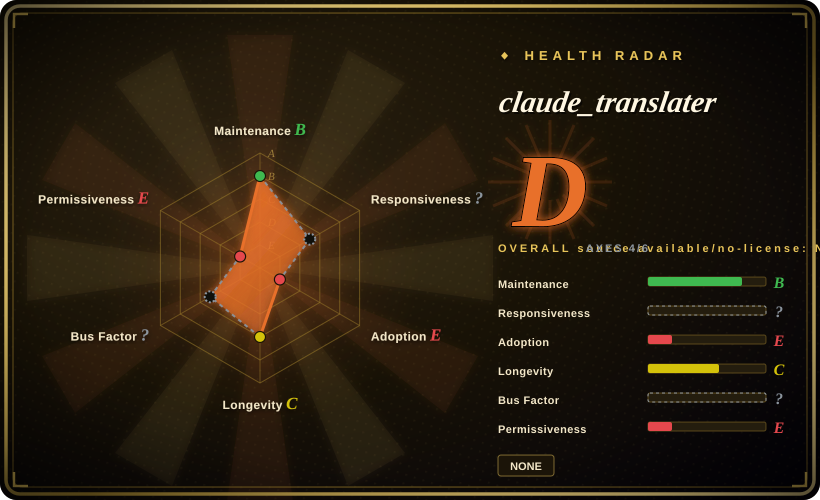

# claude_translater

A shell-script + Claude CLI document translation toolbox: PDF/DOCX/EPUB go through Calibre HTMLZ to Markdown chunks, get translated by the Claude CLI step by step, and are merged back to HTML; a separate script translates PPTX. It is the direct inspiration for [translate-book](translate-book.md).

## When to use

You're a Claude Code user who wants the simplest possible thing that works: clone one repo, run `./translatebook.sh book.pdf`, and let a seven-step shell pipeline (Calibre convert → split → Claude CLI translate → merge → HTML → TOC → format conversion) do the rest — no skill installation, no manifest schemas, no orchestration rules to learn. You also have a PowerPoint deck to translate, which the fancier successors don't touch: `pptxtrans.py` handles PPTX via python-pptx.

You pick it over [translate-book](translate-book.md) only when you specifically want raw, hackable shell scripts you can read end-to-end in minutes and bend to your own workflow, or when you need PPTX translation; you accept that in exchange you give up parallelism, resume, and term-consistency machinery. You pick it over [bilingual_book_maker](../../../reading-tools/bilingual-book-maker.md) when you want to spend your Claude Code subscription instead of setting up API keys.

## When NOT to use

- **You want an actively maintained project.** The last commit is 2026-07-14, the whole history is ~17 commits, and there is no LICENSE file in the repo (only a README badge claiming MIT) as of 2026-09-18 — for anything long-term, use [translate-book](translate-book.md), which is the restructured, actively maintained successor of this exact pipeline.
- **You need speed on a whole book.** The pipeline drives the Claude CLI sequentially step by step with no parallel subagents, no resume, and no manifest validation. For books, use translate-book (parallel + resumable) or bilingual_book_maker (scriptable API calls) instead.
- **You're not in the Claude ecosystem.** If your agent runtime is Codex/OpenClaw or you want to call OpenAI/DeepL/local models, use bilingual_book_maker instead — this toolbox is hard-wired to the Claude CLI.
- **You need term consistency across chapters.** There is no glossary, no neighbor context, no selective re-translation; proper nouns will drift across a long book. Use translate-book instead.
- **You need a redistributable base for a product.** With no LICENSE file, you have no granted rights beyond viewing the code — treat it as read-only reference and build on translate-book (MIT) instead.

## Comparison

| Alternative | In index | Our verdict | Tradeoff |
|---|---|---|---|
| [translate-book](translate-book.md) | ✅ | Choose translate-book for any real book-translation job: it is this same Calibre→chunk→translate pipeline restructured as a portable skill with parallel subagents, resume, and glossary feedback. | claude_translater gives you transparent, trivially hackable shell scripts and a PPTX translator; translate-book gives you the maintained, parallel, consistency-aware version — but requires a skill-capable harness and drops PPTX. |
| [bilingual_book_maker](../../../reading-tools/bilingual-book-maker.md) | ✅ | Choose bilingual_book_maker when you want a packaged CLI with releases, resume, many model backends, and bilingual output; choose claude_translater only for its Claude-CLI-native simplicity. | bilingual_book_maker is older, MIT-licensed, PyPI-packaged, and unattended-friendly; claude_translater is a thin personal script set with no license and no release process, but zero API-key setup if you already have Claude Code. |
| [Baoyu Skills](../content-production/baoyu-skills.md) | ✅ | Choose Baoyu Skills when you translate articles/text inside a broader content workflow; choose claude_translater only for file-based book/PPTX translation via shell. | Baoyu's translate skill is maintained text translation with modes and glossary support, not a file pipeline; claude_translater handles PDF/DOCX/EPUB/PPTX files end-to-end but is unmaintained and Claude-only. |

## Tech stack

- **Bash + Python 3.6+** — `translatebook.sh` orchestrates numbered step scripts (`01_convert_to_htmlz.py` … `07_generate_formats.py`)
- **Calibre (`ebook-convert`)** — unified PDF/DOCX/EPUB → HTMLZ conversion path
- **Claude CLI** — performs the actual translation, driven by the scripts
- **pypandoc** — HTML ↔ Markdown conversion; **python-pptx** — the separate PPTX translator
- **HTML templates** — `template.html` / `template_ebook.html` for final output

## Dependencies

- **Claude CLI (Claude Code)** — hard requirement; all translation goes through it
- **Calibre** — required for input conversion and format output
- **Python packages** — `python-docx PyMuPDF ebooklib beautifulsoup4 lxml markdown Pillow pdf2image pypandoc` (auto-installed by the script), plus `python-pptx` for PPTX
- No database, no services; everything runs locally in temp/output directories

## Ops difficulty

**Low.** Clone, install Calibre + Claude CLI, run one shell script. There is no packaging, no release process, and no test suite visible; the repo is a flat collection of scripts (including several experimental `epub_to_pdf_*` variants), so you read the code to debug it. Multi-project temp-dir handling was a fixed pain point (per the v2.1 README notes), so keep runs sequential per directory.

## Health & viability

- **Maintenance:** Coasting-to-quiet — created 2025-07-11, last commit 2026-07-14, ~17 commits total, 0 open issues (as of 2026-09-18). It reads as a personal tool that reached "works for me" state [推断].
- **Governance / bus factor:** Single personal repo (`wizlijun`); no contribution process, no CI, no releases beyond a README version badge.
- **Backing & longevity (Lindy):** ~14 months old but with a tiny footprint (35 stars, 11 forks); its historical significance is that [translate-book](translate-book.md) credits it as the inspiration and carried the idea forward with an active maintainer.
- **Adoption & ecosystem:** Minimal adoption; Chinese-language README; no package distribution — clone-and-run only.
- **Risk flags:** **No LICENSE file** in the repository root despite a README badge claiming MIT (verified via repo file listing, 2026-09-18) — legally it's all-rights-reserved by default; do not redistribute or build products on it. Otherwise no relicense history, no CLA.

## Caveats (unverified)

- [未验证] The README's "v2.1" version exists only as a badge/changelog note — there are no git tags or releases to confirm what it maps to.
- [未验证] The claimed automatic cleanup of Calibre markers, page numbers, and stray tags is described in the README; its robustness across arbitrary PDFs is untested here.
- [未验证] The auto-install of Python dependencies via `translatebook.sh` may pin nothing — version drift of `pypandoc`/`PyMuPDF` could break the pipeline [推断].
- [推断] The repo's many loose variant scripts (`epub_to_pdf_converter.py`, `epub_to_pdf_working.py`, …) suggest trial-and-error development; expect dead code paths.
- [推断] With 0 open issues and 35 stars, real-world usage is likely very small; treat "works on the author's documents" as the only tested envelope.
