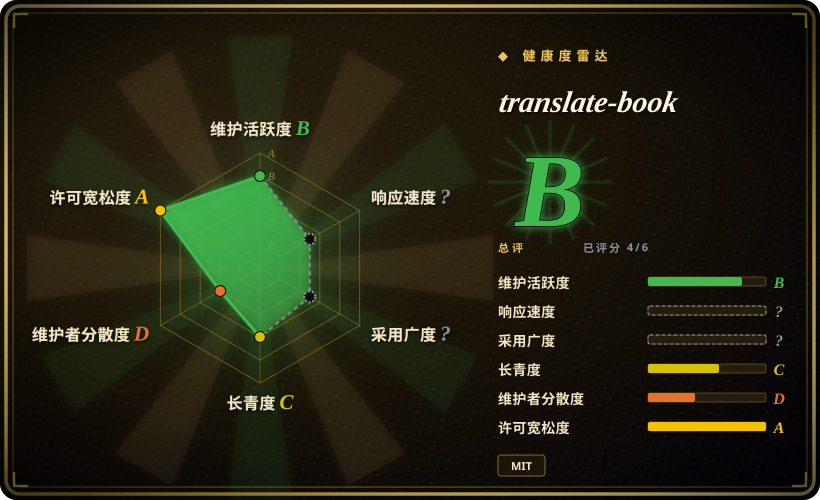

# translate-book

一个面向 Codex、Claude Code 和 OpenClaw 的 agent skill：用并行 subagent 把整本书（PDF/DOCX/EPUB）翻译成另一种语言，并带术语表＋相邻上下文机制来保证跨章节的术语与代词一致性。

## 何时使用

你是一名技术读者（或工程师），手上有一整本电子书——比如一本 300 页的英文 EPUB 或 PDF——想读中文版，而且你已经在用一个支持 skill 的 coding agent（Codex、Claude Code、OpenClaw）。把章节一段段贴进聊天窗口，到第十章一致性就崩了：同一个专有名词被翻出三种写法，“he”翻到一半性别都变了。你装上 translate-book（`npx skills add deusyu/translate-book`），把文件丢给 agent，它就跑完整条流水线：Calibre 把书转成约 6000 字符一个的 Markdown 分块，预建的 `glossary.json` 钉住每个术语的标准译法、以硬约束注入每个分块的提示词，每个分块还能看到相邻分块各约 300 字符的只读摘要来消解代词和实体指代，然后 8 个并行 subagent 开翻，manifest 哈希校验＋断点续跑，最后合并出 HTML/DOCX/EPUB/PDF。

你选它而不是 [bilingual_book_maker](../../../reading-tools/bilingual-book-maker.zh.md)，是因为你想让翻译跑在自己的 agent 订阅里（不用单独配 API key）、并且要的是专门的术语一致性机制，而不是一个直连 LLM API、产出双语对照电子书的可脚本化 CLI；你选它而不是 [claude_translater](claude-translater.zh.md)——它正是受这个项目启发——是因为它把同一条流水线重构成了可移植的 skill：并行 subagent、manifest 校验、选择性重翻，取代了串行 shell 脚本。

## 何时不用

- **你要的是可脚本化、无人值守的 CLI。** 如果你想要一条命令直连 LLM/MT API（OpenAI、Anthropic、DeepL、本地 Ollama……）跑完批处理、不驱动 agent 循环，用 [bilingual_book_maker](../../../reading-tools/bilingual-book-maker.zh.md)——translate-book 必须在交互式 agent harness 里编排 subagent，难以定时和托管。
- **你只翻网页或短文章。** 如果你的阅读场景在浏览器里，用 [Read Frog](../../../reading-tools/read-frog.zh.md) 或 [FluentRead](../../../reading-tools/fluentread.zh.md)——它们在你阅读时原地翻译，完全没有文件流水线。
- **你装不了 Calibre 和 Pandoc。** 两者都是硬前置（输入转换和成品构建都靠它们）。想要纯 Python 安装的话，bilingual_book_maker 只要 `pip` 加一个 API key。
- **你要双语对照输出。** translate-book 产出的是单一目标语言的成书。要双语对照的 epub/txt/srt，用 bilingual_book_maker。
- **你要出版级或法律安全的翻译。** 要出版或售卖的书，用专业 CAT 工具（如 Trados——未收录，商业软件）加人工翻译；这是一条带启发式一致性检查的 LLM 流水线，不是认证级工作流。
- **你要给关键管线下一个成熟赌注。** 项目才约 6 个月（创建于 2026-03-15）、单一维护者；如果寿命是决定性因素，选 2023 年 3 月活跃至今的 bilingual_book_maker 更稳。

## 横向对比

| 替代品 | 是否收录 | 我们的评价 | 取舍 |
|---|---|---|---|
| [bilingual_book_maker](../../../reading-tools/bilingual-book-maker.zh.md) | ✅ | 要可脚本化 CLI、直连 LLM/MT API、产出双语电子书时选 bilingual_book_maker；要让翻译跑在 coding agent 订阅里、并要显式的术语表／相邻上下文一致性机制时选 translate-book。 | bilingual_book_maker 更老（2023）、有 PyPI 包、后端无关、适合无人值守；translate-book 有逐块术语表、代词上下文和选择性重翻，但只能在 agent harness 里跑，且要装 Calibre＋Pandoc。 |
| [claude_translater](claude-translater.zh.md) | ✅ | 几乎任何情况下都选 translate-book 而不是它的灵感来源：同样是 Calibre→分块→翻译流水线，但它多了并行 subagent、manifest 校验、断点续跑和术语反馈环。 | claude_translater 是更早的 shell 脚本版（仅 Claude CLI、串行、无发布、无 LICENSE 文件）；translate-book 是重构后仍活跃维护的继任者——但 claude_translater 附带一个 PPTX 翻译器，translate-book 没有。 |
| [Baoyu Skills](../content-production/baoyu-skills.zh.md) | ✅ | 翻译只是内容流水线里一环（排版、发布、配图）时选 Baoyu Skills；任务明确就是一整本书时选 translate-book。 | Baoyu 的 `baoyu-translate` 是带术语表的三模式文本翻译 skill，不是带分块、manifest 校验和电子书输出的整书流水线——为一本书装上 20+ 个 skill 的合集，形状不对。 |
| [Read Frog](../../../reading-tools/read-frog.zh.md) | ✅ | 阅读发生在浏览器里、要原地双语覆盖时选 Read Frog；手上有电子书文件、要一本翻完的成品时选 translate-book。 | Read Frog 是面向网页和字幕的浏览器扩展（BYOK provider），永远不会产出你能收藏或发到 Kindle 的 EPUB/DOCX/PDF 译著。 |

## 健康度与可持续性

- **维护**：活跃——创建于 2026-03-15，最后 push 2026-09-07，约 55 个 commit；术语一致性的四期 roadmap（issue #7）已 ship 三期。无 tagged release，只能跟 `main`（截至 2026-09-18）。
- **治理／bus factor**：单一维护者（`deusyu`，登记在册 3 个 contributor）。README 明确声明 PR 不是首选贡献路径、可能被关掉、改成 maintainer 按 issue 自己重写——路线图刻意中心化，bus factor 为 1，外部影响力低。
- **背书与寿命（Lindy）**：无组织背书。约 6 个月的repo谈不上 Lindy 记录；这么年轻的仓库有 1.9k star，更像发布期的流量而非经过验证的生命力 [推断]。“年龄×仍活跃”的条件还无法满足——当作有潜力，而不是已被证明。
- **采用与生态**：通过 skills.sh 生态（`npx skills add`）装进三种 agent runtime；220 个 fork 说明有人在动手用，但独立可见的完整跑完整本书的报告很少 [未验证]。
- **风险信号**：MIT，干净。真实风险是项目年轻、单人治理，以及沉重的外部前置（Calibre＋Pandoc）；复杂 PDF 版式的成品保真度取决于 Calibre 的转换质量 [推断]。

## 存疑（未验证）

- [未验证] 术语表＋相邻上下文机制在真实 100+ 分块的书上到底能消掉多少术语漂移和代词错误，没有独立评测；项目自己的 roadmap（issue #7）把整书有机验证列为未来工作。
- [未验证] 每本书的翻译质量和成本完全取决于你跑在哪个 agent runtime、哪个模型上；官方没有公布基准数据。
- [未验证] 3 个 contributor 里可能含 bot 账号；有效人类维护者很可能只有 1 个。
- [推断] 约 6 个月积累的 1.9k star 多半来自发布期曝光（trending／社媒传播），不代表持续的生产采用。
- [推断] PDF 输入质量受限于 Calibre 的 `ebook-convert`——复杂版式、表格和数学公式可能在翻译开始前就已经退化。
- [未验证] README 声称支持七种目标语言（zh、en、ja、ko、fr、de、es）；各语言的输出质量此处未实测。
