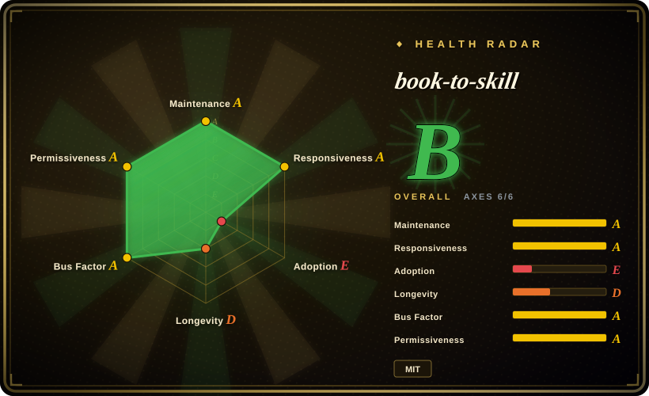
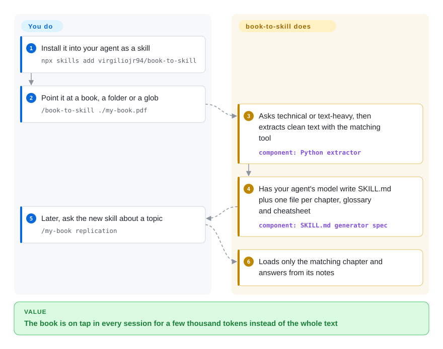

# book-to-skill

You bought a 400-page technical book, read it once, and three months later your coding agent either makes up what chapter 7 says or wants the whole PDF pasted in again at ~200K tokens a session. book-to-skill has your agent read the book once and write it up as a skill — a short index of the core ideas plus one small file per chapter — so later questions load only the chapter they need.

## When to use

You're an engineer working in Claude Code, Copilot CLI, Codex, Amp or OpenCode, and you keep a few reference books, an internal `docs/` folder or a pile of RFCs you consult constantly. Asking the agent about them fails one of two ways: it answers from vague training memory ("chapter 5 covers… something about replication"), or you paste the PDF and pay for 200K tokens on every turn while it re-reads the table of contents. You install book-to-skill as a skill, run `/book-to-skill ./designing-data-intensive-apps.pdf`, and after a one-time conversion costing roughly a dollar of model tokens you can type `/designing-data-intensive-apps replication` and get an answer grounded in that chapter's distilled notes.

You pick it over [MarkItDown](../document-parsing/markitdown.md) or [Docling](../document-parsing/docling.md) because those stop at clean Markdown — the agent would still re-read the whole text each time — while book-to-skill uses them (Docling is its technical-PDF extractor) and then synthesizes the skill structure on top. You pick it over a RAG stack such as [LlamaIndex](../agent-frameworks/workflow-builders/llamaindex.md) because there is no embedding store or server to run — the result is plain Markdown files your agent already knows how to load. And you pick it over [distilly](distilly.md) when the source is knowledge to consult, not a person whose judgment and voice you want imitated.

## How it works

The project has two halves. A deterministic Python extractor turns each source — PDF, EPUB, DOCX, HTML, RTF, MOBI, Markdown and more — into clean text plus metadata, choosing a fast text tool for prose books or Docling for technical ones with tables and code (it asks you which kind of book it is). Then the `SKILL.md` that you installed instructs **your own agent** — the model you are already paying for — to read that text, detect the chapters, and write the output: a front-loaded `SKILL.md` with the book's core mental models and a chapter index (~4K tokens), one ~1K-token summary per chapter, a glossary, a patterns file and a cheatsheet. Think of it as your agent taking structured study notes once, so future sessions open the notebook to one page instead of re-reading the book. The files land in the shared `~/.agents/skills/<slug>/` folder (with a verified symlink into `~/.claude/skills/` under Claude Code); you choose the source, the slug, and whether to optionally publish the skill to a private GitHub repo.

<!-- flow-steps:begin (generated from flows/book-to-skill.json by tools/flow_card.py — do not edit) -->

Text version of the flow

1. **You**: Install it into your agent as a skill — `npx skills add virgiliojr94/book-to-skill`
2. **You**: Point it at a book, a folder or a glob — `/book-to-skill ./my-book.pdf`
3. **book-to-skill**: Asks technical or text-heavy, then extracts clean text with the matching tool — component: `Python extractor`
4. **book-to-skill**: Has your agent's model write SKILL.md plus one file per chapter, glossary and cheatsheet — component: `SKILL.md generator spec`
5. **You**: Later, ask the new skill about a topic — `/my-book replication`
6. **book-to-skill**: Loads only the matching chapter and answers from its notes

**Value**: The book is on tap in every session for a few thousand tokens instead of the whole text

<!-- flow-steps:end -->

## When NOT to use

- **You need exact text, not synthesized notes.** The generator deliberately "never copies raw passages" — it summarizes into frameworks and rules, so an exact clause of a spec or a precise table can be lost. When verbatim fidelity matters, convert with [Docling](../document-parsing/docling.md) and keep the Markdown alongside, or write the `SKILL.md` by hand.
- **The corpus is large or changes daily.** Each source is a one-shot LLM conversion (~$1 per book in the project's own estimate) and must be re-run or folded in when the source changes. For thousands of documents or live sources, use a retrieval pipeline such as [LlamaIndex](../agent-frameworks/workflow-builders/llamaindex.md).
- **Your book has no "Chapter N" headings or is a scanned PDF.** Auto-detection needs explicit chapter headings (the docs show *Pro Git* and *Moby-Dick* not auto-segmenting), and scanned PDFs have no text layer — the extractor stops and tells you to run `ocrmypdf` first. If you can't do that preparation, use [MarkItDown](../document-parsing/markitdown.md) for a flat conversion instead.
- **The content must not leave your machine.** Extraction is local, but the distillation is done by your agent's model, so a cloud-hosted agent receives the whole book text. For confidential material, run the agent against a local model or keep it in a self-hosted RAG stack.
- **You want to share skills built from books you bought.** The README says skills generated from copyrighted third-party books must stay private; the publish step defaults to a private repo for that reason. For shareable knowledge packs, build from your own or openly licensed material, or use curated packs such as [Waza](engineering/waza.md).
- **Your agent has no skill support.** Output is an Agent Skills `SKILL.md` folder. If your harness can't load skills, use [MarkItDown](../document-parsing/markitdown.md) to produce Markdown you can attach manually.

## Comparison

| Alternative | In index | Our verdict | Tradeoff |
|---|---|---|---|
| [Docling](../document-parsing/docling.md) | ✅ | Pick Docling when you need faithful Markdown or JSON of a document for your own pipeline; pick book-to-skill when the goal is an agent skill you query by chapter. | Docling keeps tables and code exactly and needs no LLM, but leaves structuring and retrieval to you; book-to-skill calls Docling and then spends model tokens to synthesize notes. |
| [MarkItDown](../document-parsing/markitdown.md) | ✅ | Pick MarkItDown for a quick, free conversion to Markdown when the agent can afford to read it whole; pick book-to-skill when the book is too big to load every session. | MarkItDown is one command with no model cost; the output is flat text, so the per-session token bill stays. |
| [distilly](distilly.md) | ✅ | Pick distilly when the source is one person's traces and you want the agent to imitate their judgment; pick book-to-skill when the source is reference knowledge to consult. | distilly produces behavior and voice rules; book-to-skill produces chapter notes, glossary and cheatsheets. |
| [LlamaIndex](../agent-frameworks/workflow-builders/llamaindex.md) | ✅ | Pick LlamaIndex for retrieval over a large or changing corpus; pick book-to-skill for a handful of books you want as static, installable notes. | LlamaIndex needs embeddings, a store and code; book-to-skill needs nothing running but must be re-run when sources change. |
| [NotebookLM Claude Code Skill](context-engineering/notebooklm-skill.md) | ✅ | Treat this archived skill as a pattern source only; pick book-to-skill when you want local files rather than answers routed through Google NotebookLM. | NotebookLM gives citation-backed answers but depends on Google's UI and service, and the repo was archived in 2026-09; book-to-skill output is files you own. |

## Tech stack

- **Python ≥ 3.9** extractor (`scripts/extract.py` / `book_to_skill` package), with format parsers for PDF, EPUB, DOCX, HTML, RTF, MOBI/AZW (via Calibre), TXT, Markdown, reStructuredText and AsciiDoc.
- **PDF extraction:** `pdftotext` (poppler) → `pypdf` → `pdfminer.six` for prose; `docling` for technical books; `pdf-inspector` in the `pdf` extra.
- **Generator:** a `SKILL.md` spec executed by the host agent's LLM, plus `tools/validate_skill.py` to check output against per-host rules and `tools/discovery_tax.py` for token measurements.
- **Output format:** the open Agent Skills standard (`SKILL.md` + on-demand chapter files).

## Dependencies

- **A skill-capable coding agent and its model** — Claude Code, Copilot CLI, Codex, Amp, OpenCode, OpenClaw or Hermes Agent. The model does the distillation, so its token cost is the main running cost.
- **Optional extractors per format:** `poppler-utils`, `pypdf`, `pdfminer.six`, `docling` (slow on CPU, ~1.5 s/page), `ebooklib` + `beautifulsoup4`, `python-docx`, `striprtf`, Calibre for MOBI. `python3 scripts/extract.py --check` reports what is missing.
- **Optional:** the `gh` CLI if you publish generated skills to GitHub; `ocrmypdf` for scanned PDFs.
- No database, server or GPU.

## Ops difficulty

**Low.** Install is a `git clone` into your skills folder or `npx skills add virgiliojr94/book-to-skill`; the standalone pip CLI (installed from the git URL — not on PyPI) gives only the extractor. Nothing runs between conversions. The real work is per book: picking the extraction mode, fixing chapter segmentation when headings are non-standard, OCR-ing scans, and re-running or folding in when sources change.

## Health & viability

- **Maintenance (2026-10-08):** active — commits within the last few days, semver releases from v1.0.0 (2026-06-08) to v1.4.0 (2026-08-10), a changelog, a pytest suite and evals.
- **Governance:** a personal-account project — the maintainer (`virgiliojr94`) owns the roadmap and merges, but contributions are broad: 51 active contributors in the last 12 months and the top contributor's share is about 40% (radar governance moved from B to A in this re-score). Bus factor for decisions is still one person, funded via GitHub Sponsors.
- **Age / Lindy:** created 2026-05-01 (~5 months). No Lindy record; treat as young.
- **Adoption:** ~34k stars and ~3.6k forks in five months (as of 2026-10), plus a community use-case index. The growth is real attention but far ahead of any production track record; a star curve this steep on a tool this young is a hype signal as much as an adoption one.
- **Risk flags:** MIT license, clean. A **malicious re-upload** (`Leutenegger/book-to-skill`) that steals wallet data was reported in the repo's SECURITY-NOTICE (2026-08-17) — install only from `virgiliojr94/book-to-skill`. The Agent Skills format and host skill paths are still moving, which is why the docs carry per-host install notes.

## Caveats (unverified)

- [未验证] The "24×–51× fewer tokens" and "~$1 per book" figures are the project's own measurements on a few books and one model (Claude Sonnet 4.5 pricing); this page did not reproduce them.
- [未验证] Compatibility with each host (Copilot CLI, Amp, Codex, OpenCode, OpenClaw, Hermes Agent) is as claimed by the README and `validate_skill.py`; not tested here.
- [未验证] Quality of the synthesized chapter notes depends on the host model; nuanced detail, code and cross-references may be compressed away.
- [推断] Star velocity (~34k in five months) is likely amplified by social-media trending rather than proportional to production use.
