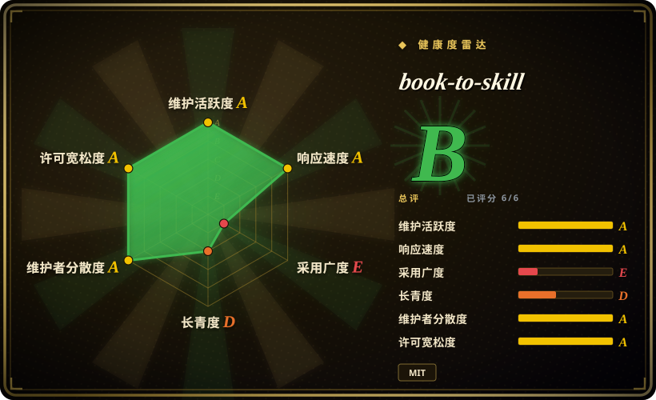
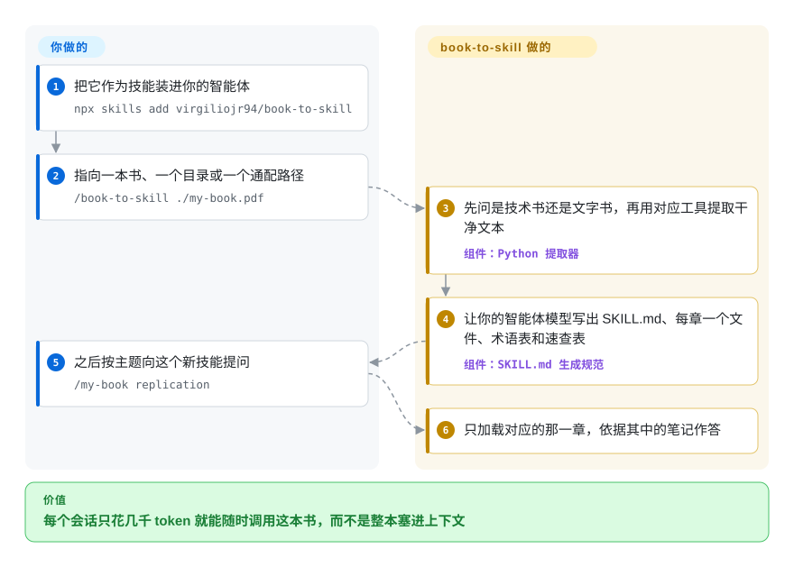

# book-to-skill

你买了一本 400 页的技术书，读过一遍，三个月后再问编码智能体，它要么编造第 7 章讲了什么，要么让你把整本 PDF 再贴一次，每个会话约 20 万 token。book-to-skill 让你的智能体只读一遍这本书，把它写成一个技能：一页核心思想索引，外加每章一个小文件，以后提问只加载需要的那一章。

## 何时使用

你在 Claude Code、Copilot CLI、Codex、Amp 或 OpenCode 里写代码，手边有几本常翻的参考书、一个内部 `docs/` 目录或一摞 RFC。问智能体时总是两种失败：要么它凭训练时的模糊印象作答（“第 5 章讲的是……大概跟复制有关”），要么你把 PDF 贴进去，每一轮都为 20 万 token 买单，看它一遍遍重读目录。你把 book-to-skill 作为技能装上，运行 `/book-to-skill ./designing-data-intensive-apps.pdf`，花大约一美元的模型 token 做一次转换，之后输入 `/designing-data-intensive-apps replication`，就能拿到基于那一章提炼笔记的回答。

和 [MarkItDown](../document-parsing/markitdown.zh.md) 或 [Docling](../document-parsing/docling.zh.md) 比，选它是因为那两个停在“干净的 Markdown”，智能体每次还得把全文重读一遍；book-to-skill 会先用它们（Docling 就是它处理技术类 PDF 的提取器），再在上面合成技能结构。和 [LlamaIndex](../agent-frameworks/workflow-builders/llamaindex.zh.md) 这类 RAG 方案比，选它是因为不用跑 embedding 存储或服务，产物就是智能体本来就会加载的 Markdown 文件。和 [distilly](distilly.zh.md) 比，当素材是要查阅的知识、而不是要模仿其判断和口吻的某个人时，选 book-to-skill。

## 怎么用起来

项目分两半。一半是确定性的 Python 提取器：把每份源文件（PDF、EPUB、DOCX、HTML、RTF、MOBI、Markdown 等）转成干净文本加元数据；它会先问你这是偏文字的书还是技术书，文字书用快速的文本工具，带表格和代码的技术书用 Docling。另一半是你装上的那个 `SKILL.md`，它指挥**你自己的智能体**（也就是你本来就在付费用的那个模型）去读这些文本、识别章节、写出产物：一个把核心思维模型和章节索引放在最前面的 `SKILL.md`（约 4K token），每章一份约 1K token 的摘要，一个术语表、一个模式文件和一张速查表。可以把它想成智能体一次性做好一本结构化的读书笔记，以后每个会话只翻到其中一页，而不是重读整本书。文件写进共享的 `~/.agents/skills/<slug>/` 目录（在 Claude Code 下还会建一个经过读回校验的软链到 `~/.claude/skills/`）；选哪份源、起什么名字、要不要把技能推到一个私有 GitHub 仓库，由你决定。

<!-- flow-steps:begin (generated from flows/book-to-skill.json by tools/flow_card.py — do not edit) -->

流程文字版

1. **你**：把它作为技能装进你的智能体 — `npx skills add virgiliojr94/book-to-skill`
2. **你**：指向一本书、一个目录或一个通配路径 — `/book-to-skill ./my-book.pdf`
3. **book-to-skill**：先问是技术书还是文字书，再用对应工具提取干净文本 — 组件：`Python 提取器`
4. **book-to-skill**：让你的智能体模型写出 SKILL.md、每章一个文件、术语表和速查表 — 组件：`SKILL.md 生成规范`
5. **你**：之后按主题向这个新技能提问 — `/my-book replication`
6. **book-to-skill**：只加载对应的那一章，依据其中的笔记作答

**价值**：每个会话只花几千 token 就能随时调用这本书，而不是整本塞进上下文

<!-- flow-steps:end -->

## 何时不用

- **你要原文，不要提炼后的笔记。** 生成器刻意“从不照抄原文段落”，它把内容概括成框架和规则，所以规范里的某条原句、某张精确的表可能丢失。逐字保真重要时，用 [Docling](../document-parsing/docling.zh.md) 转换并把 Markdown 一起留着，或者手写 `SKILL.md`。
- **语料很大，或者每天都在变。** 每份源都是一次性的 LLM 转换（项目自己估算每本书约 1 美元），源一变就得重跑或做增量合并。上千份文档或实时数据源，用 [LlamaIndex](../agent-frameworks/workflow-builders/llamaindex.zh.md) 这类检索管线。
- **书里没有“Chapter N”式标题，或者是扫描版 PDF。** 自动分章需要明确的章节标题（文档里就举了 *Pro Git* 和 *Moby-Dick* 无法自动分章的例子）；扫描版 PDF 没有文本层，提取器会直接停下，让你先跑 `ocrmypdf`。做不了这些准备时，用 [MarkItDown](../document-parsing/markitdown.zh.md) 做一次扁平转换。
- **内容不能离开你的机器。** 提取在本地，但提炼由智能体的模型完成，用云端模型的智能体会收到整本书的文本。机密材料要么让智能体接本地模型，要么放进自托管的 RAG 方案。
- **你想把买来的书做成技能分享出去。** README 明确说，用受版权保护的第三方书籍生成的技能必须保持私有，发布步骤也因此默认建私有仓库。想要可分享的知识包，就用自己的或开放许可的材料来做，或者用现成的精选技能包，例如 [Waza](engineering/waza.zh.md)。
- **你的智能体不支持技能。** 产物是 Agent Skills 标准的 `SKILL.md` 目录。宿主加载不了技能时，用 [MarkItDown](../document-parsing/markitdown.zh.md) 生成 Markdown 手动附上。

## 横向对比

| 替代品 | 是否收录 | 我们的评价 | 取舍 |
|---|---|---|---|
| [Docling](../document-parsing/docling.zh.md) | ✅ | 你的管线需要忠实的 Markdown 或 JSON 时选 Docling；目标是一个能按章查询的智能体技能时选 book-to-skill。 | Docling 精确保留表格和代码、不需要 LLM，但结构化和检索要你自己做；book-to-skill 调用 Docling 之后再花模型 token 合成笔记。 |
| [MarkItDown](../document-parsing/markitdown.zh.md) | ✅ | 想要一条命令、零模型成本地转成 Markdown，且智能体读得起全文时选 MarkItDown；书太大、没法每个会话都加载时选 book-to-skill。 | MarkItDown 一条命令、不花模型钱；产物是扁平文本，每个会话的 token 账单照旧。 |
| [distilly](distilly.zh.md) | ✅ | 素材是某个人的痕迹、想让智能体模仿其判断时选 distilly；素材是要查阅的参考知识时选 book-to-skill。 | distilly 产出行为和口吻规则；book-to-skill 产出章节笔记、术语表和速查表。 |
| [LlamaIndex](../agent-frameworks/workflow-builders/llamaindex.zh.md) | ✅ | 要在大规模或不断变化的语料上做检索时选 LlamaIndex；只有几本书、想要静态可安装的笔记时选 book-to-skill。 | LlamaIndex 需要 embedding、存储和代码；book-to-skill 什么都不用常驻，但源一变就得重跑。 |
| [NotebookLM Claude Code Skill](context-engineering/notebooklm-skill.zh.md) | ✅ | 这个技能已归档，只把它当设计参考；想要本地文件、而不是经 Google NotebookLM 转一道的回答时选 book-to-skill。 | NotebookLM 能给带引用的回答，但依赖 Google 的界面和服务，仓库已于 2026-09 归档；book-to-skill 的产物是你自己拥有的文件。 |

## 技术栈

- **Python ≥ 3.9** 提取器（`scripts/extract.py` / `book_to_skill` 包），带 PDF、EPUB、DOCX、HTML、RTF、MOBI/AZW（经 Calibre）、TXT、Markdown、reStructuredText、AsciiDoc 的格式解析器。
- **PDF 提取：** 文字书走 `pdftotext`（poppler）→ `pypdf` → `pdfminer.six`；技术书走 `docling`；`pdf` 可选依赖里还有 `pdf-inspector`。
- **生成器：** 一份由宿主智能体的 LLM 执行的 `SKILL.md` 规范，外加按宿主规则校验产物的 `tools/validate_skill.py` 和测 token 的 `tools/discovery_tax.py`。
- **产物格式：** 开放的 Agent Skills 标准（`SKILL.md` + 按需加载的章节文件）。

## 依赖

- **一个支持技能的编码智能体及其模型**：Claude Code、Copilot CLI、Codex、Amp、OpenCode、OpenClaw 或 Hermes Agent。提炼由模型完成，它的 token 费用是主要运行成本。
- **按格式可选的提取器：** `poppler-utils`、`pypdf`、`pdfminer.six`、`docling`（CPU 上慢，约 1.5 秒/页）、`ebooklib` + `beautifulsoup4`、`python-docx`、`striprtf`，MOBI 需要 Calibre。`python3 scripts/extract.py --check` 会列出缺什么。
- **可选：** 要把生成的技能发布到 GitHub 需要 `gh` CLI；扫描版 PDF 需要 `ocrmypdf`。
- 不需要数据库、服务或 GPU。

## 运维难度

**低。** 安装就是 `git clone` 进技能目录，或 `npx skills add virgiliojr94/book-to-skill`；独立的 pip CLI（从 git 地址安装，不在 PyPI 上）只包含提取器。两次转换之间没有任何东西在运行。真正的工作量在每本书上：选提取模式，章节标题不规范时修正分章，给扫描件做 OCR，源变了就重跑或增量合并。

## 健康度与可持续性

- **维护（2026-10-08）：** 活跃，最近几天仍有提交，按语义化版本从 v1.0.0（2026-06-08）发到 v1.4.0（2026-08-10），有 changelog、pytest 测试和评测集。
- **治理：** 个人账号下的项目，维护者（`virgiliojr94`）掌握路线图和合并权，但贡献面很广：过去 12 个月有 51 位活跃贡献者，第一贡献者占比约 40%（本次重算雷达的治理轴从 B 升到 A）。决策层面的 bus factor 仍是一个人，资金来自 GitHub Sponsors。
- **年龄与 Lindy：** 2026-05-01 创建（约 5 个月），没有 Lindy 记录，按年轻项目对待。
- **采用：** 截至 2026-10，五个月内约 3.4 万 star、约 3.6 千 fork，还有一个社区用例索引。关注度是真的，但远远跑在生产使用记录前面；这么年轻的工具有这么陡的 star 曲线，既是采用信号，也是炒作信号。
- **风险信号：** MIT 许可证，干净。仓库的 SECURITY-NOTICE（2026-08-17）通报了一个**恶意重新上传的仓库**（`Leutenegger/book-to-skill`），会窃取加密钱包数据，只从 `virgiliojr94/book-to-skill` 安装。Agent Skills 格式和各宿主的技能目录仍在变化，所以文档里有逐个宿主的安装说明。

## 存疑（未验证）

- [未验证] “token 少 24–51 倍”和“每本书约 1 美元”是项目自己在几本书、一个模型（按 Claude Sonnet 4.5 价格）上的测量，本页没有复现。
- [未验证] 与各宿主（Copilot CLI、Amp、Codex、OpenCode、OpenClaw、Hermes Agent）的兼容性依据 README 和 `validate_skill.py` 的说法，本页没有实测。
- [未验证] 合成的章节笔记质量取决于宿主模型；细微的细节、代码和交叉引用可能在压缩中丢失。
- [推断] star 增速（五个月约 3.4 万）很可能被社交媒体热榜放大，与生产使用量不成比例。
