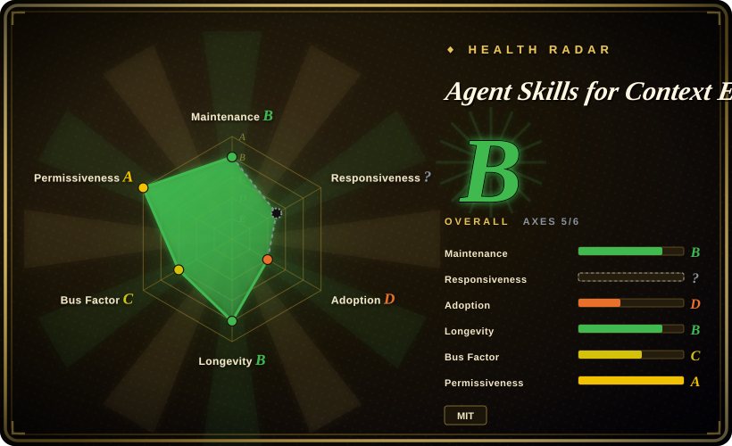
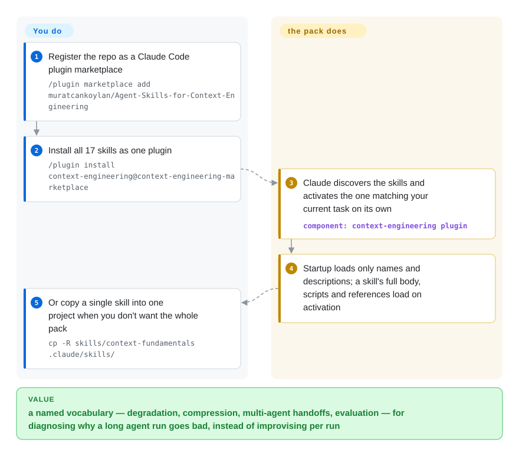

# Agent Skills for Context Engineering

Long agent runs rot on context: stale tool output fills the window, the agent forgets decisions it already made, a sub-agent gets the wrong slice of state. This pack installs 17 named skills — degradation, compression, multi-agent handoffs, memory, evaluation, harness engineering — that give a coding agent a vocabulary and checklist for diagnosing and fixing that, instead of you improvising per run.

## When to use

You're an agent engineer building a multi-agent or long-running agent system, and your runs keep falling over for context reasons: the window fills with stale tool output, the agent "forgets" earlier decisions mid-task, a sub-agent gets handed the wrong slice of state, or your retrieval dumps so much into the prompt that quality degrades instead of improving. You know roughly *that* it's a context problem, but you don't have a vocabulary or a checklist for diagnosing which failure mode you're in or how to fix it. This pack gives your agent a curated set of on-demand skills — `context-fundamentals`, `context-degradation`, `context-compression`, `context-optimization`, `multi-agent-patterns`, `long-horizon-prompting`, `memory-systems`, `tool-design`, `filesystem-context`, `hosted-agents`, `latent-briefing`, `evaluation`, `advanced-evaluation`, `harness-engineering`, `self-improvement-loops`, `project-development`, `bdi-mental-states` (17 as of 2026-09) — each shipping a `SKILL.md` plus reference docs and demonstration scripts, so the agent loads the relevant one when a task touches that area.

You reach for it when you want an opinionated, pre-built corpus rather than authoring your own context-management skills from scratch — a corpus the README says is cited in academic work (a Meta Context Engineering paper and an agent-harness survey list it as foundational on static skill architecture), which is a stronger provenance signal than most skill packs carry. It installs as a Claude Code plugin through its bundled marketplace manifest (`/plugin marketplace add … && /plugin install context-engineering@context-engineering-marketplace`); individual skill folders can be copied into `.claude/skills/`, `.cursor/skills/`, `.codex/skills/`, or `.agents/skills/`, and the repo also ships an Open Plugins manifest so Cursor/Codex-family hosts can discover it — though activation fidelity outside Claude Code is README-claimed, not verified here.

## How it works

Each skill is a directory following the Agent Skills spec: a `SKILL.md` holding metadata plus the instructions the agent loads, with optional `scripts/` and `references/` siblings; the README asks for skill bodies under 500 lines. The repo ships one as a Claude Code plugin marketplace (its own manifest) and doubles as an Open Plugins package (`.plugin/plugin.json`) that Cursor, Codex, or Copilot CLI hosts can read — or you copy a single skill folder into a project's skills directory. At startup the host sees only skill names and descriptions; when your task matches a skill's activation scenario, the full body loads on demand — that "progressive disclosure" is what keeps a 17-skill corpus from eating the very context it exists to manage. What it does for you: the diagnostic vocabulary and checklists — degradation patterns, compression strategies, handoff rules, evaluation harness design, self-improvement-loop gates — plus demonstration scripts written as portable Python pseudocode. What stays yours: judging which advice fits your system and implementing it; nothing here executes or enforces, and the router-accuracy benchmarks the README reports for its own skills are self-measured. Pin a tag or commit if you need reproducibility — plugin installs track the live tree.

<!-- flow-steps:begin (generated from flows/context-engineering-skills.json by tools/flow_card.py — do not edit) -->

Text version of the flow

1. **You**: Register the repo as a Claude Code plugin marketplace — `/plugin marketplace add muratcankoylan/Agent-Skills-for-Context-Engineering`
2. **You**: Install all 17 skills as one plugin — `/plugin install context-engineering@context-engineering-marketplace`
3. **Agent Skills for Context Engineering**: Claude discovers the skills and activates the one matching your current task on its own — component: `context-engineering plugin`
4. **Agent Skills for Context Engineering**: Startup loads only names and descriptions; a skill's full body, scripts and references load on activation
5. **You**: Or copy a single skill into one project when you don't want the whole pack — `cp -R skills/context-fundamentals .claude/skills/`

**Value**: a named vocabulary — degradation, compression, multi-agent handoffs, evaluation — for diagnosing why a long agent run goes bad, instead of improvising per run

<!-- flow-steps:end -->

## When NOT to use

- **You already maintain your own context/memory skill stack.** This pack is broad and opinionated (17 skills with their own routing). Layering it over an existing curated system invites overlapping, conflicting guidance on compression, memory, and multi-agent patterns — pick one source of truth rather than double-routing.
- **You're not on a supported harness.** Activation depends on a plugin/skill loader. It's built first for Claude Code (plugin marketplace manifest); Cursor/Codex support rides on the Open Plugins manifest per the README. On a bespoke or unsupported agent there's no loader to fire the skills, and the markdown alone won't auto-activate.
- **You want a runnable library/CLI.** This is a behavior-shaping skill corpus, not a package you `import`. The bundled scripts demonstrate concepts in pseudocode — outside a supporting agent the skills do nothing. If you want enforcement, you must build the harness yourself; `harness-engineering` is advice on how.
- **Advisory, not enforced.** Behavior lives in prompt/markdown skills the agent chooses to load and follow. There is no runtime that forces correct context handling — the agent can still ignore a skill or mis-route.
- **You need a stable, frozen spec.** The newest tag is still v2.3.0 (2026-05-22) while `main` keeps landing new skills (last default-branch commit 2026-08-10; skill count went 15→17 between our checks) — plugin installs track the live tree, so names, count, and routing shift without a release. Pin a commit if you depend on a specific skill's behavior.

## Comparison

| Alternative | In index | Our verdict | Tradeoff |
|---|---|---|---|
| [notebooklm-skill](notebooklm-skill.md) | ✅ | Treat notebooklm-skill as a fork-and-read pattern source — its repo was archived in 2026-09; pick it only if you need a one-shot NotebookLM doc bridge in Claude Code and will own the fork. | Sibling in this leaf, but a single narrow retrieval bridge (NotebookLM-style document grounding), not a context-management methodology. This pack stays maintained and covers the whole diagnosis-and-fix space. |
| [Superpowers](../../agent-dev-methodology/coding-agent-harnesses/superpowers.md) | ✅ | Choose Superpowers when the need is full SDLC methodology rather than context-window engineering. | Full SDLC methodology (brainstorm→plan→TDD→verify) as a skill plugin; overlaps on the "install a curated skill bundle" form but targets the *software-development loop*, not context-window engineering. Complementary, not a substitute. |
| Anthropic's own context-engineering guidance / built-in skills | 未收录 | Choose first-party Anthropic guidance when native platform behavior matters more than a third-party corpus. | The platform's first-party docs and native skills; this is a third-party corpus layered on top, so it can duplicate or conflict with native guidance and must be reconciled. |
| Hand-rolled context/memory skills in your own repo | 未收录 | Choose custom skills when maximum fit and zero lock-in outweigh a ready-made corpus. | Maximum fit and zero lock-in, but you author and maintain everything. This pack trades some fit for a ready-made corpus with published router benchmarks (self-reported). |

## Health & viability

- **Responsiveness**: Cannot be scored — type_na.
- **Maintenance (2026-09):** **active but release-quiet** — not archived; last default-branch commit 2026-08-10, latest tag still v2.3.0 (2026-05-22), with new skills (long-horizon-prompting, self-improvement-loops, hosted-agents…) landing on `main` between tags. Growth is tree-first, version-second; the skill count shifted 15→17 since the June snapshot.
- **Governance / bus factor:** a **single-maintainer, `User`-owned** repo (`muratcankoylan`) carrying 18.0k stars (2026-09) — that popularity-vs-bus-factor mismatch is a real fragility flag: a heavily-starred personal repo has no team or org continuity if the author steps away. [推断]
- **Backing & recognition:** cited as foundational on static skill architecture in two academic works listed in the README (a PKU "Meta Context Engineering" paper and a multi-university "Agent Harness Engineering" survey) — unusual external validation for a skill pack, though the citations confirm influence, not upkeep. [未验证]
- **Age & Lindy verdict:** created 2025-12, ~9 months old — still **unproven** on Lindy, riding the 2026 skill-pack wave. It's a corpus of advice, not load-bearing runtime, so the downside if it goes stale is lower than for a library, but don't treat its longevity as established.
- **Risk flags:** advisory-only (prompt/markdown the agent may ignore), Claude-Code-first activation (other harnesses are README-claimed via Open Plugins), self-reported router-benchmark numbers, and no release for ~4 months despite a moving tree — pin a commit for reproducibility. MIT, no relicense/CVE concerns for a skill corpus.

## Caveats (unverified)

- [未验证] GitHub metadata verified 2026-09-27 (license MIT, language Python, not archived, 18.0k stars, latest release v2.3.0 of 2026-05-22, default-branch tip 2026-08-10); skill *behavior* — routing quality, benchmark numbers — was not executed or reproduced in this pass.
- [未验证] The 17-skill list matches the live `skills/` tree on 2026-09-27 (per-skill `SKILL.md` + `scripts/` + `references/`), but names and count have already shifted 15→17 between index checks — read the current tree rather than trusting this list.
- [未验证] Cursor / Codex / Copilot-CLI activation via the `.plugin/plugin.json` Open Plugins manifest, and activation fidelity outside Claude Code, are README claims — not independently confirmed here.
- [未验证] Router-benchmark figures (per-model top-1 accuracy, hardening deltas) and the two academic citations are project-reported in the README, not independently reproduced or fetched.
- [推断] Because behavior is prompt/markdown loaded by the agent, enforcement is advisory — "patterns" are instructions, not hard runtime guarantees; the agent can still deviate.
