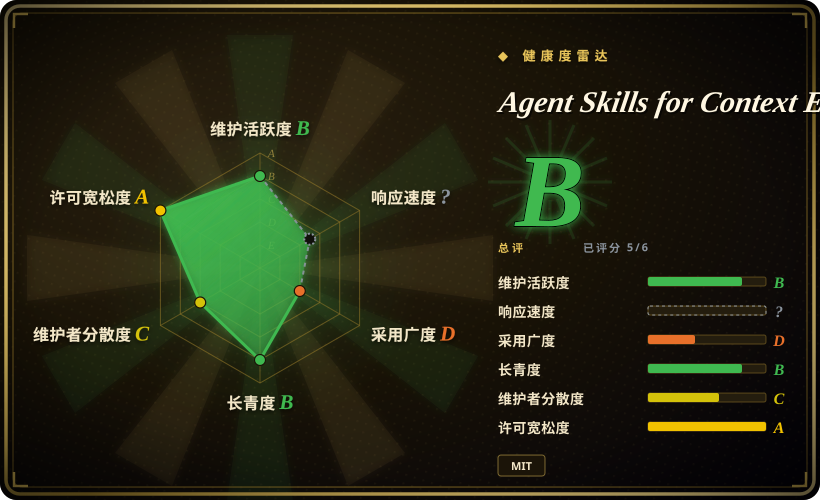
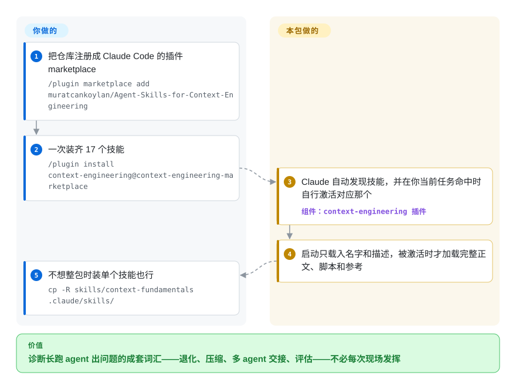

# Agent Skills for Context Engineering

长跑的 agent 会坏在上下文上：窗口塞满陈旧的工具输出、agent 忘了自己早先的决策、子 agent 拿到错的状态切片。这个包装进 17 个具名技能——退化、压缩、多 agent 交接、记忆、评估、harness 工程——给你的 coding agent 一套诊断词汇和清单，而不是你每次现场发挥。

## 何时使用

你是搭多 agent 或长跑 agent 系统的工程师，而你的 run 总因为上下文问题崩掉：窗口被陈旧的工具输出塞满、agent 在任务中途「忘掉」早先的决策、子 agent 拿到了错误的状态切片、或者检索把太多内容灌进 prompt 反而拉低了质量。你大致知道这*是*个上下文问题，但没有一套词汇或清单来判断自己落在哪种 failure mode、该怎么修。这个包给你的 agent 一组按需加载的技能——`context-fundamentals`、`context-degradation`、`context-compression`、`context-optimization`、`multi-agent-patterns`、`long-horizon-prompting`、`memory-systems`、`tool-design`、`filesystem-context`、`hosted-agents`、`latent-briefing`、`evaluation`、`advanced-evaluation`、`harness-engineering`、`self-improvement-loops`、`project-development`、`bdi-mental-states`（2026-09 实测 17 个）——每个都带一份 `SKILL.md` 外加参考文档和演示脚本，任务触及哪个领域，agent 就加载对应那个。

当你想要一套现成、有主见的语料，而不是从零自己写上下文管理技能时，你会选它——README 称该仓库被学术工作引用为静态 skill 架构的奠基文献（一篇 Meta Context Engineering 论文和一篇 agent harness 综述把它列为来源），这种出处比多数 skill 包硬。它以插件方式装进 Claude Code（走自带的 marketplace 清单：`/plugin marketplace add … && /plugin install context-engineering@context-engineering-marketplace`）；单个技能目录也可拷进 `.claude/skills/`、`.cursor/skills/`、`.codex/skills/` 或 `.agents/skills/`；仓库还随附 Open Plugins 清单，Cursor/Codex 系宿主可据此发现它——但在 Claude Code 之外的激活保真度是 README 声称，未经本索引验证。

## 怎么用起来

每个技能是一个按 Agent Skills 规范组织的目录：`SKILL.md` 装元数据和给 agent 读的指令，可选的 `scripts/` 和 `references/` 作伴；README 要求技能正文不超过 500 行。仓库把自己同时包装成 Claude Code 插件 marketplace（自带清单）和一份 Open Plugins 插件（`.plugin/plugin.json`），后者可被 Cursor、Codex 或 Copilot CLI 宿主读取——或者你干脆只拷一个技能目录进项目。启动时宿主只看见技能的名字和描述；当你的任务命中某个技能的激活场景，它的完整正文才被按需载入——这套「渐进披露」正是 17 技能语料反过来不吞噬它所管理的上下文的原因。它替你做：把诊断词汇与清单——退化模式、压缩策略、交接规则、评估框架设计、自我改进循环的门禁——连同演示概念的可移植 Python 伪代码脚本一并备好。留给你的：判断哪条建议贴合你的系统并落地执行——这里没有代码替你运行或强制什么，README 里自家技能的路由准确率 benchmark 也是自测的。要可复现就 pin 一个 tag 或 commit——插件安装跟的是活动目录树。

<!-- flow-steps:begin (generated from flows/context-engineering-skills.json by tools/flow_card.py — do not edit) -->

流程文字版

1. **你**：把仓库注册成 Claude Code 的插件 marketplace — `/plugin marketplace add muratcankoylan/Agent-Skills-for-Context-Engineering`
2. **你**：一次装齐 17 个技能 — `/plugin install context-engineering@context-engineering-marketplace`
3. **Agent Skills for Context Engineering**：Claude 自动发现技能，并在你当前任务命中时自行激活对应那个 — 组件：`context-engineering 插件`
4. **Agent Skills for Context Engineering**：启动只载入名字和描述，被激活时才加载完整正文、脚本和参考
5. **你**：不想整包时装单个技能也行 — `cp -R skills/context-fundamentals .claude/skills/`

**价值**：诊断长跑 agent 出问题的成套词汇——退化、压缩、多 agent 交接、评估——不必每次现场发挥

<!-- flow-steps:end -->

## 何时不用

- **你已经在维护自己的上下文/记忆技能栈。** 这个包又广又有主见（17 个技能各有自己的路由）。把它叠在既有的精选体系上，会在压缩、记忆、多 agent 模式上引入重叠、冲突的指导——选一个事实源，别双路由。
- **你不在受支持的 harness 上。** 激活依赖插件/skill 加载器。它首先是为 Claude Code 构建的（插件 marketplace 清单）；Cursor/Codex 支持走 README 声称的 Open Plugins 清单路径。在自研或不受支持的 agent 上没有加载器来触发这些技能，光有 markdown 不会自动激活。
- **你要的是可运行的库/CLI。** 这是塑造行为的技能语料，不是你能 `import` 的包。自带脚本以伪代码演示概念；脱离支持它的 agent，这些技能什么都不做。要强制力就得自己搭 harness——`harness-engineering` 只是告诉你怎么搭的建议。
- **是建议，不是强制。** 行为都活在 agent 自行选择加载并遵循的 prompt/markdown 里。没有运行时去强制正确的上下文处理——agent 仍可能忽略某个技能或路由错。
- **你需要一份稳定、冻结的规范。** 最新 tag 仍停在 v2.3.0（2026-05-22），而 `main` 持续在落新技能（默认分支最近提交 2026-08-10；本索引两次核查之间技能数已从 15 涨到 17）——插件安装跟的是活动目录树，名称、数量、路由会在不发版的情况下漂移。若依赖某个技能的具体行为，请 pin 到 commit。

## 横向对比

| 替代品 | 是否收录 | 我们的评价 | 取舍 |
|---|---|---|---|
| [notebooklm-skill](notebooklm-skill.zh.md) | ✅ | notebooklm-skill 已归档（2026-09），只把它当作可 fork 的模式参考；只有当你在 Claude Code 里要一次性 NotebookLM 文档桥接、且愿意自己接手维护时选它。 | 同 leaf 的兄弟项，但它是单个窄口径的取回桥（NotebookLM 式文档接地），而非上下文管理方法论；本包仍在维护，覆盖从诊断到修复的整条空间。 |
| [Superpowers](../../agent-dev-methodology/coding-agent-harnesses/superpowers.zh.md) | ✅ | 需要完整 SDLC 方法论（brainstorm→plan→TDD→verify）时，选 Superpowers。 | 把完整 SDLC 方法论做成 skill 插件；在「安装一套精选技能包」这一形态上重叠，但它针对的是*软件开发循环*，不是上下文窗口工程。互补而非替代。 |
| Anthropic 自家的上下文工程指南/内置技能 | 未收录 | 需要平台第一方文档与原生能力、以保原生行为一致时，选 Anthropic 自家指南。 | 平台第一方文档与原生技能；本包是叠在其上的第三方语料，可能与原生指导重复或冲突，需要自行调和。 |
| 自己仓库里手写的上下文/记忆技能 | 未收录 | 需要最高贴合度和零锁定、且愿意自行维护时，选手写技能。 | 贴合度最高、零锁定，但一切都得你自己写自己维护。本包以一定贴合度换一套现成语料，外加它自报的路由 benchmark。 |

## 健康度与可持续性

- **响应速度**：无法计算——type_na。
- **维护（2026-09）：** **活跃但发版沉寂**——未归档；默认分支最近提交 2026-08-10，最新 tag 仍是 v2.3.0（2026-05-22），期间新技能（long-horizon-prompting、self-improvement-loops、hosted-agents 等）持续落在 `main` 上。生长发生在树里而非版本号里；技能数自 6 月快照以来已从 15 涨到 17。
- **治理/bus factor：** 这是一个**单人维护、`User` 所有**的仓库（`muratcankoylan`），却背着 18.0k stars（2026-09）——这种「人气 vs bus factor」的错配是一个真实的脆弱信号：高 star 的个人仓库一旦作者离开，没有团队或组织来接续。[推断]
- **背书与认可：** README 列出两篇学术工作将其引用为静态技能架构的奠基来源（PKU 的 Meta Context Engineering 论文、一篇多校合作的 Agent Harness Engineering 综述）——对 skill 包来说这是少见的对外验证，不过引用只能证明影响力，不能证明维护投入。[未验证]
- **年龄与 Lindy 判断：** 创建于 2025-12，约 9 个月——在 Lindy 维度上仍**未经验证**，踩在 2026 年技能包热潮上。它是一套建议语料、不是承重的运行时，所以它过时的下行风险比库要低，但不要把它的存续性当成已成立。
- **风险旗标：** 仅建议性（agent 可忽略的 prompt/markdown）、激活以 Claude Code 优先（其他 harness 是 README 经 Open Plugins 声称的）、路由 benchmark 数字为自报、树在动但约 4 个月没发版——为可复现请 pin commit。MIT，技能语料没有 relicense/CVE 之忧。

## 存疑（未验证）

- [未验证] GitHub 元数据于 2026-09-27 核验（license MIT、语言 Python、未归档、18.0k star、最新 release v2.3.0 发布于 2026-05-22、默认分支 tip 提交于 2026-08-10）；技能*行为*——路由质量、benchmark 数字——本轮未执行或复现。
- [未验证] 17 技能清单与 2026-09-27 的活动 `skills/` 树一致（每个含 `SKILL.md` + `scripts/` + `references/`），但名称和数量在两次索引核查之间已经历 15→17 的漂移——请读当前树而非信这份清单。
- [未验证] 经 `.plugin/plugin.json`（Open Plugins 清单）的 Cursor/Codex/Copilot CLI 激活路径、以及在 Claude Code 之外的激活保真度，均为 README 声称——此处未独立确认。
- [未验证] 路由 benchmark 数字（各模型 top-1 准确率、硬化前后的变化量）与两篇学术引用均为 README 中项目自述，未经独立复现或抓取验证。
- [推断] 因为行为是 agent 加载的 prompt/markdown，强制力是建议性的——「模式」是指令而非硬运行时保证；agent 仍可能偏离。
