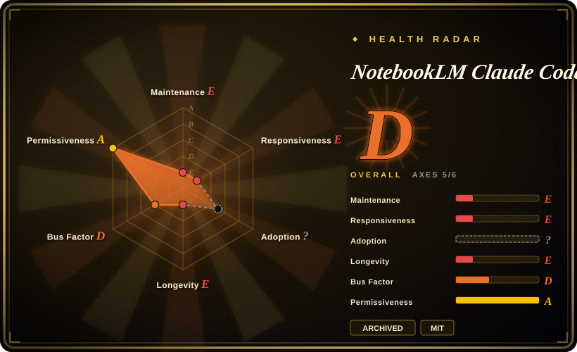
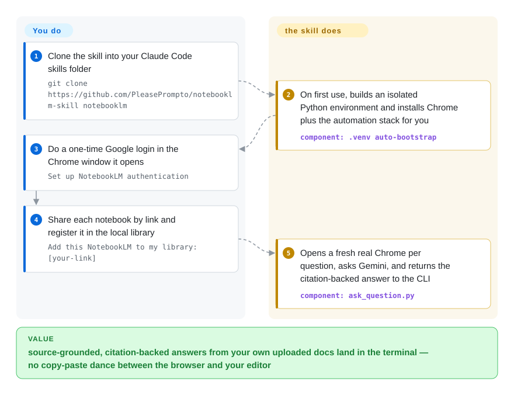

# NotebookLM Claude Code Skill

Tell Claude Code "search my docs" and it burns tokens grinding through file after file, keyword-matches, and invents APIs when the answer isn't there. This skill routed those questions to your Google NotebookLM notebooks instead — Python scripts driving a real Chrome, citation-backed answers back in the CLI. **Archived: the repo was archived in September 2026; it may still run, but any fix for Google-UI drift is now yours.**

## When to use

You're a developer using Claude Code with a large body of reference material — vendor SDK docs, an internal wiki, a workshop manual, a sprawling set of PDFs — that the agent keeps mishandling. When you say "search my docs," it reads file after file (burning tokens), grep-matches keywords and misses the connections between documents, and when it can't find an API it invents a plausible-looking one. You've already uploaded those same docs to Google NotebookLM, where Gemini has pre-processed them into a source-grounded knowledge base, but you're stuck copy-pasting questions and answers between the NotebookLM browser tab and your editor.

You install this skill (`git clone` into `~/.claude/skills/notebooklm/`) so Claude can talk to NotebookLM directly. On first use it self-provisions an isolated `.venv` and a real Chrome instance; you do a one-time Google login in a headful browser window, share each notebook by link, and register it in a small local library with tags. From then on, when you ask "what do my React docs say about hooks?", Claude picks the right notebook, runs the Python script, opens a fresh browser, asks Gemini, and gets a synthesized, citation-backed answer back in the CLI — then uses that to write correct code. It's a retrieval bridge: NotebookLM does the grounding, the skill is the plumbing that lets the agent reach it without you in the loop. Because the repo is archived (2026-09), reach for it this way only once you've accepted you'll fork and own it — the design of the bridge is still the clearest worked example of "skill drives browser to an external grounded service."

## How it works

The skill is a folder Claude Code loads on demand: a `SKILL.md` instruction file plus three Python scripts — `ask_question.py` (query), `notebook_manager.py` (library), `auth_manager.py` (Google login). When you mention NotebookLM or paste a notebook link, Claude follows the instructions and shells out to the right script; the script drives a real Google Chrome window through `patchright` — a stealth-oriented fork of Playwright, the browser-automation library — and scrapes the answer off NotebookLM's web UI, because there is no API: the product is pure plumbing between the CLI and the browser. Google login happens once, interactively, in a visible window; the cookies persist under `data/browser_state/` so later runs don't re-prompt, and your notebook links plus tags live in a local `data/library.json` so Claude can pick the right notebook per question. Every question then opens a fresh browser, asks, reads, and closes — a deliberately stateless model. What it does for you: notebook selection, browser driving, answer capture. What stays yours: uploading the docs and link-sharing each notebook up front, re-authenticating when the session dies, and — since the upstream is archived — repairing it whenever Google changes the UI underneath.

<!-- flow-steps:begin (generated from flows/notebooklm-skill.json by tools/flow_card.py — do not edit) -->

Text version of the flow

1. **You**: Clone the skill into your Claude Code skills folder — `git clone https://github.com/PleasePrompto/notebooklm-skill notebooklm`
2. **NotebookLM Claude Code Skill**: On first use, builds an isolated Python environment and installs Chrome plus the automation stack for you — component: `.venv auto-bootstrap`
3. **You**: Do a one-time Google login in the Chrome window it opens — `Set up NotebookLM authentication`
4. **You**: Share each notebook by link and register it in the local library — `Add this NotebookLM to my library: [your-link]`
5. **NotebookLM Claude Code Skill**: Opens a fresh real Chrome per question, asks Gemini, and returns the citation-backed answer to the CLI — component: `ask_question.py`

**Value**: source-grounded, citation-backed answers from your own uploaded docs land in the terminal — no copy-paste dance between the browser and your editor

<!-- flow-steps:end -->

## When NOT to use

- **Archived — fork before you rely on it.** The repo was archived in September 2026; the README's own banner: "This project is no longer maintained… no updates, bug fixes or support. It may stop working when the upstream services change. Feel free to fork." A tool that automates Google's live UI lives or dies on drift fixes, and none will come from upstream now — and the author's sister project, the notebooklm-mcp server, is **also archived** (checked 2026-09-27), so "migrate to the MCP version" is no longer an escape hatch. Treat both as pattern sources or fork-and-own.
- **You don't (or won't) put your docs in Google NotebookLM.** This is a *bridge*, not a RAG engine. It has no embeddings, no vector store, no local index of its own — if your knowledge isn't already in a NotebookLM notebook (and shared "anyone with link"), there is nothing to query. For a maintained self-hosted path, build on local RAG stacks (LlamaIndex / LangChain retrievers — not indexed) instead.
- **You're not on local Claude Code.** It works *only* with a local Claude Code install. The web UI sandboxes skills without network access, so the browser automation it depends on cannot run.
- **Automating a Google account is a problem for you.** It logs into and drives Google with a real Chrome session. The author explicitly recommends a *dedicated* Google account and warns automated usage may be detected or flagged; that is a real ToS/account-risk surface, not a hypothetical. [未验证]
- **You need stateful, multi-turn research.** The session model is stateless — each question opens a fresh browser and closes it; there's no persistent chat context and answers can't reference "the previous answer." Multi-step depth comes from the agent re-asking, not from a held session.
- **You're sensitive to NotebookLM's own limits.** Free-tier daily query limits, manual upload, and the public-link share requirement are all NotebookLM constraints this skill inherits and cannot remove.

## Comparison

| Alternative | In index | Our verdict | Tradeoff |
|---|---|---|---|
| [Agent Skills for Context Engineering](context-engineering-skills.md) | ✅ | Choose the context-engineering pack when you need a maintained methodology, not one narrow bridge. | A still-maintained context-engineering *skill pack* (17 skills for context plumbing as advice); this repo is one runnable retrieval bridge to a single external service — and it's archived, so the methodology pack is the safer bet unless the NotebookLM bridge specifically is your subject. |
| notebooklm-mcp (same author) | 未收录 | Neither repo is a maintained choice now — both were archived in 2026-09; fork the MCP server only when you specifically need its persistent-session model across harnesses. | The MCP sibling adds stateful chat sessions, TypeScript/npm packaging, and multi-tool support (Claude Code, Codex, Cursor); the skill stays zero-server, Python, clone-and-go — but with both archived, whatever you pick, you own the breakage. |
| Local RAG stacks (LlamaIndex / LangChain retrievers, etc.) | 未收录 | Choose local RAG when you need self-hosted embeddings and vector storage with fixes still coming upstream. | Self-hosted embeddings + vector DB you own end-to-end; higher setup cost (chunking, embeddings, infra) but no third-party account, no public-share requirement, no browser automation — and, unlike this archived skill, an actively maintained dependency chain. |
| Built-in file reading / grep retrieval | 未收录 | Choose built-in retrieval when Claude Code's default file access is sufficient. | What Claude Code does by default — high token cost, keyword-shaped retrieval, hallucination on gaps. This skill exists specifically to replace that for doc-heavy tasks, at the price of the account and fragility above. |

## Tech stack

- **Language:** Python (3.8+ per the README badge, README verified 2026-09-27).
- **Browser automation:** `patchright==1.55.2` — a Playwright-based, stealth-oriented automation library — driving **real Google Chrome** (not Chromium) for fingerprint consistency and anti-detection.
- **Config:** `python-dotenv==1.0.0`.
- **Skill surface:** a `SKILL.md` instruction file plus three scripts — `ask_question.py` (query), `notebook_manager.py` (library management), `auth_manager.py` (Google auth). A local `data/` folder (`library.json`, `auth_info.json`, `browser_state/`) holds library + session state and is git-ignored; it contains live Google credentials, so never commit or share it.

## Dependencies

- **Local Claude Code** (not the web UI) on your own machine — hard requirement; the sandbox has no network access for the browser.
- **An active Google account** with access to NotebookLM, plus notebooks you've uploaded docs to and shared by public link.
- **Google Chrome** and the Python automation stack — auto-installed into an isolated `.venv` inside the skill folder on first use (no global installs, but it does pull Chrome down).
- **Internet access** to reach NotebookLM at query time.
- NotebookLM's own service (Gemini-backed); you're subject to its free-tier daily query limits.

## Ops difficulty

**Low-to-medium for an individual; high once you count the account risk and the abandonment.** Install is a single `git clone`, and the venv/Chrome bootstrap is automatic — there's no server to run, no DB, no deploy. The ongoing burden is the auth and the fragility: you do a one-time interactive Google login (and re-login when the session expires), you must keep notebooks uploaded and link-shared, and the whole thing rides on browser automation against a third-party UI plus anti-detection heuristics — both of which can break without warning when Google changes things. With the repo archived (2026-09), those breaks are **yours** to diagnose and patch; the author's own banner says to fork. The recommendation to use a throwaway Google account, and the "can't guarantee Google won't detect or flag automated usage" disclaimer, push this above a trivial dev-tool in real-world operational risk. [未验证]

## Health & viability

- **Responsiveness**: Cannot be scored — no_traffic (archived, issue queue closed to new support).
- **Maintenance (2026-09):** **abandoned — archived.** The repo was archived in September 2026 (GitHub API + README banner, both checked 2026-09-27); last functional release v1.3.0 (2025-11-21), and the final `master` commit (2026-09-10) is the archival notice itself. The author also archived the notebooklm-mcp sibling.
- **Governance / bus factor:** single-maintainer, `User`-owned repo (`PleasePrompto`) at 7.8k stars (2026-09) — popularity never translated into a team, and the one maintainer has now stepped away from both repos in this line.
- **Age & Lindy verdict:** created 2025-10, barely a year old, and archived before it could build a track record — **Lindy fails outright**: nothing about its short life predicts survival, and the moving target it automates (Google's UI) does not wait.
- **Risk flags:** browser automation against Google's live UI plus anti-detection heuristics with **no upstream fixer**; ToS/account-flagging risk the author warns about; local storage of live Google session credentials. A maintained alternative (self-hosted RAG, or a NotebookLM tool still under development) is the safer production path; use this as a design reference or fork it.

## Caveats (unverified)

- [未验证] Whether the skill still *works* today against the current NotebookLM UI was not tested in this pass — the repo sat ~7 months before archiving, and the author's banner itself concedes it "may stop working when the upstream services change."
- [未验证] Pinned dependency versions (`patchright==1.55.2`, `python-dotenv==1.0.0`) and Python 3.8+ are as stated in the README (2026-09-27) but were not exercised here; the Chrome auto-install and venv bootstrap were not run.
- [未验证] Google ToS / account-detection risk: the author states humanization features are built in but cannot guarantee Google won't detect or flag automated usage, and recommends a dedicated account. The actual likelihood of flagging, and whether it violates Google's terms, is not independently confirmed.
- [未验证] The script names (`ask_question.py`, `notebook_manager.py`, `auth_manager.py`), the stateless fresh-browser-per-question session model, and the `data/` layout are from the README/repo tree; exact behavior was not executed.
- [推断] "Drastically reduced hallucinations" is the project's claim about NotebookLM's source-grounding; answer quality depends entirely on what you uploaded and on NotebookLM/Gemini, which this skill does not control.
