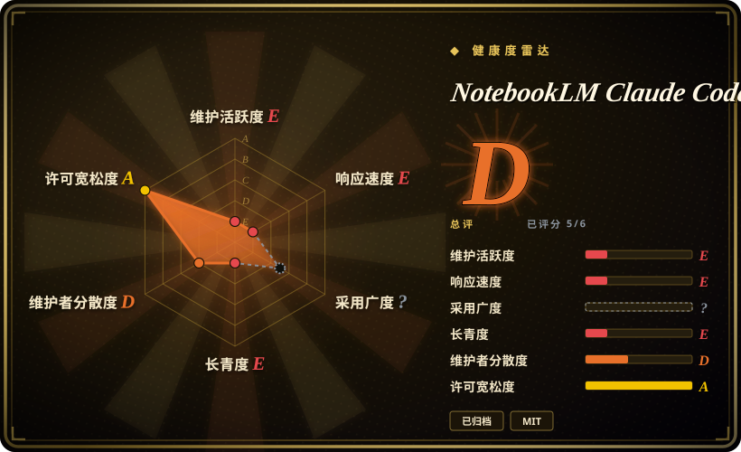
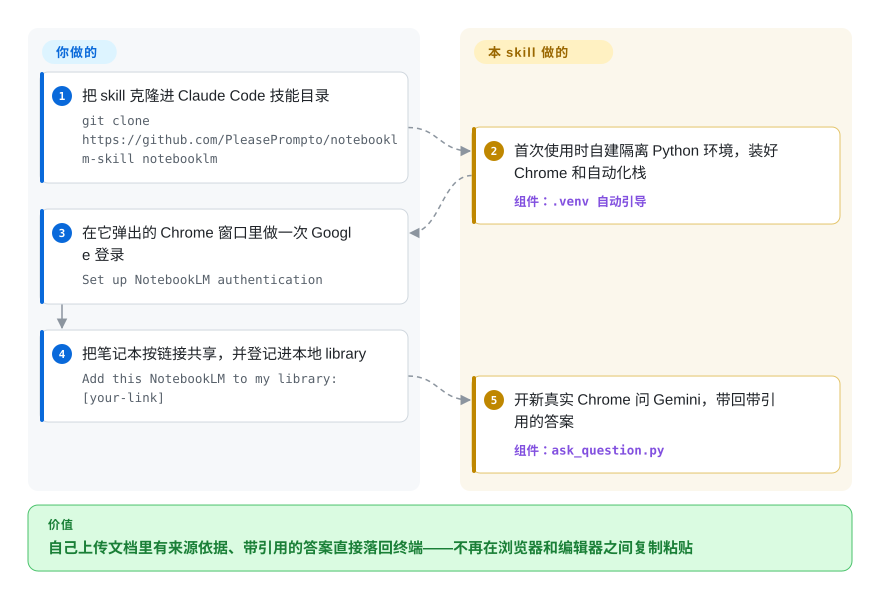

# NotebookLM Claude Code Skill

你让 Claude Code“搜一下我的文档”，它就一个文件接一个文件地烧 token、按关键词硬匹配、找不到 API 就现编。这个 skill 把问题改道送进你的 Google NotebookLM 笔记本——Python 脚本驱动一个真实 Chrome，把带引用的答案带回 CLI。**已归档：仓库于 2026 年 9 月归档；它也许还能跑，但 Google 界面漂移后的每一个修复都归你了。**

## 何时使用

你是一名用 Claude Code 的开发者，手头有一大堆参考材料——第三方 SDK 文档、内部 wiki、一本维修手册、一摞 PDF——而 agent 老是处理不好。你说“搜一下我的文档”，它就一个文件接一个文件地读（烧 token），按关键词 grep、错过文档之间的关联；找不到某个 API 时，又会编一个看起来很合理的出来。这些文档你其实早就上传到了 Google NotebookLM——那里 Gemini 已经把它们预处理成了一个有来源依据的知识库——但你只能在 NotebookLM 浏览器标签页和编辑器之间手动复制粘贴问题和答案。

于是你安装这个 skill（`git clone` 到 `~/.claude/skills/notebooklm/`），让 Claude 直接和 NotebookLM 对话。首次使用时它会自建一个隔离的 `.venv` 和一个真实 Chrome 实例；你在弹出的有头浏览器窗口里做一次性 Google 登录，把每个笔记本按链接共享，再注册进一个带标签的本地 library。此后当你问“我的 React 文档怎么讲 hooks 的？”，Claude 会挑出对应笔记本、跑 Python 脚本、开一个全新浏览器去问 Gemini，把综合好、带引用的答案拿回 CLI——再据此写出正确代码。它是一座取回桥：NotebookLM 负责来源依据，这个 skill 是让 agent 在你不插手的情况下够到它的管道。只是上游已于 2026-09 归档，今天仍要走这条路，前提是你接受 fork 后自己养——这座桥的设计仍是「skill 驱动浏览器对接外部接地服务」最完整的样例。

## 怎么用起来

这个 skill 是一个按需加载的 Claude Code 目录：一份 `SKILL.md` 指令文件，加三个 Python 脚本——`ask_question.py`（查询）、`notebook_manager.py`（library 管理）、`auth_manager.py`（Google 登录）。当你提到 NotebookLM 或贴出一个笔记本链接，Claude 按指令去调相应脚本；脚本用 `patchright`——一个偏隐身的 Playwright（浏览器自动化库）分支——驱动一个真实 Google Chrome 窗口，从 NotebookLM 的网页界面上把答案读回来，因为它根本没有 API：这件产品就是 CLI 与浏览器之间的纯管道。Google 登录只做一次、在可见窗口里人工完成；cookie 存进 `data/browser_state/`，之后的运行不再被要求重新登录；笔记本链接和标签存在本地 `data/library.json`，Claude 靠它按问题挑对笔记本。此后每个问题都是开一个新浏览器、问完、读完、关掉——刻意设计的无状态模型。它替你做：选本、驱动浏览器、取回答案。留给你的：事先把文档传进 NotebookLM 并按链接共享笔记本、会话过期时重新认证——以及，因为上游已归档，Google 一改界面，修理也归你。

<!-- flow-steps:begin (generated from flows/notebooklm-skill.json by tools/flow_card.py — do not edit) -->

流程文字版

1. **你**：把 skill 克隆进 Claude Code 技能目录 — `git clone https://github.com/PleasePrompto/notebooklm-skill notebooklm`
2. **NotebookLM Claude Code Skill**：首次使用时自建隔离 Python 环境，装好 Chrome 和自动化栈 — 组件：`.venv 自动引导`
3. **你**：在它弹出的 Chrome 窗口里做一次 Google 登录 — `Set up NotebookLM authentication`
4. **你**：把笔记本按链接共享，并登记进本地 library — `Add this NotebookLM to my library: [your-link]`
5. **NotebookLM Claude Code Skill**：开新真实 Chrome 问 Gemini，带回带引用的答案 — 组件：`ask_question.py`

**价值**：自己上传文档里有来源依据、带引用的答案直接落回终端——不再在浏览器和编辑器之间复制粘贴

<!-- flow-steps:end -->

## 何时不用

- **已归档——先 fork 再考虑依赖。** 仓库于 2026 年 9 月归档，README 自己挂出的横幅写着：“此项目不再维护……没有更新、修复或支持。上游服务变更时它可能失效。欢迎 fork。”（引文见 README，2026-09-27 核）一个自动化 Google 实时界面的工具，命就攥在漂移修复上，而上游不会再给——作者的姊妹项目 notebooklm-mcp 服务器**同样已归档**（2026-09-27 查证），“迁去 MCP 版”也不再是逃生门。两者都只当模式参考，或 fork 后自养。
- **你不（或不愿）把文档放进 Google NotebookLM。** 这是一座*桥*，不是 RAG 引擎。它自己没有 embedding、没有向量库、没有任何本地索引——如果知识没有先进入一个 NotebookLM 笔记本（且按“任何拥有链接的人”共享），就根本没东西可查。要仍在维护的自托管路径，去搭本地 RAG 栈（LlamaIndex / LangChain retrievers，未收录）。
- **你不是在本地 Claude Code 上跑。** 它*只*能配本地 Claude Code 安装。Web UI 把 skill 沙箱化、无网络访问，所以它依赖的浏览器自动化跑不起来。
- **自动化操作一个 Google 账号对你是问题。** 它会用真实 Chrome 会话登录并驱动 Google。作者明确建议用一个*专用* Google 账号，并警告自动化使用可能被检测或标记；这是实打实的 ToS/账号风险面，不是假想。[未验证]
- **你需要有状态的多轮研究。** 会话模型是无状态的——每个问题开一个全新浏览器、用完即关；没有持久聊天上下文，答案也无法引用“上一条回答”。多步深度来自 agent 反复追问，而非一个被保持住的会话。
- **你在意 NotebookLM 自身的限制。** 免费档每日查询上限、需手动上传、笔记本必须公开链接共享——这些都是 NotebookLM 的约束，本 skill 继承且无法消除。

## 横向对比

| 替代品 | 是否收录 | 我们的评价 | 取舍 |
|---|---|---|---|
| [Agent Skills for Context Engineering](context-engineering-skills.zh.md) | ✅ | 需要仍在维护的方法论、而不是单座窄桥时，选上下文工程技能包。 | 一个仍在维护的上下文工程*技能包*（17 个技能，以建议形态管理上下文）；本仓库是通向单一外部服务的一座可运行取回桥——且已归档，除非 NotebookLM 桥本身就是你的课题，否则方法论包是更稳的赌注。 |
| notebooklm-mcp（同作者） | 未收录 | 两个仓库如今都不是“有人维护”的选择——2026-09 双双归档；只有当你明确需要它的持久会话模型跨工具工作时，才去 fork MCP 版。 | MCP 同门多出的是有状态聊天会话、TypeScript/npm 打包和多工具支持（Claude Code、Codex、Cursor）；本 skill 胜在零服务器、Python、clone 即用——但既然双双归档，选中哪个，损坏都由你 own。 |
| 本地 RAG 栈（LlamaIndex / LangChain retrievers 等） | 未收录 | 需要端到端自托管 embedding 和向量库、且上游修复仍在流动时，选本地 RAG 栈。 | 你端到端自托管的 embedding + 向量库；搭建成本更高（切块、embedding、基础设施），但无第三方账号、无公开共享要求、无浏览器自动化——而且不像这个已归档的 skill，它的依赖链仍在被积极维护。 |
| 内置文件读取 / grep 取回 | 未收录 | Claude Code 默认文件访问已经足够时，选内置取回。 | Claude Code 的默认行为——token 成本高、关键词式取回、空白处会幻觉。本 skill 正是为在文档密集任务里替换它而存在，代价是上面那份账号与脆弱性账。 |

## 技术栈

- **语言：** Python（README 徽章标 3.8+，README 于 2026-09-27 核对）。
- **浏览器自动化：** `patchright==1.55.2`——一个基于 Playwright、偏隐身的自动化库——驱动**真实 Google Chrome**（非 Chromium），以求指纹一致与反检测。
- **配置：** `python-dotenv==1.0.0`。
- **skill 表面：** 一份 `SKILL.md` 指令文件，加三个脚本——`ask_question.py`（查询）、`notebook_manager.py`（library 管理）、`auth_manager.py`（Google 认证）。本地 `data/` 目录（`library.json`、`auth_info.json`、`browser_state/`）保存 library 与会话状态，且被 git 忽略；里面有活的 Google 凭据，切勿提交或外传。

## 依赖

- **本地 Claude Code**（非 web UI），在你自己的机器上——硬性要求；沙箱无网络访问，浏览器跑不起来。
- **一个可用的 Google 账号**，能访问 NotebookLM，并有你已上传文档、按公开链接共享的笔记本。
- **Google Chrome** 和 Python 自动化栈——首次使用时自动装进 skill 文件夹内一个隔离的 `.venv`（无全局安装，但确实会下载 Chrome）。
- **互联网访问**，查询时连到 NotebookLM。
- NotebookLM 自身服务（Gemini 支撑）；你受其免费档每日查询上限约束。

## 运维难度

**对个人是低到中；把账号风险和弃维护算进去就是高。** 安装是单条 `git clone`，venv/Chrome 引导是自动的——没有服务器要跑、没有数据库、没有部署。持续负担在认证与脆弱性上：你要做一次性交互式 Google 登录（会话过期后再登），要保持笔记本已上传且链接共享，整套东西骑在针对第三方 UI 的浏览器自动化加反检测启发式上——两者都可能在 Google 改东西时毫无预兆地失效。仓库已于 2026-09 归档，这些失效的**诊断和补丁从此归你**——作者横幅原话就是欢迎 fork。建议用一次性 Google 账号、以及“无法保证 Google 不会检测或标记自动化使用”的免责声明，把它在真实世界的运维风险推到普通开发工具之上。[未验证]

## 健康度与可持续性

- **响应速度**：无法计算——no_traffic（已归档，issue 队列不再承接支持）。
- **维护（2026-09）：** **已弃养——归档。** 仓库 2026 年 9 月归档（GitHub API 与 README 横幅，2026-09-27 双核）；最后一个功能 release 是 v1.3.0（2025-11-21），`master` 的最后一次提交（2026-09-10）就是归档公告本身。作者的 notebooklm-mcp 同门也一并归档。
- **治理/bus factor：** 单人维护、`User` 所有的仓库（`PleasePrompto`），7.8k stars（2026-09）——人气从未转化为团队，唯一维护者如今已从这条线的两个仓库同时离场。
- **年龄与 Lindy 判断：** 创建于 2025-10，堪堪一岁，还没建立起履历就被归档——**Lindy 直接不成立**：它短暂的一生没有任何存续性信号，而它自动化的移动靶（Google 界面）不会等人。
- **风险旗标：** 针对 Google 实时界面的浏览器自动化加反检测启发式，且**没有上游修复者**；作者警告的 ToS/账号被标记风险；本地存着活的 Google 会话凭据。仍在开发中的替代品（自托管 RAG，或其他仍在维护的 NotebookLM 工具）才是更稳的生产路径；本仓库当作设计参考或 fork 使用。

## 存疑（未验证）

- [未验证] 本轮未实测该 skill 对当前 NotebookLM 界面是否还能跑通——仓库在归档前已沉寂约 7 个月，作者横幅自己也承认“上游服务变更时可能失效”。
- [未验证] 锁定的依赖版本（`patchright==1.55.2`、`python-dotenv==1.0.0`）和 Python 3.8+ 按 2026-09-27 的 README 原文照录，但未在此实测；Chrome 自动安装与 venv 引导也未实跑。
- [未验证] Google ToS / 账号检测风险：作者称内置了拟人化特性，但无法保证 Google 不会检测或标记自动化使用，并建议用专用账号。被标记的实际概率、以及是否违反 Google 条款，均未独立确认。
- [未验证] 脚本名（`ask_question.py`、`notebook_manager.py`、`auth_manager.py`）、每问开新浏览器的无状态会话模型，以及 `data/` 布局取自 README/仓库树；确切行为未执行验证。
- [推断] “大幅减少幻觉”是该项目对 NotebookLM 来源依据机制的主张；答案质量完全取决于你上传了什么以及 NotebookLM/Gemini 本身，而这些不在本 skill 控制范围内。
