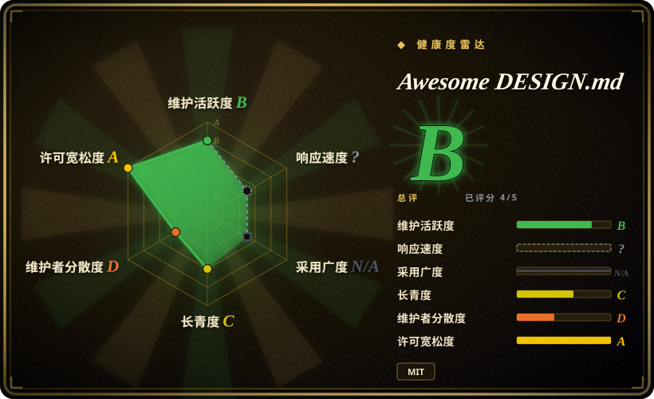
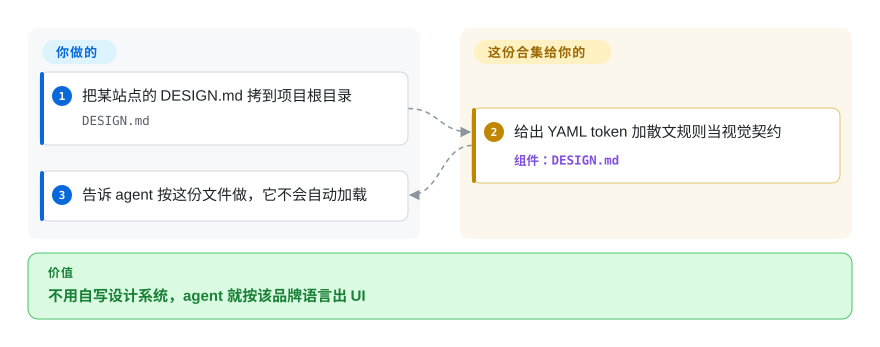

# Awesome DESIGN.md

你让 agent 做页面，它每次都长得差不多；说“做成 Linear 那样”又太飘，抓不住。这个仓库按站点各给一份现成的 `DESIGN.md`（配色字号，再加不要做什么），拷进项目根目录，让 agent 对着读。

## 何时使用

你在用 coding agent 做落地页或产品界面。每次说“做高级一点”，回来的都是居中大标题、三张卡片、紫到蓝的渐变。手里没有设计师，也不想从零写设计系统。打开这份合集，选一个叫得出名字的站点——Linear、Stripe、Notion、Claude——把对应目录里的 `DESIGN.md` 拷到项目根，告诉 agent 按它做。

要的是**某一个品牌的样子**，而不是“有品味”，就选它，而不是 [Taste-Skill](taste-skill.zh.md) 或 [UI UX Pro Max Skill](ui-ux-pro-max.zh.md)。只想丢一个文件、不想开 Google Stitch 账号和 MCP，就选它，而不是 [Stitch Skills](stitch-skills.zh.md)。决定性取舍：你拿到一份写好的视觉契约，同时放弃了**自己的**品牌、官方 token，以及 harness 自动加载。

## 快问快答

**这是不是把知名网站各整理成了一份 DESIGN.md？**
是。截至 2026-09-27，`design-md/` 下有 74 个品牌目录，每个一份 `DESIGN.md`（YAML token 加 markdown 规则），另有一份五行 README，预览都指到 `getdesign.md`。

**主流 harness 会像读 AGENTS.md 那样自动加载 DESIGN.md 吗？**
不会。Codex、OpenCode、Claude Code、Cursor 开机注入的是 `AGENTS.md` 或 `CLAUDE.md`。`DESIGN.md` 必须你开口去点；放在同一目录只是习惯，不是同等特权。

**这些是品牌官方设计系统吗？**
不是。第三方从公开可见 CSS 抽的。MIT LICENSE 的版权写的是 VoltAgent；README 写明不主张对任何站点视觉标识的所有权。抽查的 `design-md/claude/DESIGN.md` 在 Known Gaps 里写了：真实产品聊天界面不在范围内。

## 怎么用起来

仓库本身不运行。每个 `design-md/<brand>/` 是一对静态文件：一份 Google alpha 规格的 `DESIGN.md`（YAML 里是颜色、字体、圆角、间距、组件；正文是气质、布局和不要做什么），再加一份 README，预览已经搬到 `https://getdesign.md/`。你把 markdown 拷到项目根。agent 把它当额外指令读——没有解析器，除非你另外用 `@google/design.md` 做 lint，或上传到 Stitch。类比：`AGENTS.md` 是 harness 会自动塞进去的工程简报；这份文件是一件戏服，得你亲手递给模型。

<!-- flow-steps:begin (generated from flows/awesome-design-md.json by tools/flow_card.py — do not edit) -->

流程文字版

1. **你**：把某站点的 DESIGN.md 拷到项目根目录 — `DESIGN.md`
2. **Awesome DESIGN.md**：给出 YAML token 加散文规则当视觉契约 — 组件：`DESIGN.md`
3. **你**：告诉 agent 按这份文件做，它不会自动加载

**价值**：不用自写设计系统，agent 就按该品牌语言出 UI

<!-- flow-steps:end -->

## 何时不用

- **你要的是自己的品牌，不是 Linear 的皮。** 这些文件在仿公开营销站。写一份项目自己的 `DESIGN.md`，或用 [Stitch Skills](stitch-skills.zh.md) 的 `extract-design-md` 从自己的代码抽，别拷别人的样子。
- **你要的是品味，不是克隆某个品牌。** 用 [Taste-Skill](taste-skill.zh.md) 或 [UI UX Pro Max Skill](ui-ux-pro-max.zh.md)——它们注入判断，不是 Stripe / Linear 的戏服。
- **你要按授权重建整个站点，还要截图和资产。** 那是 [ai-website-cloner-template](ai-website-cloner-template.zh.md)；一份 `DESIGN.md` 只有 token 和散文，不是克隆套件。
- **你指望 harness 像加载 AGENTS.md 那样自动读它。** 不会。需要常驻规则，就在 `AGENTS.md` / `CLAUDE.md` / `.cursor/rules` 里写一行指针。需要在 Stitch 里解析成设计系统，用 [Stitch Skills](stitch-skills.zh.md) 和 Stitch 的上传路径。
- **你要的是 linter 或格式规范，不是语料。** 格式在 `google-labs-code/design.md`（`npx @google/design.md lint`）。本仓库只是样例文件。
- **你想贡献一个新品牌文件。** `CONTRIBUTING.md` 写明不接受 `DESIGN.md` 的 PR。付费独占抽取走 `getdesign.md`（托管站，不是仓库）。
- **商标和法律风险不可接受。** 这些不是官方品牌套件。当非正式抽取用，不要做出一副自己就是 Nike 或 Stripe 的产品。

## 横向对比

| 替代品 | 是否收录 | 我们的评价 | 取舍 |
|---|---|---|---|
| [Stitch Skills](stitch-skills.zh.md) | 已收录 | 要通过 Google Stitch 抽取或套用**自己的**设计系统时选 Stitch Skills；只想从公开站点拷一份现成文件、又不跑 Stitch MCP 时选本合集。 | Stitch Skills 能生成和转换；本仓库只发静态 markdown。省掉厂商登录，也没有回到真实屏幕的往返。 |
| [Taste-Skill](taste-skill.zh.md) | 已收录 | 失败模式是千篇一律的 AI 味、又不想长得像某个品牌时选 Taste-Skill；brief 就是“做成 Linear 那样”时选本合集。 | Taste-Skill 推断方向；本合集把 token 钉在一个抽出来的站点上。更具体，仿冒风险也更大。 |
| [UI UX Pro Max Skill](ui-ux-pro-max.zh.md) | 已收录 | 要本地风格/配色/字体检索加上可访问性清单时选 UI UX Pro Max；要一份品牌 `DESIGN.md` 当唯一契约时选本合集。 | Pro Max 是带 CSV 引擎的 skill pack；这是一堆 markdown。没有安装渠道，也没有强制。 |
| [ai-website-cloner-template](ai-website-cloner-template.zh.md) | 已收录 | 已获授权、要重建站点并需要截图、资产和视觉 QA 时选克隆模板；一份 token 加散文就够时选本合集。 | 克隆模板是重建工作流；这是一份可丢进去的设计 brief。更轻，也复现不了版式和资产。 |
| getdesign.md（VoltAgent 托管站） | 非仓库 | 要预览、下载，或给 74 个目录里没有的站点做付费独占抽取时选托管站；只要公开 markdown 时留在 GitHub 仓库。 | 同一组织的商业漏斗。预览在那边——仓库 README 仍声称有 `preview.html`，树里一份都没有。 |

## 健康度与可持续性

- **维护（2026-09）：** 未归档；最近一次 push 是 2026-09-21 的 “Update README”。没有 GitHub Release 或 tag。近期历史更多是改 README 和 banner，而不是加新品牌（Nintendo 是 2026-06-08 进的）。所谓“活跃”更像营销页在动，不是有版本的产品。
- **治理与 bus factor：** 组织所有（`VoltAgent`）。贡献统计里 `necatiozmen` 占列出的 62 次中的 59 次，另外三个名字各 1 次。组织背书消除不了单人内容管线。`CONTRIBUTING.md` 关掉了社区提交新 `DESIGN.md` 的 PR。
- **年龄与 Lindy：** 创建于 2026-03-31，到 2026-09-27 大约六个月，约 11.8 万 star。年轻且星数虚高：Lindy 先验**不支持**把星数当成寿命。年龄 × 仍在更新，尚未被时间证明。
- **采用：** 没有包，没有 skill 加载器可装。用法是拷 markdown。star/fork 是内容仓的热度，不是安装基数。
- **风险旗标：**（1）README 声称每个站点含 `preview.html` / `preview-dark.html`；2026-09-27 全树列举 **0** 个 `.html`——预览在托管站上。（2）MIT 盖在抽出来的品牌 token 上，同时又声明不主张所有权。（3）312 个 open issue。（4）硬导向 `getdesign.md`（赞助、付费请求）。（5）只有建议层：文件强迫不了模型。

## 存疑（未验证）

- [未验证] star/fork 数（2026-09-27 约 11.8 万 / 1.3 万）天天变，不是质量或寿命信号。
- [未验证] MIT 能否覆盖第三方抽取的品牌 CSS / 视觉标识，是法律问题；仓库 LICENSE 和 README 免责声明给不了结论。
- [未验证] 每一份 `DESIGN.md` 对活站的保真度（色值、字体、组件）没有逐品牌核对；只读了 Claude 样本的 Known Gaps。
- [未验证] 目录数（74）和 “DESIGN.md count” 徽章会漂；把清单当完整之前先再列一次 `design-md/`。
- [推断] 六个月大的 markdown 合集拿到这么高的 star，更像榜单/热度机制，而不是已核实的、用这些文件做出品牌 UI 的用户基数。
- [推断] 主流 harness 都不会自动加载 `DESIGN.md`，真实效果取决于你是否在 `AGENTS.md` / `CLAUDE.md` 里加指针；只丢文件常常什么都不发生。
