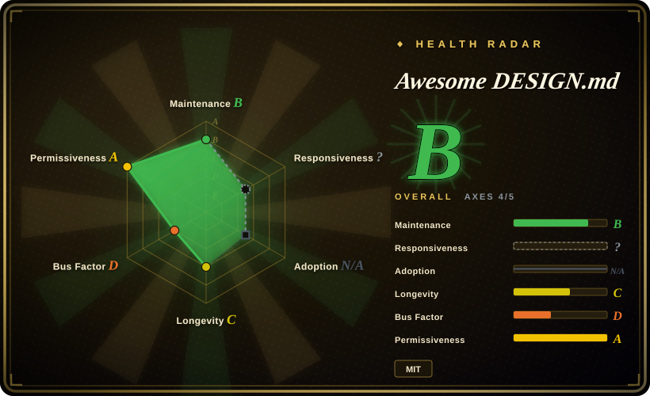
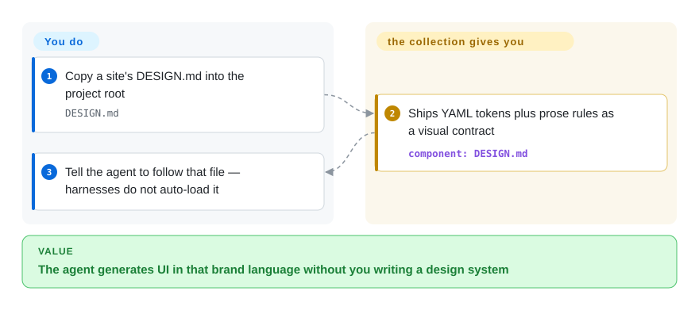

# Awesome DESIGN.md

Your coding agent keeps shipping the same generic UI, and “make it look like Linear” is too vague to stick. This repo hands you a ready `DESIGN.md` — tokens plus don’ts — extracted from a named site, so you drop one file and point the agent at it.

## When to use

You are shipping a landing page or product UI with a coding agent. Every “make it look premium” prompt comes back as a centered hero, three cards, and a purple-to-blue gradient. You do not have a designer, and you do not want to write a design system from scratch. You open this collection, pick a named site — Linear, Stripe, Notion, Claude — copy that folder’s `DESIGN.md` into the project root, and tell the agent to follow it.

Pick this over [Taste-Skill](../ui-taste/taste-skill.md) or [UI UX Pro Max Skill](../ui-taste/ui-ux-pro-max.md) when the point is a *specific* brand language, not inferred “taste.” Pick it over [Stitch Skills](stitch-skills.md) when you want a file you can drop in with no Google Stitch account or MCP server. The deciding tradeoff: you get a prewritten visual contract, and you give up having *your* brand, official tokens, or any harness that loads the file by itself.

## Q&A

**Is this a corpus of famous-site DESIGN.md files?**
Yes. As of 2026-09-27 the tree has 74 brand folders under `design-md/`, each with a `DESIGN.md` (YAML tokens plus markdown rules) and a five-line README that points previews at `getdesign.md`.

**Do mainstream harnesses auto-load DESIGN.md the way they load AGENTS.md?**
No. Codex, OpenCode, Claude Code, and Cursor auto-inject `AGENTS.md` or `CLAUDE.md`. `DESIGN.md` is a file you must mention — same directory is a convention, not the same privilege.

**Are these official brand design systems?**
No. Third-party extractions of publicly visible CSS. The MIT LICENSE claims copyright for VoltAgent; the README says they do not claim ownership of any site’s visual identity. One sample (`design-md/claude/DESIGN.md`) lists Known Gaps: the real product chat UI is out of scope.

## How it works

The repo does not run. Each `design-md/<brand>/` folder is a static pair: a `DESIGN.md` in Google’s alpha DESIGN.md format (YAML frontmatter for colors, type, radius, spacing, components; markdown for mood, layout, and don’ts) plus a README that has moved previews to `https://getdesign.md/`. You copy the markdown into the project root. The agent treats it as extra instructions — there is no parser unless you separately lint with `@google/design.md` or upload the file into Stitch. Analogy: `AGENTS.md` is the standing engineering brief the harness injects; this file is a costume you have to hand the model yourself.

<!-- flow-steps:begin (generated from flows/awesome-design-md.json by tools/flow_card.py — do not edit) -->

Text version of the flow

1. **You**: Copy a site's DESIGN.md into the project root — `DESIGN.md`
2. **Awesome DESIGN.md**: Ships YAML tokens plus prose rules as a visual contract — component: `DESIGN.md`
3. **You**: Tell the agent to follow that file — harnesses do not auto-load it

**Value**: The agent generates UI in that brand language without you writing a design system

<!-- flow-steps:end -->

## When NOT to use

- **You need *your* brand, not Linear’s.** These files impersonate public marketing sites. Write a project `DESIGN.md` or extract one from your own code with [Stitch Skills](stitch-skills.md) (`extract-design-md`) instead of copying someone else’s look.
- **You want taste without cloning a brand.** Use [Taste-Skill](../ui-taste/taste-skill.md) or [UI UX Pro Max Skill](../ui-taste/ui-ux-pro-max.md) — they inject judgment, not a Stripe/Linear costume.
- **You need to rebuild an authorized site with screenshots and assets.** That is [ai-website-cloner-template](ai-website-cloner-template.md); a `DESIGN.md` is tokens and prose, not a clone kit.
- **You expect the harness to load it like AGENTS.md.** It will not. If you need standing rules, put a one-line pointer in `AGENTS.md` / `CLAUDE.md` / `.cursor/rules`. If you need a parsed design system inside Stitch, use [Stitch Skills](stitch-skills.md) and the Stitch upload path.
- **You need a linter or a format spec, not a corpus.** The format lives in `google-labs-code/design.md` (`npx @google/design.md lint`). This repo is sample files.
- **You want to contribute a new brand file.** `CONTRIBUTING.md` says they cannot accept `DESIGN.md` pull requests. Paid exclusive extractions go through `getdesign.md` (hosted, not a repo).
- **Legal or trademark risk is unacceptable.** The files are not official brand kits. Treat them as unofficial extracts; do not ship a product that claims to *be* Nike or Stripe.

## Comparison

| Alternative | In index | Our verdict | Tradeoff |
|---|---|---|---|
| [Stitch Skills](stitch-skills.md) | ✅ | Pick Stitch Skills when you need to extract or apply *your* design system through Google Stitch; pick this collection when you only want a ready file cloned from a public site and will not run the Stitch MCP server. | Stitch Skills generates and converts; this repo only ships static markdown. You avoid vendor login, and you also get no round-trip into real screens. |
| [Taste-Skill](../ui-taste/taste-skill.md) | ✅ | Pick Taste-Skill when the failure is generic AI-slop and you do not want to look like a named brand; pick this when “make it look like Linear” is the actual brief. | Taste-Skill infers a direction; this pins tokens to one extracted site. More specific, more impersonation risk. |
| [UI UX Pro Max Skill](../ui-taste/ui-ux-pro-max.md) | ✅ | Pick UI UX Pro Max when you want a local style/palette/font retrieval engine and an accessibility checklist; pick this when you want one brand’s `DESIGN.md` as the single contract. | Pro Max is a skill pack with a CSV engine; this is a folder of markdown. No install channel, no enforcement. |
| [ai-website-cloner-template](ai-website-cloner-template.md) | ✅ | Pick the cloner template when you are authorized to rebuild a site and need screenshots, assets, and visual QA; pick this when a token+prose contract is enough. | The cloner is a reconstruction workflow; this is a drop-in design brief. Lighter, and it will not reproduce layout or assets. |
| getdesign.md (VoltAgent hosted) | 非仓库 | Pick the hosted site when you want previews, downloads, or a paid exclusive extraction of a site that is not in the 74 folders; keep the GitHub repo when you only need the public markdown. | Same org’s commercial funnel. Previews live there — the repo’s own README still claims `preview.html` files that are not in the tree. |

## Health & viability

- **Maintenance (2026-09):** not archived; last push 2026-09-21 was “Update README.” No GitHub releases or tags. Recent history is README and banner edits more than new brand files (Nintendo landed 2026-06-08). Treat “active” as the marketing page moving, not a versioned product.
- **Governance & bus factor:** Organization-owned (`VoltAgent`). Contributor stats show `necatiozmen` at 59 of 62 listed contributions, with three one-commit names. Org backing does not cancel a single-author content pipeline. `CONTRIBUTING.md` closes community PRs for new `DESIGN.md` files.
- **Age & Lindy:** created 2026-03-31 — about six months old as of 2026-09-27 — with ~118k stars. Young and star-hyped: Lindy prior is *against* treating star count as longevity. Age × still-active is unproven.
- **Adoption:** no package, no skill-loader install. Consumption is copy-paste of markdown. Star/fork counts are a popularity signal for a content repo, not an install base.
- **Risk flags:** (1) README claims each site includes `preview.html` / `preview-dark.html`; a full-tree listing on 2026-09-27 found **0** `.html` files — previews are on the hosted site. (2) MIT on extracted brand tokens plus a disclaimer of non-ownership. (3) 312 open issues. (4) Hard funnel into `getdesign.md` (sponsors, paid requests). (5) Advisory-only: the file cannot force the model.

## Caveats (unverified)

- [未验证] Star/fork counts (~118k / ~13k on 2026-09-27) move daily and are not a quality or longevity signal.
- [未验证] Whether MIT covers third-party extraction of brand CSS/visual identity is a legal question; the repo’s LICENSE and README disclaimer do not settle it.
- [未验证] Fidelity of each `DESIGN.md` against the live site (hex values, type, components) was not checked brand-by-brand; only the Claude sample’s Known Gaps section was read.
- [未验证] Folder count (74) and the “DESIGN.md count” badge will drift; re-list `design-md/` before treating the inventory as complete.
- [推断] High star count on a six-month-old markdown corpus is more consistent with list/hype dynamics than with a verified user base of agents generating on-brand UI.
- [推断] Because no mainstream harness auto-loads `DESIGN.md`, real-world effect depends on the user adding a pointer in `AGENTS.md` / `CLAUDE.md`; dropping the file alone often does nothing.
