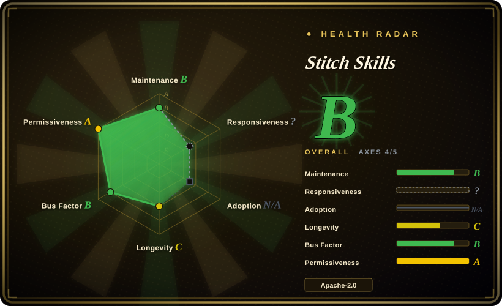
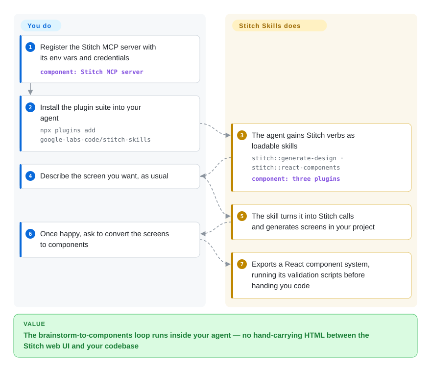

# Stitch Skills

You sketch screens in Google's Stitch, then babysit the round-trip by hand inside your coding agent — copy HTML out, eyeball it, hand-translate into React, lose the design tokens. This pack of Agent Skills lets the agent drive Stitch's MCP server (the hook that exposes Stitch to agents) directly: generate screens from a prompt, extract a `DESIGN.md`, export validated React / React Native / shadcn components.

## When to use

You're a frontend or full-stack engineer who's been handed "make this look like a real product, not a Bootstrap demo" and you don't have a designer on the team. You already use Stitch (Google Labs' AI UI design tool) to sketch screens, but inside your coding agent you keep manually shuttling between the Stitch web UI, copy-pasted HTML, and your React codebase — generate a screen, eyeball it, hand-translate it into components, lose the design tokens, repeat. The round-trip is the pain, and your agent has no idea Stitch exists.

You install Stitch Skills so the agent itself can run the loop. With the Stitch MCP server configured, the skills give your agent verbs it didn't have: `generate-design` (screens from a prompt or reference image), `code-to-design` / `extract-static-html` (pull your running app's HTML back *into* Stitch), `extract-design-md` / `taste-design` (distill a semantic `DESIGN.md` that enforces non-generic UI standards), and `react-components` / `react-native` / `shadcn-ui` / `react-vite-dashboard` (turn Stitch screens into validated component systems or dashboards). You install once — `npx plugins add google-labs-code/stitch-skills --scope project --target claude-code` for Claude Code, `--target cursor` for Cursor, a `codex plugin marketplace add …` flow for Codex, or `npx skills add google-labs-code/stitch-skills` for selective install — and the brainstorm-to-component path becomes something the agent narrates and executes instead of you babysitting tabs. The README now also documents OpenCode as a supported harness, via manual copy of the skill folders.

## How it works

Each skill is a folder the agent's skill loader discovers (`SKILL.md` plus scripts, checklists, and gold-standard examples); the markdown tells the agent *what Stitch tool to call in what order*, and the Stitch MCP server does the actual generating. So the handoff is: you register the MCP server once (setup page credentials/env vars), install the plugins, then keep talking normally — "make a browse tab for a romance app". The skill translates that into Stitch API calls, returns screens inside your Stitch project, and when you're happy, a build skill (e.g. `react-components`) converts screens to components and runs its validation scripts before handing you code. What stays yours: the design direction, approving intermediate screens, and committing the generated components — and everything degrades to inert prompts the moment the hosted Stitch service or its credentials go away.

<!-- flow-steps:begin (generated from flows/stitch-skills.json by tools/flow_card.py — do not edit) -->

Text version of the flow

1. **You**: Register the Stitch MCP server with its env vars and credentials — component: `Stitch MCP server`
2. **You**: Install the plugin suite into your agent — `npx plugins add google-labs-code/stitch-skills`
3. **Stitch Skills**: The agent gains Stitch verbs as loadable skills — `stitch::generate-design · stitch::react-components` — component: `three plugins`
4. **You**: Describe the screen you want, as usual
5. **Stitch Skills**: The skill turns it into Stitch calls and generates screens in your project
6. **You**: Once happy, ask to convert the screens to components
7. **Stitch Skills**: Exports a React component system, running its validation scripts before handing you code

**Value**: The brainstorm-to-components loop runs inside your agent — no hand-carrying HTML between the Stitch web UI and your codebase

<!-- flow-steps:end -->

## When NOT to use

- **You don't (and won't) run the Stitch MCP server.** These are skills *for Stitch* — they assume `stitch.withgoogle.com`'s MCP server is registered with credentials/env vars set. Without it the skills are inert prompts that reference tools the agent can't call. This is hard coupling to one vendor's hosted product, not a portable design methodology. [推断]
- **You want vendor-neutral "design taste" guidance.** Pure critique/taste skill packs (e.g. taste-skill, make-interfaces-feel-better, ui-ux-pro-max in this same leaf) shape *judgment* with no backend dependency. Stitch Skills is a control surface for a specific generation engine — overlapping intent, very different lock-in.
- **You already have a design-system / DESIGN.md skill you trust.** Several skills here (`extract-design-md`, `design-md`, `taste-design`, `manage-design-system`) overlap with generic `DESIGN.md` tooling; running both invites two competing sources of truth for tokens and theme.
- **You're not on a supported harness.** README (verified 2026-09-28) lists Codex, Antigravity, Gemini CLI, Claude Code, Cursor, and OpenCode — but OpenCode is manual-only: copy each skill folder into `.opencode/skills/` and rename any non-kebab `stitch::…` skill names before the loader accepts them. On other agents there's no loader to activate the SKILL.md files.
- **You need the work to outlive the product.** Maturity is early (v1.0, single org-backed Google Labs repo); skill behavior and the Stitch MCP API can move together. Pin and re-verify after upgrades.
- **Skills are advisory, not enforced.** Behavior lives in SKILL.md prompts the agent loads; "validation" steps (e.g. `react-components`) are prompt-level, and the agent can still deviate.

## Comparison

| Alternative | In index | Our verdict | Tradeoff |
|---|---|---|---|
| [designer-skills](../ui-taste/designer-skills.md) | ✅ | Pick designer-skills when you need generic designer-persona guidance and no backend dependency. | Generic designer-persona skill pack for UI/UX taste; no required backend. Stitch Skills is heavier (needs the MCP server) but actually *generates and converts* designs rather than only advising. |
| [ui-ux-pro-max](../ui-taste/ui-ux-pro-max.md) | ✅ | Pick ui-ux-pro-max when you want broad, vendor-neutral UI/UX guidance and critique. | Broad UI/UX skill collection focused on guidance and critique; vendor-neutral. Choose it when you want portable taste, Stitch Skills when you're committed to the Stitch generation loop. |
| [taste-skill](../ui-taste/taste-skill.md) | ✅ | Pick taste-skill when you need pure taste and anti-generic critique without Stitch plumbing. | Pure "taste"/anti-generic critique pack; overlaps only with Stitch's `taste-design` slice, with none of the code↔design plumbing or lock-in. |
| [make-interfaces-feel-better](../ui-taste/make-interfaces-feel-better.md) | ✅ | Pick make-interfaces-feel-better when you need advisory interaction polish for existing UI. | Interaction/polish-focused skills; advisory micro-improvements. Stitch Skills operates at the screen-generation and component-export layer instead. |
| Stitch MCP server itself (`stitch.withgoogle.com`) | not a repo | Pick the hosted Stitch MCP server when you need the actual engine these skills call. | The actual engine these skills call; it's a hosted product, not an indexable repo. This repo is just the agent-facing skill wrappers around it. |
| v0 / Lovable / other AI UI generators | 未收录 | Pick hosted AI UI generators when you want competing design-to-code products rather than agent skills. | Competing AI design-to-code products, mostly hosted SaaS rather than agent-skill repos; different unit of consumption (you drive their UI, not your agent). |

## Health & viability

- **Responsiveness**: Cannot be scored — type_na.
- **Maintenance (2026-09):** commits active (last pushed 2026-08-17) but **releases frozen** — the latest release is still v1.0 (2026-05-18; the only other tag is v0.1), so ~4 months of `main` changes are untagged; you consume the skill set off `main` or pin a commit.
- **Governance / bus factor:** `Organization`-owned by **`google-labs-code`** — org backing, not a lone maintainer, which lifts the bus factor. The flip side is **vendor risk**: the README itself states "This is not an officially supported Google product" (and it's excluded from Google's OSS vulnerability reward program), and Google Labs is an experimental arm with a documented history of sunsetting projects, so org backing here is not a longevity guarantee. `[推断]`
- **Age & Lindy verdict:** young (created 2026-01, ~8.5 months old) — **unproven**, though adoption is growing (~6.2k→8.4k stars between the 2026-06 and 2026-09 checks). Worse, its viability is *tethered to a hosted product* (`stitch.withgoogle.com`): if Stitch is deprecated, these skills are inert regardless of repo health. Lindy here is the product's, not the repo's.
- **Risk flags:** hard coupling to one vendor's hosted MCP server (skills are inert without it and its credentials), explicitly *not* an officially supported Google product and outside its VRP, advisory-only enforcement, and a stated inter-skill dependency graph that selective installs can break. The deprecation risk of a Google Labs product is the dominant flag.

## Caveats (unverified)

- [未验证] Adoption figures and the skills.sh / marketplace install telemetry aren't published; the star count (~8,383 per GitHub on 2026-09-28) is date-sensitive; treat as indicative only, not as a quality signal.
- [未验证] The exact skill inventory (stitch-design: code-to-design, generate-design, manage-design-system, extract-design-md, extract-static-html, upload-to-stitch; stitch-build: react-components, react-native, react-vite-dashboard, remotion, shadcn-ui; stitch-utilities: design-md, enhance-prompt, stitch-loop, taste-design) was read from the README's tables on 2026-09-28 and changes release-to-release; inspect the current `plugins/` directory rather than trusting this list.
- [未验证] The README states skills "often have inter-dependencies"; selective installs may break if required dependency skills are omitted — the precise dependency graph is not enumerated here.
- [推断] The skills require credentials/env vars for the Stitch MCP server (the README's Prerequisites says so) and likely a Google account or API access to the Stitch product; exact auth requirements were not confirmed from the setup docs here.
- [推断] Because behavior lives in agent-loaded SKILL.md prompts, enforcement is advisory — "validation"/"automated" steps are prompt-level instructions backed by per-skill scripts, but the agent can still deviate.
