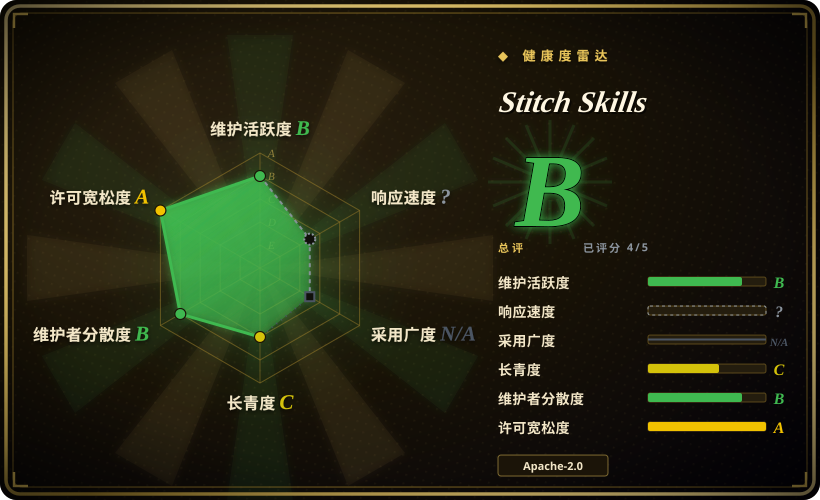
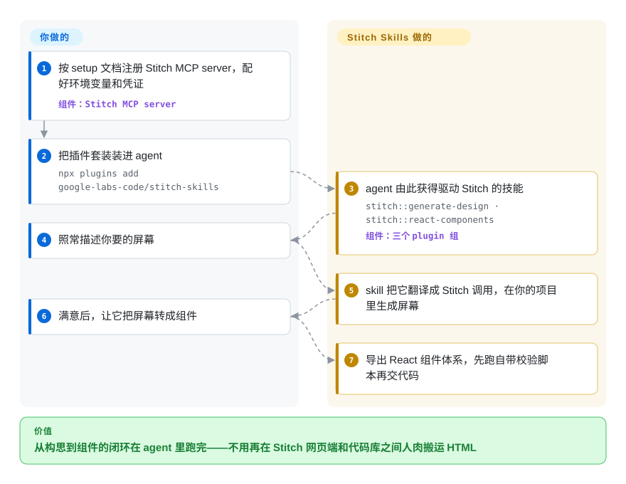

# Stitch Skills

你在 Google 的 Stitch 里画好了屏幕，回到 coding agent 里却只能人肉搬运——HTML 复制出来、肉眼比对、手工翻译成 React、设计 token 一路丢失。这套 Agent Skills 让 agent 直接驱动 Stitch 的 MCP server（把 Stitch 暴露给 agent 的接口）：从 prompt 生成屏幕、抽取 `DESIGN.md`、导出带校验的 React / React Native / shadcn 组件。

## 何时使用

你是一名前端或全栈工程师，接到的需求是“让它看起来像个真正的产品，而不是 Bootstrap 演示页”，但团队里没有设计师。你已经在用 Stitch（Google Labs 的 AI UI 设计工具）画屏幕，可在 coding agent 里你只能手动在 Stitch 网页端、复制粘贴的 HTML 和你的 React 代码库之间来回搬运——生成一个屏幕、肉眼比对、手工翻译成组件、丢掉设计 token、再来一遍。痛点就在这个来回往返上，而你的 agent 根本不知道 Stitch 的存在。

于是你装上 Stitch Skills，让 agent 自己来跑这个闭环。配好 Stitch MCP server 之后，这些技能给 agent 补上了它原本没有的动作：`generate-design`（从 prompt 或参考图生成屏幕）、`code-to-design` / `extract-static-html`（把你正在运行的 app 的 HTML 拉*回* Stitch）、`extract-design-md` / `taste-design`（蒸馏出一份强制非通用 UI 标准的语义化 `DESIGN.md`）、以及 `react-components` / `react-native` / `shadcn-ui` / `react-vite-dashboard`（把 Stitch 屏幕转成带校验的组件体系或仪表盘）。装一次即可——Claude Code 用 `npx plugins add google-labs-code/stitch-skills --scope project --target claude-code`，Cursor 用 `--target cursor`，Codex 走 `codex plugin marketplace add …`，或 `npx skills add google-labs-code/stitch-skills` 做选择性安装——从构思到组件这条路径就变成 agent 能叙述并执行的事，而不用你盯着浏览器标签页。README 现在也把 OpenCode 列为受支持的 harness，但要手动拷贝 skill 目录安装。

## 怎么用起来

每个 skill 是一个能被加载器发现的目录（`SKILL.md` 加上脚本、检查清单和范例）；markdown 告诉 agent *按什么顺序调哪些 Stitch 工具*，真正干生成的活的是 Stitch MCP server。所以交接是这样的：你一次性注册 MCP server（按 setup 页面配好凭证/环境变量）、装上 plugin，然后照常说话——「给恋爱 app 做一个 browse tab」。skill 把这句话翻译成 Stitch API 调用，在你的 Stitch 项目里产出的屏幕；你满意后，构建类 skill（如 `react-components`）把屏幕转成组件，跑完自带的校验脚本再交代码。留在你这边的：设计方向的决定、逐屏确认、以及提交生成的组件——而一旦托管的 Stitch 服务或它的凭证没了，这一切都会退化成死 prompt。

<!-- flow-steps:begin (generated from flows/stitch-skills.json by tools/flow_card.py — do not edit) -->

流程文字版

1. **你**：按 setup 文档注册 Stitch MCP server，配好环境变量和凭证 — 组件：`Stitch MCP server`
2. **你**：把插件套装装进 agent — `npx plugins add google-labs-code/stitch-skills`
3. **Stitch Skills**：agent 由此获得驱动 Stitch 的技能 — `stitch::generate-design · stitch::react-components` — 组件：`三个 plugin 组`
4. **你**：照常描述你要的屏幕
5. **Stitch Skills**：skill 把它翻译成 Stitch 调用，在你的项目里生成屏幕
6. **你**：满意后，让它把屏幕转成组件
7. **Stitch Skills**：导出 React 组件体系，先跑自带校验脚本再交代码

**价值**：从构思到组件的闭环在 agent 里跑完——不用再在 Stitch 网页端和代码库之间人肉搬运 HTML

<!-- flow-steps:end -->

## 何时不用

- **你不会（也不打算）运行 Stitch MCP server。** 这些技能是*为 Stitch 服务*的——它们假设 `stitch.withgoogle.com` 的 MCP server 已注册、凭证/环境变量已配好。没有它，这些技能只是一堆引用了 agent 调不到的工具的死 prompt。这是对单一厂商托管产品的硬耦合，不是一套可移植的设计方法论。[推断]
- **你想要厂商无关的“设计品味”指导。** 纯批评/品味类技能包（比如同一 leaf 下的 taste-skill、make-interfaces-feel-better、ui-ux-pro-max）塑造的是*判断*，不依赖任何后端。Stitch Skills 是某个特定生成引擎的控制面——意图重叠，但锁定程度天差地别。
- **你已经有信任的设计系统 / DESIGN.md 技能。** 这里有几个技能（`extract-design-md`、`design-md`、`taste-design`、`manage-design-system`）和通用的 `DESIGN.md` 工具重叠；两套同时跑会让 token 和主题产生两个互相打架的事实源。
- **你不在受支持的 harness 上。** README（2026-09-28 核实）列出 Codex、Antigravity、Gemini CLI、Claude Code、Cursor，以及 OpenCode——但 OpenCode 只能手动安装：把每个 skill 目录拷进 `.opencode/skills/`，非 kebab 格式的 `stitch::…` 技能名还要先改名，加载器才认。在其它 agent 上没有加载器来激活这些 SKILL.md 文件。
- **你需要成果脱离产品而长存。** 成熟度还早（v1.0，单一 Google Labs 组织背书的仓库）；技能行为和 Stitch MCP API 可能一起变动。请锁版本，并在升级后重新核验。
- **技能是建议性的，不是强制的。** 行为活在 agent 加载的 SKILL.md prompt 里；所谓“校验”步骤（如 `react-components`）也只是 prompt 级别，agent 仍可能偏离。

## 横向对比

| 替代品 | 是否收录 | 我们的评价 | 取舍 |
|---|---|---|---|
| [designer-skills](../ui-taste/designer-skills.zh.md) | ✅ | 需要通用设计师 persona 技能包、且不想依赖后端时，选 designer-skills。 | 通用的设计师 persona 技能包，偏 UI/UX 品味，无需后端。Stitch Skills 更重（要 MCP server），但能真正*生成和转换*设计，而非只给建议。 |
| [ui-ux-pro-max](../ui-taste/ui-ux-pro-max.zh.md) | ✅ | 需要厂商无关、偏指导与批评的宽口径 UI/UX 技能集时，选 ui-ux-pro-max。 | 偏指导与批评的宽口径 UI/UX 技能集，厂商无关。想要可移植的品味就选它，已押注 Stitch 生成闭环就选 Stitch Skills。 |
| [taste-skill](../ui-taste/taste-skill.zh.md) | ✅ | 需要纯“品味”与反通用批评、且不要 Stitch 管线时，选 taste-skill。 | 纯“品味”/反通用批评包；只和 Stitch 的 `taste-design` 切片重叠，没有任何代码↔设计的管道，也没有锁定。 |
| [make-interfaces-feel-better](../ui-taste/make-interfaces-feel-better.zh.md) | ✅ | 需要对已有界面做交互和手感打磨时，选 make-interfaces-feel-better。 | 偏交互/打磨的技能；做建议性的微改进。Stitch Skills 工作在屏幕生成和组件导出这一层。 |
| Stitch MCP server 本体（`stitch.withgoogle.com`） | 非仓库 | 需要这些技能真正调用的托管引擎时，选 Stitch MCP server 本体。 | 这些技能真正调用的引擎；它是托管产品，不是可索引的仓库。本仓库只是包在它外面、面向 agent 的技能壳。 |
| v0 / Lovable / 其它 AI UI 生成器 | 未收录 | 需要竞品 AI 设计转代码产品、而不是 agent 技能仓库时，选托管 UI 生成器。 | 竞品 AI 设计转代码产品，多为托管 SaaS 而非 agent 技能仓库；消费单元不同（你驱动它们的 UI，而非你的 agent）。 |

## 健康度与可持续性

- **响应速度**：无法计算——type_na。
- **维护（2026-09）：** 提交在动（最后 push 2026-08-17）、但 **release 冻住了**——最新仍是 v1.0（2026-05-18，另一个 tag 只有 v0.1），`main` 上约 4 个月的改动没打 tag；要么从 `main` 消费技能集，要么 pin commit。
- **治理 / bus factor：** 由 **`google-labs-code`** 组织所有——有组织背书、非单人维护，抬高了 bus factor。反面是**厂商风险**：README 自己写明「This is not an officially supported Google product」（且不在 Google OSS 漏洞奖励计划内），而 Google Labs 是实验性部门、有记录在案的下线项目历史，所以这里的组织背书并不构成存续保证。`[推断]`
- **年龄与 Lindy 判断：** 年轻（创建于 2026-01，约 8 个半月）——**未经验证**，不过采用度在涨（两次核验之间 stars 从约 6.2k 到 8.4k）。更要紧的是，它的可持续性*系于一个托管产品*（`stitch.withgoogle.com`）：一旦 Stitch 被弃用，无论仓库本身多健康，这些技能都会失效。这里的 Lindy 属于产品，而非仓库。
- **风险旗标：** 与单一厂商托管 MCP server 硬耦合（没有它及其凭证，技能即失效）、明确*不是* Google 官方支持产品且被排除在其 VRP 之外、强制力仅为建议性、且存在声称的技能间依赖图谱，选择性安装可能破坏它。Google Labs 产品的弃用风险是头号旗标。

## 存疑（未验证）

- [未验证] 最新 release 标记为 v1.0（2026-05-18 发布），仓库最后 push 于 2026-08-17；license 为 Apache-2.0、主语言 TypeScript，均据 GitHub 元数据（2026-09-28 复核）——依赖某个具体版本的行为或技能集前请重新核验。
- [未验证] stars 数（2026-09-28 GitHub 显示约 8,383）对日期敏感，仅作参考，不能当质量信号。
- [未验证] 准确的技能清单（stitch-design：code-to-design、generate-design、manage-design-system、extract-design-md、extract-static-html、upload-to-stitch；stitch-build：react-components、react-native、react-vite-dashboard、remotion、shadcn-ui；stitch-utilities：design-md、enhance-prompt、stitch-loop、taste-design）于 2026-09-28 读自 README 表格，会随版本变动；请检查当前 `plugins/` 目录而非依赖此列表。
- [未验证] 受支持 agent 列表（Codex、Antigravity、Gemini CLI、Claude Code、Cursor、OpenCode 手动安装）来自 README；各 harness 的实际激活保真度未在此独立确认。
- [未验证] README 声称技能“常有相互依赖”；选择性安装若漏掉依赖技能可能失效——确切的依赖图谱未在此枚举。
- [推断] 这些技能需要 Stitch MCP server 的凭证/环境变量，很可能还需要 Google 账号或 Stitch 产品的 API 访问；确切的鉴权要求未从文档确认。
- [推断] 由于行为活在 agent 加载的 SKILL.md prompt 里，强制力是建议性的——所谓“校验”/“自动化”步骤是 prompt 级指令，不是硬保证。
