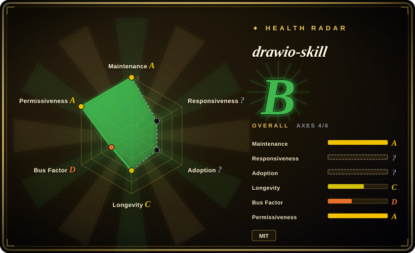
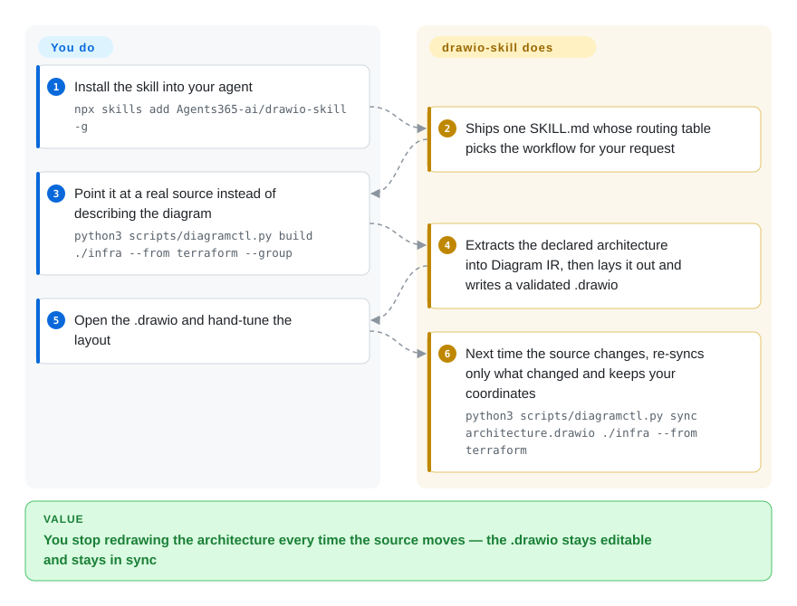

# drawio-skill

An agent skill that turns prose, code, IaC and API schemas into editable `.drawio` files — then re-syncs them from the source without discarding the layout you tuned by hand.

## When to use

You're the engineer who owns the architecture picture — the one that has to be right before a design review, a migration, or an incident retro. Drawing it is not the problem; keeping it true is. The Terraform was refactored two quarters ago, the diagram wasn't, and now nobody opens it any more. You want the agent to build the picture from the real source instead: a Terraform tree, a Kubernetes manifest set, a `docker-compose.yml`, a SQL DDL file, an OpenAPI/AsyncAPI/Protobuf/GraphQL spec, a repository's import graph, or a CI workflow. And you still want a `.drawio` file at the end, because a human always nudges a box before showing it to anyone.

Reach for drawio-skill when the diagram has to survive contact with a real team and keep living: the deciding tradeoff is that it keeps a diagram's *meaning*, *provenance* and *geometry* as separate layers, so it can re-extract from a source that changed and move only the affected nodes instead of regenerating the picture and losing your layout. If the diagram should instead stay plain text inside git, reach for Mermaid; if the value is a loose sketch a person draws, reach for Excalidraw; if you want an agent-made diagram as a self-contained HTML artifact with no draw.io install at all, reach for archify.

## How it works

drawio-skill is one `SKILL.md` (147 lines, mostly a routing table) plus 45 Python scripts; the agent reads that table and picks the workflow for your request, so you never call the scripts yourself. Underneath, everything funnels through one idea the project calls the **Diagram IR**: a small model where every node and edge keeps three things apart — what it *means* (`kind`, owner, environment, trust boundary), where it *came from* (source file and line, kept as provenance), and where it *sits* on the page. Importers fill in only the first two, a layout step decides the third, and the third is the only layer you are expected to edit by hand. That separation is what makes `sync` possible: re-running an importer against a changed source yields a new meaning-and-provenance layer, which is diffed against the old one so only changed nodes move — your coordinates and styles stay untouched, and deletions remain visible as faded elements until you pass `--prune`. What you supply is the source and the layout taste; what it supplies is extraction, placement, structural validation and the bookkeeping that keeps model and picture in step. Its footprint is deliberately small: Python 3 only for the IR, build, sync, query, test, review and story workflows; the draw.io desktop binary only for rendered PNG/SVG/PDF exports and the vision self-check loop; Graphviz only for automatic layout; PyYAML, Pillow and python-pptx only where an importer or export needs them, each failing with an explicit message rather than a traceback.

<!-- flow-steps:begin (generated from flows/drawio-skill.json by tools/flow_card.py — do not edit) -->

Text version of the flow

1. **You**: Install the skill into your agent — `npx skills add Agents365-ai/drawio-skill -g`
2. **drawio-skill**: Ships one SKILL.md whose routing table picks the workflow for your request
3. **You**: Point it at a real source instead of describing the diagram — `python3 scripts/diagramctl.py build ./infra --from terraform --group`
4. **drawio-skill**: Extracts the declared architecture into Diagram IR, then lays it out and writes a validated .drawio
5. **You**: Open the .drawio and hand-tune the layout
6. **drawio-skill**: Next time the source changes, re-syncs only what changed and keeps your coordinates — `python3 scripts/diagramctl.py sync architecture.drawio ./infra --from terraform`

**Value**: You stop redrawing the architecture every time the source moves — the .drawio stays editable and stays in sync

<!-- flow-steps:end -->

## When NOT to use

- **The diagram must stay plain text in git.** When reviewers should read the diagram as a diffable code block that renders inside a Markdown file, use [Mermaid](../../diagramming/mermaid.md): it is compact and portable, at the cost of layout control. drawio-skill optimizes for a hand-tunable picture instead.
- **The value is a loose, hand-drawn sketch.** For whiteboard-style collaboration where a person does the drawing, use [Excalidraw](../../diagramming/excalidraw.md); drawio-skill targets generated, precise, source-backed diagrams rather than casual sketching.
- **You want an agent-made diagram artifact without installing anything desktop.** If a self-contained HTML/SVG diagram is an acceptable deliverable and no `.drawio` file is needed, [archify](archify.md) avoids the draw.io binary entirely.
- **The artifact is a prototype, slide deck, animation or infographic.** That is [huashu-design](huashu-design.md)'s surface — HTML-native visual artifacts; drawio-skill stays narrow on diagrams that map to real system components.
- **You need rendered exports but cannot run the draw.io desktop binary.** The IR, XML, `build`, `sync`, `query`, `test`, `review` and `story` paths are pure Python; PNG/SVG/PDF export and the vision self-check loop are not. In an environment that cannot run that binary you get XML plus a diagrams.net URL fallback rather than the polished artifact — prefer Mermaid or a hosted drawing tool there.
- **You want the diagram to prove something about the running system.** `test`, `review` and `whatif` read the *declared* model — `whatif` is deterministic reachability, and the project itself says these cannot establish runtime redundancy or security controls. For runtime truth, pair it with your observability and chaos-testing stack rather than the diagram.
- **You need a long track record before adopting.** The repo dates from March 2026 and one account authors most of its history, so its API surface and behavior move fast. If you need a long-lived, multi-vendor-backed dependency, an established diagrams-as-code toolchain is the safer bet; if you adopt this, pin a version and re-check after upgrades.

## Comparison

| Alternative | In index | Our verdict | Tradeoff |
|---|---|---|---|
| [archify](archify.md) | ✅ | Choose drawio-skill when the file must open in draw.io and be re-synced from source; choose archify when a self-contained HTML/SVG diagram is enough and no desktop binary should be needed. | archify renders in a browser and installs nothing; drawio-skill costs a draw.io install but returns a file humans can hand-edit plus a sync path back to the source. |
| [huashu-design](huashu-design.md) | ✅ | Choose huashu-design when the artifact is a prototype, slide deck, animation or infographic; keep drawio-skill when the artifact is a technical diagram that must map to named system components. | huashu-design covers a wider visual surface with HTML output; drawio-skill is narrower but carries provenance and a machine-checkable model. |
| [Mermaid](../../diagramming/mermaid.md) | ✅ | Choose Mermaid when the diagram should stay plain text, diff cleanly in review and render inside Markdown; choose drawio-skill when the audience needs a polished picture a non-engineer will open and adjust. | Mermaid is portable and zero-install but gives little layout control; drawio-skill trades that portability for hand-tunable geometry and official cloud/UML shape fidelity. |
| [Excalidraw](../../diagramming/excalidraw.md) | ✅ | Choose Excalidraw when the point is a collaborative sketch a human draws on; choose drawio-skill when the diagram must be generated from a source of truth and stay accurate across changes. | Excalidraw wins on low-friction drawing; drawio-skill wins on extraction accuracy and incremental update, at the cost of a heavier pipeline. |

## Health & viability

- **Maintenance (checked 2026-09-21):** actively developed. The repo was pushed on 2026-09-14, the same day as its v3.4.0 release, and it has cut 45 releases since 2026-04-06 — roughly eight a month. Not archived.
- **Not scored — responsiveness and adoption.** Both are `?` for structural reasons (`type_na`, `no_package_structural`): the rubric's spine signals for those axes need a package-registry feed, and an agent skill installed by copying a directory has none. Read the aggregate as four of six axes scored, not as a full hexagon.
- **Governance & bus factor — the weakest axis.** Practically a single-publisher project: 16 contributors exist, but one account (`Agents365-ai`, a GitHub `User` from 2025-07 with 7 public repos and 391 followers) authored 261 of 283 commits. That account also fronts sibling diagram skills (excalidraw-skill, tldraw-skill, mermaid-skill, plantuml-skill), so the roadmap is one publisher's product line, not a foundation's.
- **Age & Lindy (2026-09):** the repo dates from 2026-03-03, so it is about six and a half months young. Attention is high relative to that age (~9,516 stars, 671 forks), but with so little history the Lindy prior is unproven — adopt for what it does today and expect the surface to keep moving. [推断]
- **Adoption & ecosystem:** listed on SkillsMP and agentskills.io and installable with `npx skills add`; the per-agent compatibility list is the project's own claim, so verify it on your harness. [未验证]
- **Risk flags:** MIT with no relicense history. The real trust question is capability, not license — the skill declares `allowed-tools: [Bash, Read, Write, WebFetch]` and ships 45 scripts, so installing it hands an agent a local code executor. I checked the scripts for `shell=True`, `os.system`, `eval` and `exec` (none), that icon downloads go through an https host allowlist and stay off unless requested, and that the repo publishes its own static-scanner findings instead of suppressing them.
- **Churn risk:** eight releases a month against 42 focused tools means command flags and behavior can shift between versions; pin the version you validated.

## Caveats (unverified)

- [未验证] Star and fork counts (~9,516 / 671 on 2026-09-21) are GitHub metadata; the composition of that growth could not be checked, because GitHub's stargazers listing API returned 404 from this environment and no star timeline was available.
- [未验证] The compatibility list (Claude Code, Cursor, Copilot, OpenClaw, Codex, Autohand Code, Hermes) is the project's own; only the Agent Skills format is a shared standard, and per-harness fidelity was not tested in this pass.
- [未验证] The README's "321 AI/LLM brand logos" figure is not directly checkable: the bundled `data/lobe-icons.json` holds 871 entries and the reference doc states no filter rule, so 321 is presumably a curated subset of the same file.
- [未验证] The rendered-export path (draw.io desktop CLI → PNG/SVG/PDF) and the vision self-check loop were not exercised, because the draw.io binary was not installed on this machine. What was verified locally is the Python path: 218 unit tests pass, and `build` (IR → `.drawio`) plus a policy `test` run end to end against the bundled `examples/architecture-studio` fixture.
- [未验证] The project's own comparison table and `docs/COMPARISON.md` are self-reported. Claims I could check locally (test count, shape-index size, guarded optional imports) hold, but the competitive claims were not independently verified.
- [推断] The semantic layer (`test` / `review` / `whatif`) reasons about declared diagram semantics only; treating its findings as evidence about the running system would overstate what graph topology can show.
- [推断] Single-publisher ownership means that if `Agents365-ai` stops, expect the project to stall rather than transfer to a community.
