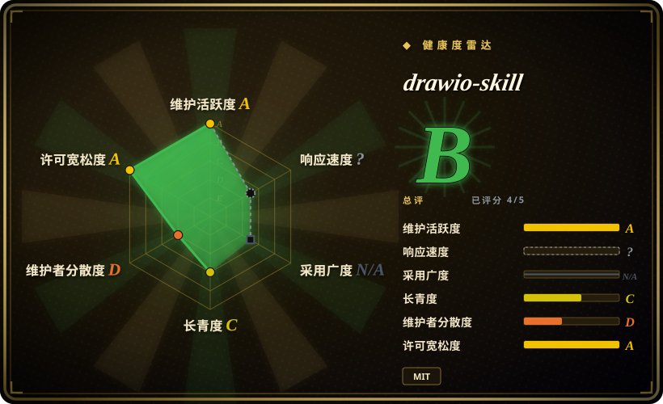
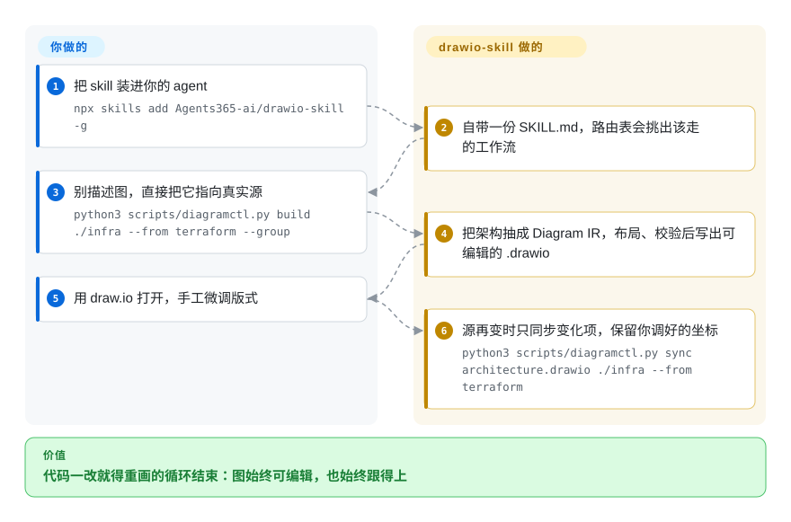

# drawio-skill

把自然语言、代码、IaC 和接口 schema 变成可编辑的 `.drawio` 文件，并能在源改动后重新同步、不丢掉你手工调好的版式。

## 何时使用

你是那个「手里握着架构图」的人——设计评审、迁移、故障复盘之前，这张图必须是对的。难点从来不是画，而是让它保持真实：Terraform 两个季度前就重构过了，图没跟上，于是再也没人打开它。这时你要的是让 agent 直接从真实源出图——Terraform 目录、K8s manifest 集合、`docker-compose.yml`、SQL DDL、OpenAPI/AsyncAPI/Protobuf/GraphQL 规格文件、仓库的 import 图，或者一条 CI 流水线。同时你还希望最终产物仍然是一个 `.drawio` 文件，因为给人看之前，人总要挪一挪框。

当你需要这张图「能进真实团队、还得活下去」时选它：决定性取舍在于它把图的**含义**、**来源**和**几何**分成三层保存，所以源变了它能重新抽取、只移动受影响的节点，而不是整张重画、把你调好的布局冲掉。如果图应该以纯文本活在 git 里，选 Mermaid；如果价值在于人随手画的草图，选 Excalidraw；如果只想要一份不装 draw.io 就能看的自包含 HTML 图，选 archify。

## 怎么用起来

drawio-skill 的主体是一份 `SKILL.md`（147 行，绝大部分是一张路由表）加 45 个 Python 脚本；agent 读这张表自己挑该走的工作流，你不用手动调脚本。底下所有流程都汇到它称为 **Diagram IR** 的模型：每个节点和边把三件事分开存——它**是什么**（`kind`、owner、environment、trust boundary）、它**从哪来**（源文件与行号，作为 provenance 保留）、它**画在哪**。导入器只填前两层，布局步骤决定第三层，而第三层是唯一预期由你手改的层。这个拆分正是 `sync` 成立的前提：拿改过的源重跑一次导入器，得到新的「含义加来源」层，再和旧层做 diff，于是只有变化的节点会动——你的坐标和样式原样保留，被删掉的东西默认以淡显元素留着可审，直到你显式加 `--prune`。你出的是源和版式审美，它出的是抽取、摆放、结构校验，以及让模型和图不掉队的记账。它的占地很小：IR、build、sync、query、test、review、story 这几条链路只要 Python 3；渲染 PNG/SVG/PDF 导出和「看图自检」循环才需要 draw.io 桌面版二进制；自动布局才需要 Graphviz；PyYAML、Pillow、python-pptx 只在对应导入器或导出用到时才有要求，缺了会明确报错，而不是抛一堆 traceback。

<!-- flow-steps:begin (generated from flows/drawio-skill.json by tools/flow_card.py — do not edit) -->

流程文字版

1. **你**：把 skill 装进你的 agent — `npx skills add Agents365-ai/drawio-skill -g`
2. **drawio-skill**：自带一份 SKILL.md，路由表会挑出该走的工作流
3. **你**：别描述图，直接把它指向真实源 — `python3 scripts/diagramctl.py build ./infra --from terraform --group`
4. **drawio-skill**：把架构抽成 Diagram IR，布局、校验后写出可编辑的 .drawio
5. **你**：用 draw.io 打开，手工微调版式
6. **drawio-skill**：源再变时只同步变化项，保留你调好的坐标 — `python3 scripts/diagramctl.py sync architecture.drawio ./infra --from terraform`

**价值**：代码一改就得重画的循环结束：图始终可编辑，也始终跟得上

<!-- flow-steps:end -->

## 何时不用

- **图必须以纯文本留在 git 里。** 如果评审时希望图是一个可 diff、能在 Markdown 里直接渲染的代码块，用 [Mermaid](../../diagramming/mermaid.zh.md)：它紧凑、零安装、可移植，代价是版式控制弱。drawio-skill 优化的是「可手工微调的成品图」，不是这个场景。
- **要的是随手的白板风格草图。** 人画、人协作的场景用 [Excalidraw](../../diagramming/excalidraw.zh.md)；drawio-skill 面向的是生成式的、精确的、有源可溯的图，不是随手涂画。
- **想要 agent 出图但不想装任何桌面软件。** 如果自包含的 HTML/SVG 图就算交付物、不需要 `.drawio` 文件，[archify](archify.zh.md) 完全绕开 draw.io 二进制。
- **交付物是原型、幻灯片、动画或信息图。** 那是 [huashu-design](huashu-design.zh.md) 的地盘（HTML 原生的视觉产物）；drawio-skill 只做能对应到真实系统组件的那类图。
- **需要渲染导出，但跑不了 draw.io 桌面版二进制。** IR、XML、`build`、`sync`、`query`、`test`、`review`、`story` 这些链路是纯 Python；PNG/SVG/PDF 导出和看图自检循环不是。在跑不了那个二进制的环境里，你拿到的是 XML 加一个 diagrams.net 链接兜底，而不是成品图——这种情况改用 Mermaid，或改用托管绘图工具。
- **想让图证明运行时的性质。** `test`、`review`、`whatif` 读的都是**声明**出来的模型：`whatif` 是确定性可达性计算，项目自己也写明这些无法确立运行时的冗余与安全控制。要运行时真相，请接你自己的可观测性与混沌工程工具链，而不是靠这张图。
- **需要足够长的历史才敢采纳。** 仓库 2026 年 3 月才建立，绝大多数提交来自同一个账号，接口与行为变化很快。如果你要的是一个历史悠久、多方背书的依赖，成熟的 diagrams-as-code 工具链更稳；如果你采纳本页项目，请锁版本，并在升级后重新核对。

## 横向对比

| 替代品 | 是否收录 | 我们的评价 | 取舍 |
|---|---|---|---|
| [archify](archify.zh.md) | ✅ | 需要文件能在 draw.io 里打开、并能从源重新同步时选 drawio-skill；自包含的 HTML/SVG 图就够、且不想装桌面二进制时选 archify。 | archify 在浏览器里渲染、不装东西；drawio-skill 要装一次 draw.io，换来一个人能手工编辑的文件和一条回到源的同步路径。 |
| [huashu-design](huashu-design.zh.md) | ✅ | 交付物是原型、幻灯片、动画或信息图时选 huashu-design；交付物是必须对应到具体系统组件的技术图时留用 drawio-skill。 | huashu-design 覆盖的视觉面更宽、输出 HTML；drawio-skill 更窄，但带 provenance 和可机器校验的模型。 |
| [Mermaid](../../diagramming/mermaid.zh.md) | ✅ | 图要保持纯文本、在评审里能干净 diff、并能直接渲染进 Markdown 时选 Mermaid；读者需要一张非工程同学也愿意打开微调的成品图时选 drawio-skill。 | Mermaid 可移植、零安装，但几乎没有版式控制；drawio-skill 拿这份可移植性换手工可调的几何与官方云图标、UML 形状的还原度。 |
| [Excalidraw](../../diagramming/excalidraw.zh.md) | ✅ | 重点是人在上面协作涂画时选 Excalidraw；图必须从事实源生成、并且随源变化保持准确时选 drawio-skill。 | Excalidraw 胜在低门槛手绘；drawio-skill 胜在抽取准确和增量更新，代价是链路更重。 |

## 健康度与可持续性

- **维护（核对于 2026-09-21）：** 活跃开发中。仓库在 2026-09-14 有推送，同日发布 v3.4.0；自 2026-04-06 起已发 45 个 release，约每月八个。未归档。
- **未评分的两轴——响应性与采用度。** 两轴都是 `?`，原因是结构性的（`type_na`、`no_package_structural`）：这两轴的主信号依赖包仓库反馈，而一个靠复制目录安装的 agent skill 没有这个信号。请按「六轴中评了四轴」来读这个总分，不要当成完整六边形。
- **治理与巴士系数——最弱的一项。** 实质是单一发布方项目：贡献者有 16 人，但其中一个账号（`Agents365-ai`，GitHub `User`，2025-07 注册，7 个公开仓库、391 关注者）贡献了 283 次提交中的 261 次。该账号还挂着同族的 excalidraw-skill、tldraw-skill、mermaid-skill、plantuml-skill，所以路线图是一个发布方的产品线，不是基金会的项目。
- **年龄与 Lindy（2026-09）：** 仓库起点是 2026-03-03，只有约六个半月，很年轻。相对这个年龄关注度很高（约 9,516 星、671 fork），但历史太短，Lindy 先验尚未成立——按它今天能做什么来采纳，并预期接口会继续变。 [推断]
- **采用与生态：** 已收录于 SkillsMP 与 agentskills.io，可用 `npx skills add` 安装；各 agent 的兼容清单是项目自己的说法，请在你的 harness 上实测。 [未验证]
- **风险信号：** MIT，无换协议历史。真正的信任问题不是许可而是能力——该 skill 声明 `allowed-tools: [Bash, Read, Write, WebFetch]` 并附带 45 个脚本，装上就等于把本地代码执行权交给 agent。我检查过脚本里没有 `shell=True`、`os.system`、`eval`、`exec`；图标下载走 https 主机白名单且默认关闭；仓库把自己的静态扫描结论公开列出，而不是压制。
- **变更频率风险：** 每月八个 release 对 42 个细分工具，意味着命令行参数与行为会随版本变；请锁住你验证过的版本。

## 存疑（未验证）

- [未验证] 星数与 fork 数（2026-09-21 约 9,516 / 671）来自 GitHub 元数据；这波增长的构成无法核查——GitHub 的 stargazers 列表接口在本环境返回 404，拿不到时间线。
- [未验证] 兼容清单（Claude Code、Cursor、Copilot、OpenClaw、Codex、Autohand Code、Hermes）来自项目自述；只有 Agent Skills 格式是共同标准，各 harness 的实际保真度本轮未测。
- [未验证] README 所称「321 个 AI/LLM 品牌 logo」无法直接核对：内置的 `data/lobe-icons.json` 有 871 条记录，参考文档也没写筛选规则，所以 321 应是同一文件里的一个精选子集。
- [未验证] 渲染导出链路（draw.io 桌面版 CLI 到 PNG/SVG/PDF）与看图自检循环未实际跑通，因为本机没装 draw.io 二进制。本地已验证的是 Python 链路：218 个单测通过，`build`（IR 到 `.drawio`）与一条策略 `test` 在自带的 `examples/architecture-studio` 样例上端到端跑通。
- [未验证] 项目自己的对比表与 `docs/COMPARISON.md` 属自述。我能在本地核对的（测试数、shape 索引规模、可选依赖的 import 守卫）都对得上，但其中竞争性结论未独立验证。
- [推断] 语义层（`test` / `review` / `whatif`）只推理声明式的图语义；把它的结论当作运行时证据会高估图拓扑能说明的事情。
- [推断] 单一发布方持有意味着：如果 `Agents365-ai` 停手，更可能停摆，而不是移交给社区。
