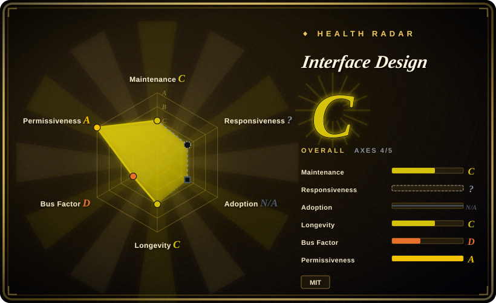
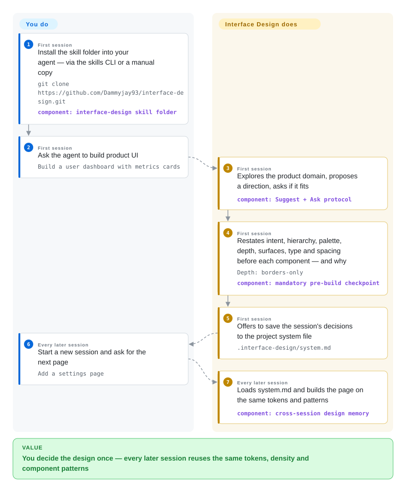

# Interface Design

You ask your coding agent for another settings page and it quietly re-decides every design question from scratch — 38px buttons this time, 17px gaps, the same Inter default as last session — so the app looks like four prototypes stapled together. Interface Design is a Claude Code / Codex skill that makes the agent explore the product's domain, decide direction and tokens once, restate that decision before every component, and persist it in `.interface-design/system.md` so later sessions reuse it.

## When to use

You're a developer or design engineer shipping product UI — dashboards, admin panels, SaaS tools, settings pages — with Claude Code or Codex. Two pains stack up: the *drift* (session one picks 4px spacing and borders-only depth; session three silently ships soft shadows and 17px gaps, and nobody decided the switch) and the *generated look* (every element one size and weight, no focal point, a grid of identical cards that reads "an AI made this"). You reach for Interface Design when your work is product surfaces rather than marketing pages — the skill's own scope excludes landing pages — and when the cost you're paying is that decisions don't survive sessions.

Compared with the sibling taste packs, the deciding tradeoff is **memory plus enforcement altitude**: the pack's signature is the cross-session design file (`.interface-design/system.md`, written after the first build, reloaded whenever the skill fires) and two review commands (`/interface-design:design-review`, a strict approval bar that can block a build; `/interface-design:design-deslop`, a fast diff-scoped slop cleanup). Pick [taste-skill](taste-skill.md) when the job is landing pages with tunable aesthetic dials, or [ui-ux-pro-max](ui-ux-pro-max.md) when you want retrieval over a curated style/palette/font database instead of a reasoning protocol that leaves the agent doing the thinking.

## How it works

The entire repo is instruction markdown with no runtime — a `SKILL.md` of roughly 320 lines, two command files, and reference templates that a skill-capable agent loads when the request is product-UI work (Claude Code auto-invokes or `/interface-design`; Codex scans `~/.agents/skills`, and `agents/openai.yaml` allows implicit invocation). What the project does for you: it imposes a decision protocol — an intent brief (who the human is, what they must accomplish, how it should feel), four mandatory domain-exploration outputs (domain vocabulary, color world, a product-specific signature, and the three defaults you're rejecting), a per-component checkpoint restating intent, hierarchy, palette, depth, surfaces, typography and spacing with a *why* for each, and concrete craft rules (type scale as a ratio, one committed depth strategy, low-opacity rgba borders, ~60/30/10 accent budget, sub-300ms custom easing). What stays yours: confirming the proposed direction, approving the save to the system file, and the fact that enforcement is advisory — the checkpoint is mandatory prompt text, not a lint gate, and nothing blocks a build. Two conditionals are explicit in the skill: it renders live specimens only if the harness has an inline render tool, and offers direction boards / paintovers only if an image-generation tool exists — it tells the agent to check, never assume.

<!-- flow-steps:begin (generated from flows/interface-design.json by tools/flow_card.py — do not edit) -->

Text version of the flow

1. **You** (First session): Install the skill folder into your agent — via the skills CLI or a manual copy — `git clone https://github.com/Dammyjay93/interface-design.git` — component: `interface-design skill folder`
2. **You** (First session): Ask the agent to build product UI — `Build a user dashboard with metrics cards`
3. **Interface Design** (First session): Explores the product domain, proposes a direction, asks if it fits — component: `Suggest + Ask protocol`
4. **Interface Design** (First session): Restates intent, hierarchy, palette, depth, surfaces, type and spacing before each component — and why — `Depth: borders-only` — component: `mandatory pre-build checkpoint`
5. **Interface Design** (First session): Offers to save the session's decisions to the project system file — `.interface-design/system.md`
6. **You** (Every later session): Start a new session and ask for the next page — `Add a settings page`
7. **Interface Design** (Every later session): Loads system.md and builds the page on the same tokens and patterns — component: `cross-session design memory`

**Value**: You decide the design once — every later session reuses the same tokens, density and component patterns

<!-- flow-steps:end -->

## When NOT to use

- **Marketing pages, landings, campaigns, brand-only work.** The skill's own description rules them out; its craft is tuned to dense product surfaces. Use [taste-skill](taste-skill.md) (its signature domain is landing-page anti-slop) or [Hallmark](hallmark.md) for one-off web briefs.
- **You're adjusting one small component and there's no direction question.** The protocol wants four exploration outputs and a seven-line checkpoint before *every* UI edit — heavy ceremony for a padding fix. Use [make-interfaces-feel-better](make-interfaces-feel-better.md)'s ~16 named detail rules, which cost nothing per component.
- **You need deterministic enforcement.** Everything is prompt text an agent can skip or dilute; "mandatory" is mandatory in prose. For a real artifact gate, use [Impeccable](../../ai-design-generation/impeccable.md)'s detector or a CSS linter in CI.
- **You want pre-computed style candidates, not reasoning.** [ui-ux-pro-max](ui-ux-pro-max.md) queries a CSV-backed style/palette/font database and emits concrete options plus an accessibility checklist; this pack makes the agent derive everything from your product's domain.
- **You already have a governed design system or brand tokens.** Inferred directions and a `system.md` of the agent's own can fight mandated tokens; encode the real system directly and skip the taste layer.
- **You already run another opinionated taste skill.** Two anti-slop packs loaded together produce overlapping, conflicting directives on typography, color and motion — pick one taste source of truth.
- **Your install path is the Claude Code plugin marketplace.** Open issue #13 (checked 2026-09-28): the plugin's skill/commands don't appear in Claude Code's slash menu because the repo nests them under `.claude/` instead of the top-level convention. The skills.sh install or manual copy of the skill folder is the recommended path.

## Comparison

| Alternative | In index | Our verdict | Tradeoff |
|---|---|---|---|
| [Taste-Skill](taste-skill.md) | ✅ | Pick Interface Design when the surface is product UI and the pain is decisions evaporating between sessions; pick Taste-Skill when the deliverable is a landing page or you want tunable aesthetic dials. | Interface Design buys a persistent system file and review commands but ships no motion skeletons or image-to-code pipelines; Taste-Skill covers more aesthetic variants yet retains nothing across sessions. |
| [UI UX Pro Max Skill](ui-ux-pro-max.md) | ✅ | Pick ui-ux-pro-max when you want retrieval over curated style/palette/font databases plus a pre-delivery accessibility checklist; pick Interface Design for a reasoning-and-memory protocol. | The retrieval engine returns concrete candidates fast but is bounded by its curated data; this pack's output is only as good as the agent's adherence to the protocol. |
| [make-interfaces-feel-better](make-interfaces-feel-better.md) | ✅ | Pick make-interfaces-feel-better for near-zero-ceremony detail polish — ~16 named mechanical fixes and nothing else; pick Interface Design when hierarchy, direction and cross-session consistency are the gap. | The checklist never argues about design direction; this pack sets direction and remembers it, at the cost of a mandatory checkpoint on every component. |
| [Hallmark](hallmark.md) | ✅ | Pick Hallmark for explicit one-pass verbs (build, audit, redesign, study) on a web page; pick Interface Design when the same app must stay coherent across many agent sessions. | Hallmark is a workflow-shaped brief; Interface Design adds the memory file and a blocking design-review command, but only for product-UI scope. |
| [Impeccable](../../ai-design-generation/impeccable.md) | ✅ | Pick Impeccable when AI-slop detection must be deterministic — a CLI over existing artifacts you can run in CI; pick Interface Design to steer the agent before the slop is written. | The detector gates what exists; the skill influences what will be generated — they solve different ends of the same problem, not each other's. |

## Health & viability

- **Responsiveness**: cannot be scored for this type (machine axis `?` — type_na); the observed issue triage below is editorial evidence, not a grade.
- **Maintenance (2026-09):** active January–June 2026 with date-stamped tags (`v2026.1.20`, `v2026.2.8`, `v2026.6.12`, `v2026.6.12.1248`), then quiet — last commit 2026-06-20, 100 days stale at check. The maintainer still closed issue #11 on 2026-08-27, so the project is attended, not shipping.
- **Governance / bus factor:** one contributor (owner Dammyjay93, 50/50 commits on `main`), `User`-owned repo. The roadmap is a single person's design taste; no team, no org.
- **Backing & longevity:** no foundation or vendor backing — GitHub Sponsors funding and a self-hosted Vercel site (interface-design.dev, live at check 2026-09-28). Created 2026-01-05, 266 days old at check: **too young for a Lindy verdict** — durability is unproven. [推断：依据是仓库年龄与活动记录，无法验证留存]
- **Adoption & ecosystem:** ~5.7k stars, 370 forks, 40 watchers (GitHub API, 2026-09-28); installs through skills.sh and the Claude Code marketplace; supports Claude Code and Codex. A 40-watcher base under 5.7k stars is a hype signal, not an engaged user community — high stars on a young repo is a risk flag per this index's own heuristic, not proof of staying power.
- **Risk flags:** the plugin-marketplace load bug (issue #13) is open; surface churn — the old `critique` command was replaced by `design-review` + `design-deslop` in the 2026-06-20 "refocus" commit, and the repo was renamed from `claude-design-skill`. License is a plain MIT `LICENSE` file (verified by reading it) — no relicense or open-core trap.

## Caveats (unverified)

- [未验证] That the skill actually improves UI quality is author-claimed, demonstrated only by their own before/after gallery at interface-design.dev/examples.html; no independent or quantitative evaluation exists in the repo.
- [未验证] Install and activation fidelity per harness was not reproduced here — the skills.sh path, the Claude Code plugin path (known-broken per open issue #13 as of 2026-09-28), and the Codex `~/.agents/skills` path are all README claims.
- [未验证] Star/fork/watcher counts are volatile point-in-time numbers read from the GitHub API on 2026-09-28.
- [推断：依据 star/watcher 比例与仓库年龄] The ~5.7k stars accrued in ~8 months likely reflect viral social sharing rather than a measured install base; sustained usage is unknown.
- [未验证] `language: Markdown` is an editorial choice — GitHub linguist reports only Shell (the 542-byte `.githooks/pre-commit`); the skill payload itself is markdown that linguist does not weight.
- [推断：依据文件布局，未实测] The system.md memory loop relies entirely on the agent obeying prose ("read it and apply", "offer to save"); nothing in code enforces the round-trip, so a harness that drops skill context mid-session can silently skip it.
